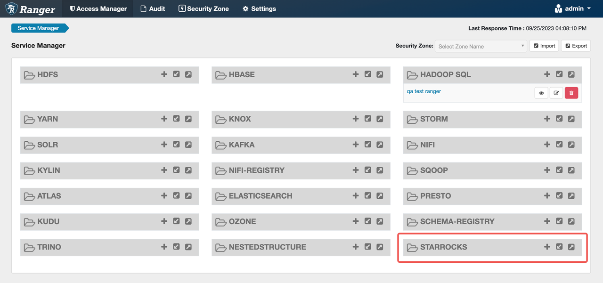
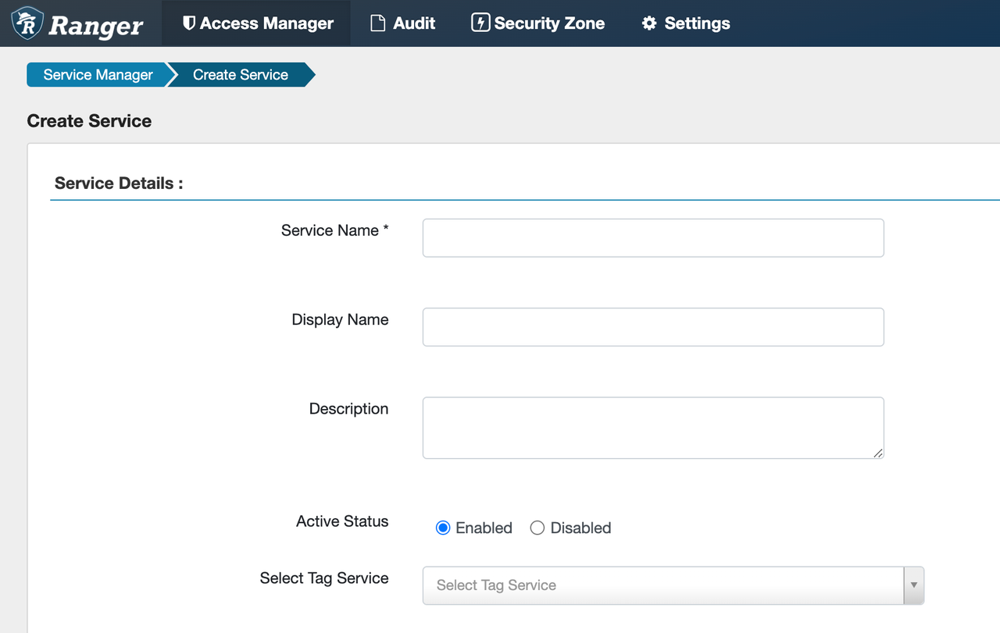

# Apache Ranger で権限を管理する

[Apache Ranger](https://ranger.apache.org/) は、ユーザーが視覚的なウェブページを通じてアクセス ポリシーをカスタマイズできる集中型のセキュリティ管理フレームワークを提供します。これにより、どの役割がどのデータにアクセスできるかを決定し、Hadoop エコシステム内のさまざまなコンポーネントとサービスに対してきめ細かいデータ アクセス制御を実行できます。

Apache Ranger は次のコア モジュールを提供します。

- **Ranger Admin**: Ranger のコア モジュールで、組み込みのウェブページがあります。ユーザーはこのページまたは REST インターフェースを通じてセキュリティ ポリシーを作成および更新できます。Hadoop エコシステムのさまざまなコンポーネントのプラグインは、定期的にこれらのポリシーをポーリングして取得します。
- **Agent Plugin**: Hadoop エコシステムに埋め込まれたコンポーネントのプラグイン。これらのプラグインは、Ranger Admin から定期的にセキュリティ ポリシーを取得し、ポリシーをローカル ファイルに保存します。ユーザーがコンポーネントにアクセスすると、対応するプラグインが設定されたセキュリティ ポリシーに基づいてリクエストを評価し、認証結果を対応するコンポーネントに送信します。
- **User Sync**: ユーザーおよびユーザー グループ情報を取得し、ユーザーおよびユーザー グループの権限データを Ranger のデータベースに同期するために使用されます。

StarRocks v3.1.9 では、ネイティブの RBAC 特権システムに加えて、Apache Ranger を通じたアクセス制御もサポートしています。現在、StarRocks は以下をサポートしています。

- Apache Ranger を通じてアクセス ポリシー、マスキング ポリシー、および行レベル フィルタ ポリシーを作成します。
- Ranger の監査ログ。
- **Kerberos を使用して認証する Ranger サーバーはサポートされていません。**

このトピックでは、StarRocks と Apache Ranger の権限制御方法と統合プロセスについて説明します。Ranger でセキュリティ ポリシーを作成してデータ セキュリティを管理する方法については、[Apache Ranger 公式ウェブサイト](https://ranger.apache.org/) を参照してください。

## 権限制御方法

StarRocks は Apache Ranger と統合され、次の権限制御方法を提供します。

- Ranger で StarRocks Service を作成して権限制御を実装します。ユーザーが StarRocks の内部テーブル、外部テーブル、またはその他のオブジェクトにアクセスする際、StarRocks Service に設定されたアクセス ポリシーに従ってアクセス制御が実行されます。
- ユーザーが外部データ ソースにアクセスする場合、Apache Ranger 上の外部サービス (Hive Service など) を再利用してアクセス制御を行うことができます。StarRocks は、異なる External Catalog に対して Ranger サービスを一致させ、データ ソースに対応する Ranger サービスに基づいてアクセス制御を実装します。

StarRocks が Apache Ranger と統合された後、次のアクセス制御パターンを実現できます。

- Apache Ranger を使用して、StarRocks の内部テーブル、外部テーブル、およびすべてのオブジェクトへのアクセスを一元管理します。
- Apache Ranger を使用して、StarRocks の内部テーブルおよびオブジェクトへのアクセスを管理します。External Catalog については、Ranger 上の対応する外部サービスのポリシーを再利用してアクセス制御を行います。
- Apache Ranger を使用して、外部データ ソースに対応するサービスを再利用することで External Catalog へのアクセスを管理します。StarRocks の内部テーブルおよびオブジェクトへのアクセスは、StarRocks のネイティブ RBAC 特権システムを使用して管理します。

**認証プロセス**

1. ユーザー認証には LDAP を使用し、Ranger を使用して LDAP ユーザーを同期し、アクセス ルールを設定することもできます。StarRocks も LDAP を通じてユーザーのログイン認証を完了できます。
2. ユーザーがクエリを開始すると、StarRocks はクエリ文を解析し、ユーザー情報と必要な特権を Apache Ranger に渡します。Ranger は、対応するサービスに設定されたアクセス ポリシーに基づいてユーザーが必要な特権を持っているかどうかを判断し、認証結果を StarRocks に返します。ユーザーがアクセス権を持っている場合、StarRocks はクエリ データを返し、そうでない場合はエラーを返します。

## 前提条件

- Apache Ranger 2.1.0 以降がインストールされています。Apache Ranger のインストール方法については、[Ranger クイック スタート](https://ranger.apache.org/quick_start_guide.html) を参照してください。
- すべての StarRocks FE マシンが Apache Ranger にアクセスできること。各 FE マシンで次のコマンドを実行して確認できます。

   ```SQL
   telnet <ranger-ip> <ranger-port>
   ```

   `Connected to <ip>` と表示されれば、接続は成功です。

## StarRocks Service を Ranger と統合する

### (オプション) ranger-starrocks-plugin をインストールする

:::note
このステップの主な目的は、Ranger のリソース名自動補完機能を使用することです。Ranger Admin でポリシーを作成する際、ユーザーはアクセスを保護する必要があるリソースの名前を入力する必要があります。ユーザーがリソース名を入力しやすくするために、Ranger Admin は自動補完機能を提供しており、入力された内容に一致するサービス内の利用可能なリソースを検索し、リソース名を自動的に補完します。

Ranger クラスターを操作する権限がない場合や、この機能が必要ない場合は、このステップをスキップできます。

また、ranger-starrocks-plugin をインストールしなかった場合、StarRocks サービスを作成する際に `test connection` を使用できませんが、それはサービスを正常に作成できないことを意味するわけではありません。
:::

1. Ranger Admin ディレクトリ `ews/webapp/WEB-INF/classes/ranger-plugins` に `starrocks` フォルダーを作成します。

   ```SQL
   mkdir {path-to-ranger}/ews/webapp/WEB-INF/classes/ranger-plugins/starrocks
   ```

2. [plugin-starrocks/target/ranger-starrocks-plugin-3.0.0-SNAPSHOT.jar](https://www.starrocks.io/download/community) と [mysql-connector-j.jar](https://dev.mysql.com/downloads/connector/j/) をダウンロードし、`starrocks` フォルダーに配置します。

3. Ranger Admin を再起動します。

   ```SQL
   ranger-admin restart
   ```

### Ranger Admin で StarRocks Service を設定する

:::note
このステップでは、Ranger 上で StarRocks Service を設定し、ユーザーが Ranger を通じて StarRocks オブジェクトに対するアクセス制御を実行できるようにします。
:::

1. [ranger-servicedef-starrocks.json](https://github.com/StarRocks/ranger/blob/master/agents-common/src/main/resources/service-defs/ranger-servicedef-starrocks.json) を StarRocks FE マシンまたは Ranger マシンの任意のディレクトリにコピーします。

   ```SQL
   wget https://raw.githubusercontent.com/StarRocks/ranger/master/agents-common/src/main/resources/service-defs/ranger-servicedef-starrocks.json
   ```

   :::note
   Ranger の自動補完機能が必要ない場合 (つまり、ranger-starrocks-plugin をインストールしていない場合)、.json ファイルの `implClass` を空に設定する必要があります。

   ```JSON
   "implClass": "",
   ```

   Ranger の自動補完機能が必要な場合 (つまり、ranger-starrocks-plugin をインストールしている場合)、.json ファイルの `implClass` を `org.apache.ranger.services.starrocks.RangerServiceStarRocks` に設定する必要があります。

   ```JSON
   "implClass": "org.apache.ranger.services.starrocks.RangerServiceStarRocks",
   ```

   :::

2. Ranger 管理者として次のコマンドを実行して StarRocks Service を追加します。

   ```Bash
   curl -u <ranger_adminuser>:<ranger_adminpwd> \
   -X POST -H "Accept: application/json" \
   -H "Content-Type: application/json" http://<ranger-ip>:<ranger-port>/service/plugins/definitions -d@ranger-servicedef-starrocks.json
   ```

3. `http://<ranger-ip>:<ranger-host>/login.jsp` にアクセスして Apache Ranger ページにログインします。ページに STARROCKS サービスが表示されます。

   

4. **STARROCKS** の後のプラス記号 (`+`) をクリックして StarRocks Service を設定します。

   

   

   - `Service Name`: サービス名を入力する必要があります。
   - `Display Name`: STARROCKS の下に表示するサービスの名前。指定しない場合は `Service Name` が表示されます。
   - `Username` と `Password`: ポリシー作成時にオブジェクト名を自動補完するために使用される FE ユーザー名とパスワード。この 2 つのパラメーターは StarRocks と Ranger の接続性には影響しません。自動補完を使用する場合は、`db_admin` ロールがアクティブなユーザーを少なくとも 1 人設定してください。
   - `jdbc.url`: StarRocks FE の IP アドレスとポートを入力します。

   以下の図は、設定例を示しています。

   

   以下の図は、追加されたサービスを示しています。

   

5. **Test connection** をクリックして接続性をテストし、接続が成功したら保存します。ranger-starrocks-plugin をインストールしていない場合は、接続テストをスキップして直接作成できます。
6. StarRocks クラスターの各 FE マシンで、`fe/conf` フォルダーに [ranger-starrocks-security.xml](https://github.com/StarRocks/ranger/blob/master/plugin-starrocks/conf/ranger-starrocks-security.xml) を作成し、内容をコピーします。次の 2 つのパラメーターを変更し、変更を保存する必要があります。

   - `ranger.plugin.starrocks.service.name`: ステップ 4 で作成した StarRocks Service の名前に変更します。
   - `ranger.plugin.starrocks.policy.rest the url`: Ranger Admin のアドレスに変更します。

   他の設定を変更する必要がある場合は、Apache Ranger の公式ドキュメントを参照してください。たとえば、`ranger.plugin.starrocks.policy.pollIntervalM` を変更してポリシー変更の取得間隔を変更できます。

   ```SQL
   vim ranger-starrocks-security.xml

   ...
       <property>
           <name>ranger.plugin.starrocks.service.name</name>
           <value>starrocks</value> -- StarRocks Service 名に変更します。
           <description>
               Name of the Ranger service containing policies for this StarRocks instance
           </description>
       </property>
   ...

   ...
       <property>
           <name>ranger.plugin.starrocks.policy.rest.url</name>
           <value>http://localhost:6080</value> -- Ranger Admin アドレスに変更します。
           <description>
               URL to Ranger Admin
           </description>
       </property>   
   ...
   ```

7. (オプション) Ranger の監査ログサービスを使用する場合は、各 FE マシンの `fe/conf` フォルダーに [ranger-starrocks-audit.xml](https://github.com/StarRocks/ranger/blob/master/plugin-starrocks/conf/ranger-starrocks-audit.xml) ファイルを作成します。内容をコピーし、**`xasecure.audit.solr.solr_url` の `solr_url` を自分の `solr_url` に置き換えて**、ファイルを保存します。

8. すべての FE 設定ファイルに `access_control = ranger` の設定を追加します。

   ```SQL
   vim fe.conf
   access_control=ranger 
   ```

9. すべての FE マシンを再起動します。

   ```SQL
   -- FE フォルダーに切り替えます。
   cd..

   bin/stop_fe.sh
   bin/start_fe.sh
   ```

## 他のサービスを再利用して外部テーブルへのアクセスを制御する

External Catalog については、外部サービス (Hive Service など) を再利用してアクセス制御を行うことができます。StarRocks は、異なる Catalog に対して異なる Ranger 外部サービスを一致させることをサポートしています。ユーザーが外部テーブルにアクセスする際、システムは対応する外部テーブルの Ranger サービスのアクセス ポリシーに基づいてアクセス制御を実施します。ユーザーの権限は、同じ名前の Ranger ユーザーと一致します。

1. Hive の Ranger 設定ファイル [ranger-hive-security.xml](https://github.com/StarRocks/ranger/blob/master/hive-agent/conf/ranger-hive-security.xml) と [ranger-hive-audit.xml](https://github.com/StarRocks/ranger/blob/master/hive-agent/conf/ranger-hive-audit.xml) をすべての FE マシンの `fe/conf` ファイルにコピーします。Ranger の IP とポートが正しいことを確認してください。
2. すべての FE マシンを再起動します。
3. External Catalog を設定します。

   - External Catalog を作成する際に、プロパティ `"ranger.plugin.hive.service.name"` を追加します。

      ```SQL
        CREATE EXTERNAL CATALOG hive_catalog_1
        PROPERTIES (
            "type" = "hive",
            "hive.metastore.type" = "hive",
            "hive.metastore.uris" = "thrift://xx.xx.xx.xx:9083",
            "ranger.plugin.hive.service.name" = "<ranger_hive_service_name>"
        )
      ```

   - 既存の External Catalog にもこのプロパティを追加できます。
  
       ```SQL
       ALTER CATALOG hive_catalog_1
       SET ("ranger.plugin.hive.service.name" = "<ranger_hive_service_name>");
       ```

​    この操作により、既存の Catalog の認証方法が Ranger ベースの認証に変更されます。

## 次のステップ

StarRocks Service を追加した後、そのサービスをクリックしてアクセス制御ポリシーを作成し、異なるユーザーまたはユーザー グループに異なる権限を割り当てることができます。ユーザーが StarRocks データにアクセスする際、これらのポリシーに基づいてアクセス制御が実施されます。