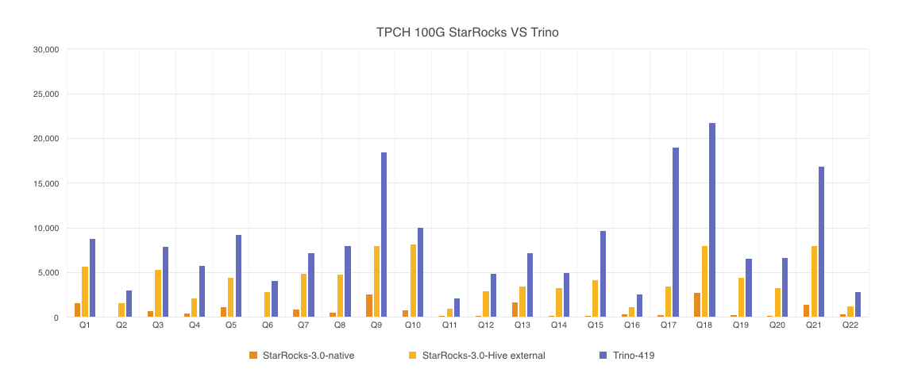

# TPC-H ベンチマーク

TPC-H は、トランザクション処理性能評議会 (TPC) によって開発された意思決定支援ベンチマークです。ビジネス指向のアドホッククエリと同時データ修正のスイートで構成されています。TPC-H は、実際の生産環境に基づいたモデルを構築し、販売システムのデータウェアハウスをシミュレートするために使用できます。このテストでは、データサイズが 1 GB から 3 TB の 8 つのテーブルを使用します。合計 22 のクエリがテストされ、主な性能指標は各クエリの応答時間であり、クエリが送信されてから結果が返されるまでの時間です。

## 1. テスト結論

TPC-H 100G スケールデータセットで合計 22 のクエリを使用して比較テストを実施しました。結果は以下の通りです。



StarRocks はローカルストレージと Hive テーブルクエリの 2 つの方法をテストしました。StarRocks Hive テーブルと Trino は同じデータをクエリします。データは ORC 形式で保存され、zlib 形式で圧縮されています。

StarRocks がネイティブストレージからデータをクエリするレイテンシーは 21 秒、StarRocks が Hive 外部テーブルをクエリするレイテンシーは 92 秒、Trino が Hive 外部テーブルをクエリするレイテンシーは 187 秒でした。

## 2. テスト準備

### 2.1 ハードウェア環境

| マシン | 4 クラウドホスト |
| -------- | ----------------------------------------------------- |
| CPU | 16core Intel(R) Xeon(R) Platinum 8269CY CPU @ 2.50GHz |
| メモリ | 64 GB |
| ネットワーク帯域幅 | 5 Gbits/s |
| ディスク | ESSD クラウドディスク |

### 2.2 ソフトウェア環境

StarRocks と Trino は同じ構成のマシンにデプロイされています。StarRocks には 1 FE と 3 BEs がデプロイされています。Trino には 1 コーディネーターと 3 ワーカーがデプロイされています。

- カーネルバージョン: Linux 3.10.0-1127.13.1.el7.x86_64

- オペレーティングシステムバージョン: CentOS Linux release 7.8.2003  

- ソフトウェアバージョン: StarRocks Community Edition 3.0, Trino-419, Hive-2.3.9

## 3 テストデータと結果

### 3.1 テストデータ

| テーブル | 行数 |
| -------- | ------ |
| customer | 1500 万 |
| lineitem | 6 億 |
| nation | 25 |
| orders | 1 億 5000 万 |
| part | 2000 万 |
| partsupp | 8000 万 |
| region | 5 |
| supplier | 100 万 |

### 3.2 テスト結果

:::note
クエリ結果の単位は ms です。低い方が良いです。
すべてのクエリは 1 回ウォームアップされ、その後 3 回実行して平均値を結果として取ります。
:::

| クエリ | StarRocks-native-3.0 | StarRocks-3.0-Hive external | Trino-419 |
| ---- | -------------------- | ---------------------------- | --------- |
| Q1 | 1540 | 5660 | 8811 |
| Q2 | 100 | 1593 | 3009 |
| Q3 | 700 | 5286 | 7891 |
| Q4 | 423 | 2110 | 5760 |
| Q5 | 1180 | 4453 | 9181 |
| Q6 | 56 | 2806 | 4029 |
| Q7 | 903 | 4910 | 7158 |
| Q8 | 546 | 4766 | 8014 |
| Q9 | 2553 | 8010 | 18460 |
| Q10 | 776 | 8190 | 9997 |
| Q11 | 206 | 920 | 2088 |
| Q12 | 166 | 2916 | 4852 |
| Q13 | 1663 | 3420 | 7203 |
| Q14 | 146 | 3286 | 4995 |
| Q15 | 123 | 4173 | 9688 |
| Q16 | 353 | 1126 | 2545 |
| Q17 | 296 | 3426 | 18970 |
| Q18 | 2713 | 7960 | 21763 |
| Q19 | 246 | 4406 | 6586 |
| Q20 | 176 | 3280 | 6632 |
| Q21 | 1410 | 7933 | 16873 |
| Q22 | 350 | 1190 | 2788 |
| 合計 | 16625 | 91820 | 187293 |

## 4. テストプロセス

### 4.1 StarRocks ネイティブテーブルのクエリ

#### 4.1.1 データ生成

tpch-poc ツールパッケージをダウンロードして、TPC-H 標準テストセット `scale factor=100` のデータを生成します。

```Bash
wget https://starrocks-public.oss-cn-zhangjiakou.aliyuncs.com/tpch-poc-1.0.zip
unzip tpch-poc-1.0
cd tpch-poc-1.0

sh bin/gen_data/gen-tpch.sh 100 data_100
```

#### 4.1.2 テーブル構造の作成

設定ファイル `conf/starrocks.conf` を修正し、クラスタのアドレス (ホストとポート) を指定してから、テーブル作成操作を行います。

```SQL
sh bin/create_db_table.sh ddl_100
```

#### 4.1.3 データのインポート

```Python
sh bin/stream_load.sh data_100
```

#### 4.1.4 データのクエリ

```Python
sh bin/benchmark.sh
```

### 4.2 StarRocks での Hive 外部テーブルのクエリ

#### 4.2.1 テーブル構造の作成

Hive に外部テーブルを作成します。外部テーブルのストレージ形式は ORC で、圧縮形式は zlib です。詳細なテーブル作成文は [5.3](#53-hive-external-table-creation-orc-storage-format) を参照してください。この Hive 外部テーブルは、StarRocks と Trino の両方のクエリに使用されます。

http://localhost:3000/docs/benchmarking/TPC-H_Benchmarking/

#### 4.2.2 データのインポート

ステップ 4.1.1 で生成された TPC-H CSV オリジナルデータを HDFS の指定パス (この記事では `/user/tmp/csv/` を使用) にアップロードし、Hive に外部テーブルを作成します。詳細なテーブル作成文は [5.4](#54-hive-external-table-creation-csv-storage-format) を参照してください。この Hive 外部テーブルのストレージ形式は CSV で、ストレージパスは `/user/tmp/csv/` です。CSV オリジナルデータがアップロードされるパスです。

CSV 形式の外部テーブルのデータを ORC 形式の外部テーブルに `INSERT INTO` を使用してインポートし、データを ORC のストレージ形式と zlib の圧縮形式で取得します。インポートコマンドは以下の通りです。

```SQL
use tpch_hive_csv;

insert into tpch_hive_orc.customer select * from customer;
insert into tpch_hive_orc.lineitem select * from lineitem;
insert into tpch_hive_orc.nation select * from nation;
insert into tpch_hive_orc.orders select * from orders;
insert into tpch_hive_orc.part select * from part;
insert into tpch_hive_orc.partsupp select * from partsupp;
insert into tpch_hive_orc.region select * from region;
insert into tpch_hive_orc.supplier select * from supplier;
```

#### 4.2.3 データのクエリ

StarRocks は Catalog 機能を使用して Hive テーブルデータをクエリします。詳細な操作は [Hive catalog](../data_source/catalog/hive_catalog.md) を参照してください。

## 5. クエリ SQL とテーブル作成文

### 5.1 TPC-H クエリ SQL

```SQL
--Q1
select
  l_returnflag,
  l_linestatus,
  sum(l_quantity) as sum_qty,
  sum(l_extendedprice) as sum_base_price,
  sum(l_extendedprice * (1 - l_discount)) as sum_disc_price,
  sum(l_extendedprice * (1 - l_discount) * (1 + l_tax)) as sum_charge,
  avg(l_quantity) as avg_qty,
  avg(l_extendedprice) as avg_price,
  avg(l_discount) as avg_disc,
  count(*) as count_order
from
  lineitem
where
  l_shipdate <= date '1998-12-01' - interval '90' day
group by
  l_returnflag,
  l_linestatus
order by
  l_returnflag,
  l_linestatus;

--Q2
select
  s_acctbal,
  s_name,
  n_name,
  p_partkey,
  p_mfgr,
  s_address,
  s_phone,
  s_comment
from
  part,
  supplier,
  partsupp,
  nation,
  region
where
  p_partkey = ps_partkey
  and s_suppkey = ps_suppkey
  and p_size = 15
  and p_type like '%BRASS'
  and s_nationkey = n_nationkey
  and n_regionkey = r_regionkey
  and r_name = 'EUROPE'
  and ps_supplycost = (
    select
      min(ps_supplycost)
    from
      partsupp,
      supplier,
      nation,
      region
    where
      p_partkey = ps_partkey
      and s_suppkey = ps_suppkey
      and s_nationkey = n_nationkey
      and n_regionkey = r_regionkey
      and r_name = 'EUROPE'
  )
order by
  s_acctbal desc,
  n_name,
  s_name,
  p_partkey
limit 100;

--Q3
select
  l_orderkey,
  sum(l_extendedprice * (1 - l_discount)) as revenue,
  o_orderdate,
  o_shippriority
from
  customer,
  orders,
  lineitem
where
  c_mktsegment = 'BUILDING'
  and c_custkey = o_custkey
  and l_orderkey = o_orderkey
  and o_orderdate < date '1995-03-15'
  and l_shipdate > date '1995-03-15'
group by
  l_orderkey,
  o_orderdate,
  o_shippriority
order by
  revenue desc,
  o_orderdate
limit 10;

--Q4
select
  o_orderpriority,
  count(*) as order_count
from
  orders
where
  o_orderdate >= date '1993-07-01'
  and o_orderdate < date '1993-07-01' + interval '3' month
  and exists (
    select
      *   
    from
      lineitem
    where
      l_orderkey = o_orderkey
      and l_commitdate < l_receiptdate
  )
group by
  o_orderpriority
order by
  o_orderpriority;

--Q5
select
  n_name,
  sum(l_extendedprice * (1 - l_discount)) as revenue
from
  customer,
  orders,
  lineitem,
  supplier,
  nation,
  region
where
  c_custkey = o_custkey
  and l_orderkey = o_orderkey
  and l_suppkey = s_suppkey
  and c_nationkey = s_nationkey
  and s_nationkey = n_nationkey
  and n_regionkey = r_regionkey
  and r_name = 'ASIA'
  and o_orderdate >= date '1994-01-01'
  and o_orderdate < date '1994-01-01' + interval '1' year
group by
  n_name
order by
  revenue desc;

--Q6
select
  sum(l_extendedprice * l_discount) as revenue
from
  lineitem
where
  l_shipdate >= date '1994-01-01'
  and l_shipdate < date '1994-01-01' + interval '1' year
  and l_discount between .06 - 0.01 and .06 + 0.01
  and l_quantity < 24;

--Q7
select
  supp_nation,
  cust_nation,
  l_year,
  sum(volume) as revenue
from
  (
    select
      n1.n_name as supp_nation,
      n2.n_name as cust_nation,
      extract(year from l_shipdate) as l_year,
      l_extendedprice * (1 - l_discount) as volume
    from
      supplier,
      lineitem,
      orders,
      customer,
      nation n1,
      nation n2
    where
      s_suppkey = l_suppkey
      and o_orderkey = l_orderkey
      and c_custkey = o_custkey
      and s_nationkey = n1.n_nationkey
      and c_nationkey = n2.n_nationkey
      and (
        (n1.n_name = 'FRANCE' and n2.n_name = 'GERMANY')
        or (n1.n_name = 'GERMANY' and n2.n_name = 'FRANCE')
      )   
      and l_shipdate between date '1995-01-01' and date '1996-12-31'
  ) as shipping
group by
  supp_nation,
  cust_nation,
  l_year
order by
  supp_nation,
  cust_nation,
  l_year;

--Q8
select
  o_year,
  sum(case
    when nation = 'BRAZIL' then volume
    else 0
  end) / sum(volume) as mkt_share
from
  (
    select
      extract(year from o_orderdate) as o_year,
      l_extendedprice * (1 - l_discount) as volume,
      n2.n_name as nation
    from
      part,
      supplier,
      lineitem,
      orders,
      customer,
      nation n1,
      nation n2,
      region
    where
      p_partkey = l_partkey
      and s_suppkey = l_suppkey
      and l_orderkey = o_orderkey
      and o_custkey = c_custkey
      and c_nationkey = n1.n_nationkey
      and n1.n_regionkey = r_regionkey
      and r_name = 'AMERICA'
      and s_nationkey = n2.n_nationkey
      and o_orderdate between date '1995-01-01' and date '1996-12-31'
      and p_type = 'ECONOMY ANODIZED STEEL'
  ) as all_nations
group by
  o_year
order by
  o_year;

--Q9
select
  nation,
  o_year,
  sum(amount) as sum_profit
from
  (
    select
      n_name as nation,
      extract(year from o_orderdate) as o_year,
      l_extendedprice * (1 - l_discount) - ps_supplycost * l_quantity as amount
    from
      part,
      supplier,
      lineitem,
      partsupp,
      orders,
      nation
    where
      s_suppkey = l_suppkey
      and ps_suppkey = l_suppkey
      and ps_partkey = l_partkey
      and p_partkey = l_partkey
      and o_orderkey = l_orderkey
      and s_nationkey = n_nationkey
      and p_name like '%green%'
  ) as profit
group by
  nation,
  o_year
order by
  nation,
  o_year desc;

--Q10
select
      c_custkey,
      c_name,
      sum(l_extendedprice * (1 - l_discount)) as revenue,
      c_acctbal,
      n_name,
      c_address,
      c_phone,
      c_comment
    from
      customer,
      orders,
      lineitem,
      nation
    where
      c_custkey = o_custkey
      and l_orderkey = o_orderkey
      and o_orderdate >= date '1993-10-01'
      and o_orderdate < date '1993-10-01' + interval '3' month
      and l_returnflag = 'R'
      and c_nationkey = n_nationkey
    group by
      c_custkey,
      c_name,
      c_acctbal,
      c_phone,
      n_name,
      c_address,
      c_comment
    order by
      revenue desc
limit 20;

--Q11
select
  ps_partkey,
  sum(ps_supplycost * ps_availqty) as value
from
  partsupp,
  supplier,
  nation
where
  ps_suppkey = s_suppkey
  and s_nationkey = n_nationkey
  and n_name = 'GERMANY'
group by
  ps_partkey having
    sum(ps_supplycost * ps_availqty) > (
      select
        sum(ps_supplycost * ps_availqty) * 0.000001
      from
        partsupp,
        supplier,
        nation
      where
        ps_suppkey = s_suppkey
        and s_nationkey = n_nationkey
        and n_name = 'GERMANY'
    )   
order by
  value desc;

--Q12
select
  l_shipmode,
  sum(case
    when o_orderpriority = '1-URGENT'
      or o_orderpriority = '2-HIGH'
      then 1
    else 0
  end) as high_line_count,
  sum(case
    when o_orderpriority <> '1-URGENT'
      and o_orderpriority <> '2-HIGH'
      then 1
    else 0
  end) as low_line_count
from
  orders,
  lineitem
where
  o_orderkey = l_orderkey
  and l_shipmode in ('MAIL', 'SHIP')
  and l_commitdate < l_receiptdate
  and l_shipdate < l_commitdate
  and l_receiptdate >= date '1994-01-01'
  and l_receiptdate < date '1994-01-01' + interval '1' year
group by
  l_shipmode
order by
  l_shipmode;

--Q13
select c_count, count(*) as custdist
from (
    select
        c_custkey,
        count(o_orderkey) as c_count
    from
        customer left outer join orders on
            c_custkey = o_custkey
            and o_comment not like '%special%requests%'
    group by  
        c_custkey
    ) as c_orders
group by  
    c_count
order by
    custdist desc,
    c_count desc;

--Q14
select
  100.00 * sum(case
    when p_type like 'PROMO%'
      then l_extendedprice * (1 - l_discount)
    else 0
  end) / sum(l_extendedprice * (1 - l_discount)) as promo_revenue
from
  lineitem,
  part
where
  l_partkey = p_partkey
  and l_shipdate >= date '1995-09-01'
  and l_shipdate < date '1995-09-01' + interval '1' month;

--Q15
select
  s_suppkey,
  s_name,
  s_address,
  s_phone,
  total_revenue
from
  supplier,
  revenue0
where
  s_suppkey = supplier_no
  and total_revenue = (
    select
      max(total_revenue)
    from
      revenue0
  )
order by
  s_suppkey;

--Q16
select
  p_brand,
  p_type,
  p_size,
  count(distinct ps_suppkey) as supplier_cnt
from
  partsupp,
  part
where
  p_partkey = ps_partkey
  and p_brand <> 'Brand#45'
  and p_type not like 'MEDIUM POLISHED%'
  and p_size in (49, 14, 23, 45, 19, 3, 36, 9)
  and ps_suppkey not in (
    select
      s_suppkey
    from
      supplier
    where
      s_comment like '%Customer%Complaints%'
  )
group by
  p_brand,
  p_type,
  p_size
order by
  supplier_cnt desc,
  p_brand,
  p_type,
  p_size;

--Q17
select
  sum(l_extendedprice) / 7.0 as avg_yearly
from
  lineitem,
  part
where
  p_partkey = l_partkey
  and p_brand = 'Brand#23'
  and p_container = 'MED BOX'
  and l_quantity < (
    select
      0.2 *avg(l_quantity)
    from
      lineitem
    where
      l_partkey = p_partkey
  );

--Q18
select
  c_name,
  c_custkey,
  o_orderkey,
  o_orderdate,
  o_totalprice,
  sum(l_quantity)
from
  customer,
  orders,
  lineitem
where
  o_orderkey in (
    select
      l_orderkey
    from
      lineitem
    group by
      l_orderkey having
        sum(l_quantity) > 300
  )
  and c_custkey = o_custkey
  and o_orderkey = l_orderkey
group by
  c_name,
  c_custkey,
  o_orderkey,
  o_orderdate,
  o_totalprice
order by
  o_totalprice desc,
  o_orderdate
limit 100;

--Q19
select
  sum(l_extendedprice* (1 - l_discount)) as revenue
from
  lineitem,
  part
where
  (
    p_partkey = l_partkey
    and p_brand = 'Brand#12'
    and p_container in ('SM CASE', 'SM BOX', 'SM PACK', 'SM PKG')
    and l_quantity >= 1 and l_quantity <= 1 + 10
    and p_size between 1 and 5
    and l_shipmode in ('AIR', 'AIR REG')
    and l_shipinstruct = 'DELIVER IN PERSON'
  )
  or  
  (
    p_partkey = l_partkey
    and p_brand = 'Brand#23'
    and p_container in ('MED BAG', 'MED BOX', 'MED PKG', 'MED PACK')
    and l_quantity >= 10 and l_quantity <= 10 + 10
    and p_size between 1 and 10
    and l_shipmode in ('AIR', 'AIR REG')
    and l_shipinstruct = 'DELIVER IN PERSON'
  )
  or  
  (
    p_partkey = l_partkey
    and p_brand = 'Brand#34'
    and p_container in ('LG CASE', 'LG BOX', 'LG PACK', 'LG PKG')
    and l_quantity >= 20 and l_quantity <= 20 + 10
    and p_size between 1 and 15
    and l_shipmode in ('AIR', 'AIR REG')
    and l_shipinstruct = 'DELIVER IN PERSON'
  );

--Q20
select
  s_name,
  s_address
from
  supplier,
  nation
where
  s_suppkey in (
    select
      ps_suppkey
    from
      partsupp
    where
      ps_partkey in (
        select
          p_partkey
        from
          part
        where
          p_name like 'forest%'
      )   
      and ps_availqty > (
        select
          0.5 * sum(l_quantity)
        from
          lineitem
        where
          l_partkey = ps_partkey
          and l_suppkey = ps_suppkey
          and l_shipdate >= date '1994-01-01'
          and l_shipdate < date '1994-01-01' + interval '1' year
      )   
  )
  and s_nationkey = n_nationkey
  and n_name = 'CANADA'
order by
  s_name;

--Q21
select
        s_name,
        count(*) as numwait
from
        supplier,
        lineitem l1,
        orders,
        nation
where
        s_suppkey = l1.l_suppkey
        and o_orderkey = l1.l_orderkey
        and o_orderstatus = 'F'
        and l1.l_receiptdate > l1.l_commitdate
        and exists (
                select
                        *
                from
                        lineitem l2
                where
                        l2.l_orderkey = l1.l_orderkey
                        and l2.l_suppkey <> l1.l_suppkey
        )
        and not exists (
                select
                        *
                from
                        lineitem l3
                where
                        l3.l_orderkey = l1.l_orderkey
                        and l3.l_suppkey <> l1.l_suppkey
                        and l3.l_receiptdate > l3.l_commitdate
        )
        and s_nationkey = n_nationkey
        and n_name = 'SAUDI ARABIA'
group by
        s_name
order by
        numwait DESC,
        s_name
limit 100;


--Q22
select
  cntrycode,
  count(*) as numcust,
  sum(c_acctbal) as totacctbal
from
  (
    select
      substring(c_phone, 1, 2) as cntrycode,
      c_acctbal
    from
      customer
    where
      substring(c_phone, 1, 2) in
        ('13', '31', '23', '29', '30', '18', '17')
      and c_acctbal > (
        select
          avg(c_acctbal)
        from
          customer
        where
          c_acctbal > 0.00
          and substring(c_phone, 1, 2) in
            ('13', '31', '23', '29', '30', '18', '17')
      )   
      and not exists (
        select
          *
        from
          orders
        where
          o_custkey = c_custkey
      )   
  ) as custsale
group by
  cntrycode
order by
  cntrycode;
```

### 5.2 StarRocks ネイティブテーブルの作成

```SQL
#Create table customer
drop table if exists customer;
CREATE TABLE customer (
    c_custkey int NOT NULL,
    c_name VARCHAR(25) NOT NULL,
    c_address VARCHAR(40) NOT NULL,
    c_nationkey int NOT NULL,
    c_phone VARCHAR(15) NOT NULL,
    c_acctbal decimal(15, 2) NOT NULL,
    c_mktsegment VARCHAR(10) NOT NULL,
    c_comment VARCHAR(117) NOT NULL
)ENGINE=OLAP
DUPLICATE KEY(`c_custkey`)
COMMENT "OLAP"
DISTRIBUTED BY HASH(`c_custkey`) BUCKETS 24
PROPERTIES (
    "replication_num" = "1"
);

#Create table lineitem
drop table if exists lineitem;
CREATE TABLE lineitem (
    l_shipdate DATE NOT NULL,
    l_orderkey int NOT NULL,
    l_linenumber int not null,
    l_partkey int NOT NULL,
    l_suppkey int not null,
    l_quantity decimal(15, 2) NOT NULL,
    l_extendedprice decimal(15, 2) NOT NULL,
    l_discount decimal(15, 2) NOT NULL,
    l_tax decimal(15, 2) NOT NULL,
    l_returnflag VARCHAR(1) NOT NULL,
    l_linestatus VARCHAR(1) NOT NULL,
    l_commitdate DATE NOT NULL,
    l_receiptdate DATE NOT NULL,
    l_shipinstruct VARCHAR(25) NOT NULL,
    l_shipmode VARCHAR(10) NOT NULL,
    l_comment VARCHAR(44) NOT NULL
)ENGINE=OLAP
DUPLICATE KEY(`l_shipdate`, `l_orderkey`)
COMMENT "OLAP"
DISTRIBUTED BY HASH(`l_orderkey`) BUCKETS 96
PROPERTIES (
    "replication_num" = "1",
    "colocate_with" = "tpch2"
);

#Create table nation
drop table if exists nation;
CREATE TABLE `nation` (
  `n_nationkey` int(11) NOT NULL,
  `n_name` varchar(25) NOT NULL,
  `n_regionkey` int(11) NOT NULL,
  `n_comment` varchar(152) NULL
) ENGINE=OLAP
DUPLICATE KEY(`N_NATIONKEY`)
COMMENT "OLAP"
DISTRIBUTED BY HASH(`N_NATIONKEY`) BUCKETS 1
PROPERTIES (
    "replication_num" = "3"
);

#Create table orders
drop table if exists orders;
CREATE TABLE orders (
    o_orderkey int NOT NULL,
    o_orderdate DATE NOT NULL,
    o_custkey int NOT NULL,
    o_orderstatus VARCHAR(1) NOT NULL,
    o_totalprice decimal(15, 2) NOT NULL,
    o_orderpriority VARCHAR(15) NOT NULL,
    o_clerk VARCHAR(15) NOT NULL,
    o_shippriority int NOT NULL,
    o_comment VARCHAR(79) NOT NULL
)ENGINE=OLAP
DUPLICATE KEY(`o_orderkey`, `o_orderdate`)
COMMENT "OLAP"
DISTRIBUTED BY HASH(`o_orderkey`) BUCKETS 96
PROPERTIES (
    "replication_num" = "1",
    "colocate_with" = "tpch2"
);

#Create table part
drop table if exists part;
CREATE TABLE part (
    p_partkey int NOT NULL,
    p_name VARCHAR(55) NOT NULL,
    p_mfgr VARCHAR(25) NOT NULL,
    p_brand VARCHAR(10) NOT NULL,
    p_type VARCHAR(25) NOT NULL,
    p_size int NOT NULL,
    p_container VARCHAR(10) NOT NULL,
    p_retailprice decimal(15, 2) NOT NULL,
    p_comment VARCHAR(23) NOT NULL
)ENGINE=OLAP
DUPLICATE KEY(`p_partkey`)
COMMENT "OLAP"
DISTRIBUTED BY HASH(`p_partkey`) BUCKETS 24
PROPERTIES (
    "replication_num" = "1",
    "colocate_with" = "tpch2p"
);

#Create table partsupp
drop table if exists partsupp;
CREATE TABLE partsupp (
    ps_partkey int NOT NULL,
    ps_suppkey int NOT NULL,
    ps_availqty int NOT NULL,
    ps_supplycost decimal(15, 2) NOT NULL,
    ps_comment VARCHAR(199) NOT NULL
)ENGINE=OLAP
DUPLICATE KEY(`ps_partkey`)
COMMENT "OLAP"
DISTRIBUTED BY HASH(`ps_partkey`) BUCKETS 24
PROPERTIES (
    "replication_num" = "1",
    "colocate_with" = "tpch2p"
);

#Create table region
drop table if exists region;
CREATE TABLE region (
    r_regionkey int NOT NULL,
    r_name VARCHAR(25) NOT NULL,
    r_comment VARCHAR(152)
)ENGINE=OLAP
DUPLICATE KEY(`r_regionkey`)
COMMENT "OLAP"
DISTRIBUTED BY HASH(`r_regionkey`) BUCKETS 1
PROPERTIES (
    "replication_num" = "3"
);

#Create table supplier
drop table if exists supplier;
CREATE TABLE supplier (  
    s_suppkey int NOT NULL,
    s_name VARCHAR(25) NOT NULL,
    s_address VARCHAR(40) NOT NULL,
    s_nationkey int NOT NULL,
    s_phone VARCHAR(15) NOT NULL,
    s_acctbal decimal(15, 2) NOT NULL,
    s_comment VARCHAR(101) NOT NULL
)ENGINE=OLAP
DUPLICATE KEY(`s_suppkey`)
COMMENT "OLAP"
DISTRIBUTED BY HASH(`s_suppkey`) BUCKETS 12
PROPERTIES (
    "replication_num" = "1"
);


drop view if exists revenue0;
create view revenue0 (supplier_no, total_revenue) as
select
    l_suppkey,
    sum(l_extendedprice * (1 - l_discount))
from
    lineitem
where
    l_shipdate >= date '1996-01-01'
    and l_shipdate < date '1996-01-01' + interval '3' month
group by
    l_suppkey;
```

### 5.3 Hive 外部テーブルの作成 (ORC ストレージ形式)

```SQL
create database tpch_hive_orc;
use tpch_hive_orc;

--Create table customer
CREATE TABLE `customer`(
  `c_custkey` int,
  `c_name` varchar(25),
  `c_address` varchar(40),
  `c_nationkey` int,
  `c_phone` varchar(15),
  `c_acctbal` decimal(15,2),
  `c_mktsegment` varchar(10),
  `c_comment` varchar(117))
ROW FORMAT SERDE
  'org.apache.hadoop.hive.ql.io.orc.OrcSerde'
WITH SERDEPROPERTIES (
  'field.delim'='|',
  'serialization.format'='|')
STORED AS INPUTFORMAT
  'org.apache.hadoop.hive.ql.io.orc.OrcInputFormat'
OUTPUTFORMAT
  'org.apache.hadoop.hive.ql.io.orc.OrcOutputFormat'
LOCATION
  'hdfs://emr-header-1.cluster-49146:9000/user/hive/warehouse/tpch_hive_orc.db/customer';

-- Create table lineitem
  CREATE TABLE `lineitem`(
  `l_orderkey` bigint,
  `l_partkey` int,
  `l_suppkey` int,
  `l_linenumber` int,
  `l_quantity` decimal(15,2),
  `l_extendedprice` decimal(15,2),
  `l_discount` decimal(15,2),
  `l_tax` decimal(15,2),
  `l_returnflag` varchar(1),
  `l_linestatus` varchar(1),
  `l_shipdate` date,
  `l_commitdate` date,
  `l_receiptdate` date,
  `l_shipinstruct` varchar(25),
  `l_shipmode` varchar(10),
  `l_comment` varchar(44))
ROW FORMAT SERDE
  'org.apache.hadoop.hive.ql.io.orc.OrcSerde'
WITH SERDEPROPERTIES (
  'field.delim'='|',
  'serialization.format'='|')
STORED AS INPUTFORMAT
  'org.apache.hadoop.hive.ql.io.orc.OrcInputFormat'
OUTPUTFORMAT
  'org.apache.hadoop.hive.ql.io.orc.OrcOutputFormat'
LOCATION
  'hdfs://emr-header-1.cluster-49146:9000/user/hive/warehouse/tpch_hive_orc.db/lineitem';

-- Create table nation
CREATE TABLE `nation`(
  `n_nationkey` int,
  `n_name` varchar(25),
  `n_regionkey` int,
  `n_comment` varchar(152))
ROW FORMAT SERDE
  'org.apache.hadoop.hive.ql.io.orc.OrcSerde'
WITH SERDEPROPERTIES (
  'field.delim'='|',
  'serialization.format'='|')
STORED AS INPUTFORMAT
  'org.apache.hadoop.hive.ql.io.orc.OrcInputFormat'
OUTPUTFORMAT
  'org.apache.hadoop.hive.ql.io.orc.OrcOutputFormat'
LOCATION
  'hdfs://emr-header-1.cluster-49146:9000/user/hive/warehouse/tpch_hive_orc.db/nation';

-- Create table orders
CREATE TABLE `orders`(
  `o_orderkey` bigint,
  `o_custkey` int,
  `o_orderstatus` varchar(1),
  `o_totalprice` decimal(15,2),
  `o_orderdate` date,
  `o_orderpriority` varchar(15),
  `o_clerk` varchar(15),
  `o_shippriority` int,
  `o_comment` varchar(79))
ROW FORMAT SERDE
  'org.apache.hadoop.hive.ql.io.orc.OrcSerde'
WITH SERDEPROPERTIES (
  'field.delim'='|',
  'serialization.format'='|')
STORED AS INPUTFORMAT
  'org.apache.hadoop.hive.ql.io.orc.OrcInputFormat'
OUTPUTFORMAT
  'org.apache.hadoop.hive.ql.io.orc.OrcOutputFormat'
LOCATION
  'hdfs://emr-header-1.cluster-49146:9000/user/hive/warehouse/tpch_hive_orc.db/orders';

--Create table part
CREATE TABLE `part`(
  `p_partkey` int,
  `p_name` varchar(55),
  `p_mfgr` varchar(25),
  `p_brand` varchar(10),
  `p_type` varchar(25),
  `p_size` int,
  `p_container` varchar(10),
  `p_retailprice` decimal(15,2),
  `p_comment` varchar(23))
ROW FORMAT SERDE
  'org.apache.hadoop.hive.ql.io.orc.OrcSerde'
WITH SERDEPROPERTIES (
  'field.delim'='|',
  'serialization.format'='|')
STORED AS INPUTFORMAT
  'org.apache.hadoop.hive.ql.io.orc.OrcInputFormat'
OUTPUTFORMAT
  'org.apache.hadoop.hive.ql.io.orc.OrcOutputFormat'
LOCATION
  'hdfs://emr-header-1.cluster-49146:9000/user/hive/warehouse/tpch_hive_orc.db/part';

--Create table partsupp
CREATE TABLE `partsupp`(
  `ps_partkey` int,
  `ps_suppkey` int,
  `ps_availqty` int,
  `ps_supplycost` decimal(15,2),
  `ps_comment` varchar(199))
ROW FORMAT SERDE
  'org.apache.hadoop.hive.ql.io.orc.OrcSerde'
WITH SERDEPROPERTIES (
  'field.delim'='|',
  'serialization.format'='|')
STORED AS INPUTFORMAT
  'org.apache.hadoop.hive.ql.io.orc.OrcInputFormat'
OUTPUTFORMAT
  'org.apache.hadoop.hive.ql.io.orc.OrcOutputFormat'
LOCATION
  'hdfs://emr-header-1.cluster-49146:9000/user/hive/warehouse/tpch_hive_orc.db/partsupp';

--Create table region
CREATE TABLE `region`(
  `r_regionkey` int,
  `r_name` varchar(25),
  `r_comment` varchar(152))
ROW FORMAT SERDE
  'org.apache.hadoop.hive.ql.io.orc.OrcSerde'
WITH SERDEPROPERTIES (
  'field.delim'='|',
  'serialization.format'='|')
STORED AS INPUTFORMAT
  'org.apache.hadoop.hive.ql.io.orc.OrcInputFormat'
OUTPUTFORMAT
  'org.apache.hadoop.hive.ql.io.orc.OrcOutputFormat'
LOCATION
  'hdfs://emr-header-1.cluster-49146:9000/user/hive/warehouse/tpch_hive_orc.db/region';

--Create table supplier
CREATE TABLE `supplier`(
  `s_suppkey` int,
  `s_name` varchar(25),
  `s_address` varchar(40),
  `s_nationkey` int,
  `s_phone` varchar(15),
  `s_acctbal` decimal(15,2),
  `s_comment` varchar(101))
ROW FORMAT SERDE
  'org.apache.hadoop.hive.ql.io.orc.OrcSerde'
WITH SERDEPROPERTIES (
  'field.delim'='|',
  'serialization.format'='|')
STORED AS INPUTFORMAT
  'org.apache.hadoop.hive.ql.io.orc.OrcInputFormat'
OUTPUTFORMAT
  'org.apache.hadoop.hive.ql.io.orc.OrcOutputFormat'
LOCATION
  'hdfs://emr-header-1.cluster-49146:9000/user/hive/warehouse/tpch_hive_orc.db/supplier';
```

### 5.4 Hive 外部テーブルの作成 (CSV ストレージ形式)

```SQL
create database tpch_hive_csv;
use tpch_hive_csv;

--Create the customer external table.
CREATE EXTERNAL TABLE `customer`(
  `c_custkey` int,
  `c_name` varchar(25),
  `c_address` varchar(40),
  `c_nationkey` int,
  `c_phone` varchar(15),
  `c_acctbal` double,
  `c_mktsegment` varchar(10),
  `c_comment` varchar(117))
ROW FORMAT SERDE
  'org.apache.hadoop.hive.serde2.lazy.LazySimpleSerDe'
WITH SERDEPROPERTIES (
  'field.delim'='|',
  'serialization.format'='|')
STORED AS INPUTFORMAT
  'org.apache.hadoop.mapred.TextInputFormat'
OUTPUTFORMAT
  'org.apache.hadoop.hive.ql.io.HiveIgnoreKeyTextOutputFormat'
LOCATION
  'hdfs://emr-header-1.cluster-49146:9000/user/tmp/csv/customer_csv';
 
--Create the lineitem external table.
CREATE EXTERNAL TABLE `lineitem`(
  `l_orderkey` int,
  `l_partkey` int,
  `l_suppkey` int,
  `l_linenumber` int,
  `l_quantity` double,
  `l_extendedprice` double,
  `l_discount` double,
  `l_tax` double,
  `l_returnflag` varchar(1),
  `l_linestatus` varchar(1),
  `l_shipdate` date,
  `l_commitdate` date,
  `l_receiptdate` date,
  `l_shipinstruct` varchar(25),
  `l_shipmode` varchar(10),
  `l_comment` varchar(44))
ROW FORMAT SERDE
  'org.apache.hadoop.hive.serde2.lazy.LazySimpleSerDe'
WITH SERDEPROPERTIES (
  'field.delim'='|',
  'serialization.format'='|')
STORED AS INPUTFORMAT
  'org.apache.hadoop.mapred.TextInputFormat'
OUTPUTFORMAT
  'org.apache.hadoop.hive.ql.io.HiveIgnoreKeyTextOutputFormat'
LOCATION
  'hdfs://emr-header-1.cluster-49146:9000/user/tmp/csv/lineitem_csv';
 

--Create the nation external table.
CREATE EXTERNAL TABLE `nation`(
  `n_nationkey` int,
  `n_name` varchar(25),
  `n_regionkey` int,
  `n_comment` varchar(152))
ROW FORMAT SERDE
  'org.apache.hadoop.hive.serde2.lazy.LazySimpleSerDe'
WITH SERDEPROPERTIES (
  'field.delim'='|',
  'serialization.format'='|')
STORED AS INPUTFORMAT
  'org.apache.hadoop.mapred.TextInputFormat'
OUTPUTFORMAT
  'org.apache.hadoop.hive.ql.io.HiveIgnoreKeyTextOutputFormat'
LOCATION
  'hdfs://emr-header-1.cluster-49146:9000/user/tmp/csv/nation_csv';
  
--Create the orders external table.
CREATE EXTERNAL TABLE `orders`(
  `o_orderkey` int,
  `o_custkey` int,
  `o_orderstatus` varchar(1),
  `o_totalprice` double,
  `o_orderdate` date,
  `o_orderpriority` varchar(15),
  `o_clerk` varchar(15),
  `o_shippriority` int,
  `o_comment` varchar(79))
ROW FORMAT SERDE
  'org.apache.hadoop.hive.serde2.lazy.LazySimpleSerDe'
WITH SERDEPROPERTIES (
  'field.delim'='|',
  'serialization.format'='|')
STORED AS INPUTFORMAT
  'org.apache.hadoop.mapred.TextInputFormat'
OUTPUTFORMAT
  'org.apache.hadoop.hive.ql.io.HiveIgnoreKeyTextOutputFormat'
LOCATION
  'hdfs://emr-header-1.cluster-49146:9000/user/tmp/csv/orders_csv';
  
--Create the part external table.
CREATE EXTERNAL TABLE `part`(
  `p_partkey` int,
  `p_name` varchar(55),
  `p_mfgr` varchar(25),
  `p_brand` varchar(10),
  `p_type` varchar(25),
  `p_size` int,
  `p_container` varchar(10),
  `p_retailprice` double,
  `p_comment` varchar(23))
ROW FORMAT SERDE
  'org.apache.hadoop.hive.serde2.lazy.LazySimpleSerDe'
WITH SERDEPROPERTIES (
  'field.delim'='|',
  'serialization.format'='|')
STORED AS INPUTFORMAT
  'org.apache.hadoop.mapred.TextInputFormat'
OUTPUTFORMAT
  'org.apache.hadoop.hive.ql.io.HiveIgnoreKeyTextOutputFormat'
LOCATION
  'hdfs://emr-header-1.cluster-49146:9000/user/tmp/csv/part_csv';
  
--Create the partsupp external table.
CREATE EXTERNAL TABLE `partsupp`(
  `ps_partkey` int,
  `ps_suppkey` int,
  `ps_availqty` int,
  `ps_supplycost` double,
  `ps_comment` varchar(199))
ROW FORMAT SERDE
  'org.apache.hadoop.hive.serde2.lazy.LazySimpleSerDe'
WITH SERDEPROPERTIES (
  'field.delim'='|',
  'serialization.format'='|')
STORED AS INPUTFORMAT
  'org.apache.hadoop.mapred.TextInputFormat'
OUTPUTFORMAT
  'org.apache.hadoop.hive.ql.io.HiveIgnoreKeyTextOutputFormat'
LOCATION
  'hdfs://emr-header-1.cluster-49146:9000/user/tmp/csv/partsupp_csv';
  
--Create the region external table.
CREATE EXTERNAL TABLE `region`(
  `r_regionkey` int,
  `r_name` varchar(25),
  `r_comment` varchar(152))
ROW FORMAT SERDE
  'org.apache.hadoop.hive.serde2.lazy.LazySimpleSerDe'
WITH SERDEPROPERTIES (
  'field.delim'='|',
  'serialization.format'='|')
STORED AS INPUTFORMAT
  'org.apache.hadoop.mapred.TextInputFormat'
OUTPUTFORMAT
  'org.apache.hadoop.hive.ql.io.HiveIgnoreKeyTextOutputFormat'
LOCATION
  'hdfs://emr-header-1.cluster-49146:9000/user/tmp/csv/region_csv';
  
--Create the supplier external table.
CREATE EXTERNAL TABLE `supplier`(
  `s_suppkey` int,
  `s_name` varchar(25),
  `s_address` varchar(40),
  `s_nationkey` int,
  `s_phone` varchar(15),
  `s_acctbal` double,
  `s_comment` varchar(101))
ROW FORMAT SERDE
  'org.apache.hadoop.hive.serde2.lazy.LazySimpleSerDe'
WITH SERDEPROPERTIES (
  'field.delim'='|',
  'serialization.format'='|')
STORED AS INPUTFORMAT
  'org.apache.hadoop.mapred.TextInputFormat'
OUTPUTFORMAT
  'org.apache.hadoop.hive.ql.io.HiveIgnoreKeyTextOutputFormat'
LOCATION
  'hdfs://emr-header-1.cluster-49146:9000/user/tmp/csv/supplier_csv';
```