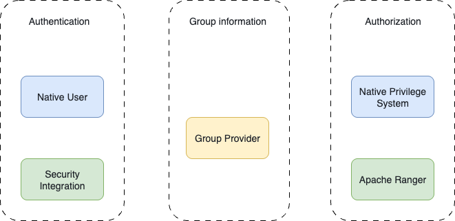
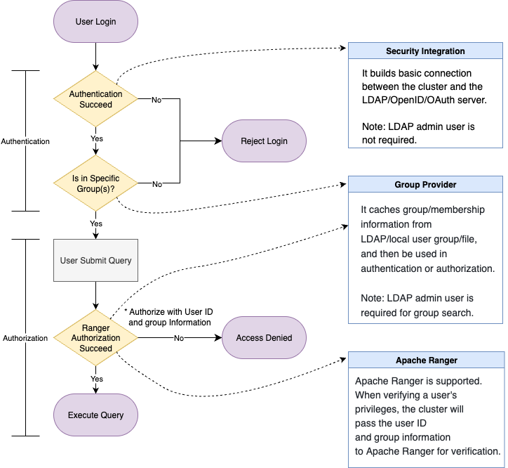

# 認証と授権

このトピックは、一貫的の認証と授権のワークフローを開発するためのベストプラクティスを提供することを目的としています。

以下に関わる各操作の詳細な手順については、[関連項目](#関連項目) のリンクを参照してください。

## 実際の企業シナリオ

大企業はしばしば複雑な組織構造を持ち、多様なプラットフォームやツールを使用する多数の従業員を抱えています。IT ガバナンスの観点から、統一されたアイデンティティ、認証、および授権システムを持つことは大きな利点をもたらします。

- **ユーザー管理の簡素化**: 管理者はもはや複数のシステムでユーザーを手動で作成または削除し、権限を割り当てる必要がありません。ユーザーライフサイクル管理（例: オンボーディング/オフボーディング）はシームレスで監査に適したものになります。
- **セキュリティの向上**: シングルサインオン (SSO) メカニズムにより、ユーザーが複数の資格情報を管理する必要がなくなり、攻撃対象が減少します。
- **役割に基づくアクセス制御**: アクセス権限は通常、ユーザーの役割や部門に結び付けられます。よく構築されたアイデンティティシステムにより、より簡単で正確な授権決定が可能になります。

### 例

SaaS 企業の異なる部門に 3 人の新しい従業員が参加すると仮定します。1 人はマーケティングスペシャリスト、2 人はソリューションアーキテクトです。

- **組織的には**、彼らは異なるチームに属しています。
- **アイデンティティの観点から**、彼らのメールアカウントは内部プラットフォーム全体でのログイン資格情報として機能します。
- **アクセス権によって**、3 人それぞれが異なるプラットフォームへのアクセス権を持っています。
  - マーケティングスペシャリストは Hubspot のバックエンドにログインして新しいリードを確認できます。
  - ソリューションアーキテクトはサービスコンソールにアクセスし、割り当てられた顧客のサービスを管理できます。

3 人全員が同じアイデンティティプロバイダーを使用しているにもかかわらず、彼らのアクセス権は厳格に管理されています。

  - マーケティングスペシャリストは Hubspot のみにアクセスできます。
  - ソリューションアーキテクトはサービスコンソールにアクセスできますが、割り当てられていないユーザーのサービスにはアクセスできません。また、Hubspot にもアクセスできません。

## アクセス制御の 3 層

この例は、企業のアイデンティティとアクセスフローにおける 3 つの重要なコンポーネントを強調しています。

1. **アイデンティティ認証** – 「私は SaaS 企業の認証された従業員であるピーターです。」
2. **アクセス認証** – 「ソリューションアーキテクトとして、サービスコンソールにログインする権限があります。」（すべての認証された従業員がすべてのサービスにアクセスできるわけではありません。）
3. **アクション授権** – 「SaaS 企業の顧客として、私たち自身のサービスの情報を表示できますが、他の顧客の情報は表示できません。」

### データベースコンテキストにおいて

これらのアクセス制御の層は、データベースシステムにも適用されます。

1. **アイデンティティ検証**: ユーザーが有効な従業員であり、独自のパスワードを持っていることを確認します。
2. **アクセス認証**: ユーザーまたはそのグループが特定のクラスターにログインする権限を持っていることを確認します。
3. **操作授権**: ユーザーがクエリを実行したり、データをロードしたりできるかどうかを確認します。

ご覧のとおり、認証と授権は実際には密接に結びついています。ユーザーの認証要求は、しばしばより広範なアクセス制御要件を意味します。したがって、完全なアクセスフローを理解することが重要です。

## 主要概念

### LDAP

Lightweight Directory Access Protocol (LDAP) は、分散ディレクトリ情報にアクセスし、維持するためのプロトコルです。組織のグローバルアドレス帳と考えることができます。

- 各ユーザーには一意のパス (Distinguished Name, DN) があります。
- LDAP は基本的なユーザー情報を保存し、パスワードを含みます。
- LDAP はグループ構造とメンバーシップも管理します。
- `ldapsearch` クエリはユーザーやグループを取得できます。

LDAP は以下のように使用できます。

- **認証**ソースとして（ユーザー名とパスワードを検証するため）。
- アクセス制御のための**グループ情報**プロバイダーとして。

### UNIX グループ

時には、ユーザーがセキュリティや分離の理由で LDAP グループをローカル（ホスト OS 上）でミラーリングし、外部 LDAP サーバーとの直接通信を避けることがあります。これらのローカル UNIX グループは、認証やアクセス制御の強制に使用できます。

### OAuth, OIDC, and JWT

:::tip

**用語の簡単な説明**

- **ID トークン**: アイデンティティの証明（私は私です。）
- **アクセス トークン**: 特定のリソースにアクセスする権限の証明（私は特定のことができます。）
- **OAuth 2.0**: アクセストークンを提供する授権フレームワーク。
- **OIDC**: OAuth 上の認証レイヤー。ID とアクセス トークンを提供します。
- **JWT**: トークン形式。OAuth と OIDC の両方で使用されます。

:::

**実際の使用法:**

- **OAuth ベースのログイン**: 外部のログインページ（例: Google）にリダイレクトし、その後クラスターに戻ります。事前にブラウザアクセスとリダイレクト URL の設定が必要です。
- **JWT ベースのログイン**: ユーザーはトークンを直接クラスターに渡し、事前に公開鍵またはエンドポイントの設定が必要です。

## 機能

システムは、アクセス制御の 3 層すべてをサポートしています。

1. **ユーザー認証** – 「私は私です。」
2. **ログイン授権** – 「私はこのクラスターにアクセスする権限があります。」（個人またはグループのメンバーシップに依存します。）
3. **操作授権** – 「このクエリを実行したり、このデータセットをロードしたりできます。」（授権はアイデンティティまたはグループの所属に基づくことができます。）

バージョン 3.5 以降、StarRocks はさまざまなアイデンティティとアクセス管理コンポーネントの組み合わせをサポートするモジュラーで構成可能なモデルを提供します。

*機能マッピング*



機能の観点から:

1. **認証プロバイダー** – サポートされているプロトコル: ネイティブユーザー、LDAP、OIDC、OAuth 2.0
2. **グループプロバイダー** – サポートされているソース: LDAP、オペレーティングシステム、ファイルベースの設定
3. **授権システム** – サポートされているシステム: ネイティブ RBAC と IBAC、そして Apache Ranger

### 認証

サポートされている認証モードの比較:

| 方式                    | CREATE USER (ネイティブユーザー)                          | CREATE SECURITY INTEGRATION (セッションベースのダミーユーザー)    |
| ---------------------- | ------------------------------------------------------ | ------------------------------------------------------------ |
| 説明                    | クラスター内で手動でユーザーを作成します。外部認証システムと関連付けることができます。ユーザーはクラスター内に明示的に存在します。 | 外部認証統合を定義します。クラスターはユーザー情報を保存しません。オプションで Group Provider と組み合わせて許可されたユーザーを定義できます。 |
| ログインプロセス          | ユーザーはクラスター内で事前に作成されている必要があります。ログイン時に、ユーザーは StarRocks または設定された外部認証システム（例: LDAP, JWT）を介して認証されます。事前に作成されたユーザーのみがログインできます。 | ログイン時に、StarRocks は外部のアイデンティティシステムを使用してユーザーを認証します。成功すると、一時的なセッションスコープの「ダミーユーザー」が内部で作成されます。このユーザーはセッション終了後に破棄されます。 |
| 認証プロセス              | ユーザーがクラスター内に存在するため、ネイティブの授権システムまたは Apache Ranger を使用して事前に権限を割り当てることができます。 | ユーザーは永続しませんが、ロールとグループのマッピングを事前に定義できます。ユーザーがログインすると、システムはグループに基づいてロールを割り当て、RBAC を可能にします。Apache Ranger も並行して使用できます。 |
| メリットとデメリット、使用例 | <ul><li>**メリット**: 完全な柔軟性—ネイティブおよび外部の授権システムの両方をサポートします。</li><li>**デメリット**: ユーザーの作成には手動の手間がかかり、面倒な場合があります。</li><li>**推奨されるケース**: 小規模なユーザーベースやクラスターがアクセス制御を処理するケースに推奨されます。</li></ul> | <ul><li>**メリット**: 設定が簡単で、外部認証の設定と許可されたグループの定義のみが必要です。</li><li>**推奨されるケース**: ロールとグループのマッピングを持つ大規模なユーザーベースに理想的です。</li></ul> |

これらの認証モードは共存できます。ユーザーがログインを試みるとき:

1. クラスターは最初にユーザーがネイティブユーザーとして存在するかどうかを確認し、それに応じて認証を試みます。
2. ユーザーが見つからない場合、クラスターは設定で定義された `authentication_chain` に従って進行します。

このハイブリッドモードは、異なる組織の要件に適した柔軟性と制御を提供します。

#### オプション 1: 外部認証システムを使用したネイティブユーザーの作成

たとえば、OAuth2.0 を使用してネイティブユーザーを作成するには、次の構文を使用できます。

```SQL
CREATE USER <username> IDENTIFIED WITH authentication_oauth2 AS 
'{
  "auth_server_url": "<auth_server_url>",
  "token_server_url": "<token_server_url>",
  "client_id": "<client_id>",
  "client_secret": "<client_secret>",
  "redirect_url": "<redirect_url>",
  "jwks_url": "<jwks_url>",
  "principal_field": "<principal_field>",
  "required_issuer": "<required_issuer>",
  "required_audience": "<required_audience>"
}';
```

その後、ユーザーに特権や役割を `GRANT` したり、Apache Ranger などの外部システムに授権を委任したりできます。

#### オプション 2: 外部認証システムとのセキュリティインテグレーションの使用

外部認証サービスがクラスターにアクセスできるようにするセキュリティインテグレーションを作成することもできます。

```SQL
CREATE SECURITY INTEGRATION <security_integration_name> 
PROPERTIES (
    "type" = "oauth2",
    "auth_server_url" = "",
    "token_server_url" = "",
    "client_id" = "",
    "client_secret" = "",
    "redirect_url" = "",
    "jwks_url" = "",
    "principal_field" = "",
    "required_issuer" = "",
    "required_audience" = ""
    "comment" = ""
);
```

その後、FE パラメータ `authentication_chain` を設定し、クラスターのセキュリティインテグレーションを有効にする必要があります。

```SQL
ADMIN SET FRONTEND CONFIG (
    "authentication_chain" = "<security_integration_name>[... ,]"
);
```

### グループプロバイダー（オプションだが推奨）

クラスター内のグループ情報は、認証および授権システムの両方から**分離**されています。これは、ログイン制御とアクセス制御の両方で使用できる共有レイヤーとして機能し、独立して構成できます。

#### グループの使用方法

- **認証ステージ**

  セキュリティインテグレーションと一緒に使用する場合、グループメンバーシップはログインを許可される範囲を定義できます。認証に合格し、指定されたグループに属するユーザーのみがクラスターにアクセスできます。

- **授権ステージ**

  授権中にグループメンバーシップが自動的に考慮されます。特権がグループに付与されている場合、そのグループ内のすべてのユーザーはアクセスチェック中に権限を継承します。

#### 設定に関する注意事項

- グループプロバイダーを構成する際には、次のことを指定する必要があります。
  - **ログインできる**（ログイン範囲）を定義するために使用されるグループ
  - **特定のリソースにアクセスできる**（授権）を定義するために使用されるグループ
- **重要**: グループプロバイダーによって返されるユーザーアイデンティティ（例: ユーザー名または ID）は、認証および授権中に使用されるアイデンティティと**一致する必要があります**。一貫性のない識別子は、権限またはログインの失敗を引き起こします。

#### 例

次の例は LDAP に基づいています。

1. グループプロバイダーを作成します。

   ```SQL
   -- LDAP グループプロバイダー
   CREATE GROUP PROVIDER <group_provider_name> 
   PROPERTIES (
       "type" = "ldap",
       ldap_info,
       ldap_search_group_arg,
       ldap_search_attr,
       [ldap_cache_attr]
   )
   
   ldap_info ::=
       "ldap_conn_url" = "",
       "ldap_bind_root_dn" = "",
       "ldap_bind_root_pwd" = "",
       "ldap_bind_base_dn" = "",
       ["ldap_conn_timeout" = "",]
       ["ldap_conn_read_timeout" = ""]
   
   ldap_search_group_arg ::= 
       { "ldap_group_dn" = "" 
       | "ldap_group_filter" = "" }, 
       "ldap_group_identifier_attr" = ""
   
   ldap_search_user_arg ::=
       "ldap_group_member_attr" = "",
       "ldap_user_search_attr" = ""
   
   ldap_cache_arg ::= 
       "ldap_cache_refresh_interval" = ""
   ```

2. グループプロバイダーをセキュリティインテグレーションと統合します。

   ```SQL
   ALTER SECURITY INTEGRATION <security_integration_name> SET
   (
       "group_provider" = "",
       "permitted_groups" = ""
   )
   ```

3. グループプロバイダーを授権システムと統合します。ネイティブ認証または Apache Ranger のいずれかを使用できます。

   - ネイティブ認証:

     グループにロールを割り当てることができます。ログイン時に、ユーザーはグループメンバーシップに基づいて自動的にロールが割り当てられます。

     ```sql
     GRANT role TO EXTERNAL GROUP <group_name>
     ```

   - Apache Ranger:

     ユーザーがログインすると、StarRocks はグループ情報を Ranger に渡してポリシー評価を行います。

### 授権

StarRocks は、**内部および外部の授権メカニズム**をサポートしており、独立してまたは組み合わせて使用することができます。

- **内部授権**

  StarRocks は、組み込みの **RBAC (Role-Based Access Control)** および **IBAC (Identity-Based Access Control)** システムを提供します。

  - **RBAC**: ユーザーまたはグループに役割を割り当て、その役割に特権を付与します。
  - **IBAC**: ユーザーに直接特権を付与します。

- **外部授権**

  StarRocks は **Apache Ranger** と統合して、集中化された統一された授権管理をサポートします。

Apache Ranger は、StarRocks のネイティブ授権システムと一緒に、または単独で使用することができます。

- **完全な Ranger 授権** 内部テーブルと外部テーブル（例: Hive）は Ranger を介して授権されます。
  - 内部テーブルの権限は、Ranger 用の StarRocks プラグインを使用します。
  - 外部テーブルの権限は、StarRocks プラグインまたは他の外部サービスプラグイン（例: Hive プラグイン）を介して管理できます。
- **ハイブリッド授権**
  - **内部テーブル**: StarRocks のネイティブシステム（RBAC/IBAC）によって授権されます。
  - **外部テーブル**: Ranger を介して授権されます。外部テーブルの権限は、StarRocks プラグインを使用して管理することも、適切な外部サービス（例: Hive, HDFS）を介して管理することもできます。

この柔軟性により、組織は集中化された授権への移行を段階的に行うことができ、現在のインフラストラクチャとセキュリティポリシーに適したハイブリッドモデルを維持することができます。

## コンボソリューション

認証と授権のワークフローを完了する方法に基づいてソリューションを選択できます。

### ソリューション 1: 外部認証 + 外部授権

外部認証および授権システムを完全に活用して、クラスターのログインおよびアクセス権限を制御できます。全体的なプロセスは次のとおりです。

1. **セキュリティインテグレーション**を使用して、外部認証システムとの接続を確立します。
2. **グループプロバイダー**内で認証および授権のために必要なグループ情報を設定します。
3. **セキュリティインテグレーション**でクラスターにログインを許可されるグループを定義します。これらのグループに属するユーザーはログインアクセスが許可されます。
4. **Apache Ranger**で **StarRocks サービス**を作成し、内部テーブルと外部テーブルの両方のアクセス制御を管理します。外部テーブルの場合、授権のために既存のサービスを再利用することもできます。
5. ユーザーがクエリを送信すると、システムはユーザーのアイデンティティとグループメンバーシップ（グループプロバイダーで設定されたもの）を Ranger に送信して授権を行います。
6. 授権チェックが通過すると、システムはクエリの実行を続行します。

:::note

このプロセス全体で、ユーザー ID とグループ名がすべての統合システムで一貫していることを確認する必要があります。

:::



### ソリューション 2: 外部認証（ネイティブユーザー）+ 内部授権

**組み込みの授権システム**を使用しながら、**外部認証**に依存することを希望する場合は、このアプローチに従うことができます。

1. **ユーザーを手動で作成**し、各ユーザーに対して外部認証方法を指定します。
2. ユーザーが作成された後、標準の `GRANT` ステートメントを使用して役割または特権を割り当てます。
3. 認証が成功すると、クラスターのネイティブ権限システムに基づいてユーザーが授権されます。

:::tip

手動で作成されたユーザーは、**グループプロバイダー**および **Ranger** と統合することもできますが、このアプローチは **セキュリティインテグレーション** を使用するよりも複雑で自動化されていません。したがって、これは**推奨されるベストプラクティスではありません**。

:::

### ソリューション 3: 外部認証 (外部アイデンティティ) + 内部授権

**StarRocks の組み込み授権システム**を使用しながら、**外部認証**に依存する場合は、次のアプローチを取ることができます。

1. **セキュリティインテグレーション**を使用して、外部認証システムとの接続を確立します。
2. **グループプロバイダー**内で認証と授権に必要なグループ情報を設定します。
3. **セキュリティインテグレーション**で StarRocks クラスターにログインを許可するグループを定義します。これらのグループに属するユーザーは、ログインアクセスが許可されます。
4. StarRocks 内で必要なロールを**作成し**、それらを外部グループに**付与します**。
5. ユーザーがログインを試みる際には、認証に合格し、授権されたグループに属している必要があります。ログインが成功すると、StarRocks はグループメンバーシップに基づいて適切なロールを自動的に割り当てます。
6. クエリ実行中、StarRocks は通常通り**内部 RBAC ベースの授権**を実施します。
7. さらに、このソリューションと **Ranger** を組み合わせることも可能です。例えば、内部テーブルの授権には **StarRocks のネイティブ RBAC** を使用し、外部テーブルの授権には **Ranger** を使用します。Ranger を介して授権を行う際、StarRocks は**ユーザー ID と対応するグループ情報**を Ranger に渡してアクセス制御を行います。


## 関連項目

- **認証**
  - [Native Authentication](../administration/user_privs/authentication/native_authentication.md)
  - [Security Integration](../administration/user_privs/authentication/security_integration.md)
  - [LDAP Authentication](../administration/user_privs/authentication/ldap_authentication.md)
  - [OAuth 2.0 Authentication](../administration/user_privs/authentication/oauth2_authentication.md)
  - [JSON Web Token Authentication](../administration/user_privs/authentication/jwt_authentication.md)
- [**グループプロバイダー**](../administration/user_privs/group_provider.md)
- **授権**
  - [Native Authorization](../administration/user_privs/authorization/User_privilege.md)
  - [Apache Ranger Plugin](../administration/user_privs/authorization/ranger_plugin.md)
