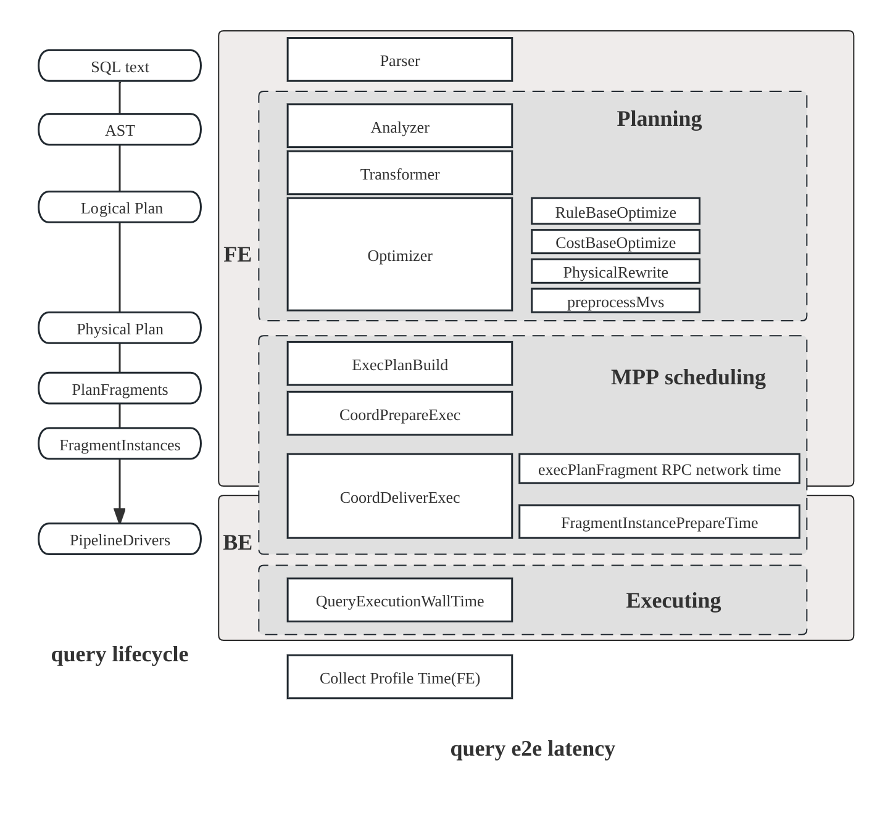
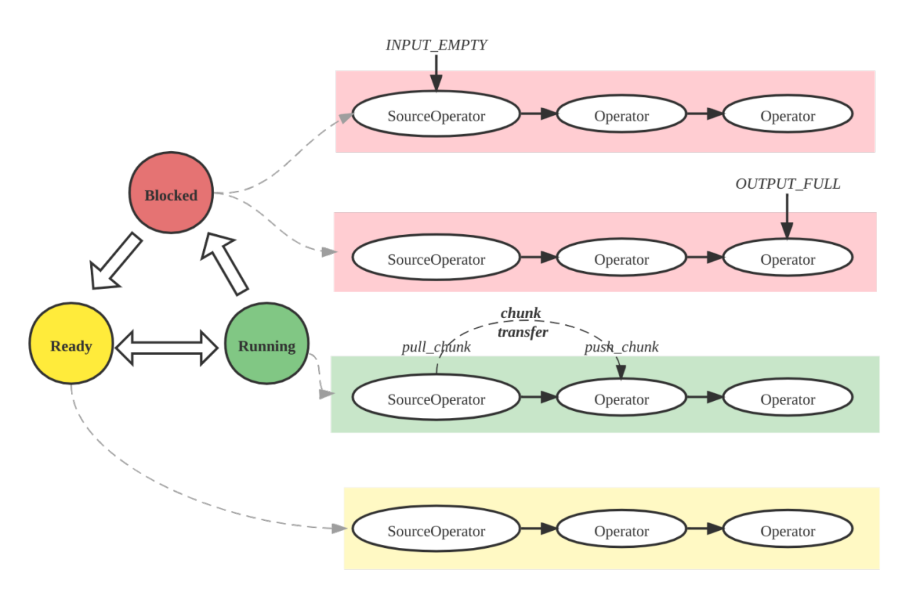

# クエリプラン

クエリパフォーマンスの最適化は、分析システムにおける一般的な課題です。クエリが遅いと、ユーザーエクスペリエンスやクラスタ全体のパフォーマンスに悪影響を及ぼす可能性があります。StarRocksでは、クエリプランとクエリプロファイルを理解し解釈することが、遅いクエリを診断し改善するための基盤となります。これらのツールは以下のことに役立ちます。
- ボトルネックや高コストの操作を特定する
- 最適でないジョイン戦略やインデックスの欠如を見つける
- データがどのようにフィルタリング、集計、移動されるかを理解する
- リソース使用のトラブルシューティングと最適化

**クエリプラン**は、StarRocks FE によって生成される詳細なロードマップで、SQL ステートメントがどのように実行されるかを説明します。クエリをスキャン、ジョイン、集計、ソートなどの一連の操作に分解し、それらを最も効率的に実行する方法を決定します。

StarRocks はクエリプランを確認するためのいくつかの方法を提供しています。

1. **EXPLAIN ステートメント**:  
   `EXPLAIN` を使用して、クエリの論理または物理的な実行プランを表示します。出力を制御するオプションを追加できます。
   - `EXPLAIN LOGICAL <query>`: 簡略化されたプランを表示します。
   - `EXPLAIN <query>`: 基本的な物理プランを表示します。
   - `EXPLAIN VERBOSE <query>`: 詳細情報を含む物理プランを表示します。
   - `EXPLAIN COSTS <query>`: 各操作の推定コストを含み、統計の問題を診断するために使用されます。

2. **EXPLAIN ANALYZE**:  
   `EXPLAIN ANALYZE <query>` を使用してクエリを実行し、実際の実行プランと実行時の統計情報を表示します。詳細は [Explain Anlayze](./query_profile_text_based_analysis.md) ドキュメントを参照してください。

   例:
   ```sql
   EXPLAIN ANALYZE SELECT * FROM sales_orders WHERE amount > 1000;
   ```

3. **Query Profile**:  
   クエリを実行した後、その詳細な実行プロファイルを表示できます。これには、タイミング、リソース使用量、オペレーター レベルの統計が含まれます。詳細情報のアクセスと解釈については [Query Profile](./query_profile_overview.md) ドキュメントを参照してください。
   - **SQL コマンド**: `SHOW PROFILELIST` および `ANALYZE PROFILE FOR <query_id>` を使用して、特定のクエリの実行プロファイルを取得できます。
   - **FE HTTP サービス**: StarRocks FE の Web UI で **Query** または **Profile** セクションに移動して、クエリの実行詳細を検索および確認できます。
   - **マネージドバージョン**: クラウドまたはマネージドデプロイメントでは、提供された Web コンソールまたはモニタリングダッシュボードを使用して、クエリプランとプロファイルを表示できます。多くの場合、視覚化やフィルタリングオプションが強化されています。

通常、クエリプランはクエリの計画と最適化に関連する問題を診断するために使用され、クエリプロファイルはクエリ実行中のパフォーマンス問題を特定するのに役立ちます。以下のセクションでは、クエリ実行の主要な概念を探り、クエリプランを分析する具体的な例を紹介します。

## クエリ実行フロー

StarRocks におけるクエリのライフサイクルは、主に3つのフェーズで構成されています。
1. **計画**: クエリは解析、分析、最適化を経て、クエリプランの生成に至ります。
2. **スケジューリング**: スケジューラとコーディネータがプランをすべての参加バックエンドノードに分配します。
3. **実行**: プランはパイプライン実行エンジンを使用して実行されます。



**プラン構造**

StarRocks のプランは階層的です。
- **フラグメント**: 最上位の作業スライスで、各フラグメントは異なるバックエンドノードで実行される複数の **FragmentInstances** を生成します。
- **パイプライン**: インスタンス内で、パイプラインはオペレーターを連結し、複数の **PipelineDrivers** が同じパイプラインを別々の CPU コアで同時に実行します。
- **オペレーター**: データを実際に処理するスキャン、ジョイン、集計などの基本的なステップです。


**パイプライン実行エンジン**

パイプラインエンジンは、クエリプランを並列かつ効率的に実行し、複雑なプランや大規模なデータ量を高パフォーマンスかつスケーラブルに処理します。



**メトリックマージ戦略**

デフォルトでは、StarRocks はプロファイルのボリュームを削減するために FragmentInstance と PipelineDriver レイヤーをマージし、簡略化された3層構造を生成します。
- フラグメント
- パイプライン
- オペレーター

このマージ動作は、セッション変数 `pipeline_profile_level` を通じて制御できます。

## 例

### クエリプランとプロファイルの読み方

1. **構造を理解する**: クエリプランはフラグメントに分割され、それぞれが実行のステージを表します。下から上に読みます: まずスキャンノード、次にジョイン、集計、そして最終的に結果です。

2. **全体的な分析**:
   - 総実行時間、メモリ使用量、CPU/ウォールタイム比を確認します。
   - オペレーター時間でソートして遅いオペレーターを見つけます。
   - フィルターが可能な限りプッシュダウンされていることを確認します。
   - データの偏り（オペレーター時間や行数の不均一）を探します。
   - 高いメモリ使用量やディスクスピルを監視し、ジョイン順序を調整したり、ロールアップビューを使用したりします。
   - 必要に応じてマテリアライズドビューやクエリヒント（`BROADCAST`、`SHUFFLE`、`COLOCATE`）を使用して最適化します。

2. **スキャン操作**: `OlapScanNode` または類似のものを探します。どのテーブルがスキャンされ、どのフィルターが適用され、事前集計やマテリアライズドビューが使用されているかを確認します。

3. **ジョイン操作**: ジョインタイプ（`HASH JOIN`、`BROADCAST`、`SHUFFLE`、`COLOCATE`、`BUCKET SHUFFLE`）を特定します。ジョイン方法はパフォーマンスに影響します。
   - **Broadcast**: 小さなテーブルをすべてのノードに送信します。小さなテーブルに適しています。
   - **Shuffle**: 行をパーティション分割してシャッフルします。大きなテーブルに適しています。
   - **Colocate**: テーブルが同じ方法でパーティション分割されているため、ローカルジョインを可能にします。
   - **Bucket Shuffle**: ネットワークコストを削減するために、1つのテーブルのみをシャッフルします。

4. **集計とソート**: `AGGREGATE`、`TOP-N`、または `ORDER BY` を探します。これらは大規模または高カーディナリティのデータで高コストになる可能性があります。

5. **データ移動**: `EXCHANGE` ノードはフラグメントまたはノード間のデータ転送を示します。データ移動が多すぎるとパフォーマンスに悪影響を及ぼす可能性があります。

6. **述語プッシュダウン**: スキャン時に適用されるフィルターは、下流のデータを削減します。`PREDICATES` または `PushdownPredicates` を確認して、どのフィルターがプッシュダウンされているかを確認します。

### クエリプランの例

:::tip
これは、TPC-DS ベンチマークからのクエリ 96 です。
:::

```sql
EXPLAIN select  count(*)
from store_sales
    ,household_demographics
    ,time_dim
    , store
where ss_sold_time_sk = time_dim.t_time_sk
    and ss_hdemo_sk = household_demographics.hd_demo_sk
    and ss_store_sk = s_store_sk
    and time_dim.t_hour = 8
    and time_dim.t_minute >= 30
    and household_demographics.hd_dep_count = 5
    and store.s_store_name = 'ese'
order by count(*) limit 100;
```

出力は、StarRocks がクエリをどのように実行するかを示す階層的なプランで、フラグメントとオペレーターに分かれています。以下はクエリプランフラグメントの簡略化された例です。

```
PLAN FRAGMENT 1
  6:HASH JOIN (BROADCAST)
    |-- 4:HASH JOIN (BROADCAST)
    |     |-- 2:HASH JOIN (BROADCAST)
    |     |     |-- 0:OlapScanNode (store_sales)
    |     |     |-- 1:OlapScanNode (time_dim)
    |     |-- 3:OlapScanNode (household_demographics)
    |-- 5:OlapScanNode (store)
```

- **OlapScanNode**: テーブルをスキャンし、フィルターや事前集計が適用される可能性があります。
- **HASH JOIN (BROADCAST)**: 小さなテーブルをブロードキャストして2つのテーブルをジョインします。
- **フラグメント**: 各フラグメントは異なるノードで並行して実行できます。

クエリ96のクエリプランは、0から4までの5つのフラグメントに分かれています。クエリプランは、下から上に一つずつ読むことができます。

フラグメント4は、`time_dim` テーブルをスキャンし、関連するクエリ条件（すなわち `time_dim.t_hour = 8 and time_dim.t_minute >= 30`）を事前に実行する役割を担っています。このステップは述語プッシュダウンとしても知られています。StarRocks は、集計テーブルに対して `PREAGGREGATION` を有効にするかどうかを決定します。前の図では、`time_dim` の事前集計は無効になっています。この場合、`time_dim` のすべてのディメンション列が読み取られ、テーブルに多くのディメンション列がある場合、パフォーマンスに悪影響を及ぼす可能性があります。`time_dim` テーブルがデータ分割に `range partition` を選択した場合、クエリプランでいくつかのパーティションがヒットし、無関係なパーティションは自動的にフィルタリングされます。マテリアライズドビューがある場合、StarRocks はクエリに基づいてマテリアライズドビューを自動的に選択します。マテリアライズドビューがない場合、クエリは自動的にベーステーブルにヒットします（たとえば、前の図の `rollup: time_dim`）。

スキャンが完了すると、フラグメント4が終了します。データは、前の図で EXCHANGE ID : 09 と示されるように、他のフラグメントに渡され、受信ノード9に送られます。

クエリ96のクエリプランでは、フラグメント2、3、4は似た機能を持っていますが、異なるテーブルをスキャンする役割を担っています。具体的には、クエリ内の `Order/Aggregation/Join` 操作はフラグメント1で実行されます。

フラグメント1は `BROADCAST` メソッドを使用して `Order/Aggregation/Join` 操作を実行します。つまり、小さなテーブルを大きなテーブルにブロードキャストします。両方のテーブルが大きい場合は、`SHUFFLE` メソッドを使用することをお勧めします。現在、StarRocks は `HASH JOIN` のみをサポートしています。`colocate` フィールドは、結合された2つのテーブルが同じ方法でパーティション分割およびバケット化されていることを示し、データを移動せずにローカルでジョイン操作を実行できることを示します。ジョイン操作が完了すると、上位レベルの `aggregation`、`order by`、および `top-n` 操作が実行されます。

特定の式を削除することにより（オペレーターのみを保持）、クエリプランはよりマクロ的なビューで提示できます。以下の図に示すように。


