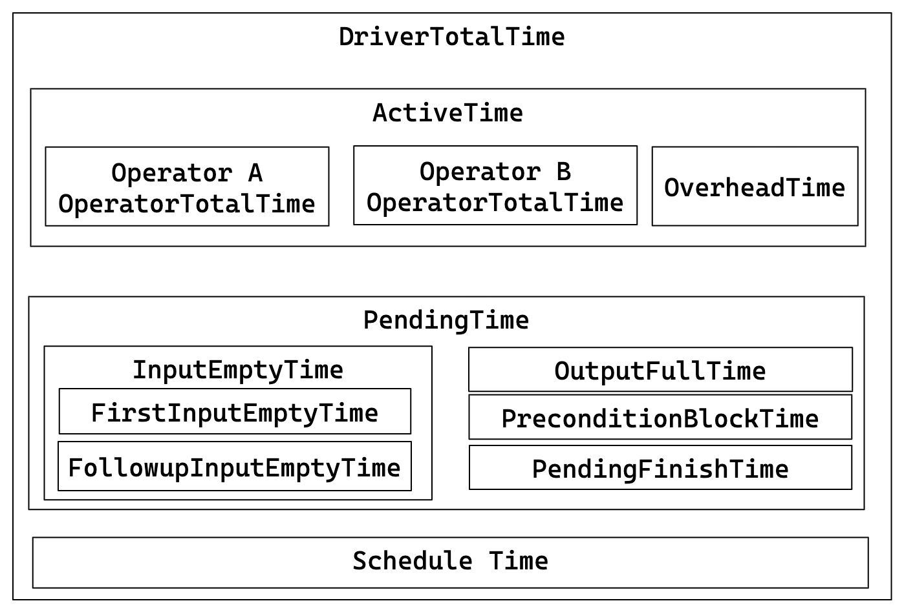

# クエリプロファイルメトリクス

> によって出力される生メトリクスの権威ある参照情報**StarRocks クエリプロファイル**（オペレーター別にグループ化）。\
> 用語集としてご利用ください。トラブルシューティングのガイダンスについては**query_profile_tuning_recipes.md**をご参照ください。

### サマリーメトリクス

クエリ実行に関する基本情報：

| メトリクス | 説明 |
|--------|-------------|
| Total | クエリで消費された合計時間。Planning、Executing、Profiling フェーズの所要時間を含む。 |
| Query State | クエリの状態。Finished、Error、Running などの状態がある。 |
| Query ID | クエリの一意識別子。 |
| Start Time | クエリ開始時のタイムスタンプ。 |
| End Time | クエリ終了時のタイムスタンプ。 |
| Total | クエリの合計所要時間。 |
| Query Type | クエリの種類。 |
| Query State | クエリの現在の状態。 |
| StarRocks Version | 使用している StarRocks のバージョン。 |
| User | クエリを実行したユーザー。 |
| Default Db | クエリに使用されたデフォルトデータベース。 |
| Sql Statement | 実行された SQL 文。 |
| Variables | クエリに使用された重要な変数。 |
| NonDefaultSessionVariables | クエリに使用された非デフォルトのセッション変数。 |
| Collect Profile Time | プロファイルの収集にかかった時間。 |
| IsProfileAsync | プロファイル収集が非同期であったかどうかを示す。 |

### プランナーメトリクス

プランナーの包括的な概要を提供します。通常、プランナーに費やされた合計時間が 10ms 未満であれば、問題はありません。

特定のシナリオでは、プランナーにより多くの時間が必要になる場合があります：

1. 複雑なクエリでは、最適な実行計画を確保するために、解析と最適化に追加の時間が必要になる場合があります。
2. マテリアライズドビューが多数存在すると、クエリの書き換えに必要な時間が増加する可能性があります。
3. 複数の同時クエリがシステムリソースを使い果たし、クエリキューが使用される場合、`Pending` の時間が長くなる可能性があります。
4. 外部テーブルを含むクエリでは、外部メタデータサーバーとの通信に追加の時間がかかる場合があります。

例：

```
     - -- Parser[1] 0
     - -- Total[1] 3ms
     -     -- Analyzer[1] 0
     -         -- Lock[1] 0
     -         -- AnalyzeDatabase[1] 0
     -         -- AnalyzeTemporaryTable[1] 0
     -         -- AnalyzeTable[1] 0
     -     -- Transformer[1] 0
     -     -- Optimizer[1] 1ms
     -         -- MVPreprocess[1] 0
     -         -- MVTextRewrite[1] 0
     -         -- RuleBaseOptimize[1] 0
     -         -- CostBaseOptimize[1] 0
     -         -- PhysicalRewrite[1] 0
     -         -- DynamicRewrite[1] 0
     -         -- PlanValidate[1] 0
     -             -- InputDependenciesChecker[1] 0
     -             -- TypeChecker[1] 0
     -             -- CTEUniqueChecker[1] 0
     -             -- ColumnReuseChecker[1] 0
     -     -- ExecPlanBuild[1] 0
     - -- Pending[1] 0
     - -- Prepare[1] 0
     - -- Deploy[1] 2ms
     -     -- DeployLockInternalTime[1] 2ms
     -         -- DeploySerializeConcurrencyTime[2] 0
     -         -- DeployStageByStageTime[6] 0
     -         -- DeployWaitTime[6] 1ms
     -             -- DeployAsyncSendTime[2] 0
     - DeployDataSize: 10916
    Reason:
```

### 実行概要メトリクス

高レベルの実行統計：

| メトリクス | 説明 | 目安 |
|--------|-------------|---------------|
| FrontendProfileMergeTime | FE 側のプロファイル処理時間 | 10ms 未満が正常 |
| QueryAllocatedMemoryUsage | ノード全体で割り当てられたメモリの合計 | |
| QueryDeallocatedMemoryUsage | ノード全体で解放されたメモリの合計 | |
| QueryPeakMemoryUsagePerNode | ノードごとの最大ピークメモリ | 容量の 80% 未満が正常 |
| QuerySumMemoryUsage | ノード全体のピークメモリの合計 | |
| QueryExecutionWallTime | 実行のウォールタイム | |
| QueryCumulativeCpuTime | ノード全体の合計 CPU 時間 | `walltime * totalCpuCores` と比較 |
| QueryCumulativeOperatorTime | オペレーターの合計実行時間 | オペレーター時間割合の分母 |
| QueryCumulativeNetworkTime | Exchange ノードの合計ネットワーク時間 | |
| QueryCumulativeScanTime | Scan ノードの合計 IO 時間 | |
| QueryPeakScheduleTime | パイプラインの最大スケジュール時間 | 単純なクエリでは 1s 未満が正常 |
| QuerySpillBytes | ディスクにスピルされたデータ | 1GB 未満が正常 |

### テーブルごとのスキャン統計

マージされたクエリプロファイルには `PerTableScanStats` サマリーが付加されており、テーブルおよびバックエンドホスト別にスキャン作業を分解します。これは、アイソモーフィックマージがホストレベルの情報を統合する前に、インスタンスごとのプロファイルツリーを走査することで構築され、スキャンオペレーターが `UniqueMetrics` に公開する `RowsRead`、`BytesRead`、`RawRowsRead` カウンターと、`Database` および `Table` の情報文字列を集計します。キーはデータベース名で修飾されるため、異なるデータベース内の同名テーブル（例：`db1.orders` と `db2.orders`）は別々のバケットに保持されます。BE がスキャンに対してデータベースを報告しない場合は、テーブル名のみがフォールバックとして使用されます。BE ノード間のデータスキューを発見し、クエリのスキャンコストを支配しているテーブルを特定するのに役立ちます。

構造：

```
PerTableScanStats
  TableNum / ScanRows / ScanBytes / RawScanRows   -- query-wide totals
  Table: <database>.<table>                       -- bare <table> if database absent
    HostNum / ScanRows / ScanBytes / RawScanRows  -- per-table totals
    Host: <host:port>
      ScanRows / ScanBytes / RawScanRows          -- per (table, host)
```

| メトリクス | 説明 |
|--------|-------------|
| TableNum | スキャンされた異なるテーブルの数（トップレベルのみ） |
| HostNum | このテーブルをスキャンした BE ホストの数（テーブルレベルのみ） |
| ScanRows | フィルタリング後に読み取られた行数（スコープ別に集計） |
| ScanBytes | フィルタリング後に読み取られたバイト数（スコープ別に集計、すべてのコネクターで報告されるわけではない） |
| RawScanRows | 述語フィルタリング前に読み取られた生の行数（スコープ別に集計） |

### フラグメントメトリクス

フラグメントレベルの実行詳細：

| メトリクス | 説明 |
|--------|-------------|
| InstanceNum | FragmentInstance の数 |
| InstanceIds | すべての FragmentInstance の ID |
| BackendNum | 参加している BE の数 |
| BackendAddresses | BE のアドレス |
| FragmentInstancePrepareTime | フラグメントの Prepare フェーズの所要時間 |
| InstanceAllocatedMemoryUsage | インスタンスに割り当てられたメモリの合計 |
| InstanceDeallocatedMemoryUsage | インスタンスで解放されたメモリの合計 |
| InstancePeakMemoryUsage | インスタンス全体のピークメモリ |

### パイプラインメトリクス

パイプラインの実行詳細と関係：



主な関係：

- DriverTotalTime = ActiveTime + PendingTime + ScheduleTime
- ActiveTime = ∑ OperatorTotalTime + OverheadTime
- PendingTime = InputEmptyTime + OutputFullTime + PreconditionBlockTime + PendingFinishTime
- InputEmptyTime = FirstInputEmptyTime + FollowupInputEmptyTime

| メトリクス | 説明 |
|--------|-------------|
| DegreeOfParallelism | パイプライン実行の並列度。 |
| TotalDegreeOfParallelism | 並列度の合計。同じパイプラインが複数のマシンで実行される場合があるため、この項目はすべての値を集計する。 |
| DriverPrepareTime | Prepare フェーズにかかった時間。このメトリクスは DriverTotalTime に含まれない。 |
| DriverTotalTime | パイプラインの合計実行時間。Prepare フェーズに費やされた時間を除く。 |
| ActiveTime | パイプラインの実行時間。各オペレーターの実行時間と、has_output、need_input などのメソッド呼び出しに費やされた時間などのフレームワーク全体のオーバーヘッドを含む。 |
| PendingTime | さまざまな理由でパイプラインのスケジューリングがブロックされた時間。 |
| InputEmptyTime | 入力キューが空のためにパイプラインがブロックされた時間。 |
| FirstInputEmptyTime | 入力キューが空のためにパイプラインが最初にブロックされた時間。最初のブロック時間は主にパイプラインの依存関係によって引き起こされるため、個別に計算される。 |
| FollowupInputEmptyTime | 入力キューが空のためにパイプラインがその後ブロックされた時間。 |
| OutputFullTime | 出力キューが満杯のためにパイプラインがブロックされた時間。 |
| PreconditionBlockTime | 依存関係が満たされていないためにパイプラインがブロックされた時間。 |
| PendingFinishTime | 非同期タスクの完了を待機してパイプラインがブロックされた時間。 |
| ScheduleTime | パイプラインのスケジューリング時間。レディキューへの投入から実行スケジューリングまでの時間。 |
| BlockByInputEmpty | InputEmpty によってパイプラインがブロックされた回数。 |
| BlockByOutputFull | OutputFull によってパイプラインがブロックされた回数。 |
| BlockByPrecondition | 前提条件が満たされていないためにパイプラインがブロックされた回数。 |

### オペレーターメトリクス

| メトリクス | 説明 |
|--------|-------------|
| PrepareTime | 準備に費やされた時間。 |
| OperatorTotalTime | オペレーターが消費した合計時間。次の式を満たす：OperatorTotalTime = PullTotalTime + PushTotalTime + SetFinishingTime + SetFinishedTime + CloseTime。準備に費やされた時間は除く。 |
| PullTotalTime | オペレーターが push_chunk の実行に費やした合計時間。 |
| PushTotalTime | オペレーターが pull_chunk の実行に費やした合計時間。 |
| SetFinishingTime | オペレーターが set_finishing の実行に費やした合計時間。 |
| SetFinishedTime | オペレーターが set_finished の実行に費やした合計時間。 |
| PushRowNum | オペレーターへの入力行の累積数。 |
| PullRowNum | オペレーターからの出力行の累積数。 |
| JoinRuntimeFilterEvaluate | Join Runtime Filter が評価された回数。 |
| JoinRuntimeFilterHashTime | Join Runtime Filter のハッシュ計算に費やされた時間。 |
| JoinRuntimeFilterInputRows | Join Runtime Filter への入力行数。 |
| JoinRuntimeFilterOutputRows | Join Runtime Filter からの出力行数。 |
| JoinRuntimeFilterTime | Join Runtime Filter に費やされた時間。 |

### スキャンオペレーター

#### OLAP スキャンオペレーター

OLAP_SCANオペレーターは、StarRocksネイティブテーブルからデータを読み取る役割を担っています。

| メトリック | 説明 |
|--------|-------------|
| Table | テーブル名。 |
| Rollup | マテリアライズドビュー名。マテリアライズドビューがヒットしない場合は、テーブル名と同等です。 |
| SharedScan | enable_shared_scanセッション変数が有効かどうか。 |
| TabletCount | タブレット数。 |
| MorselsCount | モーセル数。モーセルは基本的なIO実行単位です。 |
| PushdownPredicates | プッシュダウン述語の数。 |
| Predicates | 述語式。 |
| BytesRead | 読み取ったデータのサイズ。 |
| CompressedBytesRead | ディスクから読み取った圧縮データのサイズ。 |
| UncompressedBytesRead | ディスクから読み取った非圧縮データのサイズ。 |
| RowsRead | 読み取った行数（述語フィルタリング後）。 |
| RawRowsRead | 読み取った生の行数（述語フィルタリング前）。 |
| ReadPagesNum | 読み取ったページ数。 |
| CachedPagesNum | キャッシュされたページ数。 |
| ChunkBufferCapacity | チャンクバッファの容量。 |
| DefaultChunkBufferCapacity | チャンクバッファのデフォルト容量。 |
| PeakChunkBufferMemoryUsage | チャンクバッファのピークメモリ使用量。 |
| PeakChunkBufferSize | チャンクバッファのピークサイズ。 |
| PrepareChunkSourceTime | チャンクソースの準備に費やした時間。 |
| ScanTime | 累積スキャン時間。スキャン操作は非同期I/Oスレッドプールで完了します。 |
| IOTaskExecTime | IOタスクの実行時間。 |
| IOTaskWaitTime | IOタスクの送信成功からスケジュール実行までの待機時間。 |
| SubmitTaskCount | IOタスクが送信された回数。 |
| SubmitTaskTime | タスク送信に費やした時間。 |
| PeakIOTasks | IOタスクのピーク数。 |
| PeakScanTaskQueueSize | IOタスクキューのピークサイズ。 |

#### コネクタースキャンオペレーター

OLAP_SCANオペレーターに似ていますが、Iceberg/Hive/Hudi/Deltaなどの外部テーブルのスキャンに使用されます。

| メトリック | 説明 |
|--------|-------------|
| DataSourceType | データソースの種類。HiveDataSource、ESDataSourceなどがあります。 |
| Table | テーブル名。 |
| TabletCount | タブレット数。 |
| MorselsCount | モーセル数。 |
| Predicates | 述語式。 |
| PredicatesPartition | パーティションに適用される述語式。 |
| SharedScan | `enable_shared_scan`セッション変数が有効かどうか。 |
| ChunkBufferCapacity | チャンクバッファの容量。 |
| DefaultChunkBufferCapacity | チャンクバッファのデフォルト容量。 |
| PeakChunkBufferMemoryUsage | チャンクバッファのピークメモリ使用量。 |
| PeakChunkBufferSize | チャンクバッファのピークサイズ。 |
| PrepareChunkSourceTime | チャンクソースの準備にかかった時間。 |
| ScanTime | スキャンの累積時間。スキャン操作は非同期I/Oスレッドプールで完了します。 |
| IOTaskExecTime | I/Oタスクの実行時間。 |
| IOTaskWaitTime | IOタスクの送信成功からスケジュール実行までの待機時間。 |
| SubmitTaskCount | IOタスクが送信された回数。 |
| SubmitTaskTime | タスクの送信にかかった時間。 |
| PeakIOTasks | IOタスクのピーク数。 |
| PeakScanTaskQueueSize | IOタスクキューのピークサイズ。 |

### エクスチェンジオペレーター

エクスチェンジオペレーターは、BEノード間でデータを転送する役割を担っています。エクスチェンジ操作にはGATHER/BROADCAST/SHUFFLEなど複数の種類があります。

エクスチェンジオペレーターがクエリのボトルネックになりうる典型的なシナリオ：

1. ブロードキャストジョイン：小さなテーブルに適した方法です。ただし、オプティマイザーが最適でないクエリプランを選択した例外的なケースでは、ネットワーク帯域幅が大幅に増加する可能性があります。
2. シャッフル集計/ジョイン：大きなテーブルをシャッフルすると、ネットワーク帯域幅が大幅に増加する可能性があります。

#### エクスチェンジシンクオペレーター

| メトリック | 説明 |
|--------|-------------|
| ChannelNum | チャネル数。通常、チャネル数は受信者数と同じです。 |
| DestFragments | 宛先FragmentInstanceIDのリスト。 |
| DestID | 宛先ノードID。 |
| PartType | データ分散モード。UNPARTITIONED、RANDOM、HASH_PARTITIONED、BUCKET_SHUFFLE_HASH_PARTITIONEDが含まれます。 |
| SerializeChunkTime | チャンクのシリアライズにかかった時間。 |
| SerializedBytes | シリアライズされたデータのサイズ。 |
| ShuffleChunkAppendCounter | PartTypeがHASH_PARTITIONEDまたはBUCKET_SHUFFLE_HASH_PARTITIONEDの場合のチャンクアペンド操作の回数。 |
| ShuffleChunkAppendTime | PartTypeがHASH_PARTITIONEDまたはBUCKET_SHUFFLE_HASH_PARTITIONEDの場合のチャンクアペンド操作にかかった時間。 |
| ShuffleHashTime | PartTypeがHASH_PARTITIONEDまたはBUCKET_SHUFFLE_HASH_PARTITIONEDの場合のハッシュ計算にかかった時間。 |
| RequestSent | 送信されたデータパケット数。 |
| RequestUnsent | 未送信のデータパケット数。ショートサーキットロジックがある場合にゼロ以外になります。それ以外はゼロです。 |
| BytesSent | 送信されたデータのサイズ。 |
| BytesUnsent | 未送信データのサイズ。ショートサーキットロジックがある場合にゼロ以外になります。それ以外はゼロです。 |
| BytesPassThrough | 宛先ノードが現在のノードである場合、データはネットワーク経由で転送されません。これをパススルーデータと呼びます。このメトリックはそのパススルーデータのサイズを示します。パススルーは`enable_exchange_pass_through`によって制御されます。 |
| PassThroughBufferPeakMemoryUsage | パススルーバッファのピークメモリ使用量。 |
| CompressTime | 圧縮時間。 |
| CompressedBytes | 圧縮データのサイズ。 |
| OverallThroughput | スループット率。 |
| NetworkTime | データパケット転送にかかった時間（受信後の処理時間を除く）。 |
| NetworkBandwidth | 推定ネットワーク帯域幅。 |
| WaitTime | 送信キューが満杯による待機時間。 |
| OverallTime | 転送プロセス全体の合計時間。つまり、最初のデータパケットの送信から最後のデータパケットの正常受信確認までの時間。 |
| RpcAvgTime | RPCの平均時間。 |
| RpcCount | RPCの総数。 |

#### エクスチェンジソースオペレーター

| メトリック | 説明 |
|--------|-------------|
| RequestReceived | 受信したデータパケットのサイズ。 |
| BytesReceived | 受信したデータのサイズ。 |
| DecompressChunkTime | チャンクの解凍にかかった時間。 |
| DeserializeChunkTime | チャンクのデシリアライズにかかった時間。 |
| ClosureBlockCount | ブロックされたクロージャの数。 |
| ClosureBlockTime | クロージャのブロック時間。 |
| ReceiverProcessTotalTime | 受信側の処理にかかった合計時間。 |
| WaitLockTime | ロック待機時間。 |

### 集計オペレーター

**メトリックリスト**

| メトリック | 説明 |
|--------|-------------|
| `GroupingKeys` | `GROUP BY`列。 |
| `AggregateFunctions` | 集計関数の計算にかかった時間。 |
| `AggComputeTime` | AggregateFunctions + Group Byの時間。 |
| `ChunkBufferPeakMem` | チャンクバッファのピークメモリ使用量。 |
| `ChunkBufferPeakSize` | チャンクバッファのピークサイズ。 |
| `ExprComputeTime` | 式計算の時間。 |
| `ExprReleaseTime` | 式解放の時間。 |
| `GetResultsTime` | 集計結果の抽出にかかった時間。 |
| `HashTableSize` | ハッシュテーブルのサイズ。 |
| `HashTableMemoryUsage` | ハッシュテーブルのメモリサイズ。 |
| `InputRowCount` | 入力行数。 |
| `PassThroughRowCount` | Autoモードにおいて、集計率が低くストリーミングモードへ劣化した後にストリーミングモードで処理されたデータ行数。 |
| `ResultAggAppendTime` | 集計結果列の追加にかかった時間。 |
| `ResultGroupByAppendTime` | Group By列の追加にかかった時間。 |
| `ResultIteratorTime` | ハッシュテーブルの反復にかかった時間。 |
| `StreamingTime` | ストリーミングモードでの処理時間。 |

### ジョインオペレーター

**メトリックリスト**

| メトリック | 説明 |
|--------|-------------|
| `DistributionMode` | 分散タイプ。BROADCAST、PARTITIONED、COLOCATEなどが含まれます。 |
| `JoinPredicates` | ジョイン述語。 |
| `JoinType` | ジョインタイプ。 |
| `BuildBuckets` | ハッシュテーブルのバケット数。 |
| `BuildKeysPerBucket` | ハッシュテーブルの各バケットあたりのキー数。 |
| `BuildConjunctEvaluateTime` | ビルドフェーズ中の結合評価にかかった時間。 |
| `BuildHashTableTime` | ハッシュテーブルの構築にかかった時間。 |
| `ProbeConjunctEvaluateTime` | プローブフェーズ中の結合評価にかかった時間。 |
| `SearchHashTableTimer` | ハッシュテーブルの検索にかかった時間。 |
| `CopyRightTableChunkTime` | 右テーブルからチャンクをコピーするのにかかった時間。 |
| `OutputBuildColumnTime` | ビルド側の列を出力するのにかかった時間。 |
| `OutputProbeColumnTime` | プローブ側の列を出力するのにかかった時間。 |
| `HashTableMemoryUsage` | ハッシュテーブルのメモリ使用量。 |
| `RuntimeFilterBuildTime` | ランタイムフィルターの構築にかかった時間。 |
| `RuntimeFilterNum` | ランタイムフィルターの数。 |

### ウィンドウ関数オペレーター

| メトリック | 説明 |
|--------|-------------|
| `ProcessMode` | 実行モード。2つの部分を含みます：最初の部分はMaterializingとStreaming、2番目の部分はCumulative、RemovableCumulative、ByDefinitionです。 |
| `ComputeTime` | ウィンドウ関数の計算にかかった時間。 |
| `PartitionKeys` | パーティション列。 |
| `AggregateFunctions` | 集計関数。 |
| `ColumnResizeTime` | 列のリサイズにかかった時間。 |
| `PartitionSearchTime` | パーティション境界の検索にかかった時間。 |
| `PeerGroupSearchTime` | ピアグループ境界の検索にかかった時間。ウィンドウタイプが`RANGE`の場合にのみ意味があります。 |
| `PeakBufferedRows` | バッファ内の行数のピーク値。 |
| `RemoveUnusedRowsCount` | 未使用バッファが削除された回数。 |
| `RemoveUnusedTotalRows` | 未使用バッファから削除された行の総数。 |

### ソートオペレーター

| メトリック | 説明 |
|--------|-------------|
| `SortKeys` | ソートキー。 |
| `SortType` | クエリ結果のソート方法：完全ソートまたは上位N件のソート。 |
| `MaxBufferedBytes` | バッファリングされたデータのピークサイズ。 |
| `MaxBufferedRows` | バッファリングされた行数のピーク値。 |
| `NumSortedRuns` | ソート済みランの数。 |
| `BuildingTime` | ソート中に内部データ構造を維持するのにかかった時間。 |
| `MergingTime` | ソート中にソート済みランをマージするのにかかった時間。 |
| `SortingTime` | ソートにかかった時間。 |
| `OutputTime` | 出力ソート済みシーケンスの構築にかかった時間。 |

### マージオペレーター

| メトリック | 説明 | レベル |
|--------|-------------|-------|
| `Limit` | リミット。 | プライマリ |
| `Offset` | オフセット。 | プライマリ |
| `StreamingBatchSize` | ストリーミングモードでマージを実行する際の1回のマージ操作あたりの処理データサイズ。 | プライマリ |
| `LateMaterializationMaxBufferChunkNum` | 遅延マテリアライゼーションが有効な場合のバッファ内チャンクの最大数。 | プライマリ |
| `OverallStageCount` | 全ステージの合計実行回数。 | プライマリ |
| `OverallStageTime` | 各ステージの合計実行時間。 | プライマリ |
| `1-InitStageCount` | Initステージの実行回数。 | セカンダリ |
| `2-PrepareStageCount` | Prepareステージの実行回数。 | セカンダリ |
| `3-ProcessStageCount` | Processステージの実行回数。 | セカンダリ |
| `4-SplitChunkStageCount` | SplitChunkステージの実行回数。 | セカンダリ |
| `5-FetchChunkStageCount` | FetchChunkステージの実行回数。 | セカンダリ |
| `6-PendingStageCount` | Pendingステージの実行回数。 | セカンダリ |
| `7-FinishedStageCount` | Finishedステージの実行回数。 | セカンダリ |
| `1-InitStageTime` | Initステージの実行時間。 | セカンダリ |
| `2-PrepareStageTime` | Prepareステージの実行時間。 | セカンダリ |
| `3-ProcessStageTime` | Processステージの実行時間。 | セカンダリ |
| `4-SplitChunkStageTime` | Splitステージにかかった時間。 | セカンダリ |
| `5-FetchChunkStageTime` | Fetchステージにかかった時間。 | セカンダリ |
| `6-PendingStageTime` | Pendingステージにかかった時間。 | セカンダリ |
| `7-FinishedStageTime` | Finishedステージにかかった時間。 | セカンダリ |
| `LateMaterializationGenerateOrdinalTime` | 遅延マテリアライゼーション中に序数列を生成するのにかかった時間。 | ターシャリ |
| `SortedRunProviderTime` | Processステージ中にプロバイダーからデータを取得するのにかかった時間。 | ターシャリ |

### テーブル関数オペレーター

| メトリック | 説明 |
|--------|-------------|
| `TableFunctionExecTime` | テーブル関数の計算時間。 |
| `TableFunctionExecCount` | テーブル関数の実行回数。 |

### プロジェクトオペレーター

Project Operatorは`SELECT <expr>`の実行を担当します。クエリに高コストな式が含まれている場合、このオペレーターは大幅な時間を要することがあります。

| メトリック | 説明 |
|--------|-------------|
| `ExprComputeTime` | 式の計算時間。 |
| `CommonSubExprComputeTime` | 共通部分式の計算時間。 |

### LocalExchange Operator

| メトリック | 説明 |
|--------|-------------|
| Type | ローカルエクスチェンジのタイプ。`Passthrough`、`Partition`、`Broadcast`を含む。 |
| `ShuffleNum` | シャッフルの回数。このメトリックは`Type`が`Partition`の場合にのみ有効です。 |
| `LocalExchangePeakMemoryUsage` | ピークメモリ使用量。 |
| `LocalExchangePeakBufferSize` | バッファのピークサイズ。 |
| `LocalExchangePeakBufferMemoryUsage` | バッファのピークメモリ使用量。 |
| `LocalExchangePeakBufferChunkNum` | バッファ内のチャンクのピーク数。 |
| `LocalExchangePeakBufferRowNum` | バッファ内の行のピーク数。 |
| `LocalExchangePeakBufferBytes` | バッファ内のデータのピークサイズ。 |
| `LocalExchangePeakBufferChunkSize` | バッファ内のチャンクのピークサイズ。 |
| `LocalExchangePeakBufferChunkRowNum` | バッファ内のチャンクあたりの行のピーク数。 |
| `LocalExchangePeakBufferChunkBytes` | バッファ内のチャンクあたりのデータのピークサイズ。 |

### OlapTableSink Operator

OlapTableSink Operatorは`INSERT INTO <table>`操作の実行を担当します。

:::tip

- `OlapTableSink`の`PushChunkNum`メトリックのMaxとMinの値の差が大きい場合、上流オペレーターにデータスキューが発生していることを示しており、ロードパフォーマンスのボトルネックにつながる可能性があります。
- `RpcClientSideTime`は`RpcServerSideTime`にネットワーク転送時間とRPCフレームワーク処理時間を加えたものです。`RpcClientSideTime`と`RpcServerSideTime`の間に大きな差がある場合は、圧縮を有効にして転送時間を短縮することを検討してください。
:::

| メトリック | 説明 |
|--------|-------------|
| `IndexNum` | 宛先テーブルに作成された同期マテリアライズドビューの数。 |
| `ReplicatedStorage` | Single Leader Replicationが有効かどうか。 |
| `TxnID` | ロードトランザクションのID。 |
| `RowsRead` | 上流オペレーターから読み取られた行数。 |
| `RowsFiltered` | データ品質が不十分なためにフィルタリングされた行数。 |
| `RowsReturned` | 宛先テーブルに書き込まれた行数。 |
| `RpcClientSideTime` | クライアント側で記録されたロードの合計RPC時間消費。 |
| `RpcServerSideTime` | サーバー側で記録されたロードの合計RPC時間消費。 |
| `PrepareDataTime` | データ形式変換およびデータ品質チェックを含む、データ準備フェーズの合計時間消費。 |
| `SendDataTime` | データのシリアライズと圧縮、および送信キューへのタスク送信にかかる時間を含む、データ送信のローカル時間消費。 |
