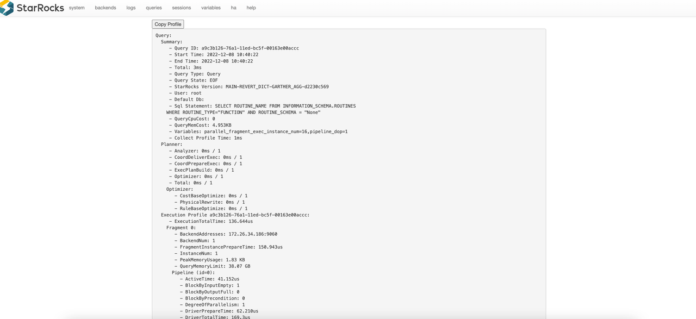

# Query Profile 概要

## はじめに

Query Profile は、クエリに関与するすべての作業ノードの実行情報を記録し、クエリパフォーマンスに影響を与えるボトルネックを迅速に特定するのに役立ちます。これは、StarRocks におけるクエリパフォーマンスの診断と調整のための強力なツールです。

> v3.3.0 以降、StarRocks は INSERT INTO FILES() および Broker Load を使用したデータロードのための Query Profile を提供することをサポートしています。関連するメトリクスの詳細については、 [OlapTableSink Operator](./query_profile_operator_metrics.md#olaptablesink-operator) を参照してください。

## Query Profile の有効化方法

### Query Profile の有効化

Query Profile を有効にするには、変数 `enable_profile` を `true` に設定します。

```SQL
SET enable_profile = true;
SET GLOBAL enable_profile = true;
```

### スロークエリのための Query Profile

長期間にわたって Query Profile をグローバルに有効にすることは、追加のシステム負荷を課す可能性があるため、本番環境では推奨されません。スロークエリのみをキャプチャして分析するには、変数 `big_query_profile_threshold` を `0s` より大きい時間に設定します。例えば、`30s` に設定すると、30 秒を超えるクエリのみが Query Profile をトリガーします。

```SQL
-- 30 秒
SET global big_query_profile_threshold = '30s';

-- 500 ミリ秒
SET global big_query_profile_threshold = '500ms';

-- 60 分
SET global big_query_profile_threshold = '60m';
```

### 実行時 Query Profile

長時間実行されるクエリでは、完了前に進捗や問題を特定するのが難しい場合があります。実行時 Query Profile 機能 (v3.1+) は、実行中に固定間隔で Query Profile データを収集し、クエリの進捗やボトルネックに関するリアルタイムの洞察を提供します。

Query Profile が有効になっている場合、実行時 Query Profile はデフォルトで 10 秒の報告間隔で自動的に有効化されます。`runtime_profile_report_interval` で間隔を調整できます。

```SQL
SET runtime_profile_report_interval = 30;
```

### 設定

| 設定項目                           | タイプ       | 有効な値         | デフォルト | 説明                                                                                       |
|-----------------------------------|--------------|-----------------|---------|-------------------------------------------------------------------------------------------|
| enable_profile                    | セッション変数 | true/false      | false   | Query Profile を有効化                                                                     |
| pipeline_profile_level            | セッション変数 | 1/2             | 1       | 1: メトリクスをマージ; 2: 元の構造を保持 (可視化ツールを無効化)                             |
| runtime_profile_report_interval   | セッション変数 | 正の整数        | 10      | 実行時 Query Profile の報告間隔 (秒)                                                        |
| big_query_profile_threshold       | セッション変数 | 文字列          | 0s      | この期間を超えるクエリに対して Query Profile を有効化 (例: '30s', '500ms', '60m')            |
| enable_statistics_collect_profile | FE ダイナミック | true/false      | false   | 統計収集関連のクエリに対する Query Profile を有効化                                         |

## Query Profile の取得方法

### Web UI 経由

1. ブラウザで `http://<fe_ip>:<fe_http_port>` にアクセスします。
2. 上部ナビゲーションで **queries** をクリックします。
3. **Finished Queries** リストで、分析したいクエリを選択し、**Profile** 列のリンクをクリックします。


選択した Query Profile の詳細ページにリダイレクトされます。



### SQL 関数 (`get_query_profile`) 経由

ワークフローの例:
- `last_query_id()`: セッションで最も最近実行されたクエリの ID を返します。最後のクエリのプロファイルを迅速に取得するのに便利です。
- `show profilelist;`: 最近のクエリとその ID およびステータスを一覧表示します。プロファイル分析に必要な `query_id` を見つけるのに使用します。
- `get_query_profile('<query_id>')`: 指定されたクエリの詳細な実行プロファイルを返します。クエリがどのように実行され、どこで時間やリソースが費やされたかを分析するのに使用します。

```sql
-- プロファイリング機能を有効にします。
SET enable_profile = true;

-- スキャンと集計を実行して、詳細なプロファイルを生成するクエリを実行します。
-- （システムテーブルを使用することで、どのクラスタでも動作します）
SELECT count(*) FROM information_schema.columns;

-- クエリの query_id を取得します。
SELECT last_query_id();
+--------------------------------------+
| last_query_id()                      |
+--------------------------------------+
| 019b364f-10c4-704c-b79a-af2cc3a77b89 |
+--------------------------------------+

-- プロファイルのリストを取得します。
SHOW PROFILELIST;

-- クエリプロファイルを取得します。
SELECT get_query_profile('019b364f-10c4-704c-b79a-af2cc3a77b89')\G
```

### マネージドバージョンで

StarRocks Managed (Enterprise) 環境では、Web コンソールのクエリ履歴から直接クエリプロファイルにアクセスできます。マネージド UI は、各クエリの実行プロファイルを直感的に視覚化し、手動の SQL コマンドなしでパフォーマンスを分析し、ボトルネックを特定するのを容易にします。

## Query Profile の解釈

### Explain Analyze

ほとんどのユーザーは、生のテキストを直接分析するのが難しいかもしれません。StarRocks は、より直感的に理解できる [Text-based Query Profile Visualized Analysis](./query_profile_text_based_analysis.md) 方法を提供しています。

### マネージドバージョン

StarRocks Enterprise Edition (EE) では、マネージドバージョンがクエリプロファイルのためのビジュアライゼーションツールを内蔵しています。このツールは、複雑なクエリ実行の詳細を生のテキスト出力と比較してはるかに簡単に解釈できるインタラクティブなグラフィカルインターフェースを提供します。

**ビジュアライゼーションツールの主な機能:**
- **オペレーター単位の内訳:** 各オペレーターのメトリクス (時間、行、メモリ) が明確に表示されたツリーまたはグラフとして実行計画を表示します。
- **ボトルネックのハイライト:** カラーコード化されたインジケーターを通じて、遅いまたはリソース集約的なオペレーターを迅速に特定します。
- **ドリルダウン機能:** 任意のオペレーターをクリックして、入力/出力行、CPU 時間、メモリ使用量などの詳細な統計を確認します。

**使用方法:**
1. StarRocks Managed Web コンソールを開きます。
2. **Query** または **Query History** セクションに移動します。
3. クエリを選択し、**Profile** または **Visualize** ボタンをクリックします。
4. ビジュアライズされたプロファイルを探索して、パフォーマンスを分析し、最適化の機会を特定します。

このビジュアライゼーションツールは、Managed/Enterprise Edition に限定されており、複雑なワークロードのトラブルシューティングとパフォーマンスチューニングを加速するように設計されています。