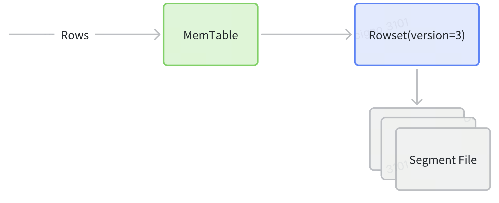
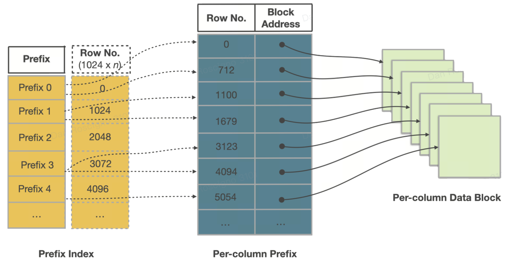

# テーブルクラスタリング

StarRocks において、慎重に選ばれたソートキーは、物理設計の中で最も影響力のある要素です。このガイドでは、ソートキーがどのように機能するのか、そのシステム的な利点、そして自身のワークロードに対して効果的なキーを選ぶための具体的な手法を説明します。

## 例
あなたが毎日数十億行のデータを受信するテレメトリシステムを運用していると仮定します。各行には `device_id` と `ts`（タイムスタンプ）がタグ付けされています。ファクトテーブルで `ORDER BY (device_id, ts)` を定義することで、以下が保証されます：

- `device_id` に対するポイントクエリがミリ秒単位で返されます。
- ダッシュボードは各デバイスの最近の時間枠をフィルタリングし、ほとんどのデータをプルーニングします。
- `GROUP BY device_id` のような集計はストリーミング集計から利益を得ます。
- 各デバイスごとの近接タイムスタンプのランにより圧縮が向上します。

このシンプルな2列のソートキー `ORDER BY (device_id, ts)` は、数十億行にわたって I/O 削減、CPU 節約、より安定したクエリパフォーマンスを提供します。

```sql
CREATE TABLE telemetry (
  device_id VARCHAR,
  ts DATETIME,
  value DOUBLE
)
ENGINE=OLAP
PRIMARY KEY(device_id, ts)
PARTITION BY date_trunc('day', ts)
DISTRIBUTED BY HASH(device_id) BUCKETS 16
ORDER BY (device_id, ts);
```
---

## 詳細な利点

1. 大規模な I/O 削減—セグメント & ページプルーニング

    仕組み：

    各セグメントと 64 KB ページは、すべての列の最小/最大値を格納します。述語がその範囲外にある場合、StarRocks はそのチャンク全体をスキップし、ディスクに触れることはありません。

    例：

    ```sql
    SELECT count(*)
    FROM events
    WHERE tenant_id = 42
      AND ts BETWEEN '2025-05-01' AND '2025-05-07';
    ```

    `ORDER BY (tenant_id, ts)` を使用すると、最初のキーが 42 に等しいセグメントのみが考慮され、その中で ts ウィンドウがその7日間と重なるページのみが対象となります。100 B 行のテーブルは 1 B 行未満をスキャンし、分単位を秒単位に変えます。

---
2. ミリ秒単位のポイントルックアップ—スパースプレフィックスインデックス

    仕組み：

    スパースプレフィックスインデックスは、約 1 K 個ごとのソートキー値を格納します。バイナリサーチで正しいページに着地し、単一のディスク読み取り（多くの場合、すでにキャッシュされている）が行を返します。

    例：

    ```sql
    SELECT *
    FROM orders
    WHERE order_id = 982347234;
    ```

    `ORDER BY (order_id)` を使用すると、プローブは 50 B 行のテーブルで約 50 キー比較を必要とし、コールドデータキャッシュでも 10 ms 未満のレイテンシーを実現します。

---
3. より速いソート集計

    仕組み：

    ソートキーが GROUP BY 句と一致する場合、StarRocks はスキャンしながらストリーミング集計を行います—ソートやハッシュテーブルは不要です。

    このソート集計プランは、ソートキー順に行をスキャンし、グループを即時に生成し、CPU キャッシュの局所性を活用し、中間実体化をスキップします。

    例：

    ```sql
    SELECT device_id, COUNT(*)
    FROM   telemetry
    WHERE  ts BETWEEN '2025-01-01' AND '2025-01-31'
    GROUP  BY device_id;
    ```

    テーブルが `ORDER BY (device_id, ts)` の場合、エンジンはストリームインする行をグループ化し、ハッシュテーブルを構築したり再ソートしたりせずに処理します。device_id のような高カーディナリティキーに対して、CPU とメモリ使用量を劇的に削減できます。

    ソートされた入力によるストリーミング集計は、大きなグループカーディナリティに対してハッシュ集計よりも通常 2–3 倍のスループットを向上させます。

---
4. より高い圧縮とホットなキャッシュ

    仕組み：

    ソートされたデータは、小さなデルタや長いランを示し、辞書、RLE、およびフレームオブリファレンスエンコーディングを加速します。コンパクトなページは、CPU キャッシュを通じて順次ストリームされます。

    例：

    (device_id, ts) でソートされたテレメトリテーブルは、同じデータを未ソートで取り込んだ場合と比べて、1.8 倍の圧縮（LZ4）と 25% の CPU/スキャン削減を達成しました。

---

## ソートキーの仕組み

ソートキーの影響は、行が書き込まれた瞬間から始まり、すべての読み取り時の最適化を通じて持続します。このセクションでは、そのライフサイクル（書き込みパス ➜ ストレージ階層 ➜ セグメント内部 ➜ 読み取りパス）を通じて、各層がどのように順序付けの価値を増幅するかを示します。

1.  書き込みパス
    1. インジェスト：行は MemTable に着地し、宣言されたソートキーでソートされ、その後、1 つ以上の順序付けられたセグメントを含む新しい Rowset としてフラッシュされます。
    2. Compaction：バックグラウンドの累積/ベースジョブは、多くの小さな Rowset をより大きなものにマージし、削除を回収し、セグメント数を減らします。すべてのソース Rowset がすでに同じ順序を共有しているため、再ソートは不要です。
    3. レプリケーション：各タブレット（Rowset を所有するシャード）は、バックエンドノードに同期的にレプリケートされ、ソートされた順序がレプリカ間で一貫していることを保証します。

   

2. ストレージ階層

| オブジェクト      | それが何か     | ソートキーにとってなぜ重要か |
| ------------- | ------------- | ------------------------------ |
| パーティション | テーブルの粗粒度の論理スライス（例：日付または tenant_id）。 | プランナー時のパーティションプルーニングを可能にし、ライフサイクル操作（TTL、バルクロード）を分離します。 |
| タブレット | パーティション内のハッシュ/ランダムバケットで、バックエンドノード間で独立してレプリケートされます。 | 行がソートキーによって物理的に順序付けられる単位。すべてのパーティション内プルーニングはここから始まります。 |
| MemTable | ディスクにフラッシュされる前に宣言されたキーでソートするインメモリの書き込みバッファ（約96 MB）。 | すべてのオンディスクセグメントがすでに順序付けられていることを保証します—後で外部ソートは不要です。 |
| Rowset | フラッシュ、ストリーミングロード、またはコンパクションサイクルによって生成される1つ以上のセグメントの不変のバンドル。 | 追加のみの設計により、StarRocks はリーダーがロックフリーのまま同時に取り込むことができます。 |
| セグメント | データページとプルーニングインデックスを運ぶ Rowset 内の自己完結型のカラムナファイル（約512 MB）。 | セグメントレベルのゾーンマップとプレフィックスインデックスは、MemTable ステージで確立された順序に依存します。 |

3.  セグメントファイルの内部

   

各セグメントは自己記述的です。上から下まで、次のものが見つかります：

    - カラムデータページ 64 KB ブロックはエンコード（辞書、RLE、デルタ）され、圧縮（LZ4 デフォルト）されます。
    - オーディナルインデックス 行オーディナル → ページオフセットをマップし、エンジンがページ n に直接ジャンプできるようにします。
    - ゾーンマップインデックス ページごとおよびセグメント全体の最小、最大、および has_null—プルーニングの最初の防御線。
    - ショートキー（プレフィックス）インデックス ソートキーの最初の 36 バイトを約 1 K 行ごとにスパースバイナリサーチテーブルにします—ミリ秒単位のポイント/レンジシークを可能にします。
    - フッター & マジックナンバー すべてのインデックスへのオフセットと整合性のためのチェックサム；StarRocks がメモリマップするだけで、残りを発見できるようにします。

ページがすでにキーでソートされているため、これらのインデックスは小さいながらも非常に効果的です。

4. 読み取りパス

    1. パーティションプルーニング（プランナー時） WHERE 句がパーティションキーを制約する場合（例：`dt BETWEEN '2025‑05‑01' AND '2025‑05‑07'`）、オプティマイザは一致するパーティションディレクトリのみを開きます。
    2. タブレットプルーニング（プランナー時） 等式フィルタがハッシュ分布列を含む場合、StarRocks はターゲットタブレット ID を計算し、それらのタブレットのみをスケジュールします。
    3. プレフィックスインデックスシーク リーディングソートカラムのスパースショートキーインデックスが正確なセグメントまたはページに絞り込みます。
    4. ゾーンマッププルーニング セグメントおよび 64 KB ページごとの最小/最大メタデータが述語ウィンドウを外れたブロックを破棄します。
    5. ベクトル化スキャン & 後期実体化 生き残ったカラムページは CPU キャッシュを通じて順次ストリームされます；参照された行&カラムのみが実体化され、メモリをタイトに保ちます。

    データはフラッシュごとにキー順にコミットされるため、各読み取り時のプルーニング層はその前の層に重なり、数十億行のテーブルでサブセカンドスキャンを実現します。

---
## 効果的なソートキーを選ぶ方法

1.  ワークロードインテリジェンスから始める

    トップ N クエリパターンを最初に分析します：

    - 等式述語（`=` / `IN`）。等式でほぼ常にフィルタリングされるカラムは、理想的なリーディング候補です。
    - 範囲述語。タイムスタンプや数値範囲は通常、ソートキーの等式カラムに続きます。
    - 集計キー。範囲カラムが `GROUP BY` 句にも現れる場合、選択的フィルタの後にキー内でそれを早めに配置することで、ソート集計を可能にします。
    - ジョイン/グループバイキー。ジョインまたはグループ化キーが一般的である場合、それらを早めに配置することを検討します。

    カラムのカーディナリティを測定します：高カーディナリティのカラム（数百万の異なる値）は最も効果的にプルーニングします。

2.  ヒューリスティックス & 経験則

    1. 順序ルール：  (高選択性の等式カラム) → (主要な範囲カラム) → (クラスターヘルパー)。
    2. カーディナリティの順序：低カーディナリティのカラムを高カーディナリティのカラムの前に配置することで、データ圧縮を向上させることができます。
    3. 幅：3–5 カラムに抑えます。非常に広いキーはインジェストを遅くし、36 バイトのプレフィックスインデックス制限を超えます。
    4. 文字列カラム：長いリーディング文字列カラムは、プレフィックスインデックスの 36 バイト制限のほとんどまたはすべてを占め、ソートキー内の後続のカラムが効果的にインデックスされるのを妨げます。

    これにより、プレフィックスインデックスのプルーニング力が低下し、ポイントクエリパフォーマンスが劣化します。

3.  他の設計ノブと調整する
    - パーティショニング：リーディングソートカラムよりも粗いパーティションキーを選択します（例：`PARTITION BY date`, `ORDER BY (tenant_id, ts)`）。これにより、パーティションプルーニングが最初に日付範囲全体を削除し、ソートプルーニングが内部をクリーンアップします。
    - バケッティング：バケッティングとクラスタリングの両方に同じカラムを使用することは異なる目的を果たします。バケッティングはクラスター全体で均等なデータ分布を保証し、ソートは効率的な I/O 削減を可能にします。
    - テーブルタイプ：プライマリキーテーブルはデフォルトでプライマリキーをソートキーとして使用しますが、物理的な順序を洗練し、プルーニングを強化するために追加のカラムを指定することもできます。集計および重複テーブルは、上記で説明した分析述語駆動のソートキー戦略に従うべきです。

---
4.  参照テンプレート

| シナリオ | パーティション | ソートキー | 理由 |
| -------- | --------- | -------- | --------- |
| B2C 注文 | date_trunc('day', order_ts) | (user_id, order_ts) | ほとんどのクエリは最初にユーザーでフィルタリングし、その後最近の時間範囲をフィルタリングします。| 
| IoT テレメトリ| date_trunc('day', ts)| (device_id, ts) | デバイススコープの時系列読み取りが支配的です。 | 
| SaaS マルチテナント | tenant_id | (dt, event_id) | パーティションによるテナント分離；ダッシュボード用に日付でクラスターをソートします。 | 
| ディメンションルックアップ | なし | (dim_id) | 小さなテーブル、純粋なポイントルックアップ—単一カラムで十分です。 |

---
## 結論

慎重に設計されたソートキーは、小さく予測可能なインジェストオーバーヘッドと引き換えに、スキャンレイテンシー、ストレージ効率、CPU 利用率の劇的な改善をもたらします。ワークロードの現実に基づいて選択を行い、カーディナリティを尊重し、`EXPLAIN` で検証することで、データとユーザー数が 10 倍以上に増加しても StarRocks をスムーズに運用することができます。