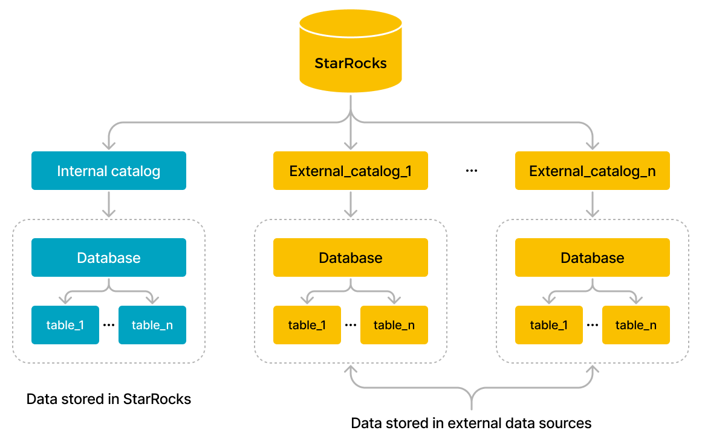

# Overview

このトピックでは、catalog とは何か、そして catalog を使用して内部データと外部データを管理およびクエリする方法について説明します。

StarRocks は v2.3 以降で catalog 機能をサポートしています。catalog により、内部データと外部データを一つのシステムで管理でき、さまざまな外部システムに保存されているデータを簡単にクエリおよび分析するための柔軟な方法を提供します。

## Basic concepts

- **Internal data**: StarRocks に保存されているデータを指します。
- **External data**: Apache Hive™、Apache Iceberg、Apache Hudi、Delta Lake、JDBC などの外部データソースに保存されているデータを指します。

## Catalog

現在、StarRocks は internal catalog と external catalog の2種類の catalog を提供しています。



- **Internal catalog** は StarRocks の内部データを管理します。たとえば、CREATE DATABASE や CREATE TABLE ステートメントを実行してデータベースやテーブルを作成すると、そのデータベースやテーブルは internal catalog に保存されます。各 StarRocks クラスターには [default_catalog](../catalog/default_catalog.md) という名前の internal catalog が1つだけあります。

- **External catalog** は外部で管理されているメタストアへのリンクのように機能し、StarRocks に外部データソースへの直接アクセスを提供します。データロードや移行なしで外部データを直接クエリできます。現在、StarRocks は以下の種類の external catalog をサポートしています:
  - [Hive catalog](../catalog/hive_catalog.md): Hive からデータをクエリするために使用されます。
  - [Iceberg catalog](./iceberg/iceberg_catalog.md): Iceberg からデータをクエリするために使用されます。
  - [Hudi catalog](../catalog/hudi_catalog.md): Hudi からデータをクエリするために使用されます。
  - [Delta Lake catalog](../catalog/deltalake_catalog.md): Delta Lake からデータをクエリするために使用されます。
  - [JDBC catalog](../catalog/jdbc_catalog.md): JDBC 互換のデータソースからデータをクエリするために使用されます。
  - [Elasticsearch catalog](../catalog/elasticsearch_catalog.md): Elasticsearch からデータをクエリするために使用されます。Elasticsearch catalog は v3.1 以降でサポートされています。
  - [Paimon catalog](../catalog/paimon_catalog.md): Paimon からデータをクエリするために使用されます。Paimon catalog は v3.1 以降でサポートされています。
  - [Unified catalog](../catalog/unified_catalog.md): Hive、Iceberg、Hudi、Delta Lake のデータソースを統合データソースとしてクエリするために使用されます。Unified catalog は v3.2 以降でサポートされています。

  StarRocks は外部データをクエリする際に、外部データソースの以下の2つのコンポーネントとやり取りします:

  - **Metastore service**: 外部データソースのメタデータにアクセスするために FEs によって使用されます。FEs はメタデータに基づいてクエリ実行計画を生成します。
  - **Data storage system**: 外部データを保存するために使用されます。分散ファイルシステムとオブジェクトストレージシステムの両方がデータストレージシステムとして使用され、さまざまな形式のデータファイルを保存できます。FEs がクエリ実行計画をすべての BEs または CNs に配布した後、すべての BEs または CNs はターゲットの外部データを並行してスキャンし、計算を行い、クエリ結果を返します。

## Access catalog

現在のセッションで指定された catalog に切り替えるには、[SET CATALOG](../../sql-reference/sql-statements/Catalog/SET_CATALOG.md) ステートメントを使用します。その後、その catalog を使用してデータをクエリできます。

## Query data

### Query internal data

StarRocks 内のデータをクエリするには、[Default catalog](../catalog/default_catalog.md) を参照してください。

### Query external data

外部データソースからデータをクエリするには、[Query external data](../catalog/query_external_data.md) を参照してください。

### Cross-catalog query

現在の catalog からクロスカタログフェデレーテッドクエリを実行するには、`catalog_name.database_name` または `catalog_name.database_name.table_name` 形式でクエリしたいデータを指定します。

- 現在のセッションが `default_catalog.olap_db` の場合、`hive_db` の `hive_table` をクエリします。

    ```SQL
    SELECT * FROM hive_catalog.hive_db.hive_table;
    ```

- 現在のセッションが `hive_catalog.hive_db` の場合、`default_catalog` の `olap_table` をクエリします。

   ```SQL
    SELECT * FROM default_catalog.olap_db.olap_table;
    ```

- 現在のセッションが `hive_catalog.hive_db` の場合、`hive_catalog` の `hive_table` と `default_catalog` の `olap_table` に対してジョインクエリを実行します。

    ```SQL
    SELECT * FROM hive_table h JOIN default_catalog.olap_db.olap_table o WHERE h.id = o.id;
    ```

- 現在のセッションが別の catalog の場合、`hive_catalog` の `hive_table` と `default_catalog` の `olap_table` に対してジョインクエリをジョイン句を使用して実行します。

    ```SQL
    SELECT * FROM hive_catalog.hive_db.hive_table h JOIN default_catalog.olap_db.olap_table o WHERE h.id = o.id;
    ```