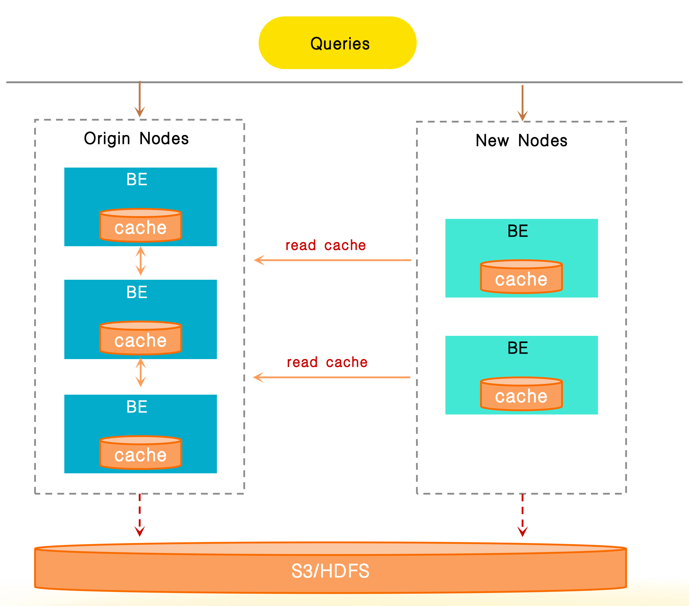

# Data Cache

Data Cache の基本原則と、Data Cache を使用してデータクエリを高速化する方法を理解します。

Data Cache は、内部テーブルと外部テーブルのデータをキャッシュするために使用されます。この機能は、v3.3.0 以降でデフォルトで有効になっています。そして、v4.0 以降では、メモリ内キャッシュとディスクキャッシュが Data Cache システムに統合され、管理が容易になっています。

Data Cache は、Page Cache (メモリ内キャッシュ) と Block Cache (ディスクキャッシュ) の2つのコンポーネントで構成されています。

## Page Cache の原則

メモリ内キャッシュとして、Page Cache は内部テーブルと外部テーブルのデータページを解凍後に保存する役割を担っています。これらのページのサイズは固定されていません。現在、Page Cache は以下のタイプのデータのキャッシュをサポートしています:

- 内部テーブルのデータページとインデックスページ
- 外部テーブルデータファイルのフッター情報
- 外部テーブルの部分的に解凍されたデータページ

Page Cache は現在、データの削除に LRU (Least Recently Used) 戦略を使用しています。

## Block Cache の原則

Block Cache はディスクベースのキャッシュであり、その主な機能はデータファイル (外部テーブルから、また共有データクラスタ内のクラウドネイティブテーブルから) をローカルディスクにキャッシュすることです。これによりリモートデータアクセスの遅延が減少し、クエリ効率が向上します。各データブロックのサイズは固定されています。

### 背景と価値

データレイク分析やクラウドネイティブテーブルのシナリオでは、StarRocks は OLAP クエリエンジンとして、HDFS やオブジェクトストレージ (以下「リモートストレージシステム」と呼びます) に保存されたデータファイルをスキャンする必要があります。このプロセスは2つの主要なパフォーマンスボトルネックに直面しています:

- クエリが読み取る必要のあるファイルが多いほど、リモート I/O のオーバーヘッドが大きくなります。
- アドホッククエリシナリオでは、同じデータへの頻繁なアクセスが冗長なリモート I/O 消費を引き起こします。

これらの問題に対処するために、Block Cache 機能が v2.5 で導入されました。リモートストレージシステムからの生データを特定の戦略に基づいて複数のブロックに分割し、これらのブロックを BE または CN ノードのローカルディスクにキャッシュします。リモートデータの繰り返し取得を回避することで、ホットデータに対するクエリパフォーマンスが大幅に向上します。

### シナリオ

- 外部カタログ (JDBC カタログを除く) を使用してリモートストレージシステムからデータをクエリする。
- 共有データクラスタ内のクラウドネイティブテーブルに対するクエリ。

### コアメカニズム

#### データ分割とキャッシュユニット

システムがリモートファイルをキャッシュする際、設定された戦略に従って元のファイルを等しいサイズのブロックに分割します。ブロックは最小のキャッシュユニットであり、そのサイズはカスタマイズ可能です。

例:

ブロックサイズが 1 MB に設定されている場合、Amazon S3 上の 128 MB の Parquet ファイルをクエリすると、ファイルは 128 個の連続したブロックに分割されます (つまり、`[0, 1 MB)`, `[1 MB, 2 MB)`, ..., `[127 MB, 128 MB)`)。

各ブロックには、以下の3つの部分からなるグローバルに一意のキャッシュ識別子 (キャッシュキー) が割り当てられます:

```Plain
hash(filename) + fileModificationTime + blockId
```

| **コンポーネント**        | **説明**                                |
| -------------------- | ---------------------------------------------- |
| filename             | データファイルの名前。                     |
| fileModificationTime | データファイルが最後に変更された時間。 |
| blockId              | データファイルが分割されたときに各ブロックに割り当てられる ID。この ID は単一ファイル内で一意ですが、グローバルには一意ではありません。 |

#### キャッシュヒットと読み取りプロセス

クエリが `[1 MB, 2 MB)` の範囲内のブロックにヒットしたと仮定すると、Block Cache は次のように進行します:

1. システムはまず、ローカル BE ノードの Block Cache にブロックが存在するかどうかを確認します (キャッシュキーを照合して)。
2. 見つかった場合 (キャッシュヒット)、ブロックはローカルディスクから直接読み取られます。
3. 見つからなかった場合 (キャッシュミス)、ブロックはリモートストレージから取得され、後続のクエリで再利用するためにローカル BE ノードの Block Cache に同期されます。

### キャッシュ媒体

Block Cache は BE または CN ノードのローカルディスクを記憶媒体として使用し、キャッシュの加速効果はディスクのパフォーマンスに直接関連しています:

- キャッシュの読み取り/書き込み遅延を最小限に抑えるために、高性能のローカルディスク (たとえば NVMe ディスク) を使用することをお勧めします。
- ディスクのパフォーマンスが最適でない場合、ディスクの数を増やして負荷分散を実現し、個々のディスクへの I/O 圧力を軽減することができます。

### キャッシュ置換ポリシー

Block Cache は、2つのデータキャッシュおよび削除戦略をサポートしています: LRU と SLRU (Segmented LRU)。

#### LRU

LRU 戦略は「最も最近使用されていない」原則に基づいており、最も長い間アクセスされていないブロックを削除します。実装が簡単で、安定したアクセスパターンのシナリオに適しています。

#### SLRU

SLRU 戦略は、キャッシュスペースを削除セグメントと保護セグメントに分割し、両方とも LRU ルールに従います:

1. データは最初のアクセス時に削除セグメントに入ります。
2. 削除セグメント内のデータは再度アクセスされると保護セグメントに昇格します。
3. 保護セグメントから削除されたデータは削除セグメントに戻され、削除セグメントから削除されたデータはキャッシュから直接削除されます。

SLRU 戦略は、突然のまばらなトラフィックに効果的に抵抗し、「一度だけアクセスされた一時的なデータ」が保護セグメント内のホットデータを直接削除するのを防ぎます。LRU よりも優れた安定性を提供します。

## Data Cache の有効化と設定

Data Cache はデフォルトで有効になっており、BE の設定項目 `datacache_enable` (デフォルト: `true`) によって制御されます。Page Cache と Block Cache は、2つの独立したコンポーネントとして、デフォルトで有効になっています。`datacache_enable` を `false` に設定すると、Data Cache 全体 (Page Cache と Block Cache の両方) が無効になります。

また、異なる BE 設定項目を使用して、Page Cache と Block Cache を個別に有効化または無効化することもできます。

- Page Cache (デフォルトで有効) は `disable_storage_page_cache` (デフォルト: `false`) によって制御されます。
- Block Cache (デフォルトで有効) は `block_cache_enable` (デフォルト: `true`) によって制御されます。

さらに、以下の BE 設定を使用して、Data Cache の最大メモリおよびディスク使用量の制限を設定し、過剰なリソースの占有を防ぐことができます:

- `datacache_mem_size`: Data Cache の最大メモリ使用量の制限を設定します (Page Cache にデータを保存するために使用されます)。
- `datacache_disk_size`: Data Cache の最大ディスク使用量の制限を設定します (Block Cache にデータを保存するために使用されます)。

## Block Cache のポピュレーション

### ポピュレーションルール

v3.3.2 以降、Block Cache のキャッシュヒット率を向上させるために、システムは以下のルールに従って Block Cache をポピュレートします:

- `SELECT` 以外のステートメント (たとえば、`ANALYZE TABLE` や `INSERT INTO SELECT`) ではキャッシュはポピュレートされません。
- テーブルのすべてのパーティションをスキャンするクエリではキャッシュはポピュレートされません。ただし、テーブルにパーティションが1つしかない場合は、デフォルトでポピュレーションが行われます。
- テーブルのすべてのカラムをスキャンするクエリではキャッシュはポピュレートされません。ただし、テーブルにカラムが1つしかない場合は、デフォルトでポピュレーションが行われます。
- Hive、Paimon、Delta Lake、Hudi、Iceberg 以外のテーブルではキャッシュはポピュレートされません。

### キャッシュポピュレーションの動作を確認する

特定のクエリに対するポピュレーションの動作を `EXPLAIN VERBOSE` コマンドで確認できます。

例:

```sql
mysql> EXPLAIN VERBOSE SELECT col1 FROM hudi_table;
...
|   0:HudiScanNode                        |
|      TABLE: hudi_table                  |
|      partitions=3/3                     |
|      cardinality=9084                   |
|      avgRowSize=2.0                     |
|      dataCacheOptions={populate: false} |
|      cardinality: 9084                  |
+-----------------------------------------+
```

`dataCacheOptions={populate: false}` は、クエリがすべてのパーティションをスキャンするため、キャッシュがポピュレートされないことを示しています。

また、セッション変数 [`populate_datacache_mode`](../sql-reference/System_variable.md#populate_datacache_mode) を使用して Block Cache のポピュレーション動作を微調整することもできます。

### ポピュレーションモード

Block Cache は2つのモード、すなわち同期ポピュレーションと非同期ポピュレーションをサポートしています。ビジネス要件に基づいて「最初のクエリパフォーマンス」と「キャッシュ効率」の間で選択できます。

**同期ポピュレーション**
- コアロジック: 最初のクエリでリモートデータが読み取られると、データは即座にローカルにキャッシュされます。後続のクエリはキャッシュを直接再利用できます。
- 利点: データキャッシュが1回のクエリで完了するため、キャッシュ効率が高いです。
- 欠点: キャッシュ操作が読み取り操作と同期して実行されるため、最初のクエリの遅延が増加する可能性があります。

**非同期ポピュレーション**
- コアロジック: 最初のクエリでは、データの読み取りが優先され、最初に完了します。キャッシュの書き込みはバックグラウンドで非同期に実行され、現在のクエリプロセスをブロックしません。
- 利点: 最初のクエリのパフォーマンスに影響を与えず、キャッシュによる読み取り操作の遅延を防ぎます。
- 欠点: 単一のクエリではすべてのアクセスされたデータを完全にキャッシュできないため、キャッシュ効率が低くなります。複数のクエリを必要とし、徐々にキャッシュカバレッジを向上させます。

v3.3.0 以降、非同期キャッシュポピュレーションがデフォルトで有効になっています。セッション変数 [`enable_datacache_async_populate_mode`](../sql-reference/System_variable.md) を設定することでポピュレーションモードを変更できます。

### 永続性

ディスクにキャッシュされたデータはデフォルトで永続化され、BE または CN が再起動した後も再利用できます。

## クエリがデータキャッシュにヒットしているかどうかを確認する

クエリプロファイルの以下のメトリクスを分析することで、クエリが Data Cache にヒットしているかどうかを確認できます:

- `DataCacheReadBytes`: システムがメモリおよびディスクから直接読み取ったデータのサイズ。
- `DataCacheWriteBytes`: リモートストレージシステムからメモリおよびディスクにロードされたデータのサイズ。
- `BytesRead`: リモートストレージシステム、メモリ、およびディスクからシステムが読み取ったデータの総量。

例1: この例では、システムがリモートストレージシステムから大量のデータ (7.65 GB) を読み取り、ディスクからは少量のデータ (518.73 MB) を読み取っています。これは、Block Cache がほとんどヒットしていないことを意味します。

```Plain
 - Table: lineorder
 - DataCacheReadBytes: 518.73 MB
   - __MAX_OF_DataCacheReadBytes: 4.73 MB
   - __MIN_OF_DataCacheReadBytes: 16.00 KB
 - DataCacheReadCounter: 684
   - __MAX_OF_DataCacheReadCounter: 4
   - __MIN_OF_DataCacheReadCounter: 0
 - DataCacheReadTimer: 737.357us
 - DataCacheWriteBytes: 7.65 GB
   - __MAX_OF_DataCacheWriteBytes: 64.39 MB
   - __MIN_OF_DataCacheWriteBytes: 0.00 
 - DataCacheWriteCounter: 7.887K (7887)
   - __MAX_OF_DataCacheWriteCounter: 65
   - __MIN_OF_DataCacheWriteCounter: 0
 - DataCacheWriteTimer: 23.467ms
   - __MAX_OF_DataCacheWriteTimer: 62.280ms
   - __MIN_OF_DataCacheWriteTimer: 0ns
 - BufferUnplugCount: 15
   - __MAX_OF_BufferUnplugCount: 2
   - __MIN_OF_BufferUnplugCount: 0
 - BytesRead: 7.65 GB
   - __MAX_OF_BytesRead: 64.39 MB
   - __MIN_OF_BytesRead: 0.00
```

例2: この例では、システムがデータキャッシュから大量のデータ (46.08 GB) を読み取り、リモートストレージシステムからはデータを読み取っていません。これは、Block Cache からのみデータを読み取っていることを意味します。

```Plain
Table: lineitem
- DataCacheReadBytes: 46.08 GB
 - __MAX_OF_DataCacheReadBytes: 194.99 MB
 - __MIN_OF_DataCacheReadBytes: 81.25 MB
- DataCacheReadCounter: 72.237K (72237)
 - __MAX_OF_DataCacheReadCounter: 299
 - __MIN_OF_DataCacheReadCounter: 118
- DataCacheReadTimer: 856.481ms
 - __MAX_OF_DataCacheReadTimer: 1s547ms
 - __MIN_OF_DataCacheReadTimer: 261.824ms
- DataCacheWriteBytes: 0.00 
- DataCacheWriteCounter: 0
- DataCacheWriteTimer: 0ns
- BufferUnplugCount: 1.231K (1231)
 - __MAX_OF_BufferUnplugCount: 81
 - __MIN_OF_BufferUnplugCount: 35
- BytesRead: 46.08 GB
 - __MAX_OF_BytesRead: 194.99 MB
 - __MIN_OF_BytesRead: 81.25 MB
```

## I/O アダプタ

ディスクアクセスのテールレイテンシーが高いキャッシュディスク I/O 負荷によって大幅に増加し、キャッシュシステムの最適化が負に働くのを防ぐために、Data Cache は I/O アダプタ機能を提供しています。この機能は、ディスク負荷が高い場合に一部のキャッシュ要求をリモートストレージにルーティングし、ローカルキャッシュとリモートストレージの両方を利用して I/O スループットを向上させます。この機能はデフォルトで有効です。

I/O アダプタを有効にするには、次のシステム変数を設定します:

```SQL
SET GLOBAL enable_datacache_io_adaptor=true;
```

## 動的スケーリング

Data Cache は、BE プロセスを再起動せずにキャッシュ容量を手動で調整することをサポートし、キャッシュ容量の自動調整もサポートしています。

### 手動スケーリング

BE 設定項目を動的に調整することで、Data Cache のメモリ制限またはディスク容量を変更できます。

例:

```SQL
-- 特定の BE インスタンスの Data Cache メモリ制限を調整します。
UPDATE be_configs SET VALUE="10G" WHERE NAME="datacache_mem_size" and BE_ID=10005;

-- すべての BE インスタンスの Data Cache メモリ比率制限を調整します。
UPDATE be_configs SET VALUE="10%" WHERE NAME="datacache_mem_size";

-- すべての BE インスタンスの Data Cache ディスク制限を調整します。
UPDATE be_configs SET VALUE="2T" WHERE NAME="datacache_disk_size";
```

:::note
- この方法で容量を調整する際は注意が必要です。WHERE 句を省略して無関係な設定項目を変更しないようにしてください。
- この方法で行ったキャッシュ容量の調整は永続化されず、BE または CN プロセスが再起動すると失われます。したがって、上記のようにパラメータを動的に調整した後、次回の再起動後に変更が有効になるように BE または CN の設定ファイルを手動で変更することをお勧めします。
:::

### 自動スケーリング

StarRocks は現在、ディスク容量の自動スケーリングをサポートしています。BE 設定でキャッシュディスクパスと容量制限を指定しない場合、自動スケーリングがデフォルトで有効になります。

設定ファイルに次の設定項目を追加し、BE または CN プロセスを再起動することで、自動スケーリングを有効にすることもできます:

```Plain
datacache_auto_adjust_enable=true
```

自動スケーリングが有効になると:

- ディスク使用量が BE 設定で指定されたしきい値 `disk_high_level` (デフォルト値は `90`、つまりディスクスペースの 90%) を超えると、システムは自動的にキャッシュデータを削除してディスクスペースを解放します。
- ディスク使用量が BE 設定で指定されたしきい値 `disk_low_level` (デフォルト値は `60`、つまりディスクスペースの 60%) を一貫して下回り、Data Cache によって使用されている現在のディスクスペースがいっぱいの場合、システムは自動的にキャッシュ容量を拡張します。
- キャッシュ容量を自動的にスケーリングする際、システムは BE 設定で指定されたレベル `disk_safe_level` (デフォルト値は `80`、つまりディスクスペースの 80%) にキャッシュ容量を調整することを目指します。

## キャッシュ共有

Data Cache は BE ノードのローカルディスクに依存しているため、クラスタがスケーリングされる際、データルーティングの変更がキャッシュミスを引き起こし、弾力的スケーリング中にパフォーマンスが大幅に低下する可能性があります。

キャッシュ共有は、ノード間でネットワークを介してキャッシュデータにアクセスすることをサポートします。クラスタスケーリング中にローカルキャッシュミスが発生した場合、システムはまず同じクラスタ内の他のノードからキャッシュデータを取得しようとします。すべてのキャッシュがミスした場合にのみ、システムはリモートストレージからデータを再取得します。この機能は、弾力的スケーリング中のキャッシュ無効化によるパフォーマンスの揺れを効果的に軽減し、安定したクエリパフォーマンスを保証します。



キャッシュ共有機能を有効にするには、次の2つの項目を設定します:

- FE 設定項目 `enable_trace_historical_node` を `true` に設定します。
- システム変数 `enable_datacache_sharing` を `true` に設定します。

さらに、クエリプロファイルの以下のメトリクスを確認して、キャッシュ共有を監視できます:

- `DataCacheReadPeerCounter`: 他のノードからの読み取り回数。
- `DataCacheReadPeerBytes`: 他のノードから読み取ったバイト数。
- `DataCacheReadPeerTimer`: 他のノードからキャッシュデータにアクセスするために使用された時間。

## 設定と変数

次のシステム変数とパラメータを使用して Data Cache を設定できます。

### システム変数

- [populate_datacache_mode](../sql-reference/System_variable.md#populate_datacache_mode)
- [enable_datacache_io_adaptor](../sql-reference/System_variable.md#enable_datacache_io_adaptor)
- [enable_file_metacache](../sql-reference/System_variable.md#enable_file_metacache)
- [enable_datacache_async_populate_mode](../sql-reference/System_variable.md)
- [enable_datacache_sharing](../sql-reference/System_variable.md#enable_datacache_sharing)

### FE 設定

- [enable_trace_historical_node](../administration/management/FE_configuration.md#enable_trace_historical_node)

### BE 設定

- [datacache_enable](../administration/management/BE_configuration.md#datacache_enable)
- [datacache_mem_size](../administration/management/BE_configuration.md#datacache_mem_size)
- [datacache_disk_size](../administration/management/BE_configuration.md#datacache_disk_size)
- [datacache_auto_adjust_enable](../administration/management/BE_configuration.md#datacache_auto_adjust_enable)
- [datacache_disk_high_level](../administration/management/BE_configuration.md#datacache_disk_high_level)
- [datacache_disk_safe_level](../administration/management/BE_configuration.md#datacache_disk_safe_level)
- [datacache_disk_low_level](../administration/management/BE_configuration.md#datacache_disk_low_level)
- [datacache_disk_adjust_interval_seconds](../administration/management/BE_configuration.md#datacache_disk_adjust_interval_seconds)
- [datacache_disk_idle_seconds_for_expansion](../administration/management/BE_configuration.md#datacache_disk_idle_seconds_for_expansion)
- [datacache_min_disk_quota_for_adjustment](../administration/management/BE_configuration.md#datacache_min_disk_quota_for_adjustment)
- [datacache_eviction_policy](../administration/management/BE_configuration.md#datacache_eviction_policy)
- [datacache_inline_item_count_limit](../administration/management/BE_configuration.md#datacache_inline_item_count_limit)
