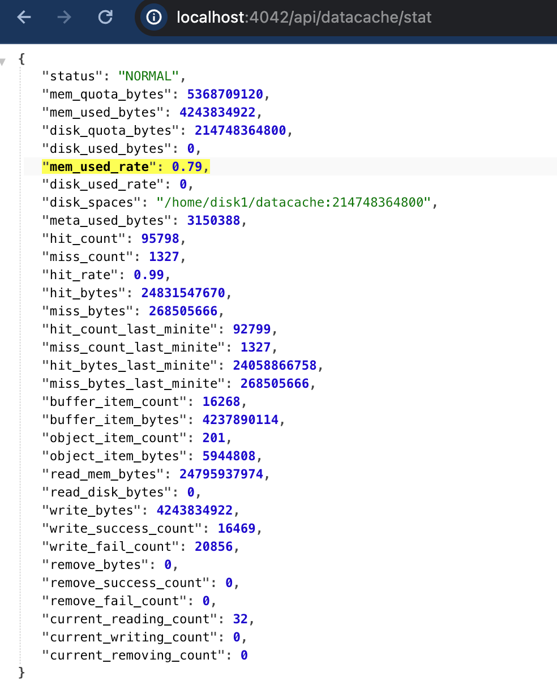

# Data Cache の可観測性

以前のバージョンでは、[Data Cache](./data_cache.md) のパフォーマンス、使用状況、健康状態を監視するための豊富なメトリクスや効率的な方法がありませんでした。

v3.3 では、StarRocks は Data Cache の可観測性を向上させ、効率的な監視方法とより多くのメトリクスを提供しています。ユーザーは、データキャッシュのディスクとメモリの全体的な使用状況や関連するメトリクスを確認でき、キャッシュ使用状況の監視が強化されました。

> **NOTE**
>
> v3.4.0 以降、external catalogs とクラウドネイティブテーブル（共有データクラスタ内）に対するクエリは、統一された Data Cache インスタンスを使用します。したがって、特に指定がない限り、以下の方法は、external catalogs とクラウドネイティブテーブルに対するクエリのキャッシュ使用状況を含む、Data Cache インスタンス自体のメトリクスを表示することをデフォルトとします。

## SQL コマンド

各 BE ノードで Data Cache の容量と使用状況を確認するために SQL コマンドを実行できます。

### SHOW BACKENDS

`DataCacheMetrics` フィールドは、特定の BE 上の Data Cache の使用ディスクとメモリスペースを記録します。

```SQL
mysql> show backends\G
*************************** 1. row ***************************
            BackendId: 10004
                   IP: XXX.XX.XX.XXX
        HeartbeatPort: 4450
               BePort: 4448
             HttpPort: 4449
             BrpcPort: 4451
        LastStartTime: 2023-12-13 20:09:30
        LastHeartbeat: 2023-12-13 20:10:43
                Alive: true
 SystemDecommissioned: false
ClusterDecommissioned: false
            TabletNum: 48
     DataUsedCapacity: 0.000 B
        AvailCapacity: 280.103 GB
        TotalCapacity: 1.968 TB
              UsedPct: 86.10 %
       MaxDiskUsedPct: 86.10 %
               ErrMsg:
              Version: datacache-heartbeat-c68caf7
               Status: {"lastSuccessReportTabletsTime":"2023-12-13 20:10:38"}
    DataTotalCapacity: 280.103 GB
          DataUsedPct: 0.00 %
             CpuCores: 104
    NumRunningQueries: 0
           MemUsedPct: 0.00 %
           CpuUsedPct: 0.0 %
     -- highlight-start
     DataCacheMetrics: Status: Normal, DiskUsage: 0.00GB/2.00GB, MemUsage: 0.00GB/30.46GB
     -- highlight-end
1 row in set (1.90 sec)
```

### information_schema

`information_schema` の `be_datacache_metrics` ビューは、以下の Data Cache に関連する情報を記録します。

```Bash
mysql> select * from information_schema.be_datacache_metrics;
+-------+--------+------------------+-----------------+-----------------+----------------+-----------------+----------------------------------------------------------------------------------------------+
| BE_ID | STATUS | DISK_QUOTA_BYTES | DISK_USED_BYTES | MEM_QUOTA_BYTES | MEM_USED_BYTES | META_USED_BYTES | DIR_SPACES                                                                                   |
+-------+--------+------------------+-----------------+-----------------+----------------+-----------------+----------------------------------------------------------------------------------------------+
| 10004 | Normal |       2147483648 |               0 |     32706263420 |              0 |               0 | [{"Path":"/home/disk1/datacache","QuotaBytes":2147483648}] |
+-------+--------+------------------+-----------------+-----------------+----------------+-----------------+----------------------------------------------------------------------------------------------+
1 row in set (5.41 sec)
```

- `BE_ID`: BE ID
- `STATUS`: BE のステータス
- `DISK_QUOTA_BYTES`: ユーザーが設定したディスクキャッシュ容量（バイト単位）
- `DISK_USED_BYTES`: 使用されたディスクキャッシュスペース（バイト単位）
- `MEM_QUOTA_BYTES`: ユーザーが設定したメモリキャッシュ容量（バイト単位）
- `MEM_USED_BYTES`: 使用されたメモリキャッシュスペース（バイト単位）
- `META_USED_BYTES`: メタデータをキャッシュするために使用されたスペース
- `DIR_SPACES`: キャッシュパスとそのキャッシュサイズ

## API コール

v3.3.2 以降、StarRocks は異なるレベルでのキャッシュ状態を反映するキャッシュメトリクスを取得するための 2 つの API を提供しています。

- `/api/datacache/app_stat`: クエリの実際のキャッシュヒット率を示し、`Remote Read Bytes / (Remote Read Bytes + Data Cache Read Bytes)` として計算されます。
- `/api/datacache/stat`: Data Cache の基礎的な実行状態。このインターフェースは主に Data Cache のメンテナンスとボトルネックの特定に使用され、クエリの実際のヒット率を反映しません。一般ユーザーはこのインターフェースに注意を払う必要はありません。

### キャッシュヒットメトリクスの表示

以下の API インターフェースにアクセスしてキャッシュヒットメトリクスを表示します。

```bash
http://${BE_HOST}:${BE_HTTP_PORT}/api/datacache/app_stat
```

返り値:

```bash
{
    "hit_bytes": 4008,
    "miss_bytes": 2004,
    "hit_rate": 0.67,
    "hit_bytes_last_minute": 4008,
    "miss_bytes_last_minute": 2004, "hit_rate": 0.67, "hit_bytes_last_minute": 4008,
    "hit_rate_last_minute": 0.67
}
```

| **Metric**             | **Description**                                      |
| ---------------------- | ---------------------------------------------------- |
| hit_bytes              | キャッシュから読み取られたバイト数。                 |
| miss_bytes             | リモートストレージから読み取られたバイト数。            |
| hit_rate               | キャッシュヒット率、`(hit_bytes / (hit_bytes + miss_bytes))` として計算されます。 |
| hit_bytes_last_minute  | 最後の 1 分間にキャッシュから読み取られたバイト数。 |
| miss_bytes_last_minute | 最後の 1 分間にリモートストレージから読み取られたバイト数。 |
| hit_rate_last_minute   | 最後の 1 分間のキャッシュヒット率。                   |

### Data Cache の基礎的な実行状態の表示

以下の API インターフェースにアクセスして、Data Cache のより詳細なメトリクスを取得できます。

```Bash
http://${BE_HOST}:${BE_HTTP_PORT}/api/datacache/stat
```

以下の図は、返されたメトリクスを示しています。



### メトリクスの説明

| **Metric**             | **Description**                                              |
| ---------------------- | ------------------------------------------------------------ |
| status                 | Data Cache インスタンスのステータス。`NORMAL`: インスタンスは正常に動作しています。`ABNORMAL`: データをキャッシュに読み書きできません。問題はログを使用して特定する必要があります。`UPDATING`: インスタンスが更新中です。オンラインスケーリング中の更新状態など。 |
| mem_quota_bytes        | ユーザーが設定したメモリキャッシュ容量（バイト単位）。     |
| mem_used_bytes         | 使用されたメモリキャッシュスペース（バイト単位）。         |
| mem_used_rate          | 実際のメモリキャッシュ使用率（パーセンテージ）。               |
| disk_quota_bytes       | ユーザーが設定したディスクキャッシュ容量（バイト単位）。       |
| disk_used_bytes        | 使用されたディスクキャッシュスペース（バイト単位）。           |
| disk_used_rate         | 実際のディスクキャッシュ使用率（パーセンテージ）。                 |
| disk_spaces            | ユーザーが設定したディスクキャッシュ情報。各キャッシュパスとキャッシュサイズを含みます。 |
| meta_used_bytes        | システムメタデータをキャッシュするために使用されたスペース（バイト単位）。           |
| hit_count              | キャッシュヒットの数。                                    |
| miss_count             | キャッシュミスの数。                                  |
| hit_rate               | キャッシュヒット率。                                          |
| hit_bytes              | キャッシュでヒットしたバイト数。               |
| miss_bytes             | キャッシュでミスしたバイト数。            |
| hit_count_last_minute  | 最後の 1 分間のキャッシュヒット数。                 |
| miss_count_last_minute | 最後の 1 分間のキャッシュミス数。               |
| hit_bytes_last_minute  | 最後の 1 分間にヒットしたバイト数。         |
| miss_bytes_last_minute | 最後の 1 分間にミスしたバイト数。      |
| buffer_item_count      | キャッシュ内の現在の Buffer インスタンスの数。Buffer インスタンスは、リモートファイルからの生データの一部を読み取り、データを直接メモリまたはディスクにキャッシュする一般的なデータキャッシュを指します。 |
| buffer_item_bytes      | Buffer インスタンスをキャッシュするために使用されたバイト数。       |
| read_mem_bytes         | メモリキャッシュから読み取られたバイト数。              |
| read_disk_bytes        | ディスクキャッシュから読み取られたバイト数。                |
| write_bytes            | キャッシュに書き込まれたバイト数。                    |
| write_success_count    | キャッシュ書き込みの成功数。                       |
| write_fail_count       | キャッシュ書き込みの失敗数。                           |
| remove_bytes           | 削除されたバイト数。                                 |
| remove_success_count   | 削除の成功数。                            |
| remove_fail_count      | 削除の失敗数。                                |
| current_reading_count  | 現在進行中のキャッシュ読み取りの数。                           |
| current_writing_count  | 現在進行中のキャッシュ書き込みの数。                          |
| current_removing_count | 現在進行中のキャッシュ削除の数。                         |