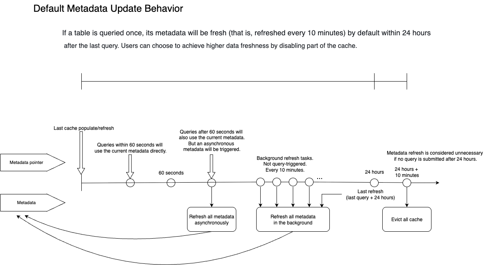

# 機能サポート: データレイク分析

v2.3以降、StarRocksは外部カタログを介して外部データソースの管理とデータレイク内のデータ分析をサポートしています。

このドキュメントでは、外部カタログの機能サポートと関連する機能のサポートバージョンについて説明します。

## 共通機能

このセクションでは、External Catalog 機能の共通機能をリストアップしています。これには、ストレージシステム、ファイルリーダー、認証情報、権限、および Data Cache が含まれます。

### 外部ストレージシステム

| ストレージシステム          | サポートバージョン |
| :---------------------- | :---------------- |
| HDFS                    | v2.3+             |
| AWS S3                  | v2.3+             |
| Microsoft Azure Storage | v3.0+             |
| Google GCS              | v3.0+             |
| Alibaba Cloud OSS       | v3.1+             |
| Huawei Cloud OBS        | v3.1+             |
| Tencent Cloud COS       | v3.1+             |
| Volcengine TOS          | v3.1+             |
| Kingsoft Cloud KS3      | v3.1+             |
| MinIO                   | v3.1+             |
| Ceph S3                 | v3.1+             |

上記のストレージシステムに対するネイティブサポートに加えて、StarRocksは以下のタイプのオブジェクトストレージサービスもサポートしています:

- **COS Cloud HDFS、OSS-HDFS、OBS PFSなどのHDFS互換オブジェクトストレージサービス**
  - **説明**: BEの設定項目 `fallback_to_hadoop_fs_list` にオブジェクトストレージのURIプレフィックスを指定し、クラウドベンダーが提供する.jarパッケージをディレクトリ **/lib/hadoop/hdfs/** にアップロードする必要があります。`fallback_to_hadoop_fs_list` に指定したプレフィックスを使用して外部カタログを作成する必要があります。
  - **サポートバージョン**: v3.1.9+, v3.2.4+
- **上記にリストされていないS3互換オブジェクトストレージサービス**
  - **説明**: BEの設定項目 `s3_compatible_fs_list` にオブジェクトストレージのURIプレフィックスを指定する必要があります。`s3_compatible_fs_list` に指定したプレフィックスを使用して外部カタログを作成する必要があります。
  - **サポートバージョン**: v3.1.9+, v3.2.4+

### 圧縮フォーマット

このセクションでは、各ファイルフォーマットがサポートする圧縮フォーマットのみをリストしています。各外部カタログがサポートするファイルフォーマットについては、対応する外部カタログのセクションを参照してください。

| ファイルフォーマット  | 圧縮フォーマット                                          |
| :----------- | :----------------------------------------------------------- |
| Parquet      | NO_COMPRESSION, SNAPPY, LZ4, ZSTD, GZIP, LZO (v3.1.5+)       |
| ORC          | NO_COMPRESSION, ZLIB, SNAPPY, LZO, LZ4, ZSTD                 |
| Text         | NO_COMPRESSION, LZO (v3.1.5+)                                |
| Avro         | NO_COMPRESSION (v3.2.1+), DEFLATE (v3.2.1+), SNAPPY (v3.2.1+), BZIP2 (v3.2.1+) |
| RCFile       | NO_COMPRESSION (v3.2.1+), DEFLATE (v3.2.1+), SNAPPY (v3.2.1+), GZIP (v3.2.1+) |
| SequenceFile | NO_COMPRESSION (v3.2.1+), DEFLATE (v3.2.1+), SNAPPY (v3.2.1+), BZIP2 (v3.2.1+), GZIP (v3.2.1+) |

:::note

Avro、RCFile、および SequenceFile のファイルフォーマットは、StarRocks 内のネイティブリーダーではなく、Java Native Interface (JNI) によって読み取られます。そのため、これらのファイルフォーマットの読み取りパフォーマンスは、Parquet および ORC よりも劣る可能性があります。

:::

### 管理、認証情報、およびアクセス制御

| 機能                                  | 説明                                                  | サポートバージョン |
| :--------------------------------------- | :----------------------------------------------------------- | :------------------- |
| Information Schema                       | 外部カタログのための Information Schema をサポートします。           | v3.2+                |
| データレイクアクセス制御                 | 外部カタログのために StarRocks のネイティブ RBAC モデルをサポートします。外部カタログ内のデータベース、テーブル、およびビュー（現在、Hive ビューと Iceberge ビューのみ）の権限を、StarRocks のデフォルトカタログ内のものと同様に管理できます。 | v3.0+                |
| Apache Ranger 上の外部サービスの再利用 | アクセス制御のために Apache Ranger 上の外部サービス（Hive Service など）の再利用をサポートします。 | v3.1.9+              |
| Kerberos 認証                  | HDFS または Hive Metastore のための Kerberos 認証をサポートします。 | v2.3+                |

### Data Cache

| 機能                                      | 説明                                                  | サポートバージョン |
| :------------------------------------------- | :----------------------------------------------------------- | :------------------- |
| Data Cache (Block Cache)                     | v2.5以降、StarRocks は CacheLib を使用して実装された Data Cache 機能（当時は Block Cache と呼ばれていました）をサポートし、その拡張性のための最適化の可能性が限られていました。v3.0以降、StarRocks はキャッシュ実装をリファクタリングし、Data Cache に新機能を追加し、各バージョンでより良いパフォーマンスを実現しました。 | v2.5+                |
| ローカルディスク間のデータ再バランス           | データの偏りが10％未満に制御されるようにするためのデータ再バランス戦略をサポートします。 | v3.2+                |
| Block Cache を Data Cache に置き換え          | **パラメータの変更** BE 設定:<ul><li>`block_cache_enable` を `datacache_enable` に置き換えます。</li><li>`block_cache_mem_size` を `datacache_mem_size` に置き換えます。</li><li>`block_cache_disk_size` を `datacache_disk_size` に置き換えます。</li><li>`block_cache_disk_path` を `datacache_disk_path` に置き換えます。</li><li>`block_cache_meta_path` を `datacache_meta_path` に置き換えます。</li><li>`block_cache_block_size` を `datacache_block_size` に置き換えます。</li></ul>セッション変数:<ul><li>`enable_scan_block_cache` を `enable_scan_datacache` に置き換えます。</li><li>`enable_populate_block_cache` を `enable_populate_datacache` に置き換えます。</li></ul>Data Cache が利用可能なバージョンにクラスターがアップグレードされた後、Block Cache パラメータは引き続き有効です。Data Cache が有効になると、新しいパラメータが古いものを上書きします。両方のパラメータグループの混在使用は許可されていません。そうしないと、一部のパラメータが効果を発揮しません。 | v3.2+                |
| Data Cache を監視する API の新しいメトリクス | Data Cache を監視する個別の API をサポートし、キャッシュ容量とヒットを含みます。Data Cache メトリクスは、インターフェース `http://${BE_HOST}:${BE_HTTP_PORT}/api/datacache/stat` を介して表示できます。 | v3.2.3+              |
| Data Cache のためのメモリトラッカー                | Data Cache のためのメモリトラッカーをサポートします。メモリ関連のメトリクスは、インターフェース `http://${BE_HOST}:${BE_HTTP_PORT}/mem_tracker` を介して表示できます。 | v3.1.8+              |
| Data Cache ウォームアップ                            | CACHE SELECT を実行することで、リモートストレージから必要なデータを事前にキャッシュに積極的に取り込み、最初のクエリがデータを取得するのに時間がかかりすぎないようにすることができます。CACHE SELECT はデータを表示したり計算を行ったりしません。データを取得するだけです。 | v3.3+                |

## Hive Catalog

### メタデータ

Hive カタログを通じて Hive データに対してクエリを実行する際、StarRocks はテーブルメタデータをキャッシュし、リモートストレージへの頻繁なアクセスによるコストを削減します。このメカニズムは、非同期リフレッシュと有効期限ポリシーを通じてデータの新鮮さを維持しながら、クエリパフォーマンスを保証します。

### キャッシュされたメタデータ

StarRocks はクエリ中に以下のメタデータをキャッシュします:

- **テーブルまたはパーティションレベルのメタデータ**
  - 内容: 
    - テーブル情報: データベース、テーブルスキーマ、列名、パーティションキー 
    - パーティション情報: パーティションリスト、パーティションの場所
  - 影響: テーブルの存在を検出する（テーブルが削除または再作成されたかどうか）
  - カタログプロパティ: 
    - `enable_metastore_cache`: メタストアキャッシュを有効にするかどうかを制御します。デフォルト値: `true`。
    - `metastore_cache_refresh_interval_sec`: キャッシュされたメタデータが新鮮と見なされる時間間隔を制御します。デフォルト値: `60`。単位: 秒。
  - 場所: Metastore (HMS または Glue)

- **パーティション名リスト**
  - 内容: パーティションを見つけて剪定するために使用されるパーティション名のリスト。パーティション名リストは上記のセクションでパーティション情報として収集されていますが、特定の状況下でこの機能を有効または無効にするための別の設定があります。
  - 影響: パーティションの存在を検出する（新しいパーティションがあるか、パーティションが削除または再作成されたかどうか）
  - カタログプロパティ: 
    - `enable_cache_list_names`: パーティション名リストキャッシュを有効にするかどうかを制御します。デフォルト値: `true`。
    - `metastore_cache_refresh_interval_sec`: キャッシュされたメタデータが新鮮と見なされる時間間隔を制御します。デフォルト値: `60`。単位: 秒。
  - 場所: Metastore (HMS または Glue)

- **ファイルレベルのメタデータ**
  - 内容: パーティションフォルダー内のファイルへのパス。
  - 影響: 既存のパーティションにデータをロードする。
  - カタログプロパティ: 
    - `enable_remote_file_cache`: リモートストレージ内のファイルのメタデータキャッシュを有効にするかどうかを制御します。デフォルト値: `true`。
    - `remote_file_cache_refresh_interval_sec`: ファイルメタデータが新鮮と見なされる時間間隔を制御します。デフォルト値: `60`。単位: 秒。
    - `remote_file_cache_memory_ratio`: ファイルメタデータキャッシュに使用できるメモリの割合を制御します。デフォルト値: `0.1` (10%)。
  - 場所: リモートストレージ (HDFS または S3)

### 非同期更新ポリシー

以下の FE 構成項目は、非同期メタデータ更新ポリシーを制御します:

| 構成項目                                           | デフォルト                              | 説明                          |
| ------------------------------------------------------------ | ------------------------------------ | ------------------------------------ |
| enable_background_refresh_connector_metadata                 | `true` in v3.0 `false` in v2.5  | 定期的なメタデータキャッシュのリフレッシュを有効にするかどうか。これが有効になると、StarRocks はメタストアをポーリングし、頻繁にアクセスされる外部カタログのキャッシュされたメタデータをリフレッシュしてデータの変更を認識します。`true` は Hive メタデータキャッシュのリフレッシュを有効にし、`false` はそれを無効にします。この項目は [FE 動的パラメータ](../administration/management/FE_configuration.md#configure-fe-dynamic-parameters) です。[ADMIN SET FRONTEND CONFIG](../sql-reference/sql-statements/cluster-management/config_vars/ADMIN_SET_CONFIG.md) コマンドを使用して変更できます。 |
| background_refresh_metadata_interval_millis                  | `600000` (10 分)                | 2回の連続したメタデータキャッシュリフレッシュの間隔。単位: ミリ秒。この項目は [FE 動的パラメータ](../administration/management/FE_configuration.md#configure-fe-dynamic-parameters) です。[ADMIN SET FRONTEND CONFIG](../sql-reference/sql-statements/cluster-management/config_vars/ADMIN_SET_CONFIG.md) コマンドを使用して変更できます。 |
| background_refresh_metadata_time_secs_since_last_access_secs | `86400` (24 時間)                   | メタデータキャッシュリフレッシュタスクの有効期限。アクセスされた外部カタログについて、指定された時間以上アクセスされていない場合、StarRocks はそのキャッシュされたメタデータのリフレッシュを停止します。アクセスされていない外部カタログについては、StarRocks はそのキャッシュされたメタデータをリフレッシュしません。単位: 秒。この項目は [FE 動的パラメータ](../administration/management/FE_configuration.md#configure-fe-dynamic-parameters) です。[ADMIN SET FRONTEND CONFIG](../sql-reference/sql-statements/cluster-management/config_vars/ADMIN_SET_CONFIG.md) コマンドを使用して変更できます。 |

### メタデータキャッシュの動作

このセクションでは、メタデータの更新とクエリ中のメタデータの動作をデフォルトの動作を使用して説明します。

デフォルトでは、テーブルがクエリされると、StarRocks はテーブル、パーティション、およびファイルのメタデータをキャッシュし、次の24時間アクティブに保ちます。この24時間の間に、システムは少なくとも10分ごとにキャッシュがリフレッシュされることを保証します（10分はメタデータリフレッシュラウンドの推定時間です。保留中のメタデータリフレッシュが多すぎる場合、全体のメタデータリフレッシュ間隔は10分以上になる可能性があります）。テーブルが24時間以上アクセスされていない場合、StarRocks は関連するメタデータを破棄します。言い換えれば、24時間以内に行われたクエリは、最悪の場合、10分前のメタデータを使用します。

詳細:

1. 最初のクエリがテーブル `A` のパーティション `P1` を含むと仮定します。StarRocks はテーブルレベルのメタデータ、パーティション名リスト、および `P1` の下のファイルパス情報をキャッシュします。キャッシュはクエリが実行される間に同期的に生成されます。
2. キャッシュが生成されてから60秒以内に2番目のクエリが提出され、テーブル `A` のパーティション `P1` にヒットした場合、StarRocks はメタデータキャッシュを直接使用し、この時点で StarRocks はすべてのキャッシュされたメタデータを新鮮と見なします（`metastore_cache_refresh_interval_sec` および `remote_file_cache_refresh_interval_sec` は StarRocks がメタデータを新鮮と見なす時間枠を制御します）。
3. 90秒後に3番目のクエリが提出され、テーブル `A` のパーティション `P1` にヒットした場合、StarRocks は依然としてメタデータキャッシュを直接使用してクエリを完了します。しかし、最後のメタデータリフレッシュから60秒以上経過しているため、StarRocks はメタデータを期限切れと見なします。したがって、StarRocks は期限切れのメタデータの非同期リフレッシュを開始します。非同期リフレッシュは現在のクエリの結果には影響しません。クエリは依然として古いメタデータを使用します。
4. テーブル `A` のパーティション `P1` がクエリされたため、次の24時間（`background_refresh_metadata_time_secs_since_last_access_secs` によって制御されます）、メタデータは10分ごと（`background_refresh_metadata_interval_millis` によって制御されます）にリフレッシュされると推定されます。メタデータリフレッシュのラウンド間の実際の間隔は、システム内の全体の保留中のリフレッシュタスクにも依存します。
5. テーブル `A` が24時間以内にクエリに関与していない場合、StarRocks は24時間後にそのメタデータキャッシュを削除します。

### ベストプラクティス

Hive Catalog の Hive Metastore (HMS) と AWS Glue のサポートはほぼ重なりますが、HMS の自動インクリメンタル更新機能は推奨されません。ほとんどの場合、デフォルトの設定が推奨されます。

メタデータ取得のパフォーマンスは、主にユーザーの HMS または HDFS NameNode のパフォーマンスに依存します。すべての要因を考慮し、テスト結果に基づいて判断してください。

- **[デフォルトと推奨] 分単位のデータ不整合を許容する最良のパフォーマンス**
  - **設定**: デフォルト設定を使用できます。データは10分以内（デフォルト）に更新されません。この期間内にクエリに対して古いデータが返されます。
  - **利点**: 最良のクエリパフォーマンス。
  - **欠点**: レイテンシーによるデータ不整合。
  - **サポートバージョン**: v2.5.5+ (v2.5ではデフォルトで無効、v3.0+ではデフォルトで有効)
- **手動リフレッシュなしで新しくロードされたデータ（ファイル）の即時可視性**
  - **設定**: 基礎データファイルのメタデータキャッシュを無効にするには、カタログプロパティ `enable_remote_file_cache` を `false` に設定します。
  - **利点**: ファイル変更の遅延なしの可視性。
  - **欠点**: ファイルメタデータキャッシュが無効な場合のパフォーマンス低下。各クエリはファイルリストにアクセスする必要があります。
  - **サポートバージョン**: v2.5.5+
- **手動リフレッシュなしでパーティション変更の即時可視性**
  - **設定**: Hive パーティション名のキャッシュを無効にするには、カタログプロパティ `enable_cache_list_names` を `false` に設定します。
  - **利点**: パーティション変更の遅延なしの可視性。
  - **欠点**: パーティション名キャッシュが無効な場合のパフォーマンス低下。各クエリはパーティションリストにアクセスする必要があります。
  - **サポートバージョン**: v2.5.5+

:::tip

データ変更のリアルタイム更新が必要で、HMS のパフォーマンスが最適化されていない場合は、キャッシュを有効にし、自動インクリメンタル更新を無効にし、上流でデータ変更があるたびにスケジューリングシステムを使用してメタデータを手動でリフレッシュ（REFRESH EXTERNAL TABLE を使用）することができます。

:::

### ストレージシステム

| 機能                         | 説明                                                  | サポートバージョン  |
| :------------------------------ | :----------------------------------------------------------- | :-------------------- |
| 再帰的サブディレクトリリスト | カタログプロパティ `enable_recursive_listing` を `true` に設定することで、再帰的サブディレクトリリストを有効にします。再帰的リストが有効になると、StarRocks はテーブルとそのパーティション、およびテーブルとそのパーティションの物理的な場所内のサブディレクトリからデータを読み取ります。この機能は、複数層のネストされたディレクトリの問題に対処するために設計されています。 | v2.5.9+ v3.0.4+ (v2.5およびv3.0ではデフォルトで無効、v3.1+ではデフォルトで有効) |

### ファイルフォーマットとデータ型

#### ファイルフォーマット

| 機能 | サポートされるファイルフォーマット                         |
| :------ | :--------------------------------------------- |
| 読み取り    | Parquet, ORC, TEXT, Avro, RCFile, SequenceFile |
| シンク    | Parquet (v3.2+), ORC (v3.3+), TEXT (v3.3+)     |

#### データ型

INTERVAL、BINARY、および UNION 型はサポートされていません。

TEXT 形式の Hive テーブルは、MAP および STRUCT 型をサポートしていません。

#### テーブルタイプ 

Hive のトランザクションテーブルの読み取りには対応していません。

### Hive ビュー

StarRocks は v3.1.0 以降、Hive ビューのクエリをサポートしています。

:::note

StarRocks が Hive ビューに対してクエリを実行する際、StarRocks および Trino の構文を使用してビューの定義を解析しようとします。StarRocks がビューの定義を解析できない場合、エラーが返されます。StarRocks が Hive または Spark に特有の関数で作成された Hive ビューの解析に失敗する可能性があります。

:::

### クエリ統計インターフェース

| 機能                                                       | サポートバージョン |
| :------------------------------------------------------------ | :------------------- |
| SHOW CREATE TABLE をサポートして Hive テーブルスキーマを表示          | v3.0+                |
| ANALYZE をサポートして統計を収集                        | v3.2+                |
| ヒストグラムおよび STRUCT サブフィールド統計の収集をサポート | v3.3+                |

### データシンキング

| 機能                | サポートバージョン | 注                                                         |
| :--------------------- | :------------------- | :----------------------------------------------------------- |
| CREATE DATABASE        | v3.2+                | Hive に作成されたデータベースの場所を指定するかどうかを選択できます。データベースの場所を指定しない場合、データベースの下に作成されたテーブルの場所を指定する必要があります。そうしないと、エラーが返されます。データベースの場所を指定した場合、場所が指定されていないテーブルはデータベースの場所を継承します。また、データベースとテーブルの両方に場所を指定した場合、最終的にテーブルの場所が有効になります。 |
| CREATE TABLE           | v3.2+                | パーティションテーブルと非パーティションテーブルの両方に対応。             |
| CREATE TABLE AS SELECT | v3.2+                |                                                              |
| INSERT INTO/OVERWRITE  | v3.2+                | パーティションテーブルと非パーティションテーブルの両方に対応。             |
| CREATE TABLE LIKE      | v3.2.4+              |                                                              |
| シンクファイルサイズ         | v3.3+                | セッション変数 `connector_sink_target_max_file_size` を使用して、シンクされる各データファイルの最大サイズを定義できます。 |

## Iceberg Catalog

### メタデータ

Iceberg カタログを通じて Iceberg データに対してクエリを実行する際、StarRocks はテーブルメタデータをキャッシュし、リモートストレージへの頻繁なアクセスによるコストを削減します。このメカニズムは、非同期リフレッシュと有効期限ポリシーを通じてデータの新鮮さを維持しながら、クエリパフォーマンスを保証します。

### キャッシュされたメタデータ

StarRocks はクエリ中に以下のメタデータをキャッシュします:

- **メタデータポインタキャッシュ**
  - 内容: メタデータポインタの JSON ファイル
    - スナップショット ID
    - マニフェストリストの場所
  - 影響: データ変更の検出（データ変更が発生すると、スナップショット ID が変わります。）
  - カタログプロパティ: 
    - `enable_iceberg_metadata_cache`: Iceberg メタデータキャッシュを有効にするかどうかを制御します。デフォルト値: `true`。
    - `iceberg_table_cache_refresh_interval_sec`: キャッシュされたメタデータが新鮮と見なされる時間間隔を制御します。デフォルト値: `60`。単位: 秒。

- **メタデータキャッシュ**
  - 内容:
    - データファイルパスのマニフェスト
    - 削除ファイルパスのマニフェスト
    - データベース
    - パーティション（マテリアライズドビューの書き換え用）
  - 影響: 
    - データまたは削除ファイルのマニフェストは変更できないため、クエリのデータの新鮮さには影響しません。
    - マテリアライズドビューの書き換えに影響を与える可能性があり、クエリがマテリアライズドビューを見逃す可能性があります。スナップショット ID がリフレッシュされると、パーティションメタデータは削除されます。したがって、新しいスナップショット ID にはパーティションメタデータが欠けており、マテリアライズドビューの書き換えが見逃される可能性があります。
  - カタログプロパティ: 
    - `enable_cache_list_names`: パーティション名リストキャッシュを有効にするかどうかを制御します。デフォルト値: `true`。
    - `metastore_cache_refresh_interval_sec`: キャッシュされたメタデータが新鮮と見なされる時間間隔を制御します。デフォルト値: `60`。単位: 秒。
    - `iceberg_data_file_cache_memory_usage_ratio`: データファイルメタデータキャッシュに使用できるメモリの割合を制御します。デフォルト値: `0.1` (10%)。
    - `iceberg_delete_file_cache_memory_usage_ratio`: 削除ファイルメタデータキャッシュに使用できるメモリの割合を制御します。デフォルト値: `0.1` (10%)。

### 非同期更新ポリシー

以下の FE 構成項目は、非同期メタデータ更新ポリシーを制御します:

| 構成項目                                           | デフォルト                              | 説明                          |
| ------------------------------------------------------------ | ------------------------------------ | ------------------------------------ |
| enable_background_refresh_connector_metadata                 | `true` in v3.0 `false` in v2.5  | 定期的なメタデータキャッシュのリフレッシュを有効にするかどうか。これが有効になると、StarRocks はメタストアをポーリングし、頻繁にアクセスされる外部カタログのキャッシュされたメタデータをリフレッシュしてデータの変更を認識します。`true` は Hive メタデータキャッシュのリフレッシュを有効にし、`false` はそれを無効にします。この項目は [FE 動的パラメータ](../administration/management/FE_configuration.md#configure-fe-dynamic-parameters) です。[ADMIN SET FRONTEND CONFIG](../sql-reference/sql-statements/cluster-management/config_vars/ADMIN_SET_CONFIG.md) コマンドを使用して変更できます。 |
| background_refresh_metadata_interval_millis                  | `600000` (10 分)                | 2回の連続したメタデータキャッシュリフレッシュの間隔。単位: ミリ秒。この項目は [FE 動的パラメータ](../administration/management/FE_configuration.md#configure-fe-dynamic-parameters) です。[ADMIN SET FRONTEND CONFIG](../sql-reference/sql-statements/cluster-management/config_vars/ADMIN_SET_CONFIG.md) コマンドを使用して変更できます。 |
| background_refresh_metadata_time_secs_since_last_access_secs | `86400` (24 時間)                   | メタデータキャッシュリフレッシュタスクの有効期限。アクセスされた外部カタログについて、指定された時間以上アクセスされていない場合、StarRocks はそのキャッシュされたメタデータのリフレッシュを停止します。アクセスされていない外部カタログについては、StarRocks はそのキャッシュされたメタデータをリフレッシュしません。単位: 秒。この項目は [FE 動的パラメータ](../administration/management/FE_configuration.md#configure-fe-dynamic-parameters) です。[ADMIN SET FRONTEND CONFIG](../sql-reference/sql-statements/cluster-management/config_vars/ADMIN_SET_CONFIG.md) コマンドを使用して変更できます。 |

### メタデータキャッシュの動作

このセクションでは、メタデータの更新とクエリ中のメタデータの動作をデフォルトの動作を使用して説明します。

デフォルトでは、テーブルがクエリされると、StarRocks はテーブルのメタデータをキャッシュし、次の24時間アクティブに保ちます。この24時間の間に、システムは少なくとも10分ごとにキャッシュがリフレッシュされることを保証します（10分はメタデータリフレッシュラウンドの推定時間です。保留中のメタデータリフレッシュが多すぎる場合、全体のメタデータリフレッシュ間隔は10分以上になる可能性があります）。テーブルが24時間以上アクセスされていない場合、StarRocks は関連するメタデータを破棄します。言い換えれば、24時間以内に行われたクエリは、最悪の場合、10分前のメタデータを使用します。

詳細:

1. 最初のクエリがテーブル `A` を含むと仮定します。StarRocks はその最新のスナップショットとメタデータをキャッシュします。キャッシュはクエリが実行される間に同期的に生成されます。
2. キャッシュが生成されてから60秒以内に2番目のクエリが提出され、テーブル `A` にヒットした場合、StarRocks はメタデータキャッシュを直接使用し、この時点で StarRocks はすべてのキャッシュされたメタデータを新鮮と見なします（`iceberg_table_cache_refresh_interval_sec` は StarRocks がメタデータを新鮮と見なす時間枠を制御します）。
3. 90秒後に3番目のクエリが提出され、テーブル `A` にヒットした場合、StarRocks は依然としてメタデータキャッシュを直接使用してクエリを完了します。しかし、最後のメタデータリフレッシュから60秒以上経過しているため、StarRocks はメタデータを期限切れと見なします。したがって、StarRocks は期限切れのメタデータの非同期リフレッシュを開始します。非同期リフレッシュは現在のクエリの結果には影響しません。クエリは依然として古いメタデータを使用します。
4. テーブル `A` がクエリされたため、次の24時間（`background_refresh_metadata_time_secs_since_last_access_secs` によって制御されます）、メタデータは10分ごと（`background_refresh_metadata_interval_millis` によって制御されます）にリフレッシュされると推定されます。メタデータリフレッシュのラウンド間の実際の間隔は、システム内の全体の保留中のリフレッシュタスクにも依存します。
5. テーブル `A` が24時間以内にクエリに関与していない場合、StarRocks は24時間後にそのメタデータキャッシュを削除します。

### ベストプラクティス

Iceberg Catalog は、HMS、Glue、および Tabular をメタストアとしてサポートします。ほとんどの場合、デフォルトの設定が推奨されます。

セッション変数 `enable_iceberg_metadata_cache` のデフォルト値は、異なるシナリオに対応するために変更されました:

- v3.2.1 から v3.2.3 までは、このパラメータは使用されるメタストアサービスに関係なくデフォルトで `true` に設定されています。
- v3.2.4 以降、Iceberg クラスターが AWS Glue をメタストアとして使用している場合、このパラメータはデフォルトで `true` に設定されています。しかし、Iceberg クラスターが他のメタストアサービス（Hive メタストアなど）を使用している場合、このパラメータはデフォルトで `false` に設定されています。
- v3.3.0 以降、このパラメータのデフォルト値は再び `true` に設定されています。これは、StarRocks が新しい Iceberg メタデータフレームワークをサポートしているためです。Iceberg Catalog と Hive Catalog は、同じメタデータポーリングメカニズムと FE 設定項目 `background_refresh_metadata_interval_millis` を使用します。

| 機能                                                      | サポートバージョン |
| :----------------------------------------------------------- | :------------------- |
| 分散メタデータプラン (大量のメタデータを扱うシナリオに推奨) | v3.3+                |
| マニフェストキャッシュ (少量のメタデータでレイテンシーに高い要求があるシナリオに推奨) | v3.3+                |

v3.3.0以降、StarRocksは上記のメタデータ読み取りおよびキャッシュ ポリシーをサポートしています。ポリシーの選択は、クラスタ内のマシンに応じてシステムが自動的に調整します。通常は変更する必要はありません。メタデータのキャッシュが有効になっているため、パフォーマンスを考慮するとメタデータの鮮度が損なわれる可能性があります。したがって、特定のクエリ要件に応じて調整することができます：

- **[デフォルトおよび推奨] 分レベルのデータ不整合を許容する最適なパフォーマンス**
  - **設定**： 追加の設定は必要ありません。デフォルトでは、10 分以内に更新されたデータは表示されません。この間、クエリーは古いデータを返します。
  - **メリット**： 最高のクエリパフォーマンス。
  - **デメリット**：遅延によるデータの不整合。
- インポートやパーティションの追加削除によって生成された新しいデータファイルはすぐに表示され、手動での更新は必要ありません。
  - **設定**： Catalog プロパティ `iceberg_table_cache_ttl_sec` を `0` に設定すると、StarRocks はクエリごとに新しいスナップショットをフェッチします。
  - **メリット**： ファイルやパーティションの変更が遅延なく表示される。
  - **デメリット**：クエリごとにスナップショットをフェッチする動作のため、パフォーマンスが低下します。

### ファイルフォーマット

| 機能 | サポートされるファイルフォーマット |
| :------ | :--------------------- |
| 読み取り    | Parquet, ORC           |
| シンク    | Parquet                |

- Parquet 形式および ORC 形式の Iceberg V1 テーブルは、位置削除と等価削除をサポートしています。
- ORC 形式の Iceberg V2 テーブルは v3.0.0 から位置削除をサポートし、Parquet 形式のものは v3.1.0 から位置削除をサポートしています。
- ORC 形式の Iceberg V2 テーブルは v3.1.8 および v3.2.3 から等価削除をサポートし、Parquet 形式のものは v3.2.5 から等価削除をサポートしています。

### Iceberg ビュー

StarRocks は、v3.3.2 以降、Iceberg ビューのクエリにサポートし、v3.5 以降、Iceberg ビューの作成にサポートしています。

現在、StarRocks を通じて作成された Iceberg ビューのみがサポートされています。v3.5 から、既存の Iceberg ビューに StarRocks の構文スタイル定義を追加できるようになりました。

### クエリ統計インターフェース

| 機能                                                       | サポートバージョン |
| :------------------------------------------------------------ | :------------------- |
| SHOW CREATE TABLE をサポートして Iceberg テーブルスキーマを表示       | v3.0+                |
| ANALYZE をサポートして統計を収集                        | v3.2+                |
| ヒストグラムおよび STRUCT サブフィールド統計の収集をサポート | v3.3+                |

### データシンキング

| 機能                | サポートバージョン | 注                                                         |
| :--------------------- | :------------------- | :----------------------------------------------------------- |
| CREATE DATABASE        | v3.1+                | Iceberg に作成されたデータベースの場所を指定するかどうかを選択できます。データベースの場所を指定しない場合、データベースの下に作成されたテーブルの場所を指定する必要があります。そうしないと、エラーが返されます。データベースの場所を指定した場合、場所が指定されていないテーブルはデータベースの場所を継承します。また、データベースとテーブルの両方に場所を指定した場合、最終的にテーブルの場所が有効になります。 |
| CREATE TABLE           | v3.1+                | パーティション付きテーブルと非パーティション付きテーブルをサポート。v4.0 からは隠しパーティション (Hidden Partition) を持つテーブルの作成をサポート。 |
| CREATE TABLE AS SELECT | v3.1+                |                                                              |
| INSERT INTO/OVERWRITE  | v3.1+                | パーティションテーブルと非パーティションテーブルの両方に対応。             |

### その他のサポート

| 機能                                                      | サポートバージョン |
| :----------------------------------------------------------- | :------------------- |
| TIMESTAMP 型のパーティションフォーマット `yyyy-MM-ddTHH:mm` および `yyyy-MM-dd HH:mm` の読み取りをサポートします。 | v2.5.19+ v3.1.9+ v3.2.3+ |
| アイスバーグのメタデータテーブルをサポートします。                   | v3.4.1+              |
| アイスバーグタイムトラベルをサポートします。                        | v3.4.0+              |

## Hudi Catalog

- StarRocks は、Hudi の Parquet 形式のデータのクエリをサポートし、Parquet ファイルのために SNAPPY、LZ4、ZSTD、GZIP、および NO_COMPRESSION 圧縮フォーマットをサポートします。
- StarRocks は、Hudi の Copy On Write (COW) テーブルと Merge On Read (MOR) テーブルを完全にサポートします。
- StarRocks は v3.0.0 以降、SHOW CREATE TABLE をサポートして Hudi テーブルスキーマを表示します。
- StarRocks v3.5.0 は Hudi 0.15.0 をサポートしています。

## Delta Lake Catalog

- StarRocks は、Delta Lake の Parquet 形式のデータのクエリをサポートし、Parquet ファイルのために SNAPPY、LZ4、ZSTD、GZIP、および NO_COMPRESSION 圧縮フォーマットをサポートします。
- StarRocks は、Delta Lake の MAP 型および STRUCT 型データのクエリをサポートしていません。
- StarRocks は v3.0.0 以降、SHOW CREATE TABLE をサポートして Delta Lake テーブルスキーマを表示します。
- 現在、Delta Lake Catalog は次のテーブル機能をサポートしています:
  - V2 Checkpoint (v3.3.0 以降)
  - タイムゾーンなしのタイムスタンプ (v3.3.1 以降)
  - カラムマッピング (v3.3.6 以降)
  - Deletion Vector (v3.4.1 以降)

## JDBC Catalog

| カタログタイプ | サポートバージョン |
| :----------- | :------------------- |
| MySQL        | v3.0+                |
| PostgreSQL   | v3.0+                |
| ClickHouse   | v3.3+                |
| Oracle       | v3.2.9+              |
| SQL Server   | v3.2.9+              |

### MySQL

| 機能        | サポートバージョン |
| :------------- | :------------------- |
| メタデータキャッシュ | v3.3+                |

#### データ型の対応

| MySQL             | StarRocks           | サポートバージョン |
| :---------------- | :------------------ | :------------------- |
| BOOLEAN           | BOOLEAN             | v2.3+                |
| BIT               | BOOLEAN             | v2.3+                |
| SIGNED TINYINT    | TINYINT             | v2.3+                |
| UNSIGNED TINYINT  | SMALLINT            | v3.0.6+ v3.1.2+ |
| SIGNED SMALLINT   | SMALLINT            | v2.3+                |
| UNSIGNED SMALLINT | INT                 | v3.0.6+ v3.1.2+ |
| SIGNED INTEGER    | INT                 | v2.3+                |
| UNSIGNED INTEGER  | BIGINT              | v3.0.6+ v3.1.2+ |
| SIGNED BIGINT     | BIGINT              | v2.3+                |
| UNSIGNED BIGINT   | LARGEINT            | v3.0.6+ v3.1.2+ |
| FLOAT             | FLOAT               | v2.3+                |
| REAL              | FLOAT               | v3.0.1+              |
| DOUBLE            | DOUBLE              | v2.3+                |
| DECIMAL           | DECIMAL32           | v2.3+                |
| CHAR              | VARCHAR(columnsize) | v2.3+                |
| VARCHAR           | VARCHAR             | v2.3+                |
| TEXT              | VARCHAR(columnsize) | v3.0.1+              |
| DATE              | DATE                | v2.3+                |
| TIME              | TIME                | v3.1.9+ v3.2.4+ |
| TIMESTAMP         | DATETIME            | v2.3+                |

### PostgreSQL

#### データ型の対応

| PGSQL     | StarRocks           | サポートバージョン |
| :-------- | :------------------ | :------------------- |
| BIT       | BOOLEAN             | v2.3+                |
| SMALLINT  | SMALLINT            | v2.3+                |
| INTEGER   | INT                 | v2.3+                |
| BIGINT    | BIGINT              | v2.3+                |
| REAL      | FLOAT               | v2.3+                |
| DOUBLE    | DOUBLE              | v2.3+                |
| NUMERIC   | DECIMAL32           | v2.3+                |
| CHAR      | VARCHAR(columnsize) | v2.3+                |
| VARCHAR   | VARCHAR             | v2.3+                |
| TEXT      | VARCHAR(columnsize) | v2.3+                |
| DATE      | DATE                | v2.3+                |
| TIMESTAMP | DATETIME            | v2.3+                |
| UUID      | VARBINARY           | v3.5.3+              |

### ClickHouse 

v3.3.0 以降でサポートされています。

### Oracle

v3.2.9 以降でサポートされています。

### SQL Server

v3.2.9 以降でサポートされています。

## Elasticsearch Catalog

Elasticsearch Catalog は v3.1.0 以降でサポートされています。

## Paimon Catalog

Paimon Catalog は v3.1.0 以降でサポートされています。

## MaxCompute Catalog

MaxCompute Catalog は v3.3.0 以降でサポートされています。

## Kudu Catalog

Kudu Catalog は v3.3.0 以降でサポートされています。
