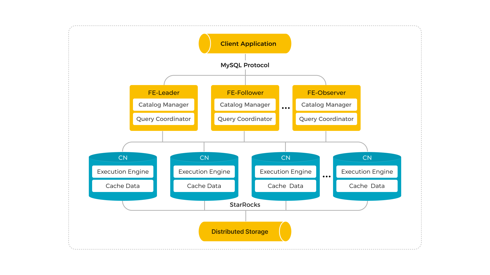

import Tabs from '@theme/Tabs';
import TabItem from '@theme/TabItem';
import ManualPrep from '../_assets/deployment/manual_prep.mdx'

# 共有データ StarRocks を手動でデプロイする

<ManualPrep />

このトピックでは、共有データ StarRocks クラスタ（ストレージとコンピューティングが分離されている）を手動でデプロイする方法について説明します。他のインストールモードについては、[デプロイメント概要](../deployment/deployment_overview.md)を参照してください。

共有なし StarRocks クラスタ（BE がストレージとコンピューティングの両方を担当する）をデプロイするには、[共有なし StarRocks を手動でデプロイする](../deployment/deploy_manually.md)を参照してください。

## 概要

共有データ StarRocks クラスタは、ストレージとコンピュートの分離の前提でクラウド向けに特別に設計されています。データをリモートストレージ（例えば、HDFS、AWS S3、Google GCS、Azure Blob Storage、Azure Data Lake Storage Gen2、MinIO）に保存することができます。これにより、より安価なストレージと優れたリソース分離を実現できるだけでなく、クラスタの弾力的なスケーラビリティも達成できます。共有データ StarRocks クラスタのクエリパフォーマンスは、ローカルディスクキャッシュがヒットした場合、共有なし StarRocks クラスタと一致します。

共有データ StarRocks クラスタは、フロントエンドエンジン（FE）とコンピュートノード（CN）で構成されており、これにより、共有なしクラスタにおける従来のバックエンドエンジン（BE）に取って代わります。

従来の共有なし StarRocks アーキテクチャと比較して、ストレージとコンピュートの分離は幅広い利点を提供します。これらのコンポーネントを分離することにより、StarRocks は以下を提供します：

- 安価でシームレスにスケーラブルなストレージ。
- 弾力的にスケーラブルなコンピュート。データが Compute Nodes (CNs) に保存されないため、ノード間でのデータ移行やシャッフルなしにスケーリングが可能です。
- クエリパフォーマンスを向上させるためのホットデータ用ローカルディスクキャッシュ。
- リモートストレージへの非同期データ取り込みにより、ロードパフォーマンスが大幅に向上します。

共有データクラスタのアーキテクチャは以下の通りです：



## ステップ 1: Leader FE ノードを起動する

次の手順は、FE インスタンスで実行されます。

1. メタデータストレージ用の専用ディレクトリを作成します。メタデータは FE デプロイメントファイルとは別のディレクトリに保存することをお勧めします。このディレクトリが存在し、書き込みアクセス権があることを確認してください。

   ```YAML
   # <meta_dir> を作成したいメタデータディレクトリに置き換えます。
   mkdir -p <meta_dir>
   ```

2. 以前に準備した[StarRocks FE デプロイメントファイル](../deployment/prepare_deployment_files.md)を保存しているディレクトリに移動し、FE 設定ファイル **fe/conf/fe.conf** を修正します。

   a. 共有データの実行モードを設定します。

      ```YAML
      run_mode = shared_data
      ```

   b. 設定項目 `meta_dir` にメタデータディレクトリを指定します。

      ```YAML
      # <meta_dir> を作成したメタデータディレクトリに置き換えます。
      meta_dir = <meta_dir>
      ```

   c. [環境設定チェックリスト](../deployment/environment_configurations.md#fe-ポート)で言及されている FE ポートが占有されている場合は、FE 設定ファイルで有効な代替ポートを割り当てる必要があります。

      ```YAML
      http_port = aaaa               # デフォルト: 8030
      rpc_port = bbbb                # デフォルト: 9020
      query_port = cccc              # デフォルト: 9030
      edit_log_port = dddd           # デフォルト: 9010
      cloud_native_meta_port = eeee  # デフォルト: 6090
      ```

      > **注意**
      >
      > クラスタ内に複数の FE ノードをデプロイする場合は、各 FE ノードに同じ `http_port` を割り当てる必要があります。

   d. クラスタの IP アドレスアクセスを有効にしたい場合は、設定ファイルに `priority_networks` という設定項目を追加し、FE ノードに専用の IP アドレス（CIDR 形式）を割り当てる必要があります。クラスタの[FQDN アクセス](../administration/management/enable_fqdn.md)を有効にしたい場合は、この設定項目を無視できます。

      ```YAML
      priority_networks = x.x.x.x/x
      ```

      > **注意**
      >
      > - インスタンスが所有する IP アドレスを表示するには、ターミナルで `ifconfig` を実行できます。
      > - v3.3.0 以降、StarRocks は IPv6 に基づくデプロイをサポートしています。

   e. インスタンスに複数の JDK がインストールされており、環境変数 `JAVA_HOME` に指定されたものとは異なる特定の JDK を使用したい場合は、設定ファイルに `JAVA_HOME` という設定項目を追加して、選択した JDK がインストールされているパスを指定する必要があります。

      ```YAML
      # <path_to_JDK> を選択した JDK がインストールされているパスに置き換えます。
      JAVA_HOME = <path_to_JDK>
      ```

   高度な設定項目については、[パラメータ設定 - FE 設定項目](../administration/management/FE_configuration.md)を参照してください。

3. FE ノードを起動します。

   - クラスタの IP アドレスアクセスを有効にするには、次のコマンドを実行して FE ノードを起動します。

     ```Bash
     ./fe/bin/start_fe.sh --daemon
     ```

   - クラスタの FQDN アクセスを有効にするには、次のコマンドを実行して FE ノードを起動します。

     ```Bash
     ./fe/bin/start_fe.sh --host_type FQDN --daemon
     ```

     ノードを初めて起動する際には、パラメータ `--host_type` を一度だけ指定する必要があります。

     > **注意**
     >
     > FQDN アクセスを有効にして FE ノードを起動する前に、すべてのインスタンスにホスト名を割り当てたことを確認してください。詳細については、[環境設定チェックリスト - ホスト名](../deployment/environment_configurations.md#ホスト名)を参照してください。

4. FE ログを確認して、FE ノードが正常に起動したかどうかを確認します。

   ```Bash
   cat fe/log/fe.log | grep thrift
   ```

   "2022-08-10 16:12:29,911 INFO (UNKNOWN x.x.x.x_9010_1660119137253(-1)|1) [FeServer.start():52] thrift server started with port 9020." のようなログ記録は、FE ノードが正常に起動したことを示しています。

## ステップ 2: CN サービスを起動する

:::note

BEノードは共有なしクラスタにのみ追加でき、CNノードは共有データクラスタにのみ追加できます。これ以外の構成では、予期しない動作を引き起こす可能性があります。

:::

次の手順は、CN インスタンスで実行されます。BE のデプロイメントファイルを使用して、CNノードをデプロイできます。

1. データキャッシュ用の専用ディレクトリを作成します。データは BE デプロイメントディレクトリとは別のディレクトリに保存することをお勧めします。このディレクトリが存在し、書き込みアクセス権があることを確認してください。

   ```YAML
   # <storage_root_path> を作成したいデータキャッシュディレクトリに置き換えます。
   mkdir -p <storage_root_path>
   ```

2. 以前に準備した[StarRocks BE デプロイメントファイル](../deployment/prepare_deployment_files.md)を保存しているディレクトリに移動し、CN 設定ファイル **be/conf/cn.conf** を修正します。

   a. 設定項目 `storage_root_path` にデータディレクトリを指定します。複数のボリュームはセミコロン (;) で区切ります。例: `/data1;/data2`。

      ```YAML
      # <storage_root_path> を作成したデータキャッシュディレクトリに置き換えます。
      storage_root_path = <storage_root_path>
      ```

      ローカルキャッシュはクエリが頻繁で、クエリされるデータが最近のものである場合に効果的ですが、ローカルキャッシュを完全にオフにしたい場合もあります。

      - Kubernetes 環境で、需要に応じて数が増減する CN ポッドには、ストレージボリュームがアタッチされていない場合があります。
      - クエリされるデータがリモートストレージのデータレイクにあり、そのほとんどがアーカイブ（古い）データである場合。クエリが頻繁でない場合、データキャッシュのヒット率は低く、キャッシュを持つことの利点がないかもしれません。

      データキャッシュをオフにするには、次のように設定します。

      ```YAML
      storage_root_path =
      ```

      > **注意**
      >
      > データはディレクトリ **`<storage_root_path>/starlet_cache`** にキャッシュされます。

   b. [環境設定チェックリスト](../deployment/environment_configurations.md)で言及されている CN ポートが占有されている場合は、CN 設定ファイルで有効な代替ポートを割り当てる必要があります。

      ```YAML
      be_port = vvvv                   # デフォルト: 9060
      be_http_port = xxxx              # デフォルト: 8040
      heartbeat_service_port = yyyy    # デフォルト: 9050
      brpc_port = zzzz                 # デフォルト: 8060
      starlet_port = uuuu              # デフォルト: 9070
      ```

   c. クラスタの IP アドレスアクセスを有効にしたい場合は、設定ファイルに `priority_networks` という設定項目を追加し、CN ノードに専用の IP アドレス（CIDR 形式）を割り当てる必要があります。クラスタの FQDN アクセスを有効にしたい場合は、この設定項目を無視できます。

      ```YAML
      priority_networks = x.x.x.x/x
      ```

      > **注意**
      >
      > - インスタンスが所有する IP アドレスを表示するには、ターミナルで `ifconfig` を実行できます。
      > - v3.3.0 以降、StarRocks は IPv6 に基づくデプロイをサポートしています。

   d.インスタンスに複数の JDK がインストールされており、環境変数 `JAVA_HOME` に指定されたものとは異なる特定の JDK を使用したい場合は、設定ファイルに `JAVA_HOME` という設定項目を追加して、選択した JDK がインストールされているパスを指定する必要があります。

      ```YAML
      # <path_to_JDK> を選択した JDK がインストールされているパスに置き換えます。
      JAVA_HOME = <path_to_JDK>
      ```

   高度な設定項目については、[パラメータ設定 - BE 設定項目](../administration/management/BE_configuration.md)を参照してください。CN のパラメータのほとんどは BE から継承されています。

3. CN ノードを起動します。

   ```Bash
   ./be/bin/start_cn.sh --daemon
   ```

   > **注意**
   >
   > - FQDN アクセスを有効にして CN ノードを起動する前に、すべてのインスタンスにホスト名を割り当てたことを確認してください。詳細については、[環境設定チェックリスト - ホスト名](../deployment/environment_configurations.md#ホスト名)を参照してください。
   > - CN ノードを起動する際にパラメータ `--host_type` を指定する必要はありません。

4. CN ログを確認して、CN ノードが正常に起動したかどうかを確認します。

   ```Bash
   cat be/log/cn.INFO | grep heartbeat
   ```

   "I0313 15:03:45.820030 412450 thrift_server.cpp:375] heartbeat has started listening port on 9050" のようなログ記録は、CN ノードが正常に起動したことを示しています。

5. 他のインスタンスで上記の手順を繰り返すことで、新しい CN ノードを起動できます。

## ステップ 3: クラスタをセットアップする

すべての FE と CN ノードが正常に起動した後、StarRocks クラスタをセットアップできます。

次の手順は、MySQL クライアントで実行されます。MySQL クライアント 5.5.0 以降がインストールされている必要があります。

1. MySQL クライアントを介して StarRocks に接続します。初期アカウント `root` でログインする必要があり、パスワードはデフォルトで空です。

   ```Bash
   # <fe_address> を Leader FE ノードの IP アドレス (priority_networks) または FQDN に置き換え、
   # <query_port> (デフォルト: 9030) を fe.conf で指定した query_port に置き換えます。
   mysql -h <fe_address> -P<query_port> -uroot
   ```

2. 次の SQL を実行して、Leader FE ノードのステータスを確認します。

   ```SQL
   SHOW PROC '/frontends'\G
   ```

   例:

   ```Plain
   MySQL [(none)]> SHOW PROC '/frontends'\G
   *************************** 1. row ***************************
                Name: x.x.x.x_9010_1686810741121
                  IP: x.x.x.x
         EditLogPort: 9010
            HttpPort: 8030
           QueryPort: 9030
             RpcPort: 9020
                Role: LEADER
           ClusterId: 919351034
                Join: true
               Alive: true
   ReplayedJournalId: 1220
       LastHeartbeat: 2023-06-15 15:39:04
            IsHelper: true
              ErrMsg: 
           StartTime: 2023-06-15 14:32:28
             Version: 3.0.0-48f4d81
   1 row in set (0.01 sec)
   ```

   - フィールド `Alive` が `true` の場合、この FE ノードは正常に起動し、クラスタに追加されています。
   - フィールド `Role` が `FOLLOWER` の場合、この FE ノードは Leader FE ノードとして選出される資格があります。
   - フィールド `Role` が `LEADER` の場合、この FE ノードは Leader FE ノードです。

3. BE/CN ノードをクラスタに追加します。

   ```SQL
   -- <cn_address> を CN ノードの IP アドレス (priority_networks) 
   -- または FQDN に置き換え、<heartbeat_service_port> を 
   -- cn.conf で指定した heartbeat_service_port (デフォルト: 9050) に置き換えます。
   ALTER SYSTEM ADD COMPUTE NODE "<cn_address>:<heartbeat_service_port>";
   ```

   > **注意**
   >
   > 1 つの SQL で複数の CN ノードを追加できます。各 `<cn_address>:<heartbeat_service_port>` ペアは 1 つの CN ノードを表します。

4. 次の SQL を実行して、CN ノードのステータスを確認します。

   ```SQL
   SHOW PROC '/compute_nodes'\G
   ```

   例:

   ```Plain
   MySQL [(none)]> SHOW PROC '/compute_nodes'\G
   *************************** 1. row ***************************
           ComputeNodeId: 10003
                      IP: x.x.x.x
           HeartbeatPort: 9050
                  BePort: 9060
                HttpPort: 8040
                BrpcPort: 8060
           LastStartTime: 2023-03-13 15:11:13
           LastHeartbeat: 2023-03-13 15:11:13
                   Alive: true
    SystemDecommissioned: false
   ClusterDecommissioned: false
                  ErrMsg: 
                 Version: 2.5.2-c3772fb
   1 row in set (0.00 sec)
   ```

   フィールド `Alive` が `true` の場合、この CN ノードは正常に起動し、クラスタに追加されています。

## ステップ 4: (オプション) 高可用性 FE クラスタをデプロイする

高可用性 FE クラスタには、StarRocks クラスタに少なくとも 3 つの Follower FE ノードが必要です。Leader FE ノードが正常に起動した後、2 つの新しい FE ノードを起動して高可用性 FE クラスタをデプロイできます。

1. MySQL クライアントを介して StarRocks に接続します。初期アカウント `root` でログインする必要があり、パスワードはデフォルトで空です。

   ```Bash
   # <fe_address> を Leader FE ノードの IP アドレス (priority_networks) または FQDN に置き換え、
   # <query_port> (デフォルト: 9030) を fe.conf で指定した query_port に置き換えます。
   mysql -h <fe_address> -P<query_port> -uroot
   ```

2. 次の SQL を実行して、新しい Follower FE ノードをクラスタに追加します。

   ```SQL
   -- <fe_address> を新しい Follower FE ノードの IP アドレス (priority_networks) 
   -- または FQDN に置き換え、<edit_log_port> を fe.conf で指定した 
   -- edit_log_port (デフォルト: 9010) に置き換えます。
   ALTER SYSTEM ADD FOLLOWER "<fe2_address>:<edit_log_port>";
   ```

   > **注意**
   >
   > - 上記のコマンドを使用して、1 回に 1 つの Follower FE ノードを追加できます。
   > - Observer FE ノードを追加したい場合は、`ALTER SYSTEM ADD OBSERVER "<fe_address>:<edit_log_port>"=` を実行します。詳細な手順については、[ALTER SYSTEM - FE](../sql-reference/sql-statements/cluster-management/nodes_processes/ALTER_SYSTEM.md)を参照してください。

3. 新しい FE インスタンスでターミナルを起動し、メタデータストレージ用の専用ディレクトリを作成し、StarRocks FE デプロイメントファイルを保存しているディレクトリに移動し、FE 設定ファイル **fe/conf/fe.conf** を修正します。詳細な手順については、[ステップ 1: Leader FE ノードを起動する](#ステップ-1-leader-fe-ノードを起動する)を参照してください。基本的には、FE ノードを起動するためのコマンドを除いて、ステップ 1 の手順を繰り返すことができます。

   Follower FE ノードを設定した後、次の SQL を実行して Follower FE ノードにヘルパーノードを割り当て、Follower FE ノードを起動します。

   > **注意**
   >
   > クラスタに新しい Follower FE ノードを追加する際には、Follower FE ノードにメタデータを同期するためのヘルパーノード（基本的には既存の Follower FE ノード）を割り当てる必要があります。

   - IP アドレスアクセスで新しい FE ノードを起動するには、次のコマンドを実行して FE ノードを起動します。

     ```Bash
     # <helper_fe_ip> を Leader FE ノードの IP アドレス (priority_networks) に置き換え、
     # <helper_edit_log_port> (デフォルト: 9010) を Leader FE ノードの edit_log_port に置き換えます。
     ./fe/bin/start_fe.sh --helper <helper_fe_ip>:<helper_edit_log_port> --daemon
     ```

     ノードを初めて起動する際には、パラメータ `--helper` を一度だけ指定する必要があります。

   - FQDN アクセスで新しい FE ノードを起動するには、次のコマンドを実行して FE ノードを起動します。

     ```Bash
     # <helper_fqdn> を Leader FE ノードの FQDN に置き換え、
     # <helper_edit_log_port> (デフォルト: 9010) を Leader FE ノードの edit_log_port に置き換えます。
     ./fe/bin/start_fe.sh --helper <helper_fqdn>:<helper_edit_log_port> \
           --host_type FQDN --daemon
     ```

     ノードを初めて起動する際には、パラメータ `--helper` と `--host_type` を一度だけ指定する必要があります。

4. FE ログを確認して、FE ノードが正常に起動したかどうかを確認します。

   ```Bash
   cat fe/log/fe.log | grep thrift
   ```

   "2022-08-10 16:12:29,911 INFO (UNKNOWN x.x.x.x_9010_1660119137253(-1)|1) [FeServer.start():52] thrift server started with port 9020." のようなログ記録は、FE ノードが正常に起動したことを示しています。

5. 上記の手順 2、3、4 を繰り返して、すべての新しい Follower FE ノードを正常に起動し、次に MySQL クライアントから次の SQL を実行して FE ノードのステータスを確認します。

   ```SQL
   SHOW PROC '/frontends'\G
   ```

   例:

   ```Plain
   MySQL [(none)]> SHOW PROC '/frontends'\G
   *************************** 1. row ***************************
                Name: x.x.x.x_9010_1686810741121
                  IP: x.x.x.x
         EditLogPort: 9010
            HttpPort: 8030
           QueryPort: 9030
             RpcPort: 9020
                Role: LEADER
           ClusterId: 919351034
                Join: true
               Alive: true
   ReplayedJournalId: 1220
       LastHeartbeat: 2023-06-15 15:39:04
            IsHelper: true
              ErrMsg: 
           StartTime: 2023-06-15 14:32:28
             Version: 3.0.0-48f4d81
   *************************** 2. row ***************************
                Name: x.x.x.x_9010_1686814080597
                  IP: x.x.x.x
         EditLogPort: 9010
            HttpPort: 8030
           QueryPort: 9030
             RpcPort: 9020
                Role: FOLLOWER
           ClusterId: 919351034
                Join: true
               Alive: true
   ReplayedJournalId: 1219
       LastHeartbeat: 2023-06-15 15:39:04
            IsHelper: true
              ErrMsg: 
           StartTime: 2023-06-15 15:38:53
             Version: 3.0.0-48f4d81
   *************************** 3. row ***************************
                Name: x.x.x.x_9010_1686814090833
                  IP: x.x.x.x
         EditLogPort: 9010
            HttpPort: 8030
           QueryPort: 9030
             RpcPort: 9020
                Role: FOLLOWER
           ClusterId: 919351034
                Join: true
               Alive: true
   ReplayedJournalId: 1219
       LastHeartbeat: 2023-06-15 15:39:04
            IsHelper: true
              ErrMsg: 
           StartTime: 2023-06-15 15:37:52
             Version: 3.0.0-48f4d81
   3 rows in set (0.02 sec)
   ```

   - フィールド `Alive` が `true` の場合、この FE ノードは正常に起動し、クラスタに追加されています。
   - フィールド `Role` が `FOLLOWER` の場合、この FE ノードは Leader FE ノードとして選出される資格があります。
   - フィールド `Role` が `LEADER` の場合、この FE ノードは Leader FE ノードです。

## ステップ 5: デフォルトのストレージボリュームを作成して設定する

共有データ StarRocks クラスタにリモートストレージにデータを保存する権限を与えるには、データベースやクラウドネイティブテーブルを作成する際にストレージボリュームを参照する必要があります。ストレージボリュームは、リモートデータストレージのプロパティと認証情報で構成されます。新しい共有データ StarRocks クラスタをデプロイした場合は、クラスタ内でデータベースやテーブルを作成する前にデフォルトストレージボリュームを定義する必要があります。

クラウドプロバイダーとサービスを選択し、対応するステートメントを実行して、デフォルトのストレージボリュームを作成および設定してください。

<Tabs groupId="cloud">

<TabItem value="s3" label="AWS S3" default>

次の例では、IAM ユーザーベースの資格情報 (アクセスキーとシークレットキー) を使用して AWS S3 バケット `defaultbucket` のストレージボリューム `def_volume` を作成し、[Partitioned Prefix](../sql-reference/sql-statements/cluster-management/storage_volume/CREATE_STORAGE_VOLUME.md#partitioned-prefix) 機能を有効にし、それをデフォルトのストレージボリュームとして設定します。

```SQL
CREATE STORAGE VOLUME def_volume
TYPE = S3
LOCATIONS = ("s3://defaultbucket")
PROPERTIES
(
    "enabled" = "true",
    "aws.s3.region" = "us-west-2",
    "aws.s3.endpoint" = "https://s3.us-west-2.amazonaws.com",
    "aws.s3.use_aws_sdk_default_behavior" = "false",
    "aws.s3.use_instance_profile" = "false",
    "aws.s3.access_key" = "xxxxxxxxxx",
    "aws.s3.secret_key" = "yyyyyyyyyy",
    "aws.s3.enable_partitioned_prefix" = "true"
);

SET def_volume AS DEFAULT STORAGE VOLUME;
```

</TabItem>

<TabItem value="gcs" label="Google Cloud Storage">

次の例では、サービスアカウントベースの認証情報を使用して GCS バケット `defaultbucket` のストレージボリューム `def_volume` を作成し、そのストレージボリュームを有効にして、デフォルトのストレージボリュームとして設定します。

```SQL
CREATE STORAGE VOLUME def_volume
TYPE = GS
LOCATIONS = ("gs://defaultbucket")
PROPERTIES
(
    "enabled" = "true",
    "gcp.gcs.use_compute_engine_service_account" = "false",
    "gcp.gcs.service_account_email" = "<google_service_account_email>",
    "gcp.gcs.service_account_private_key_id" = "<google_service_private_key_id>",
    "gcp.gcs.service_account_private_key" = "<google_service_private_key>"
);

SET def_volume AS DEFAULT STORAGE VOLUME;
```

</TabItem>

<TabItem value="azureblob" label="Azure Blob Storage">

次の例では、Azure Blob Storage バケット `defaultbucket` に対して共有キーアクセスを使用してストレージボリューム `def_volume` を作成し、ストレージボリュームを有効にしてデフォルトのストレージボリュームとして設定します。

```SQL
CREATE STORAGE VOLUME def_volume
TYPE = AZBLOB
LOCATIONS = ("azblob://defaultbucket/test/")
PROPERTIES
(
    "enabled" = "true",
    "azure.blob.endpoint" = "<endpoint_url>",
    "azure.blob.shared_key" = "<shared_key>"
);

SET def_volume AS DEFAULT STORAGE VOLUME;
```

</TabItem>

<TabItem value="adls2" label="Azure Data Lake Storage Gen2">

次の例では、Azure Data Lake Storage Gen2 ファイルシステム `testfilesystem` に対して SAS クセスを使用してストレージボリューム `adls2` を作成し、ストレージボリュームを無効にして設定します。

```SQL
CREATE STORAGE VOLUME adls2
    TYPE = ADLS2
    LOCATIONS = ("adls2://testfilesystem/starrocks")
    PROPERTIES (
        "enabled" = "false",
        "azure.adls2.endpoint" = "<endpoint_url>",
        "azure.adls2.sas_token" = "<sas_token>"
    );
```

</TabItem>

<TabItem value="minio" label="MinIO">

次の例では、Access Key と Secret Key のクレデンシャルを使用して MinIO バケット `defaultbucket` のためのストレージボリューム `def_volume` を作成し、[Partitioned Prefix](../sql-reference/sql-statements/cluster-management/storage_volume/CREATE_STORAGE_VOLUME.md#partitioned-prefix) 機能を有効にし、それをデフォルトのストレージボリュームとして設定します。

```SQL
CREATE STORAGE VOLUME def_volume
TYPE = S3
LOCATIONS = ("s3://defaultbucket")
PROPERTIES
(
    "enabled" = "true",
    "aws.s3.region" = "us-west-2",
    "aws.s3.endpoint" = "https://hostname.domainname.com:portnumber",
    "aws.s3.access_key" = "xxxxxxxxxx",
    "aws.s3.secret_key" = "yyyyyyyyyy",
    "aws.s3.enable_partitioned_prefix" = "true"
);

SET def_volume AS DEFAULT STORAGE VOLUME;
```

</TabItem>

<TabItem value="HDFS" label="HDFS">

以下の例では、HDFS ストレージ用のストレージボリューム `def_volume` を作成し、そのストレージボリュームを有効にしてデフォルトのストレージボリュームとして設定します。

```SQL
CREATE STORAGE VOLUME def_volume
TYPE = HDFS
LOCATIONS = ("hdfs://127.0.0.1:9000/user/starrocks/");

SET def_volume AS DEFAULT STORAGE VOLUME;
```

</TabItem>

</Tabs>

上記の認証方法に加え、StarRocks ではリモートストレージへのアクセスにさまざまな認証情報をサポートしています。詳細な手順については、[CREATE STORAGE VOLUME - 認証情報](../sql-reference/sql-statements/cluster-management/storage_volume/CREATE_STORAGE_VOLUME.md#認証情報) をご覧ください。

## 共有データ StarRocks を使用する

共有データ StarRocks クラスタの使用方法は、クラシックな共有なし StarRocks クラスタと似ていますが、共有データクラスタはストレージボリュームとクラウドネイティブテーブルを使用してデータをリモートストレージに保存します。

### データベースとクラウドネイティブテーブルの作成

デフォルトのストレージボリュームを作成した後、このストレージボリュームを使用してデータベースとクラウドネイティブテーブルを作成できます。

共有データ StarRocks クラスターは、すべての [StarRocks テーブルタイプ](../table_design/table_types/table_types.md)をサポートしています。

次の例では、データベース `cloud_db` とテーブル `detail_demo` を重複キーテーブルタイプに基づいて作成し、ローカルディスクキャッシュを有効にし、ホットデータの有効期間を1か月に設定し、リモートストレージへの非同期データ取り込みを無効にしています。

```SQL
CREATE DATABASE cloud_db;
USE cloud_db;
CREATE TABLE IF NOT EXISTS detail_demo (
    recruit_date  DATE           NOT NULL COMMENT "YYYY-MM-DD",
    region_num    TINYINT        COMMENT "range [-128, 127]",
    num_plate     SMALLINT       COMMENT "range [-32768, 32767] ",
    tel           INT            COMMENT "range [-2147483648, 2147483647]",
    id            BIGINT         COMMENT "range [-2^63 + 1 ~ 2^63 - 1]",
    password      LARGEINT       COMMENT "range [-2^127 + 1 ~ 2^127 - 1]",
    name          CHAR(20)       NOT NULL COMMENT "range char(m),m in (1-255) ",
    profile       VARCHAR(500)   NOT NULL COMMENT "upper limit value 65533 bytes",
    ispass        BOOLEAN        COMMENT "true/false")
DUPLICATE KEY(recruit_date, region_num)
DISTRIBUTED BY HASH(recruit_date, region_num)
PROPERTIES (
    "storage_volume" = "def_volume",
    "datacache.enable" = "true",
    "datacache.partition_duration" = "1 MONTH"
);
```

> **NOTE**
>
> デフォルトのストレージボリュームは、共有データ StarRocks クラスターでデータベースまたはクラウドネイティブテーブルを作成する際に、ストレージボリュームが指定されていない場合に使用されます。

#### `PROPERTIES`

通常のテーブル `PROPERTIES` に加えて、共有データ StarRocks クラスター用のテーブルを作成する際には、以下の `PROPERTIES` を指定する必要があります。

##### `datacache.enable`

ローカルディスクキャッシュを有効にするかどうか。

- `true` (デフォルト) このプロパティが `true` に設定されている場合、ロードされるデータはリモートストレージとローカルディスク（クエリアクセラレーションのキャッシュとして）に同時に書き込まれます。
- `false` このプロパティが `false` に設定されている場合、データはリモートストレージにのみロードされます。

> **NOTE**
>
> ローカルディスクキャッシュを有効にするには、CN 設定項目 `storage_root_path` にディスクのディレクトリを指定する必要があります。

##### `datacache.partition_duration`

ホットデータの有効期間。ローカルディスクキャッシュが有効になっている場合、すべてのデータがキャッシュにロードされます。キャッシュがいっぱいになると、StarRocks はキャッシュから最近使用されていないデータを削除します。クエリが削除されたデータをスキャンする必要がある場合、StarRocks はデータが現在の時点からの有効期間内にあるかどうかを確認します。データが有効期間内にある場合、StarRocks はデータを再度キャッシュにロードします。データが有効期間内にない場合、StarRocks はそれをキャッシュにロードしません。このプロパティは文字列値で、次の単位で指定できます: `YEAR`、`MONTH`、`DAY`、および `HOUR`。例えば、`7 DAY` や `12 HOUR` です。指定されていない場合、すべてのデータがホットデータとしてキャッシュされます。

> **NOTE**
>
> このプロパティは、`datacache.enable` が `true` に設定されている場合にのみ利用可能です。

### テーブル情報の表示

特定のデータベース内のテーブル情報を `SHOW PROC "/dbs/<db_id>"` を使用して表示できます。詳細は [SHOW PROC](../sql-reference/sql-statements/cluster-management/nodes_processes/SHOW_PROC.md) を参照してください。

例:

```Plain
mysql> SHOW PROC "/dbs/xxxxx";
+---------+-------------+----------+---------------------+--------------+--------+--------------+--------------------------+--------------+---------------+------------------------------+
| TableId | TableName   | IndexNum | PartitionColumnName | PartitionNum | State  | Type         | LastConsistencyCheckTime | ReplicaCount | PartitionType | StoragePath                  |
+---------+-------------+----------+---------------------+--------------+--------+--------------+--------------------------+--------------+---------------+------------------------------+
| 12003   | detail_demo | 1        | NULL                | 1            | NORMAL | CLOUD_NATIVE | NULL                     | 8            | UNPARTITIONED | s3://xxxxxxxxxxxxxx/1/12003/ |
+---------+-------------+----------+---------------------+--------------+--------+--------------+--------------------------+--------------+---------------+------------------------------+
```

共有データ StarRocks クラスター内のテーブルの `Type` は `CLOUD_NATIVE` です。`StoragePath` フィールドでは、StarRocks はテーブルが格納されているリモートストレージのディレクトリを返します。

### 共有データ StarRocks クラスターへのデータロード

共有データ StarRocks クラスターは、StarRocks が提供するすべてのロード方法をサポートしています。詳細は [Loading options](../loading/Loading_intro.md) を参照してください。

### 共有データ StarRocks クラスターでのクエリ

共有データ StarRocks クラスター内のテーブルは、StarRocks が提供するすべてのクエリタイプをサポートしています。詳細は StarRocks [SELECT](../sql-reference/sql-statements/table_bucket_part_index/SELECT/SELECT.md) を参照してください。

> **NOTE**
>
> 共有データ StarRocks クラスターは、v3.4.0 から [同期マテリアライズドビュー](../using_starrocks/Materialized_view-single_table.md) をサポートしています。

## StarRocks クラスタを停止する

次のコマンドを対応するインスタンスで実行することで、StarRocks クラスタを停止できます。

- FE ノードを停止します。

  ```Bash
  ./fe/bin/stop_fe.sh
  ```

- CN ノードを停止します。

  ```Bash
  ./be/bin/stop_cn.sh
  ```

## トラブルシューティング

FE または CN ノードを起動する際に発生するエラーを特定するために、次の手順を試してください。

- FE ノードが正常に起動しない場合は、**fe/log/fe.warn.log** にあるログを確認して問題を特定できます。

  ```Bash
  cat fe/log/fe.warn.log
  ```

  問題を特定して解決した後、現在の FE プロセスを終了し、既存の **meta** ディレクトリを削除し、新しいメタデータストレージディレクトリを作成して、正しい設定で FE ノードを再起動する必要があります。

- CN ノードが正常に起動しない場合は、**be/log/cn.WARNING** にあるログを確認して問題を特定できます。

  ```Bash
  cat be/log/cn.WARNING
  ```

  問題を特定して解決した後、既存の CN プロセスを終了し、正しい設定で CN ノードを再起動する必要があります。

## 次に行うこと

StarRocks クラスタをデプロイした後、初期管理手順については[デプロイ後のセットアップ](../deployment/post_deployment_setup.md)を参照してください。
