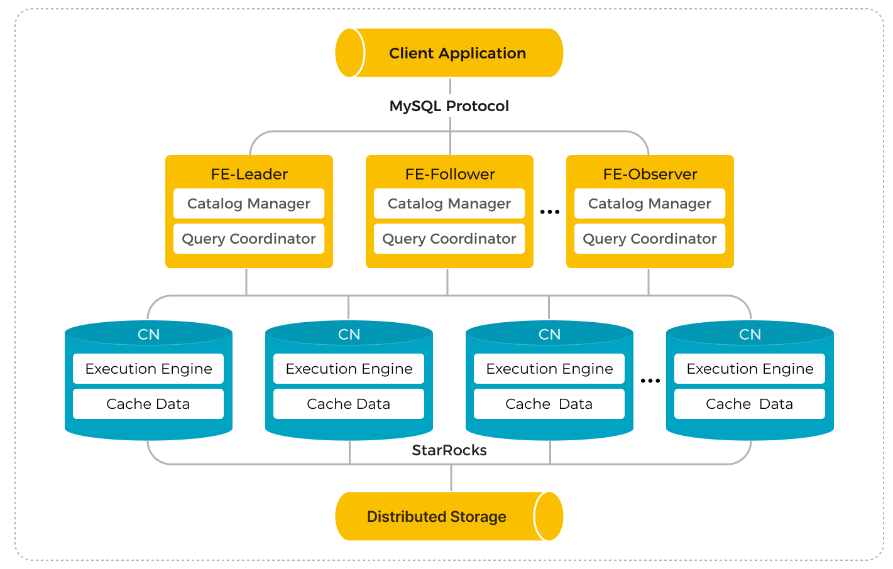

# 共有データに HDFS を使用する

import SharedDataIntro from '../../_assets/commonMarkdown/sharedDataIntro.mdx'
import SharedDataCNconf from '../../_assets/commonMarkdown/sharedDataCNconf.mdx'
import SharedDataUseIntro from '../../_assets/commonMarkdown/sharedDataUseIntro.mdx'
import SharedDataUse from '../../_assets/commonMarkdown/sharedDataUse.mdx'

<SharedDataIntro />

## アーキテクチャ



## 共有データ StarRocks クラスタをデプロイする

共有データ StarRocks クラスタのデプロイは、共有なし StarRocks クラスタのデプロイと似ています。唯一の違いは、共有データクラスタでは BEs の代わりに CNs をデプロイする必要があることです。このセクションでは、共有データ StarRocks クラスタをデプロイする際に、FE と CN の構成ファイル **fe.conf** と **cn.conf** に追加する必要がある追加の FE と CN の構成項目のみをリストします。StarRocks クラスタのデプロイに関する詳細な手順については、 [Deploy StarRocks](../../deployment/deploy_manually.md) を参照してください。

> **注意**
>
> このドキュメントの次のセクションで共有ストレージ用に構成されるまで、クラスタを起動しないでください。

## 共有データ StarRocks 用の FE ノードを構成する

FEs を起動する前に、FE 構成ファイル **fe.conf** に次の構成項目を追加します。

### HDFS 用の FE 構成例

これらは、各 FE ノードの `fe.conf` ファイルに追加する共有データの例です。

```Properties
run_mode = shared_data
cloud_native_meta_port = <meta_port>
cloud_native_storage_type = HDFS

# 例: hdfs://127.0.0.1:9000/user/starrocks/
cloud_native_hdfs_url = <hdfs_url>
```

### HDFS を使用した共有ストレージに関連するすべての FE パラメータ

#### run_mode

StarRocks クラスタの実行モード。有効な値:

- `shared_data`
- `shared_nothing` (デフォルト)

> **注意**
>
> - StarRocks クラスタで `shared_data` と `shared_nothing` モードを同時に採用することはできません。混合デプロイはサポートされていません。
> - クラスタがデプロイされた後に `run_mode` を変更しないでください。そうしないと、クラスタが再起動に失敗します。共有なしクラスタから共有データクラスタへの変換、またはその逆はサポートされていません。

#### cloud_native_meta_port

クラウドネイティブメタサービスの RPC ポート。

- デフォルト: `6090`

#### enable_load_volume_from_conf

StarRocks が FE 構成ファイルに指定されたオブジェクトストレージ関連のプロパティを使用してデフォルトのストレージボリュームを作成できるかどうか。有効な値:

- `true` (デフォルト) 新しい共有データクラスタを作成する際にこの項目を `true` に指定すると、StarRocks は FE 構成ファイルのオブジェクトストレージ関連のプロパティを使用して組み込みストレージボリューム `builtin_storage_volume` を作成し、それをデフォルトのストレージボリュームとして設定します。ただし、オブジェクトストレージ関連のプロパティを指定していない場合、StarRocks は起動に失敗します。
- `false` 新しい共有データクラスタを作成する際にこの項目を `false` に指定すると、StarRocks は組み込みストレージボリュームを作成せずに直接起動します。StarRocks でオブジェクトを作成する前に、ストレージボリュームを手動で作成し、それをデフォルトのストレージボリュームとして設定する必要があります。詳細については、 [Create the default storage volume](#use-your-shared-data-starrocks-cluster) を参照してください。

v3.1.0 からサポートされています。

> **注意**
>
> v3.0 から既存の共有データクラスタをアップグレードする際は、この項目を `true` のままにしておくことを強くお勧めします。この項目を `false` に指定すると、アップグレード前に作成したデータベースとテーブルが読み取り専用になり、それらにデータをロードすることができなくなります。

#### cloud_native_storage_type

使用するオブジェクトストレージのタイプです。共有データモードでは、StarRocks は Azure Blob (v3.1.1 以降でサポート) と S3 プロトコルと互換性のあるオブジェクトストレージ (AWS S3、Google GCP、MinIO など) にデータを保存することをサポートしています。有効な値:

- `S3` (デフォルト)
- `AZBLOB`
- `HDFS`

> **注意**
>
> - このパラメータを `S3` に指定する場合、`aws_s3` で始まるパラメータを追加する必要があります。
> - このパラメータを `AZBLOB` に指定する場合、`azure_blob` で始まるパラメータを追加する必要があります。
> - このパラメータを `HDFS` に指定する場合、`cloud_native_hdfs_url` パラメータを追加する必要があります。

#### cloud_native_hdfs_url

HDFS ストレージの URL です。例: `hdfs://127.0.0.1:9000/user/xxx/starrocks/`。

> **注意**
>
> 共有データ StarRocks クラスタが作成された後に変更できるのは、資格情報に関連する構成項目のみです。元のストレージパスに関連する構成項目を変更した場合、変更前に作成したデータベースとテーブルが読み取り専用になり、それらにデータをロードすることができなくなります。

クラスタが作成された後にデフォルトのストレージボリュームを手動で作成したい場合は、次の構成項目を追加するだけです。

```Properties
run_mode = shared_data
cloud_native_meta_port = <meta_port>
enable_load_volume_from_conf = false
```

## 共有データ StarRocks 用の CN ノードを構成する

<SharedDataCNconf />

## 共有データ StarRocks クラスタを使用する

<SharedDataUseIntro />

次の例では、HDFS ストレージ用のストレージボリューム `def_volume` を作成し、ストレージボリュームを有効にして、デフォルトのストレージボリュームとして設定します。

```SQL
CREATE STORAGE VOLUME def_volume
TYPE = HDFS
LOCATIONS = ("hdfs://127.0.0.1:9000/user/starrocks/");

SET def_volume AS DEFAULT STORAGE VOLUME;
```

<SharedDataUse />