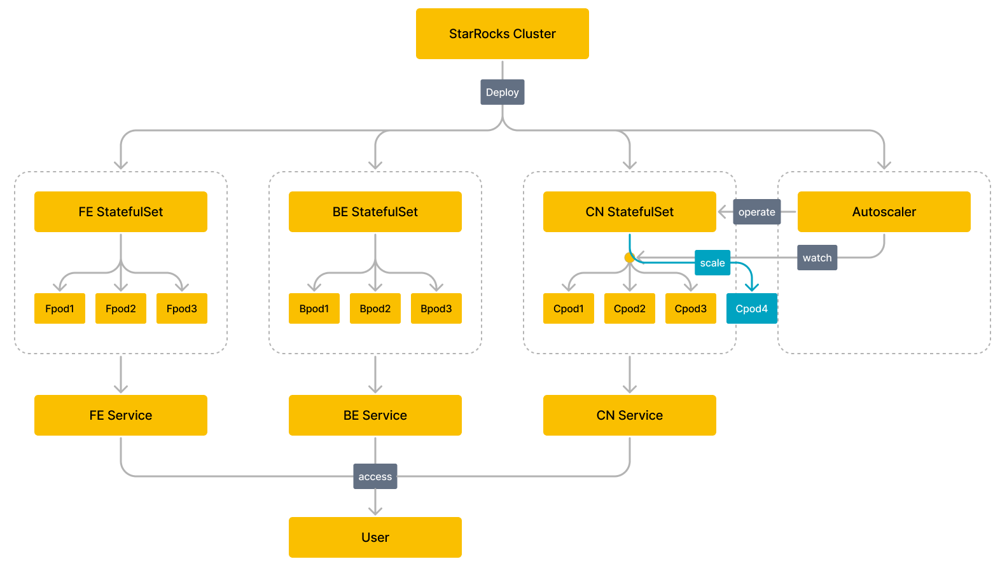

# Operator を使用して StarRocks をデプロイする

このトピックでは、StarRocks Operator を使用して Kubernetes クラスター上で StarRocks クラスターのデプロイと管理を自動化する方法を紹介します。

:::note
StarRocks k8s operator はレベル 2 オペレーターとして設計されています。レベル 2 オペレーターの機能について詳しくは、https://sdk.operatorframework.io/docs/overview/operator-capabilities/ を参照してください。
:::

## 動作の仕組み



## 始める前に

### Kubernetes クラスターを作成する

Amazon Elastic Kubernetes Service (EKS) や Google Kubernetes Engine (GKE) クラスターなどのクラウド管理 Kubernetes サービス、または自己管理の Kubernetes クラスターを使用できます。

- Amazon EKS クラスターを作成する

  1. [以下のコマンドラインツールが環境にインストールされていることを確認します](https://docs.aws.amazon.com/eks/latest/userguide/getting-started.html):
     1. AWS コマンドラインツール AWS CLI をインストールして設定します。
     2. EKS クラスターコマンドラインツール eksctl をインストールします。
     3. Kubernetes クラスターコマンドラインツール kubectl をインストールします。
  2. 次のいずれかの方法を使用して EKS クラスターを作成します:
     1. [eksctl を使用して EKS クラスターを迅速に作成する](https://docs.aws.amazon.com/eks/latest/userguide/getting-started-eksctl.html)。
     2. [AWS コンソールと AWS CLI を使用して手動で EKS クラスターを作成する](https://docs.aws.amazon.com/eks/latest/userguide/getting-started-console.html)。

- GKE クラスターを作成する

  GKE クラスターを作成する前に、すべての[前提条件](https://cloud.google.com/kubernetes-engine/docs/deploy-app-cluster#before-you-begin)を完了してください。その後、[Create a GKE cluster](https://cloud.google.com/kubernetes-engine/docs/deploy-app-cluster#create_cluster) に記載された手順に従って GKE クラスターを作成します。

- 自己管理の Kubernetes クラスターを作成する

  [kubeadm を使用したクラスターのブートストラップ](https://kubernetes.io/docs/setup/production-environment/tools/kubeadm/) に記載された手順に従って、自己管理の Kubernetes クラスターを作成します。[Minikube](https://kubernetes.io/docs/tutorials/kubernetes-basics/create-cluster/cluster-intro/) と [Docker Desktop](https://docs.docker.com/desktop/) を使用して、最小限の手順でシングルノードのプライベート Kubernetes クラスターを作成できます。

### StarRocks Operator をデプロイする

1. カスタムリソース StarRocksCluster を追加します。

   ```bash
   kubectl apply -f https://raw.githubusercontent.com/StarRocks/starrocks-kubernetes-operator/main/deploy/starrocks.com_starrocksclusters.yaml
   ```

2. StarRocks Operator をデプロイします。デフォルトの設定ファイルまたはカスタム設定ファイルを使用して StarRocks Operator をデプロイすることができます。
   1. デフォルトの設定ファイルを使用して StarRocks Operator をデプロイします。

      ```bash
      kubectl apply -f https://raw.githubusercontent.com/StarRocks/starrocks-kubernetes-operator/main/deploy/operator.yaml
      ```

      StarRocks Operator は `starrocks` 名前空間にデプロイされ、すべての名前空間の下のすべての StarRocks クラスターを管理します。
   2. カスタム設定ファイルを使用して StarRocks Operator をデプロイします。
      - StarRocks Operator をデプロイするために使用される設定ファイル **operator.yaml** をダウンロードします。

        ```bash
        curl -O https://raw.githubusercontent.com/StarRocks/starrocks-kubernetes-operator/main/deploy/operator.yaml
        ```

      - 設定ファイル **operator.yaml** をニーズに合わせて修正します。
      - StarRocks Operator をデプロイします。

        ```bash
        kubectl apply -f operator.yaml
        ```

3. StarRocks Operator の稼働状況を確認します。ポッドが `Running` 状態であり、ポッド内のすべてのコンテナが `READY` であれば、StarRocks Operator は期待通りに稼働しています。

    ```bash
    $ kubectl -n starrocks get pods
    NAME                                  READY   STATUS    RESTARTS   AGE
    starrocks-controller-65bb8679-jkbtg   1/1     Running   0          5m6s
    ```

> **NOTE**
>
> StarRocks Operator が配置されている名前空間をカスタマイズする場合は、`starrocks` をカスタマイズした名前空間の名前に置き換える必要があります。

## StarRocks クラスターをデプロイする

StarRocks が提供する [サンプル設定ファイル](https://github.com/StarRocks/starrocks-kubernetes-operator/tree/main/examples/starrocks) を直接使用して、StarRocks クラスター（カスタムリソース StarRocks Cluster を使用してインスタンス化されたオブジェクト）をデプロイできます。たとえば、**starrocks-fe-and-be.yaml** を使用して、3 つの FE ノードと 3 つの BE ノードを含む StarRocks クラスターをデプロイできます。

```bash
kubectl apply -f https://raw.githubusercontent.com/StarRocks/starrocks-kubernetes-operator/main/examples/starrocks/starrocks-fe-and-be.yaml
```

以下の表は、**starrocks-fe-and-be.yaml** ファイルのいくつかの重要なフィールドを説明しています。

| **Field** | **Description**                                              |
| --------- | ------------------------------------------------------------ |
| Kind      | オブジェクトのリソースタイプ。値は `StarRocksCluster` でなければなりません。 |
| Metadata  | メタデータで、以下のサブフィールドがネストされています:<ul><li>`name`: オブジェクトの名前。同じリソースタイプのオブジェクトを一意に識別します。</li><li>`namespace`: オブジェクトが属する名前空間。</li></ul> |
| Spec      | オブジェクトの期待される状態。有効な値は `starRocksFeSpec`、`starRocksBeSpec`、`starRocksCnSpec` です。 |

修正された設定ファイルを使用して StarRocks クラスターをデプロイすることもできます。サポートされているフィールドと詳細な説明については、[api.md](https://github.com/StarRocks/starrocks-kubernetes-operator/blob/main/doc/api.md) を参照してください。

StarRocks クラスターのデプロイには時間がかかります。この期間中、`kubectl -n starrocks get pods` コマンドを使用して StarRocks クラスターの起動状態を確認できます。すべてのポッドが `Running` 状態であり、ポッド内のすべてのコンテナが `READY` であれば、StarRocks クラスターは期待通りに稼働しています。

> **NOTE**
>
> StarRocks クラスターが配置されている名前空間をカスタマイズする場合は、`starrocks` をカスタマイズした名前空間の名前に置き換える必要があります。

```bash
$ kubectl -n starrocks get pods
NAME                                  READY   STATUS    RESTARTS   AGE
starrocks-controller-65bb8679-jkbtg   1/1     Running   0          22h
starrockscluster-sample-be-0          1/1     Running   0          23h
starrockscluster-sample-be-1          1/1     Running   0          23h
starrockscluster-sample-be-2          1/1     Running   0          22h
starrockscluster-sample-fe-0          1/1     Running   0          21h
starrockscluster-sample-fe-1          1/1     Running   0          21h
starrockscluster-sample-fe-2          1/1     Running   0          22h
```

> **Note**
>
> 長時間経過しても一部のポッドが起動しない場合は、`kubectl logs -n starrocks <pod_name>` を使用してログ情報を確認するか、`kubectl -n starrocks describe pod <pod_name>` を使用してイベント情報を確認し、問題を特定してください。

## StarRocks クラスターを管理する

### StarRocks クラスターにアクセスする

StarRocks クラスターのコンポーネントは、FE サービスなどの関連するサービスを通じてアクセスできます。サービスとそのアクセスアドレスの詳細については、[api.md](https://github.com/StarRocks/starrocks-kubernetes-operator/blob/main/doc/api.md) および [Services](https://kubernetes.io/docs/concepts/services-networking/service/) を参照してください。

> **NOTE**
>
> - デフォルトでは FE サービスのみがデプロイされます。BE サービスと CN サービスをデプロイする必要がある場合は、StarRocks クラスター設定ファイルで `starRocksBeSpec` と `starRocksCnSpec` を設定する必要があります。
> - サービスの名前はデフォルトで `<cluster name>-<component name>-service` です。たとえば、`starrockscluster-sample-fe-service` です。各コンポーネントの spec でサービス名を指定することもできます。

#### Kubernetes クラスター内から StarRocks クラスターにアクセスする

Kubernetes クラスター内からは、FE サービスの ClusterIP を通じて StarRocks クラスターにアクセスできます。

1. FE サービスの内部仮想 IP アドレス `CLUSTER-IP` とポート `PORT(S)` を取得します。

    ```Bash
    $ kubectl -n starrocks get svc 
    NAME                                 TYPE        CLUSTER-IP       EXTERNAL-IP   PORT(S)                               AGE
    be-domain-search                     ClusterIP   None             <none>        9050/TCP                              23m
    fe-domain-search                     ClusterIP   None             <none>        9030/TCP                              25m
    starrockscluster-sample-fe-service   ClusterIP   10.100.162.xxx   <none>        8030/TCP,9020/TCP,9030/TCP,9010/TCP   25m
    ```

2. Kubernetes クラスター内から MySQL クライアントを使用して StarRocks クラスターにアクセスします。

   ```Bash
   mysql -h 10.100.162.xxx -P 9030 -uroot
   ```

#### Kubernetes クラスター外から StarRocks クラスターにアクセスする

Kubernetes クラスター外からは、FE サービスの LoadBalancer または NodePort を通じて StarRocks クラスターにアクセスできます。このトピックでは LoadBalancer を例として使用します:

1. コマンド `kubectl -n starrocks edit src starrockscluster-sample` を実行して StarRocks クラスター設定ファイルを更新し、`starRocksFeSpec` のサービスタイプを `LoadBalancer` に変更します。

    ```YAML
    starRocksFeSpec:
      image: starrocks/fe-ubuntu:3.0-latest
      replicas: 3
      requests:
        cpu: 4
        memory: 16Gi
      service:            
        type: LoadBalancer # LoadBalancer として指定
    ```

2. FE サービスが外部に公開する IP アドレス `EXTERNAL-IP` とポート `PORT(S)` を取得します。

    ```Bash
    $ kubectl -n starrocks get svc
    NAME                                 TYPE           CLUSTER-IP       EXTERNAL-IP                                                              PORT(S)                                                       AGE
    be-domain-search                     ClusterIP      None             <none>                                                                   9050/TCP                                                      127m
    fe-domain-search                     ClusterIP      None             <none>                                                                   9030/TCP                                                      129m
    starrockscluster-sample-fe-service   LoadBalancer   10.100.162.xxx   a7509284bf3784983a596c6eec7fc212-618xxxxxx.us-west-2.elb.amazonaws.com   8030:30629/TCP,9020:32544/TCP,9030:32244/TCP,9010:32024/TCP   129m               ClusterIP      None            <none>                                                                   9030/TCP                                                      23h
    ```

3. マシンホストにログインし、MySQL クライアントを使用して StarRocks クラスターにアクセスします。

    ```Bash
    mysql -h a7509284bf3784983a596c6eec7fc212-618xxxxxx.us-west-2.elb.amazonaws.com -P9030 -uroot
    ```

### StarRocks クラスターをアップグレードする

#### BE ノードをアップグレードする

次のコマンドを実行して、新しい BE イメージファイル（例: `starrocks/be-ubuntu:latest`）を指定します。

```bash
kubectl -n starrocks patch starrockscluster starrockscluster-sample --type='merge' -p '{"spec":{"starRocksBeSpec":{"image":"starrocks/be-ubuntu:latest"}}}'
```

#### FE ノードをアップグレードする

次のコマンドを実行して、新しい FE イメージファイル（例: `starrocks/fe-ubuntu:latest`）を指定します。

```bash
kubectl -n starrocks patch starrockscluster starrockscluster-sample --type='merge' -p '{"spec":{"starRocksFeSpec":{"image":"starrocks/fe-ubuntu:latest"}}}'
```

アップグレードプロセスには時間がかかります。`kubectl -n starrocks get pods` コマンドを実行して、アップグレードの進行状況を確認できます。

### StarRocks クラスターをスケールする

#### BE クラスターをスケールアウトする

次のコマンドを実行して、BE クラスターを 9 ノードにスケールアウトします。

```bash
kubectl -n starrocks patch starrockscluster starrockscluster-sample --type='merge' -p '{"spec":{"starRocksBeSpec":{"replicas":9}}}'
```

### BE クラスターをスケールインする

BE ノードをスケールインする際には、一度に 1 つずつスケールインし、BEs 上のタブレットが再分配されるのを待ってから次に進む必要があります。単一レプリカのテーブルがある場合、BE ノードをオフラインにすると、タブレットが再分配されない場合にデータ損失が発生する可能性があります。

次のコマンドを実行して、10 BE ノードのクラスターを 9 にスケールインします。

```bash
kubectl -n starrocks patch starrockscluster starrockscluster-sample --type='merge' -p '{"spec":{"starRocksBeSpec":{"replicas":9}}}'
```

スケールイン後、`alive` ステータスが `false` のノードを手動で削除する必要があります。

タブレットの再分配には時間がかかります。`SHOW PROC '/statistic';` を実行して進行状況を確認できます。

#### FE クラスターをスケールアウトする

次のコマンドを実行して、FE クラスターを 4 ノードにスケールアウトします。

```bash
kubectl -n starrocks patch starrockscluster starrockscluster-sample --type='merge' -p '{"spec":{"starRocksFeSpec":{"replicas":4}}}'
```

スケーリングプロセスには時間がかかります。`kubectl -n starrocks get pods` コマンドを使用してスケーリングの進行状況を確認できます。

### CN クラスターの自動スケーリング

コマンド `kubectl -n starrocks edit src starrockscluster-sample` を実行して、CN クラスターの自動スケーリングポリシーを設定します。CN のリソースメトリクスとして、平均 CPU 使用率、平均メモリ使用量、弾性スケーリングのしきい値、上限弾性スケーリング制限、下限弾性スケーリング制限を指定できます。上限弾性スケーリング制限と下限弾性スケーリング制限は、弾性スケーリングに許可される CN の最大数と最小数を指定します。

> **NOTE**
>
> CN クラスターの自動スケーリングポリシーが設定されている場合は、StarRocks クラスター設定ファイルの `starRocksCnSpec` から `replicas` フィールドを削除してください。

Kubernetes はまた、`behavior` を使用してビジネスシナリオに応じたスケーリング動作をカスタマイズし、迅速または遅いスケーリングを実現したり、スケーリングを無効にしたりすることをサポートしています。自動スケーリングポリシーの詳細については、[Horizontal Pod Scaling](https://kubernetes.io/docs/tasks/run-application/horizontal-pod-autoscale/) を参照してください。

以下は、StarRocks が提供する自動スケーリングポリシーを設定するための[テンプレート](https://github.com/StarRocks/starrocks-kubernetes-operator/blob/main/examples/starrocks/deploy_a_starrocks_cluster_with_cn.yaml)です。

```YAML
  starRocksCnSpec:
    image: starrocks/cn-ubuntu:latest
    limits:
      cpu: 16
      memory: 64Gi
    requests:
      cpu: 16
      memory: 64Gi
    autoScalingPolicy: # CN クラスターの自動スケーリングポリシー。
      maxReplicas: 10 # CN の最大数を 10 に設定。
      minReplicas: 1 # CN の最小数を 1 に設定。
      # 以下のフィールドに基づいて HPA リソースを作成します。
      # 詳細は https://kubernetes.io/docs/tasks/run-application/horizontal-pod-autoscale/ を参照してください。
      hpaPolicy:
        metrics: # リソースメトリクス
          - type: Resource
            resource:
              name: memory  # CN の平均メモリ使用量をリソースメトリクスとして指定。
              target:
                # 弾性スケーリングのしきい値は 60%。
                # CN の平均メモリ使用率が 60% を超えると、スケールアウトのために CN の数が増加。
                # CN の平均メモリ使用率が 60% 未満になると、スケールインのために CN の数が減少。
                averageUtilization: 60
                type: Utilization
          - type: Resource
            resource:
              name: cpu # CN の平均 CPU 使用率をリソースメトリクスとして指定。
              target:
                # 弾性スケーリングのしきい値は 60%。
                # CN の平均 CPU 使用率が 60% を超えると、スケールアウトのために CN の数が増加。
                # CN の平均 CPU 使用率が 60% 未満になると、スケールインのために CN の数が減少。
                averageUtilization: 60
                type: Utilization
        behavior: # ビジネスシナリオに応じたスケーリング動作をカスタマイズし、迅速または遅いスケーリングを実現したり、スケーリングを無効にしたりします。
          scaleUp:
            policies:
              - type: Pods
                value: 1
                periodSeconds: 10
          scaleDown:
            selectPolicy: Disabled
```

以下の表は、いくつかの重要なフィールドを説明しています。

- 上限および下限の弾性スケーリング制限。

```YAML
maxReplicas: 10 # CN の最大数を 10 に設定。
minReplicas: 1 # CN の最小数を 1 に設定。
```

- 弾性スケーリングのしきい値。

```YAML
# たとえば、CN の平均 CPU 使用率をリソースメトリクスとして指定。
# 弾性スケーリングのしきい値は 60%。
# CN の平均 CPU 使用率が 60% を超えると、スケールアウトのために CN の数が増加。
# CN の平均 CPU 使用率が 60% 未満になると、スケールインのために CN の数が減少。
- type: Resource
  resource:
    name: cpu
    target:
      averageUtilization: 60
```

## FAQ

**問題の説明:** カスタムリソース StarRocksCluster を `kubectl apply -f xxx` を使用してインストールすると、`The CustomResourceDefinition 'starrocksclusters.starrocks.com' is invalid: metadata.annotations: Too long: must have at most 262144 bytes` というエラーが返されます。

**原因の分析:** `kubectl apply -f xxx` を使用してリソースを作成または更新するたびに、メタデータアノテーション `kubectl.kubernetes.io/last-applied-configuration` が追加されます。このメタデータアノテーションは JSON 形式で、*last-applied-configuration* を記録します。`kubectl apply -f xxx` はほとんどのケースで適していますが、カスタムリソースの設定ファイルが大きすぎる場合など、まれな状況ではメタデータアノテーションのサイズが制限を超えることがあります。

**解決策:** カスタムリソース StarRocksCluster を初めてインストールする場合は、`kubectl create -f xxx` を使用することをお勧めします。環境にすでにカスタムリソース StarRocksCluster がインストールされており、その設定を更新する必要がある場合は、`kubectl replace -f xxx` を使用することをお勧めします。