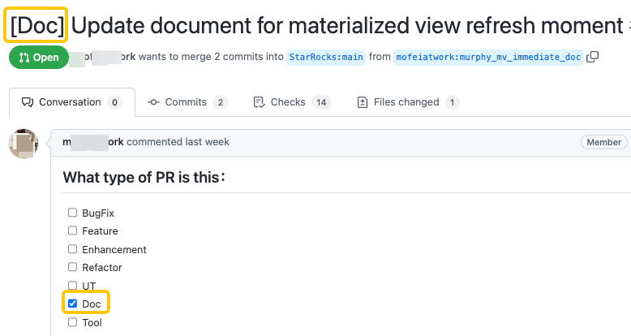
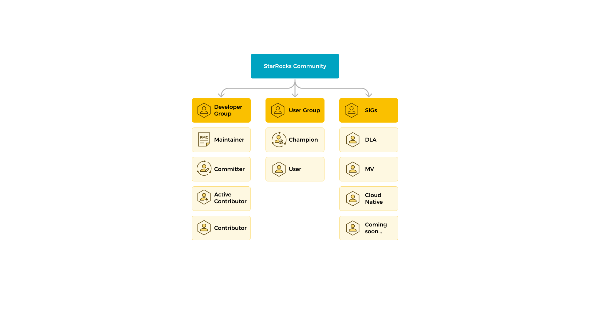

# Contribute to StarRocks

StarRocks への貢献は、誰からでも心より歓迎いたします。StarRocks への貢献は、コードの貢献に限りません。以下に、コミュニティへの貢献のさまざまなアプローチを示します。

| バグを報告する                        | StarRocks のバグを報告するには、[file an issue](https://github.com/StarRocks/starrocks/issues/new/choose) をクリックしてください。また、ドキュメントサイトの右上隅にある `Feedback` をクリックしてバグを報告することもできます。 |
| ----------------------------------- | ------------------------------------------------------------ |
| **コードを貢献する**                 | バグを修正したり、機能を実装することでコードを貢献できます。 |
| **テストケースを貢献する**            | テストケースを貢献できます。                          |
| **コードレビューを手伝う**                | StarRocks のアクティブな貢献者またはコミッターであれば、プルリクエスト (PR) のレビューを手伝うことができます。 |
| **ドキュメントを貢献する**        | StarRocks コミュニティは、中国語と英語の膨大な量のドキュメントを維持しています。ドキュメントのバグを修正したり、新しいコンテンツを提案することでドキュメントの変更を貢献できます。 |
| **StarRocks ユーザーを助ける**            | コミュニティで困難に直面している初心者を助けることができます。 |
| **StarRocks を広める** | 私たちの技術を世界に広めるために、記事を書いたり、講演を行ったりすることができます。 |

> **NOTE**
>
> ドキュメントを貢献するには、`git commit -s` を使用してコミットに **sign off** することを忘れないでください。そうしないと、Developer Certificate of Origin (DCO) チェックを通過できません。また、PR タイトルに `[Doc]` をプレフィックスとして追加し、**Doc** チェックボックスを選択してください。
> 

## コミュニティリソース

StarRocks に関するさまざまなヘルプを得るための最良の場所は、StarRocks の [Slack Channel](https://try.starrocks.com/join-starrocks-on-slack) です。貢献に関連する議論については、**#contributing-to-starrocks** チャンネルに参加してください。

また、[GitHub](https://github.com/StarRocks/starrocks/) で問題や問題を報告したり、新機能を提案したりすることもできます。

## 行動規範

私たちのコミュニティは、[code of conduct](https://github.com/StarRocks/starrocks/blob/main/CODE_OF_CONDUCT.md) を厳守しています。

## コミュニティの役割

誰もが StarRocks プロジェクトに参加することを奨励しています。新機能、プロジェクトのロードマップ、アーキテクチャに関する議論に参加したり、直面している問題を報告するだけで、誰でも影響を与えることができます。

以下に示す役割は、コミュニティに参加するためのいくつかの方法であり、各役割に期待されることを定義しています。

## ユーザーグループ

### 参加者

参加者はコミュニティに積極的に関与し、StarRocks をより良くするために取り組んでいます。

参加者として、GitHub での問題報告の提出、テストケースの貢献、ドキュメントの翻訳/修正、フォーラムやコミュニティでのユーザー質問への回答、イベントへの参加、StarRocks に関する経験の共有、GitHub での StarRocks のスター付けなどができます。

期待されることと責任:

- コミュニティの [code of conduct](https://github.com/StarRocks/starrocks/blob/main/CODE_OF_CONDUCT.md) に従う。

- 議論やコミュニティイベントに参加する。

- コミュニティにフィードバックを共有し、何がうまくいっているか、いないかを他の人に知らせる。

- 改善を提案する。

### チャンピオン

StarRocks コミュニティチャンピオンは、StarRocks 技術に精通した情熱的なコミュニティの伝道者と先駆者のグループです。彼らはコミュニティで最新の開発と製品を共有することを楽しみ、その情熱がコミュニティの進歩と発展を促進します。

#### 利点

##### 製品

- 新しい製品/機能への早期アクセス。

- プロジェクトのコアチームとの独占的な会議に参加。

##### コミュニティ

- ウェブサイトに StarRocks チャンピオンとして掲載。

- 独占的な賞品とバッジ。

##### イベント

- StarRocks のイベントへの無料アクセス。

- イベントのための旅行と宿泊費の払い戻し。

- VIP 席と VIP イベント。

#### 要件

1. StarRocks に関連するオリジナルで質の高い技術コンテンツ（記事、チュートリアル、ビデオなど）を少なくとも 3 つ公開していること。
2. スピーカーとして少なくとも 2 回のオンライン/オフライン技術共有セッションに参加していること。
3. Slack や他のチャンネルでユーザーの質問に答えるのを手伝うこと。

#### その他の要件

1. StarRocks チャンピオンは、StarRocks コミュニティの [Code of Conduct](https://github.com/StarRocks/starrocks/blob/main/CODE_OF_CONDUCT.md) に従わなければなりません。
2. StarRocks チャンピオンの資格は 1 年間であり、過去 1 年間の貢献に基づいて毎年再申請する必要があります。

## 開発者グループ

### 貢献者

貢献するすべての人が StarRocks の貢献者になることができます。メンバーは、新しい貢献者が支援を必要とする場合に指導とガイダンスを提供します。

#### 貢献者になる方法は？

- StarRocks の公開リポジトリのいずれかで 1 つのマージされた PR。

#### 貢献者として期待されること

- StarRocks のプロジェクト開発に積極的に参加する。

- コミュニティイベント（ミートアップ、ハッカソンなど）に参加する。

- StarRocks 関連の技術を学び、他の人が学ぶのを助ける。

#### 特権

- StarRocks の貢献者としてリストされる。

- StarRocks 貢献者の e-証明書を授与される。

### アクティブ貢献者

アクティブ貢献者は、StarRocks に対して優れた貢献と持続的なコミットメントを示した貢献者です。彼らはコードの貢献、ドキュメントの改善、他の人を助けることでコミュニティに積極的に参加しています。

#### アクティブ貢献者になる方法は？

- 5 つのマージされた PR または主要なバグを修正。

- 5 回以上のコードレビューに参加。

- オンライン/オフラインのミートアップやコミュニティディスカッションなどのコミュニティイベントに積極的に参加。

#### 責任と特権

- コミュニティミーティングとディスカッションに参加。

- 新しい貢献者を指導し、ガイドする。

- StarRocks アクティブ貢献者としてリストされる。

- StarRocks アクティブ貢献者の e-証明書を授与される。

### コミッター

コミッターはアクティブ貢献者から昇格します。

彼らは PR をマスターブランチにマージする権限を持ち、StarRocks の計画とメンテナンスに責任を持っています。また、コミュニティで知識を共有する積極的なメンバーでもあります。

#### コミッターになる方法は？

- StarRocks の原則と将来の計画を深く理解していること。

- プロジェクトで発生するさまざまな問題に迅速に対処する能力を持っていること。

- 主要な開発をリードし、関連するドキュメントを作成および修正する。

- 少なくとも 2 人の PMC の指名を受け、投票を通過する。

### 責任と特権

- コミュニティ内の他のメンバーシップを指導し、ガイドする。

- サブプロジェクトの継続的な健康を確保する。

- StarRocks リポジトリへの書き込みアクセスを許可される（指定される）。

- StarRocks コミッターとしてリストされる。

- StarRocks コミッターの e-証明書を授与される。

### PMC

PMC はコミッターから昇格します。彼らは PR をマスターブランチにマージする権限を持ち、StarRocks の計画とメンテナンスに責任を持っています。また、コミュニティで知識を共有する積極的なメンバーでもあります。

#### PMC になる方法は？

- StarRocks の原則を深く理解し、StarRocks の将来の計画を明確に理解していること。

- プロジェクトの問題に迅速に対処する能力を持っていること。

- プロジェクトの開発とイテレーションをリードし、プロジェクトの全体的な方向性を指導する。

- 少なくとも 2 人の PMC の指名を受け、投票を通過する。

#### 責任と特権

- コミュニティ内の他のメンバーシップを指導し、ガイドする。

- プロジェクトの継続的な健康を確保する（コード品質やテストカバレッジなど）。

- 技術設計の決定を行い、承認する。

- マイルストーンとリリースを定義する。

- 新しいコミッターと PMC の投票と昇進を行う。

- StarRocks PMC としてリストされる。

- StarRocks PMC の e-証明書を授与される。

## 貢献プロセス

どのように始めればよいかわからない場合は、以下の貢献プロセスをお勧めします。このプロセスは、学習曲線を減らし、プルリクエストをより効率的にマージするのに役立つように設計されています。

1. [Contributor License Agreement (CLA)](https://cla-assistant.io/StarRocks/starrocks) に署名します。

2. GitHub で [issue](https://github.com/StarRocks/starrocks/issues) を作成するか、[Slack channel](https://try.starrocks.com/join-starrocks-on-slack) で質問して、ディスカッションを開始します（変更が些細でない限り）。

   コードに取り掛かる前に、issue 本文にコメントし、解決したい issue を担当者に知らせる必要があります。また、この問題を解決する方法についての計画を issue 本文で共有することをお勧めします。

   - このステップは、可能な協力者とレビュアーを特定するのに役立ちます。
   - 進行中の他の変更と競合する可能性がありますか？ もしそうなら、影響を最小限に抑えるために他の人と協力してください。
   - この変更は大きいですか？ もしそうなら、他の人と協力して変更を小さなステップに分割してください。

3. 変更を実装します。

   - 変更が大きい場合は、小さな PR に分割してください。

   - 必要に応じてテストとドキュメントを含めてください。

4. GitHub で [pull request](https://github.com/StarRocks/starrocks/pulls) を作成します。

   StarRocks コミュニティでは、コードを貢献する際にフォーク・アンド・マージの GitHub ワークフローに従います。

   - GitHub アカウントで StarRocks のフォークを作成します。
   - このフォークされたリポジトリをコンピュータにクローンします。
   - 貢献したいブランチに基づいて新しいブランチをチェックアウトします。
   - 新しいブランチにコードの変更をコミットします。
   - コードの変更を含むブランチを GitHub にプッシュします。
   - コードの変更を提出するために PR を作成します。1 つの PR に 1 つのコミットを提出することをお勧めします。PR を提出する際は、[PR テンプレート](https://github.com/StarRocks/starrocks/blob/main/.github/PULL_REQUEST_TEMPLATE.md) に従うことができます。
   - プルリクエストが CI のテストを通過することを確認してください。

5. 少なくとも 2 人のレビュアーによるレビューが必要です。

   - StarRocks プロジェクトでは、プルリクエストをマージするために、少なくとも 2 人のレビュアー（コミッター）からの lgtm が必要です。

   - 通常、これは数日以内に行われますが、変更が大きい、複雑である、または重要なレビュアーが利用できない場合は、時間がかかることがあります。（プルリクエストでレビュアーに ping することを遠慮なく行ってください）。

6. メンテナーが最終的な変更を受け入れた後にプルリクエストをマージします。