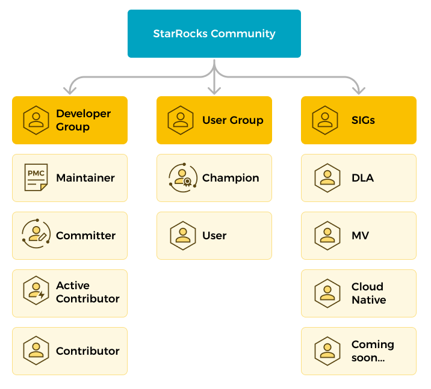

# Contribute to StarRocks

StarRocks への貢献は、誰からも心より歓迎されます。StarRocks への貢献は、コードの貢献に限りません。以下に、私たちのコミュニティに貢献するためのさまざまなアプローチを示します。

| バグを報告する                        | StarRocks のバグを報告するには、[issue を提出](https://github.com/StarRocks/starrocks/issues/new/choose) できます。また、ドキュメントサイトのページ右上にある `Feedback` をクリックしてバグを報告することもできます。 |
| ----------------------------------- | ------------------------------------------------------------ |
| **コードを貢献する**                 | バグを修正したり、機能を実装することでコードを貢献できます。 |
| **テストケースを貢献する**            | テストケースを貢献できます。                          |
| **コードレビューを手伝う**                | StarRocks のアクティブな貢献者またはコミッターであれば、プルリクエスト (PR) のレビューを手伝うことができます。 |
| **ドキュメントを貢献する**        | StarRocks コミュニティは、中国語と英語の膨大な量のドキュメントを維持しています。ドキュメントのバグを修正したり、新しいコンテンツを提案することでドキュメントの変更を貢献できます。 |
| **StarRocks ユーザーを手伝う**            | コミュニティで困難に直面している初心者を手伝うことができます。 |
| **StarRocks の情報を広める** | 私たちの技術を世界に広めるために、記事を書いたり、講演を行ったりすることができます。 |

> **NOTE**
>
> ドキュメントに貢献するには、`git commit -s` を使用してコミットに **署名** することを忘れないでください。そうしないと、Developer Certificate of Origin (DCO) チェックが失敗し、PR がブロックされる可能性があります。さらに、PR タイトルに `[Doc]` をプレフィックスとして付け、**Doc** チェックボックスを選択してください。
> 

## Community resources

StarRocks について幅広いサポートを得るための最良の場所は、StarRocks の [Slack Channel](https://try.starrocks.com/join-starrocks-on-slack) です。貢献に関連するディスカッションについては、**#contributing-to-starrocks** チャンネルに参加してください。

また、[GitHub](https://github.com/StarRocks/starrocks/) で問題や問題を報告したり、新機能を提案したりすることもできます。

## Code of conduct

私たちのコミュニティは、[code of conduct](https://github.com/StarRocks/starrocks/blob/main/CODE_OF_CONDUCT.md) を厳守しています。

## Community roles

誰もが StarRocks プロジェクトに参加することを奨励されています。新機能、プロジェクトのロードマップ、アーキテクチャについてのディスカッションに参加したり、直面している問題を報告したりすることで、誰でも影響を与えることができます。

以下に示す役割は、コミュニティに関与するためのいくつかの方法であり、各役割に期待されることを定義しています。

## User group

### Participants

参加者は、コミュニティに積極的に関与し、StarRocks をより良くするために取り組んでいます。

参加者として、GitHub での問題報告の提出、テストケースの貢献、ドキュメントの翻訳/修正、フォーラムやコミュニティでのユーザーの質問への回答、イベントへの参加、StarRocks の経験の共有、GitHub での StarRocks のスター付けなどができます。

期待されることと責任:

- コミュニティの [code of conduct](https://github.com/StarRocks/starrocks/blob/main/CODE_OF_CONDUCT.md) に従う。

- ディスカッションやコミュニティイベントに参加する。

- コミュニティにフィードバックを共有し、何が機能しているか/していないかを他の人に知らせる。

- 改善点を提案する。

### Champions

StarRocks Community Champions は、StarRocks 技術に精通した情熱的なコミュニティの伝道者と先駆者のグループです。彼らはコミュニティでの最新の開発や製品を共有することを楽しみ、その情熱がコミュニティの進歩と発展を促進します。

#### Benefits

製品

- 新しい製品/機能への早期アクセス。

- プロジェクトのコアチームとの独占ミーティングに参加。

コミュニティ

- ウェブサイトに StarRocks チャンピオンとして掲載。

- 独占的な賞品とバッジ。

イベント

- StarRocks のイベントへの無料アクセス。

- イベントのための旅行と宿泊費の払い戻し。

- VIP シートと VIP イベント。

#### Requirements

1. StarRocks に関連するオリジナルで質の高い技術コンテンツ（記事、チュートリアル、ビデオなど）を少なくとも 3 つ公開していること。
2. スピーカーとして少なくとも 2 回のオンライン/オフライン技術共有セッションに参加していること。
3. Slack やその他のチャンネルでユーザーの質問に答える手助けをすること。

#### Other Requirements

1. StarRocks Champions は StarRocks Community [Code of Conduct](https://github.com/StarRocks/starrocks/blob/main/CODE_OF_CONDUCT.md) に従わなければなりません。
2. StarRocks Champions の資格は 1 年間であり、過去 1 年間の貢献に基づいて毎年再申請する必要があります。

## Developer Group

### Contributor

貢献するすべての人が StarRocks の貢献者になることができます。メンバーは、新しい貢献者が支援を必要とする際に指導とガイダンスを提供します。

#### How to become a Contributor?

- StarRocks の公開リポジトリのいずれかで 1 つのマージされた PR。

貢献者として、私たちはあなたに期待します

- StarRocks のプロジェクト開発に積極的に参加する。

- コミュニティイベント（ミートアップ、ハッカソンなど）に参加する。

- StarRocks に関連する技術を学び、他の人が学ぶのを助ける。

#### Privileges

- StarRocks の貢献者として掲載される。

- StarRocks Contributor e-certificate を授与される。

### Active Contributor

アクティブな貢献者は、StarRocks に対して優れた貢献と持続的なコミットメントを示した貢献者です。彼らはコードの貢献、ドキュメントの改善、他の人を助けることでコミュニティに積極的に参加しています。

#### How to become an Active Contributor?

- 5 つのマージされた PR または主要なバグの修正。

- 5 回以上のコードレビューに参加。

- オンライン/オフラインのミートアップやコミュニティディスカッションなどのコミュニティイベントに積極的に参加。

#### Responsibilities and privileges

- コミュニティミーティングとディスカッションに参加する。

- 新しい貢献者を指導し、ガイドする。

- StarRocks Active Contributor として掲載される。

- StarRocks Active Contributor e-certificate を授与される。

### Committer

コミッターは、アクティブな貢献者から昇格されます。

彼らは、マスターブランチに PR をマージする権限を持ち、StarRocks の計画と保守に責任を持っています。また、コミュニティで知識を共有するアクティブなメンバーでもあります。

#### How to become a Committer?

- StarRocks の原則と将来の計画を深く理解していること。

- プロジェクトで発生するさまざまな問題に迅速に対処する能力を持っていること。

- 主要な開発をリードし、関連するドキュメントを作成および改訂する。

- 少なくとも 2 つの PMC の指名を受け、投票を通過する。

#### Responsibilities and privileges

- コミュニティ内の他のメンバーシップを指導し、ガイドする。

- サブプロジェクトの継続的な健康を確保する。

- StarRocks リポジトリへの書き込みアクセス権を付与される（指定される）。

- StarRocks Committer として掲載される。

- StarRocks Committer e-certificate を授与される。

### PMC

PMC は、コミッターから昇格されます。彼らは、マスターブランチに PR をマージする権限を持ち、StarRocks の計画と保守に責任を持っています。また、コミュニティで知識を共有するアクティブなメンバーでもあります。

#### How to become a PMC?

- StarRocks の原則を深く理解し、StarRocks の将来の計画を明確に理解していること。

- プロジェクトの問題に迅速に対処する能力を持っていること。

- プロジェクトの開発とイテレーションをリードし、プロジェクトの全体的な方向性を指揮する。

- 少なくとも 2 つの PMC の指名を受け、投票を通過する。

#### Responsibilities and privileges

- コミュニティ内の他のメンバーシップを指導し、ガイドする。

- プロジェクトの継続的な健康を確保する（コード品質やテストカバレッジなど）。

- 技術設計の決定を行い、承認する。

- マイルストーンとリリースを定義する。

- 新しいコミッターと PMC の投票と昇格を行う。

- StarRocks PMC として掲載される。

- StarRocks PMC e-certificate を授与される。

## Contribution process

どのように始めればよいかわからない場合は、貢献のためにこのプロセスをお勧めします。このプロセスは、学習曲線を減らし、プルリクエストをより効率的にマージするのに役立つように設計されています！

1. [Contributor License Agreement (CLA)](https://cla-assistant.io/StarRocks/starrocks) に署名します。

2. GitHub で [issue](https://github.com/StarRocks/starrocks/issues) を作成するか、[Slack channel](https://try.starrocks.com/join-starrocks-on-slack) で質問してディスカッションを開始します（変更が些細でない限り）。

   コードに手を付ける前に、issue 本文にコメントし、解決したい issue を担当者に知らせる必要があります。また、問題を解決する方法についての計画を issue 本文で共有することをお勧めします。

   - このステップは、可能な協力者とレビュアーを特定するのに役立ちます。
   - 変更が進行中の他の変更と競合するかどうかを確認します。もしそうなら、影響を最小限に抑えるために他の人と協力してください。
   - この変更が大きい場合は、他の人と協力して変更を小さなステップに分割してください。

3. 変更を実装します。

   - 変更が大きい場合は、小さな PR に分割してください。

   - 必要に応じてテストとドキュメントを含めてください。

4. GitHub で [pull request](https://github.com/StarRocks/starrocks/pulls) を作成します：

   StarRocks コミュニティでは、コードを貢献する際にフォーク・アンド・マージの GitHub ワークフローに従います。

   - GitHub アカウントで StarRocks をフォークします。
   - このフォークされたリポジトリをコンピュータにクローンします。
   - 貢献したいブランチに基づいて新しいブランチをチェックアウトします。
   - 新しいブランチにコードの変更をコミットします。
   - コードの変更を含むブランチを GitHub にプッシュします。
   - コードの変更を提出するために PR を作成します。1 つのコミットを 1 つの PR で提出することをお勧めします。PR を提出する際には、[PR テンプレート](https://github.com/StarRocks/starrocks/blob/main/.github/PULL_REQUEST_TEMPLATE.md) に従うことができます。
   - プルリクエストが CI のテストを通過することを確認してください。

5. 少なくとも 2 人のレビュアーによるレビューが必要です：

   - StarRocks プロジェクトでは、プルリクエストをマージするために少なくとも 2 人のレビュアー（コミッター）からの lgtm が必要です。

   - 通常、これは数日以内に行われますが、変更が大きい、複雑である、または重要なレビュアーが利用できない場合は、より長くかかることがあります。（プルリクエストでレビュアーに ping することを遠慮なく行ってください）。

6. メンテナーが最終的な変更が受け入れられた後にプルリクエストをマージします。