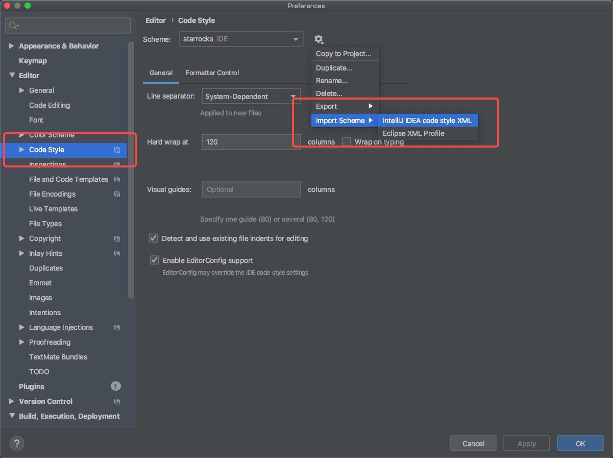

# Setup StarRocks FE 開発環境を IDEA で設定する

このチュートリアルは macOS に基づいており、Apple Chip(M1, M2)でテストされています。macOS を使用していない場合でも、このチュートリアルを参考にすることができます。

## 必要条件

### Thrift 0.13

公式の brew リポジトリには Thrift の 0.13 バージョンが存在しません。私たちのコミッターの一人が、自分のリポジトリにインストール用のバージョンを作成しました。

```bash
brew install alberttwong/thrift/thrift@0.13
```

Thrift を正常にインストールした後、次のコマンドを実行して確認できます。

```bash
$ thrift -version
Thrift version 0.13.0
```

### Protobuf

最新バージョン v3 を使用してください。なぜなら、最新バージョンの Protobuf は StarRocks で使用されている v2 バージョンの Protobuf と互換性があるからです。

```bash
brew install protobuf
```

### Maven

```
brew install maven
```

### Openjdk 1.8 または 11

```bash
brew install openjdk@11
```

### Python3

MacOS にはデフォルトでインストールされています。

各自の Thrift と Protobuf のインストールディレクトリは異なる場合があります。brew list コマンドを使用して確認できます。

```bash
brew list thrift@0.13.0
brew list protobuf
```

## StarRocks の設定

### StarRocks のダウンロード

```
git clone https://github.com/StarRocks/starrocks.git
```

### thirdparty ディレクトリの設定

`thirdparty` に `installed/bin` ディレクトリを作成します。

```bash
cd starrocks && mkdir -p thirdparty/installed/bin
```

次に、Thrift と Protobuf のソフトリンクをそれぞれ作成します。

```bash
ln -s /opt/homebrew/bin/thrift thirdparty/installed/bin/thrift
ln -s /opt/homebrew/bin/protoc thirdparty/installed/bin/protoc
```

### 環境変数の設定

```bash
export JAVA_HOME="/opt/homebrew/Cellar/openjdk@11/11.0.15" # 注意: jdk バージョンはデスクトップによって異なる場合があります
export PYTHON=/usr/bin/python3
export STARROCKS_THIRDPARTY=$(pwd)/thirdparty # 注意: starrocks ディレクトリにいることを確認してください
```

## ソースコードの生成

FE の多くのソースファイルは手動で生成する必要があります。そうしないと、IDEA はファイルが不足しているためエラーを報告します。次のコマンドを実行して自動的に生成します。

```bash
cd gensrc
make clean
make
```

## FE のコンパイル

`fe` ディレクトリに入り、Maven を使用してコンパイルします。

```bash
cd fe
mvn install -DskipTests
```

## IDEA で StarRocks を開く

1. IDEA で `StarRocks` ディレクトリを開きます。

2. コーディングスタイル設定を追加する
    コーディングスタイルを標準化するために、IDEA で `fe/starrocks_intellij_style.xml` コードスタイルファイルをインポートする必要があります。


## MacOS で StarRocks FE を実行する

IDEA を使用して `fe` ディレクトリを開きます。

`StarRocksFE.java` の Main 関数を直接実行すると、いくつかのエラーが報告されます。スムーズに実行するためには、いくつかの簡単な設定を行うだけで済みます。

**注意:** `StarRocksFE.java` は `fe/fe-core/src/main/java/com/starrocks` ディレクトリにあります。

1. StarRocks ディレクトリから `fe` ディレクトリに conf、bin、webroot ディレクトリをコピーします。

```bash
cp -r conf fe/conf
cp -r bin fe/bin
cp -r webroot fe/webroot
```

2. `fe` ディレクトリに入り、`fe` ディレクトリの下に log と meta フォルダを作成します。

```bash
cd fe
mkdir log
mkdir meta
```

3. 環境変数を設定します。以下の図のように設定します。


```bash
export PID_DIR=/Users/smith/Code/starrocks/fe/bin
export STARROCKS_HOME=/Users/smith/Code/starrocks/fe
export LOG_DIR=/Users/smith/Code/starrocks/fe/log
```

4. `fe/conf/fe.conf` の priority_networks を `127.0.0.1/24` に変更して、FE が現在のコンピュータの LAN IP を使用し、ポートのバインドに失敗するのを防ぎます。

5. これで StarRocks FE が正常に実行されました。

## MacOS で StarRocks FE をデバッグする

デバッグオプションで FE を開始した場合、IDEA デバッガを FE プロセスにアタッチできます。

```
./start_fe.sh --debug
```

https://www.jetbrains.com/help/idea/attaching-to-local-process.html#attach-to-local を参照してください。