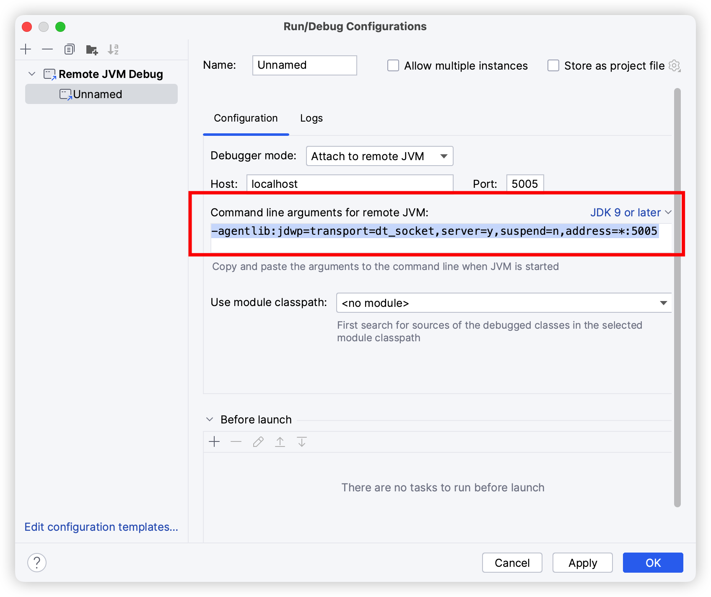
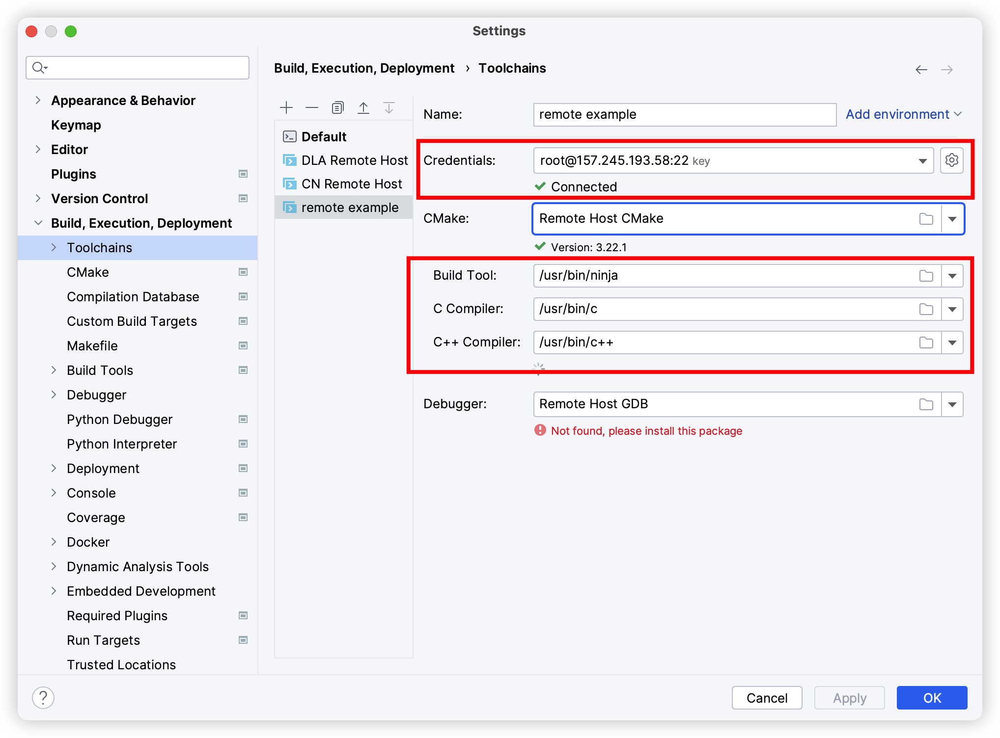
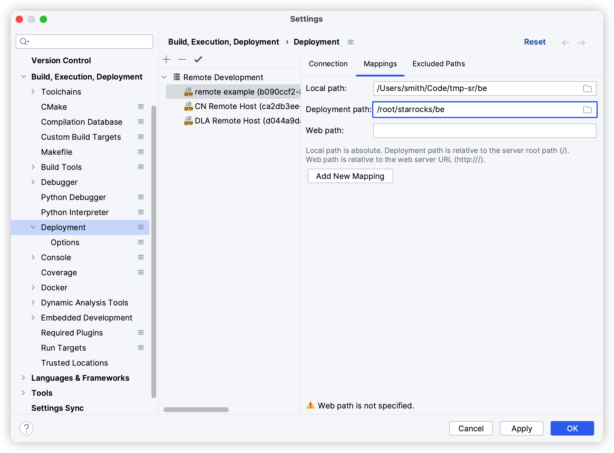
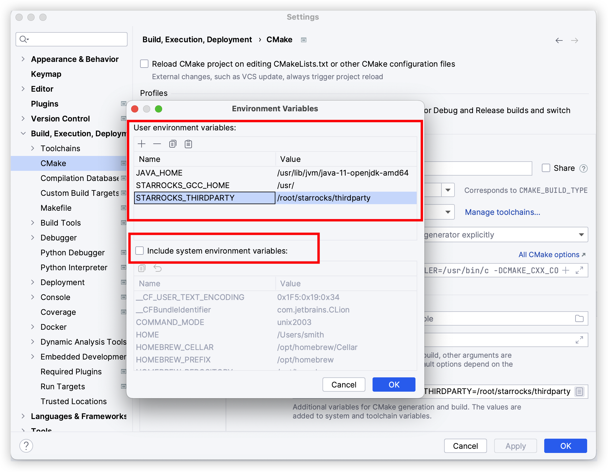
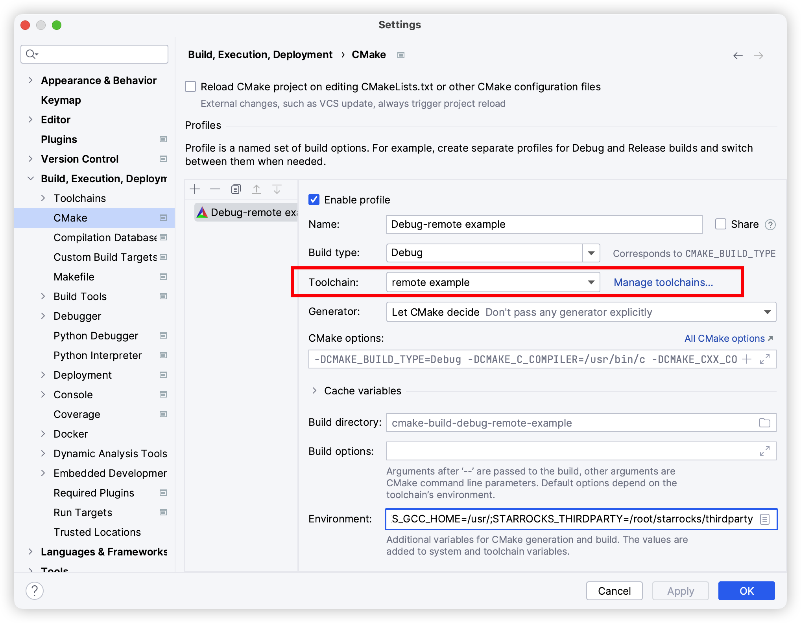

# StarRocks の開発環境をセットアップする

StarRocks のコントリビューターになりたいけれど、開発環境に悩んでいる方のために、ここにチュートリアルを書きます。

完璧な開発ツールチェーンとは何でしょうか？

* FE と BE をワンクリックでコンパイルできること。
* Clion と IDEA でコードジャンプをサポートすること。
* IDE 内のすべての変数が赤線なしで正常に解析できること。
* Clion がその解析機能を正常に有効にできること。
* FE と BE のデバッグをサポートすること。

## 準備

私は MacBook (M1) をローカルでのコーディングに使用し、リモートサーバーで StarRocks のコンパイルとテストを行います。（リモートサーバーは Ubuntu 22 を使用し、**少なくとも 16GB RAM が必要です**）。

全体のアイデアは、MacBook でコードを書き、それを IDE を通じてサーバーに自動的に同期し、サーバーを使って StarRocks をコンパイルおよび開発することです。

### MacBook のセットアップ

#### Thrift 0.13

公式の brew リポジトリには Thrift の 0.13 バージョンがありません。私たちのコミッターの一人が自分のリポジトリにバージョンを作成してインストールできるようにしました。

```bash
brew install alberttwong/thrift/thrift@0.13
```

以下のコマンドで Thrift が正常にインストールされたか確認できます。

```bash
$ thrift -version
Thrift version 0.13.0
```

#### Protobuf

最新バージョン v3 を直接使用してください。StarRocks の Protobuf プロトコルの v2 バージョンと互換性があります。

```bash
brew install protobuf
```

#### Maven

```bash
brew install maven
```

#### OpenJDK 1.8 または 11

```bash
brew install openjdk@11
```

#### Python3

MacOS には標準で付属しているため、インストールは不要です。

#### システム環境のセットアップ

```bash
export JAVA_HOME=xxxxx
export PYTHON=/usr/bin/python3
```

### Ubuntu22 サーバーのセットアップ

#### StarRocks コードのクローン

`git clone https://github.com/StarRocks/starrocks.git`

#### コンパイルに必要なツールのインストール

```bash
sudo apt update
```

```bash
sudo apt install gcc g++ maven openjdk-11-jdk python3 python-is-python3 unzip cmake bzip2 ccache byacc ccache flex automake libtool bison binutils-dev libiberty-dev build-essential ninja-build
```

`JAVA_HOME` 環境のセットアップ

```bash
export JAVA_HOME=/usr/lib/jvm/java-11-openjdk-amd64
```

#### StarRocks のコンパイルを行う

```bash
cd starrocks/
./build.sh
```

初回のコンパイルではサードパーティをコンパイルする必要があり、時間がかかります。

**最初のコンパイルには gcc を使用する必要があります。現在、サードパーティは clang では成功しません。**

## IDE のセットアップ

### FE

FE の開発は簡単です。MacOS で直接コンパイルできます。`fe` フォルダに入り、`mvn install -DskipTests` コマンドを実行するだけです。

その後、IDEA を使用して `fe` フォルダを直接開くことができ、すべてが正常に動作します。

#### ローカルデバッグ

他の Java アプリケーションと同様です。

#### リモートデバッグ

Ubuntu サーバーで `./start_fe.sh --debug` を実行し、IDEA のリモートデバッグを使用して接続します。デフォルトのポートは 5005 ですが、`start_fe.sh` スクリプトで変更できます。

デバッグ用の Java パラメータ: `-agentlib:jdwp=transport=dt_socket,server=y,suspend=n,address=*:5005` は IDEA からコピーしたものです。



### BE

最初に `fe` フォルダで `mvn install -DskipTests` を実行して、gensrc ディレクトリ内の thrift と protobuf が正しくコンパイルされていることを確認することをお勧めします。

その後、`gensrc` フォルダに入り、それぞれ `make clean` と `make` コマンドを実行する必要があります。そうしないと Clion が thrift の出力ファイルを検出できません。

Clion を使用して `be` フォルダを開きます。

`Settings` に入り、`Toolchains` を追加します。最初にリモートサーバーを追加し、次に Build Tool、C および C++ コンパイラを個別に設定します。



`Settings` / `Deployment` でフォルダの `mappings` を変更します。



`Settings` / `Cmake` で、ツールチェーンを先ほど追加したリモートツールチェーンに変更します。次の環境変数を追加します。

```bash
JAVA_HOME=/usr/lib/jvm/java-11-openjdk-amd64
STARROCKS_GCC_HOME=/usr/
STARROCKS_THIRDPARTY=/root/starrocks/thirdparty
```

注意: `Include system environment variables` をチェックしないように注意してください。





ここからは、すべてのセットアップが完了です。Clion とリモートサーバーがしばらく同期した後、コードジャンプが正常に動作します。

#### デバッグ

BE のデバッグは少し難しく、リモートサーバーで gdb を使用する必要があります。もちろん、gdb サーバー + Clion リモート gdb を使用することもできますが、お勧めしません。動作が非常に遅いです。

`start_backend.sh` スクリプトを以下のように変更する必要があります。

```bash
if [ ${RUN_BE} -eq 1 ]; then
    echo "start time: "$(date) >> $LOG_DIR/be.out
    if [ ${RUN_DAEMON} -eq 1 ]; then
        nohup ${STARROCKS_HOME}/lib/starrocks_be "$@" >> $LOG_DIR/be.out 2>&1 </dev/null &
    else
        ${STARROCKS_HOME}/lib/starrocks_be "$@" >> $LOG_DIR/be.out 2>&1 </dev/null
    fi
fi
```

から以下のように変更します。

```bash
if [ ${RUN_BE} -eq 1 ]; then
    echo "start time: "$(date) >> $LOG_DIR/be.out
    if [ ${RUN_DAEMON} -eq 1 ]; then
        nohup ${STARROCKS_HOME}/lib/starrocks_be "$@" >> $LOG_DIR/be.out 2>&1 </dev/null &
    else
        gdb -tui ${STARROCKS_HOME}/lib/starrocks_be
    fi
fi
```

その後、フラグなしで `./bin/start_be.sh` を実行するだけです。

> lakehouse のデバッグ時にエラーレポートが発生した場合は、`~/.gdbinit` に `handle SIGSEGV nostop noprint pass` を追加してください。

#### LLVM

もちろん、LLVM ツールを使用して BE を開発することもできます。

Ubuntu の LLVM インストールについては、https://apt.llvm.org/ を参照してください。

その後、次のコマンドを使用して BE をコンパイルします: `CC=clang-15 CXX=clang++-15 ./build.sh`。ただし、前提条件として、サードパーティが gcc でコンパイルされている必要があります。

## 最後に

自由に StarRocks にコードを貢献してください。 🫵