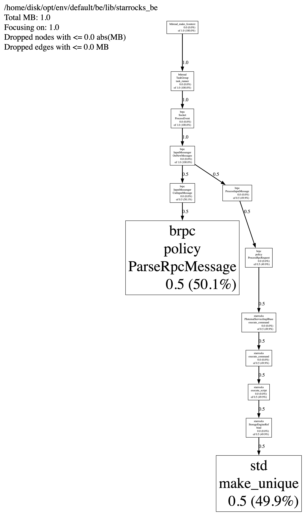

# Jemalloc ヒーププロファイリング

このトピックでは、StarRocks の Jemalloc ヒーププロファイルを有効にし、可視化する方法について説明します。

:::note
- Jemalloc ヒーププロファイルを有効にすると、StarRocks のパフォーマンスに影響を与える可能性があります。
- このソリューションは、StarRocks v3.1.6以降でのみ利用可能です。
:::

## Jemalloc ヒーププロファイルを有効にする

構文:

```SQL
ADMIN EXECUTE ON <be_id> 'System.print(HeapProf.getInstance().enable_prof())'
```

`be_id`: BE/CN ノードの ID。SHOW BACKENDS または SHOW COMPUTE NODES を実行して ID を取得できます。

例:

```SQL
mysql> admin execute on 10001 'System.print(HeapProf.getInstance().enable_prof())';
+----------------------+
| result               |
+----------------------+
| instance of HeapProf |
+----------------------+
1 row in set (0.00 sec)
```

Jemalloc ヒーププロファイルが有効かどうかを確認するには、次の構文を使用します。

```SQL
ADMIN EXECUTE ON <be_id> 'System.print(HeapProf.getInstance().has_enable())'
```

例:

```SQL
mysql> admin execute on 10001 'System.print(HeapProf.getInstance().has_enable())';
+--------+
| result |
+--------+
| true   |
+--------+
1 row in set (0.01 sec)
```

Jemalloc ヒーププロファイルを無効にするには、次の構文を使用します。

```SQL
ADMIN EXECUTE ON <be_id> 'System.print(HeapProf.getInstance().disable_prof())'
```

例:

```SQL
mysql> admin execute on 10001 'System.print(HeapProf.getInstance().disable_prof())';
+----------------------+
| result               |
+----------------------+
| instance of HeapProf |
+----------------------+
1 row in set (0.00 sec)
```

## Jemalloc ヒーププロファイルを収集する

構文:

```SQL
ADMIN EXECUTE ON <be_id> 'System.print(HeapProf.getInstance().dump_dot_snapshot())'
```

例:

```SQL
mysql> admin execute on 10001 'System.print(HeapProf.getInstance().dump_dot_snapshot())';
+-----------------------------------------------------------------------------------------------------------------------------------------------------------------------------------------------------------------+
| result                                                                                                                                                                                                          |
+-----------------------------------------------------------------------------------------------------------------------------------------------------------------------------------------------------------------+
| digraph "/home/disk/opt/env/default/be/lib/starrocks_be; 1.0 MB" {                                                                                                                                         |
| node [width=0.375,height=0.25];                                                                                                                                                                                 |
| Legend [shape=box,fontsize=24,shape=plaintext,label="/home/disk/opt/env/default/be/lib/starrocks_be\lTotal MB: 1.0\lFocusing on: 1.0\lDropped nodes with <= 0.0 abs(MB)\lDropped edges with <= 0.0 MB\l"]; |
| N1 [label="brpc\nInputMessenger\nOnNewMessages\n0.0 (0.0%)\rof 1.0 (100.0%)\r",shape=box,fontsize=8.0];                                                                                                         |
| N2 [label="brpc\nSocket\nProcessEvent\n0.0 (0.0%)\rof 1.0 (100.0%)\r",shape=box,fontsize=8.0];                                                                                                                  |
| N3 [label="bthread\nTaskGroup\ntask_runner\n0.0 (0.0%)\rof 1.0 (100.0%)\r",shape=box,fontsize=8.0];                                                                                                             |
| N4 [label="bthread_make_fcontext\n0.0 (0.0%)\rof 1.0 (100.0%)\r",shape=box,fontsize=8.0];                                                                                                                       |
| N5 [label="brpc\nInputMessenger\nCutInputMessage\n0.0 (0.0%)\rof 0.5 (50.1%)\r",shape=box,fontsize=8.0];                                                                                                        |
| N6 [label="brpc\npolicy\nParseRpcMessage\n0.5 (50.1%)\r",shape=box,fontsize=43.4];                                                                                                                              |
| N7 [label="brpc\nProcessInputMessage\n0.0 (0.0%)\rof 0.5 (49.9%)\r",shape=box,fontsize=8.0];                                                                                                                    |
| N8 [label="brpc\npolicy\nProcessRpcRequest\n0.0 (0.0%)\rof 0.5 (49.9%)\r",shape=box,fontsize=8.0];                                                                                                              |
| N9 [label="starrocks\nPInternalServiceImplBase\nexecute_command\n0.0 (0.0%)\rof 0.5 (49.9%)\r",shape=box,fontsize=8.0];                                                                                         |
| N10 [label="starrocks\nStorageEngineRef\nbind\n0.0 (0.0%)\rof 0.5 (49.9%)\r",shape=box,fontsize=8.0];                                                                                                           |
| N11 [label="starrocks\nexecute_command\n0.0 (0.0%)\rof 0.5 (49.9%)\r",shape=box,fontsize=8.0];                                                                                                                  |
| N12 [label="starrocks\nexecute_script\n0.0 (0.0%)\rof 0.5 (49.9%)\r",shape=box,fontsize=8.0];                                                                                                                   |
| N13 [label="std\nmake_unique\n0.5 (49.9%)\r",shape=box,fontsize=43.3];                                                                                                                                          |
| N2 -> N1 [label=1.0, weight=16398, style="setlinewidth(2.000000)"];                                                                                                                                             |
| N3 -> N2 [label=1.0, weight=16398, style="setlinewidth(2.000000)"];                                                                                                                                             |
| N4 -> N3 [label=1.0, weight=16398, style="setlinewidth(2.000000)"];                                                                                                                                             |
| N1 -> N5 [label=0.5, weight=10102, style="setlinewidth(2.000000)"];                                                                                                                                             |
| N5 -> N6 [label=0.5, weight=10102, style="setlinewidth(2.000000)"];                                                                                                                                             |
| N9 -> N11 [label=0.5, weight=10086, style="setlinewidth(2.000000)"];                                                                                                                                            |
| N12 -> N10 [label=0.5, weight=10086, style="setlinewidth(2.000000)"];                                                                                                                                           |
| N11 -> N12 [label=0.5, weight=10086, style="setlinewidth(2.000000)"];                                                                                                                                           |
| N1 -> N7 [label=0.5, weight=10086, style="setlinewidth(2.000000)"];                                                                                                                                             |
| N7 -> N8 [label=0.5, weight=10086, style="setlinewidth(2.000000)"];                                                                                                                                             |
| N10 -> N13 [label=0.5, weight=10086, style="setlinewidth(2.000000)"];                                                                                                                                           |
| N8 -> N9 [label=0.5, weight=10086, style="setlinewidth(2.000000)"];                                                                                                                                             |
| }                                                                                                                                                                                                               |
+-----------------------------------------------------------------------------------------------------------------------------------------------------------------------------------------------------------------+
29 rows in set (30.22 sec)
```

## Jemalloc ヒーププロファイルを可視化する

前のステップで収集したプロファイルテキストをコピーし、[GraphvizOnline](https://dreampuf.github.io/GraphvizOnline/) に貼り付けます。

その後、可視化されたヒーププロファイルをダウンロードできます。

例:


