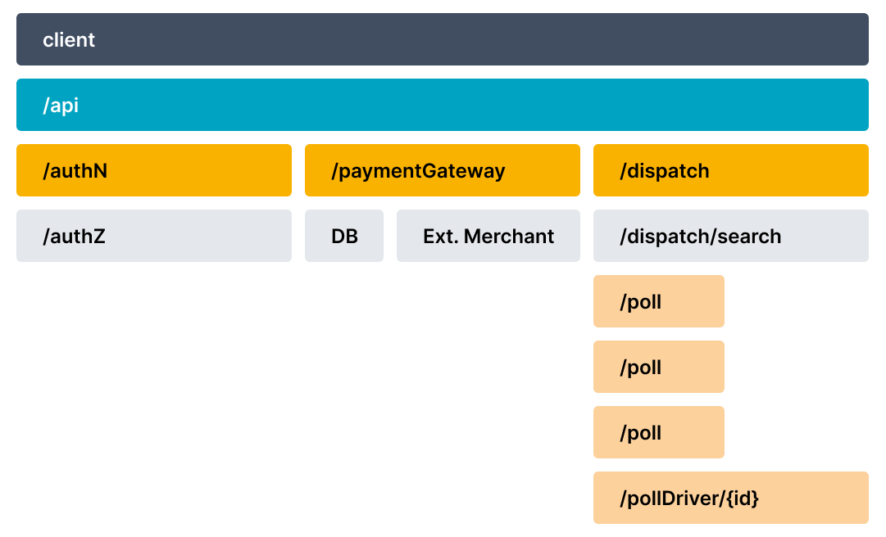

### 背景

&emsp;分散トレースは、一般的にトレースと呼ばれ、マイクロサービスやサーバーレスアプリケーションのようなマルチサービスアーキテクチャを通じて、アプリケーションやエンドユーザーによって行われたリクエストがどのように伝播するかを記録します。トレースがないと、分散システムのパフォーマンス問題の原因を特定するのは困難です。トレースは、アプリケーションやシステムの健康状態の可視性を向上させ、ローカルで再現が難しい動作をデバッグすることを可能にします。分散システムでは、非決定論的な問題が一般的であり、ローカルで再現するには複雑すぎるため、トレースは不可欠です。
&emsp;トレースは、分散システム内でリクエストがどのように流れるかを分解することで、デバッグや理解を容易にします。トレースは1つ以上のスパンで構成されます。最初のスパンはルートスパンを表します。各ルートスパンは、リクエストの開始から終了までを表します。親の下にあるスパンは、リクエスト中に何が起こるか（またはリクエストを構成するステップ）についての詳細なコンテキストを提供します。多くのオブザーバビリティバックエンドは、トレースをウォーターフォールダイアグラムとして視覚化し、次のような図になることがあります。



&emsp;ウォーターフォールダイアグラムは、ルートスパンとその子スパンの親子関係を示します。スパンが別のスパンをカプセル化するとき、これはネストされた関係も表します。
&emsp;最近、SR にトレースフレームワークが追加されました。これは、opentelemetry と jaeger を活用して、システム内の分散イベントをトレースします。

*   Opentelemetry は、インストルメンテーション/トレース SDK です。開発者はこれを使用してコードにインストルメントを追加し、オブザーバビリティバックエンドにトレースデータを送信できます。多くの言語をサポートしています。SR では java と CPP SDK を使用しています。
*   現在、Jaeger がオブザーバビリティバックエンドとして使用されています。

### 基本的な使用法

SR でトレースを有効にする手順:

1.  [Jaeger](https://www.jaegertracing.io/docs/1.31/getting-started) をインストールします。
    上記のガイドは docker を使用しています。簡単にするために、バイナリパッケージをダウンロードしてローカルで実行することもできます。`https://github.com/jaegertracing/jaeger/releases`

```
    decster@decster-MS-7C94:~/soft/jaeger-1.31.0-linux-amd64$ ll
    total 215836
    drwxr-xr-x  2 decster decster     4096 02-05 05:01:30 ./
    drwxrwxr-x 28 decster decster     4096 05-18 18:24:07 ../
    -rwxr-xr-x  1 decster decster 19323884 02-05 05:01:31 example-hotrod*
    -rwxr-xr-x  1 decster decster 23430444 02-05 05:01:29 jaeger-agent*
    -rwxr-xr-x  1 decster decster 51694774 02-05 05:01:29 jaeger-all-in-one*
    -rwxr-xr-x  1 decster decster 41273869 02-05 05:01:30 jaeger-collector*
    -rwxr-xr-x  1 decster decster 37576660 02-05 05:01:30 jaeger-ingester*
    -rwxr-xr-x  1 decster decster 47698843 02-05 05:01:30 jaeger-query*

    decster@decster-MS-7C94:~/soft/jaeger-1.31.0-linux-amd64$ ./jaeger-all-in-one 
```

2.  FE\&FE を設定してトレースを有効にします。
    現在、opentelemetry の java & cpp sdk は異なるプロトコルを使用しています。java は grpc proto を使用し、cpp は thrift\&UDP を使用しているため、エンドポイントポートが異なります。

```
    fe.conf

    # jaeger_tracing を有効にするには、jaeger_grpc_endpoint を設定します
    # jaeger_grpc_endpoint = http://localhost:14250


    be.conf

    # jaeger_tracing を有効にするには、jaeger_endpoint を設定します
    # jaeger_endpoint = localhost:6831
```

3.  jaeger の Web UI を開きます。通常は `http://localhost:16686/search` にあります。
4.  データ取り込み (streamload\/insert into) を行い、Web UI で TXN トレースを検索します。

(trace_pic2.png) 
(trace_pic3.png) 

### トレースの追加

*   トレースを追加するには、まずトレーサー、スパン、トレース伝播などの基本概念に慣れ、[observability primer](https://opentelemetry.io/docs/concepts/observability-primer) を読んでください。
*   SR のユーティリティクラスとその使用法を読みます: TraceManager.java(java) `common/tracer.h/cpp (cpp)`, 現在の使用法（例えば、write txn(load\/insert\/update\/delete) トレース、およびその BE への伝播）。
*   独自のトレースを追加します。