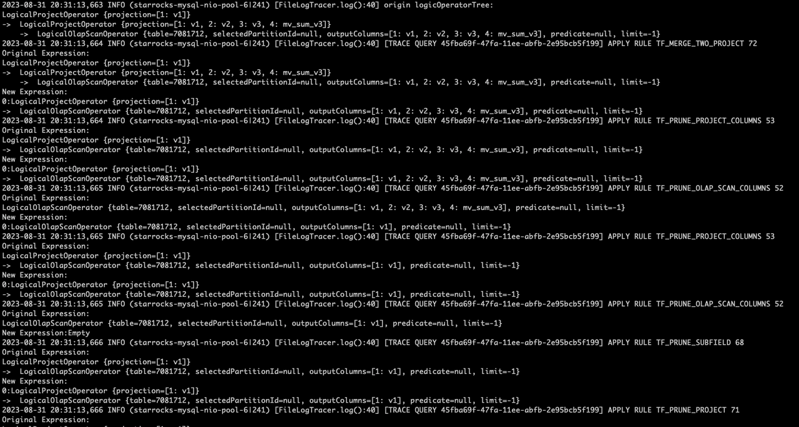

# Query Trace Profile

このトピックでは、クエリトレースプロファイルの取得と分析方法を紹介します。クエリトレースプロファイルは、指定されたクエリステートメントのデバッグ情報を記録し、時間コスト、変数と値、ログを含みます。この情報は複数のモジュールに分類されており、さまざまな観点からデバッグしてパフォーマンスのボトルネックを特定することができます。この機能は v3.2.0 以降でサポートされています。

## 構文

クエリのトレースプロファイルを取得するには、次の構文を使用します。

```SQL
TRACE { TIMES | VALUES | LOGS | ALL } [ <module> ] <query_statement>
```

- `TIMES`: 指定されたクエリの各ステージでのイベントの時間コストをトレースします。
- `VALUES`: 指定されたクエリの変数とその値をトレースします。
- `LOGS`: 指定されたクエリのログ記録をトレースします。
- `ALL`: `TIMES`、`VALUES`、`LOGS` の情報を時系列で一覧表示します。
- `<module>`: トレース情報を取得したいモジュール。 有効な値:
  - `BASE`: ベースモジュール。
  - `MV`: マテリアライズドビュー モジュール。
  - `OPTIMIZER`: オプティマイザーモジュール。
  - `SCHEDULE`: スケジュールモジュール。
  - `EXTERNAL`: 外部テーブル関連のモジュール。

  モジュールが指定されていない場合、`BASE` が使用されます。

- `<query_statement>`: クエリトレースプロファイルを取得したいクエリステートメント。

## 使用例

### クエリの時間コストをトレースする

次の例では、クエリのオプティマイザーモジュールの時間コストをトレースします。

```Plain
MySQL > TRACE TIMES OPTIMIZER SELECT * FROM t1 JOIN t2 ON t1.v1 = t2.v1;
+---------------------------------------------------------------------+
| Explain String                                                      |
+---------------------------------------------------------------------+
|  2ms|-- Total[1] 15ms                                               |
|  2ms|    -- Analyzer[1] 1ms                                         |
|  4ms|    -- Transformer[1] 1ms                                      |
|  6ms|    -- Optimizer[1] 11ms                                       |
|  6ms|        -- preprocessMvs[1] 0                                  |
|  6ms|        -- RuleBaseOptimize[1] 3ms                             |
|  6ms|            -- RewriteTreeTask[41] 2ms                         |
|  7ms|                -- PushDownJoinOnClauseRule[1] 0               |
|  7ms|                -- PushDownPredicateProjectRule[2] 0           |
|  7ms|                -- PushDownPredicateScanRule[2] 0              |
|  8ms|                -- MergeTwoProjectRule[3] 0                    |
|  8ms|                -- PushDownJoinOnExpressionToChildProject[1] 0 |
|  8ms|                -- PruneProjectColumnsRule[6] 0                |
|  8ms|                -- PruneJoinColumnsRule[2] 0                   |
|  8ms|                -- PruneScanColumnRule[4] 0                    |
|  9ms|                -- PruneSubfieldRule[2] 0                      |
|  9ms|                -- PruneProjectRule[6] 0                       |
|  9ms|                -- PartitionPruneRule[2] 0                     |
|  9ms|                -- DistributionPruneRule[2] 0                  |
|  9ms|                -- MergeProjectWithChildRule[3] 0              |
| 10ms|        -- CostBaseOptimize[1] 6ms                             |
| 10ms|            -- OptimizeGroupTask[6] 0                          |
| 10ms|            -- OptimizeExpressionTask[9] 0                     |
| 10ms|            -- ExploreGroupTask[4] 0                           |
| 10ms|            -- DeriveStatsTask[9] 3ms                          |
| 13ms|            -- ApplyRuleTask[16] 0                             |
| 13ms|                -- OnlyScanRule[2] 0                           |
| 14ms|                -- HashJoinImplementationRule[2] 0             |
| 14ms|            -- EnforceAndCostTask[12] 1ms                      |
| 14ms|                -- OlapScanImplementationRule[2] 0             |
| 15ms|                -- OnlyJoinRule[2] 0                           |
| 15ms|                -- JoinCommutativityRule[1] 0                  |
| 16ms|        -- PhysicalRewrite[1] 0                                |
| 17ms|        -- PlanValidate[1] 0                                   |
| 17ms|            -- InputDependenciesChecker[1] 0                   |
| 17ms|            -- TypeChecker[1] 0                                |
| 17ms|            -- CTEUniqueChecker[1] 0                           |
| 17ms|    -- ExecPlanBuild[1] 0                                      |
| Tracer Cost: 273us                                                  |
+---------------------------------------------------------------------+
39 rows in set (0.029 sec)
```

TRACE TIMES ステートメントによって返される **Explain String** では、各行（最後の行を除く）はクエリの指定されたモジュール（ステージ）でのイベントに対応しています。最後の行 `Tracer Cost` は、トレースプロセスの時間コストを記録します。

`|  4ms|    -- Transformer[1] 1ms` を例にとると：

- 左の列は、クエリのライフサイクル内でイベントが最初に実行された時間ポイントを記録します。
- 右の列では、連続するハイフンの後にイベントの名前が続きます。例えば、`Transformer`。
- イベント名の後の括弧内の数字 (`[1]`) は、イベントが実行された回数を示します。
- この列の最後の部分は、イベントの全体的な時間コストです。例えば、`1ms`。
- イベントの記録は、メソッドスタックの深さに基づいてインデントされています。つまり、この例では、`Transformer` の最初の実行は常に `Total` 内で発生します。

### クエリの変数をトレースする

次の例では、クエリの MV モジュールの変数と値をトレースします。

```Plain
MySQL > TRACE VALUES MV SELECT t1.v2, sum(t1.v3) FROM t1 JOIN t0 ON t1.v1 = t0.v1 GROUP BY t1.v2;
+----------------------------+
| Explain String             |
+----------------------------+
| 32ms| mv2: Rewrite Succeed |
| Tracer Cost: 66us          |
+----------------------------+
2 rows in set (0.045 sec)
```

TRACE VALUES ステートメントによって返される **Explain String** の構造は、TRACE TIMES ステートメントのそれに似ていますが、右の列には指定されたモジュールでのイベントの変数と設定が記録されています。上記の例では、マテリアライズドビューがクエリの書き換えに成功したことが記録されています。

### クエリのログをトレースする

次の例では、クエリの MV モジュールのログをトレースします。

```Plain
MySQL > TRACE LOGS MV SELECT v2, sum(v3) FROM t1 GROUP BY v2;
+-------------------------------------------------------------------------------------------------------------------------------------------------------------------------------+
| Explain String                                                                                                                                                                |
+-------------------------------------------------------------------------------------------------------------------------------------------------------------------------------+
|  3ms|    [MV TRACE] [PREPARE cac571e8-47f9-11ee-abfb-2e95bcb5f199][mv2] [SYNC=false] Prepare MV mv2 success                                                                   |
|  3ms|    [MV TRACE] [PREPARE cac571e8-47f9-11ee-abfb-2e95bcb5f199][GLOBAL] [SYNC=false] RelatedMVs: [mv2], CandidateMVs: [mv2]                                                |
|  4ms|    [MV TRACE] [PREPARE cac571e8-47f9-11ee-abfb-2e95bcb5f199][GLOBAL] [SYNC=true] There are no related mvs for the query plan                                            |
| 35ms|    [MV TRACE] [REWRITE cac571e8-47f9-11ee-abfb-2e95bcb5f199 TF_MV_AGGREGATE_SCAN_RULE mv2] Rewrite ViewDelta failed: cannot compensate query by using PK/FK constraints |
| 35ms|    [MV TRACE] [REWRITE cac571e8-47f9-11ee-abfb-2e95bcb5f199 TF_MV_ONLY_SCAN_RULE mv2] MV is not applicable: mv expression is not valid                                  |
| 43ms|    Query cannot be rewritten, please check the trace logs or `set enable_mv_optimizer_trace_log=on` to find more infos.                                                 |
| Tracer Cost: 400us                                                                                                                                                            |
+-------------------------------------------------------------------------------------------------------------------------------------------------------------------------------+
7 rows in set (0.056 sec)
```

また、次のように変数 `trace_log_mode` を設定することで、これらのログを FE ログファイル **fe.log** に出力することもできます。

```SQL
SET trace_log_mode='file';
```

`trace_log_mode` のデフォルト値は `command` で、上記のように **Explain String** としてログが返されます。値を `file` に設定すると、ログはクラス名が `FileLogTracer` である FE ログファイル **fe.log** に出力されます。

`trace_log_mode` を `file` に設定した後、TRACE LOGS ステートメントを実行してもログは返されません。

例:

```Plain
MySQL > TRACE LOGS OPTIMIZER  SELECT v1 FROM t1 ;
+---------------------+
| Explain String      |
+---------------------+
| Tracer Cost: 3422us |
+---------------------+
1 row in set (0.023 sec)
```

ログは **fe.log** に出力されます。

