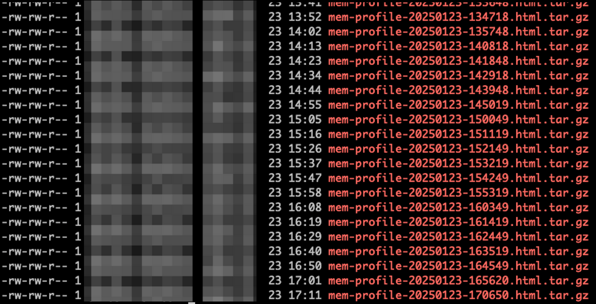
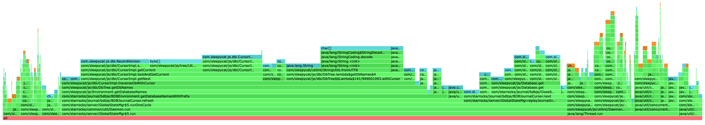

# FE ヒープメモリのトラブルシューティング

このトピックでは、StarRocks における FE ヒープメモリの問題をトラブルシューティングする方法について説明します。

## ヒープメモリ割り当ての急激な増加

StarRocks では、メモリプロファイル（またはメモリ割り当てプロファイル）を確認することで、ヒープメモリ割り当ての急激な増加を引き起こす問題を特定できます。バージョン v3.3.6 以降、StarRocks はディレクトリ **fe/log/proc_profile** に `.tgz` 形式の圧縮 HTML ファイルでメモリプロファイルを出力することをサポートしています。



メモリ問題が発生した時間に基づいて対応するファイルを見つけ、それを解凍してブラウザで開きます。ファイル内にはスタックメモリ割り当てのフレームグラフが表示されます。フレームが広いほど、そのスタックに割り当てられたメモリリソースが多いことを示しています。例えば、以下のフレームグラフでは、`BDBEnvironment.getDatabaseNamesWithPrefix` のフレーム幅がグラフの 50% を超えており、この関数にメモリリソースの半分以上が割り当てられていることを示しています。



急激な増加時にメモリプロファイルが出力されなかった場合、FE の設定ファイル **fe.conf** で以下の項目を設定し、FE を再起動することで、CPU プロファイルを手動で無効にし、プロファイルの印刷間隔を 5 分に設定できます。

```Properties
proc_profile_cpu_enable = false
proc_profile_collect_interval_s = 300
```

### バージョン v3.3.6 より前の回避策

バージョン v3.3.6 より前の場合、スクリプトを使用して定期的にメモリプロファイルを出力できます。

**fe** ディレクトリで次のシェルスクリプトを実行します。

```Bash
#!/bin/bash

mkdir -p mem_alloc_log

while true
do
    current_time=$(date +'%Y-%m-%d-%H-%M-%S')
    file_name="mem_alloc_log/alloc-profile-${current_time}.html"
    ./bin/profiler.sh -e alloc --alloc 2m -d 300 -f "$file_name" `cat bin/fe.pid`
done
```

## ヒープメモリ使用量の緩やかな増加

バージョン v3.3.7 以降、StarRocks はメモリリーク問題を追跡するための Memory Usage Tracker ログの出力をサポートしています。Memory Usage Tracker は各モジュールのメモリ使用量を定期的に記録します。

例:

```Plain
2025-02-05 19:35:23.287+08:00 INFO (MemoryUsageTracker|77) [MemoryUsageTracker.trackMemory():164] (0ms) Module Agent - AgentTaskTracker estimated 0B of memory. Contains AgentTask with 0 object(s).
2025-02-05 19:35:23.287+08:00 INFO (MemoryUsageTracker|77) [MemoryUsageTracker.trackMemory():164] (0ms) Module Backup - BackupHandler estimated 0B of memory. Contains BackupOrRestoreJob with 0 object(s).
2025-02-05 19:35:23.287+08:00 INFO (MemoryUsageTracker|77) [MemoryUsageTracker.trackMemory():164] (0ms) Module Compaction - CompactionMgr estimated 0B of memory. Contains PartitionStats with 0 object(s).
2025-02-05 19:35:23.287+08:00 INFO (MemoryUsageTracker|77) [MemoryUsageTracker.trackMemory():164] (0ms) Module Coordinator - QeProcessorImpl estimated 0B of memory. Contains QueryCoordinator with 0 object(s).
2025-02-05 19:35:23.287+08:00 INFO (MemoryUsageTracker|77) [MemoryUsageTracker.trackMemory():164] (0ms) Module Delete - DeleteMgrEPack estimated 0B of memory. Contains DeleteInfo with 0 object(s). DeleteJob with 0 object(s).
2025-02-05 19:35:23.287+08:00 INFO (MemoryUsageTracker|77) [MemoryUsageTracker.trackMemory():164] (0ms) Module Dict - CacheDictManager estimated 0B of memory. Contains ColumnDict with 0 object(s).
2025-02-05 19:35:23.287+08:00 INFO (MemoryUsageTracker|77) [MemoryUsageTracker.trackMemory():164] (0ms) Module Export - ExportMgr estimated 0B of memory. Contains ExportJob with 0 object(s).
2025-02-05 19:35:23.287+08:00 INFO (MemoryUsageTracker|77) [MemoryUsageTracker.trackMemory():164] (0ms) Module Load - InsertOverwriteJobMgr estimated 0B of memory. Contains insertOverwriteJobs with 0 object(s).
2025-02-05 19:35:23.287+08:00 INFO (MemoryUsageTracker|77) [MemoryUsageTracker.trackMemory():164] (0ms) Module Load - LoadMgrEPack estimated 245.7KB of memory. Contains LoadJob with 1165 object(s).
2025-02-05 19:35:23.287+08:00 INFO (MemoryUsageTracker|77) [MemoryUsageTracker.trackMemory():164] (0ms) Module Load - RoutineLoadMgrEPack estimated 0B of memory. Contains RoutineLoad with 0 object(s).
2025-02-05 19:35:23.287+08:00 INFO (MemoryUsageTracker|77) [MemoryUsageTracker.trackMemory():164] (0ms) Module Load - StreamLoadMgrEPack estimated 0B of memory. Contains StreamLoad with 0 object(s).
2025-02-05 19:35:23.287+08:00 INFO (MemoryUsageTracker|77) [MemoryUsageTracker.trackMemory():164] (0ms) Module LocalMetastore - LocalMetastore estimated 7KB of memory. Contains Partition with 45 object(s).
2025-02-05 19:35:23.287+08:00 INFO (MemoryUsageTracker|77) [MemoryUsageTracker.trackMemory():164] (0ms) Module MV - MVTimelinessMgr estimated 0B of memory. Contains mvTimelinessMap with 0 object(s).
2025-02-05 19:35:23.287+08:00 INFO (MemoryUsageTracker|77) [MemoryUsageTracker.trackMemory():164] (0ms) Module Profile - ProfileManager estimated 96B of memory. Contains QueryProfile with 4 object(s).
2025-02-05 19:35:23.287+08:00 INFO (MemoryUsageTracker|77) [MemoryUsageTracker.trackMemory():164] (0ms) Module Query - QueryTracker estimated 0B of memory. Contains QueryDetail with 0 object(s).
2025-02-05 19:35:23.287+08:00 INFO (MemoryUsageTracker|77) [MemoryUsageTracker.trackMemory():164] (0ms) Module Report - ReportHandler estimated 0B of memory. Contains PendingTask with 0 object(s). ReportQueue with 0 object(s).
2025-02-05 19:35:23.287+08:00 INFO (MemoryUsageTracker|77) [MemoryUsageTracker.trackMemory():164] (0ms) Module Statistics - CachedStatisticStorage estimated 0B of memory. Contains TableStats with 0 object(s). ColumnStats with 0 object(s). PartitionStats with 0 object(s). HistogramStats with 0 object(s). ConnectorTableStats with 0 object(s). ConnectorHistogramStats with 0 object(s).
2025-02-05 19:35:23.287+08:00 INFO (MemoryUsageTracker|77) [MemoryUsageTracker.trackMemory():164] (0ms) Module TabletInvertedIndex - TabletInvertedIndex estimated 49.8KB of memory. Contains TabletMeta with 208 object(s). TabletCount with 208 object(s). ReplicateCount with 216 object(s).
2025-02-05 19:35:23.287+08:00 INFO (MemoryUsageTracker|77) [MemoryUsageTracker.trackMemory():164] (0ms) Module Task - TaskManager estimated 0B of memory. Contains Task with 0 object(s).
2025-02-05 19:35:23.287+08:00 INFO (MemoryUsageTracker|77) [MemoryUsageTracker.trackMemory():164] (0ms) Module Task - TaskRunManager estimated 0B of memory. Contains PendingTaskRun with 0 object(s). RunningTaskRun with 0 object(s). HistoryTaskRun with 0 object(s).
2025-02-05 19:35:23.287+08:00 INFO (MemoryUsageTracker|77) [MemoryUsageTracker.trackMemory():164] (0ms) Module Transaction - GlobalTransactionMgr estimated 311.4KB of memory. Contains Txn with 1329 object(s). TxnCallbackCount with 0 object(s).
2025-02-05 19:35:23.288+08:00 INFO (MemoryUsageTracker|77) [MemoryUsageTracker.trackMemory():111] total tracked memory: 614.2KB, jvm: Process used: 672MB, heap used: 299.9MB, non heap used: 170MB, direct buffer used: 4.2MB
```