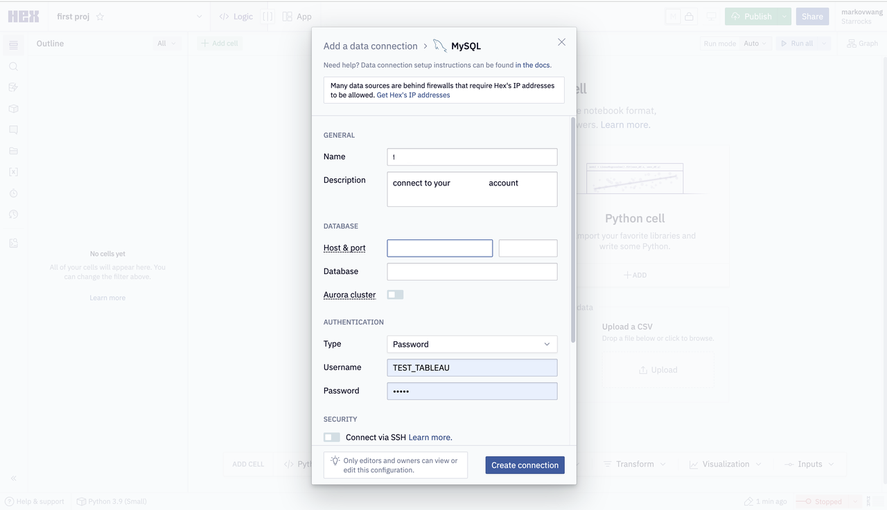

# Hex

Hex は、StarRocks 内部データと外部データの両方をクエリおよび可視化することをサポートしています。

Hex にデータ接続を追加します。接続タイプとして MySQL を選択する必要があることに注意してください。

設定が必要なパラメータは次のとおりです。

- **Name**: データ接続の名前。
- **Host & port**: StarRocks クラスターの FE ホスト IP アドレスと FE クエリポート。クエリポートの例は `9030` です。
- **Database**: StarRocks クラスターでアクセスしたいデータソース。このパラメータの値は `<catalog_name>.<database_name>` 形式です。
  - `catalog_name`: StarRocks クラスター内のターゲット catalog の名前。内部および外部 catalog の両方がサポートされています。
  - `database_name`: StarRocks クラスター内のターゲットデータベースの名前。内部および外部データベースの両方がサポートされています。
- **Type**: 使用したい認証方法。**Password** を選択します。
- **User**: StarRocks クラスターにログインするために使用されるユーザー名。例えば、`admin`。
- **Password**: StarRocks クラスターにログインするために使用されるパスワード。