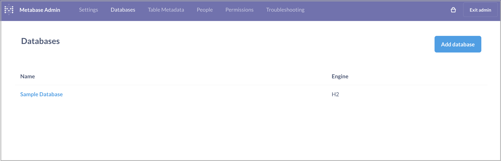

# Metabase

Metabase は、StarRocks 内部データと外部データの両方のクエリと可視化をサポートしています。

Metabase を起動し、次の手順に従ってください。

1. Metabase ホームページの右上隅にある **Settings** アイコンをクリックし、**Admin settings** を選択します。

   

2. 上部メニューバーで **Databases** を選択します。

3. **Databases** ページで、**Add database** をクリックします。

   

4. 表示されるページで、データベースパラメータを設定し、**Save** をクリックします。

   - **Database type**: **MySQL** を選択します。
   - **Host** と **Port**: 使用ケースに適したホストとポート情報を入力します。
   - **Database name**: `<catalog_name>.<database_name>` 形式でデータベース名を入力します。StarRocks の v3.2 より前のバージョンでは、StarRocks クラスターの内部 catalog のみを Metabase と統合できます。StarRocks v3.2 以降では、StarRocks クラスターの内部 catalog と external catalog の両方を Metabase と統合できます。
   - **Username** と **Password**: StarRocks クラスターのユーザー名とパスワードを入力します。
   - **Additional JDBC connection string options**: このフィールドに `tinyInt1isBit=false` プロパティを追加する必要があります。そうしないと、エラーが発生する可能性があります。

   他のパラメータは StarRocks に関係しません。ビジネスニーズに基づいて設定してください。

   

NOTE: Metabase はこの StarRocks 固有のカラムデータ型を理解しないため、DECIMAL データ型の使用は避けてください。