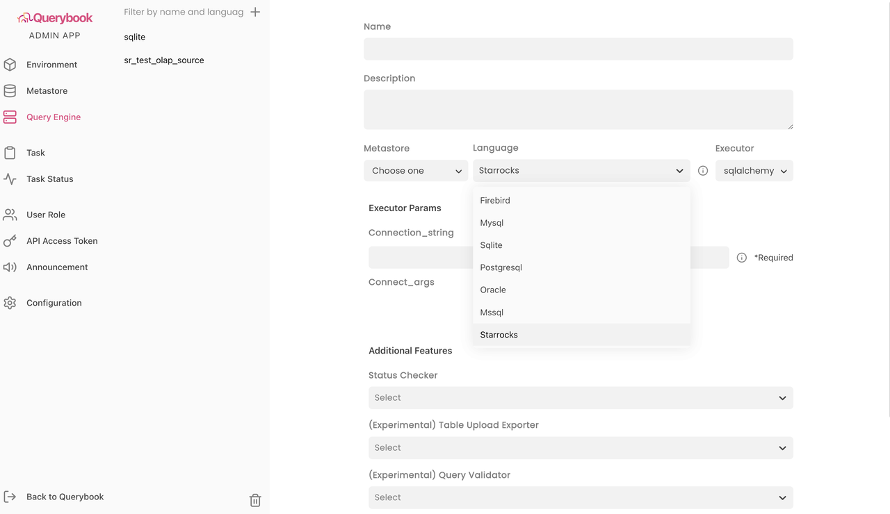

# Querybook

Querybook は、StarRocks 内部データと外部データの両方をクエリし、可視化することをサポートしています。

## 前提条件

次の準備を完了していることを確認してください。

1. Querybook リポジトリをクローンしてダウンロードします。

   ```SQL
   git clone git@github.com:pinterest/querybook.git
   cd querybook
   ```

2. プロジェクトのルートディレクトリにある `requirements` フォルダに `local.txt` という名前のファイルを作成します。

   ```SQL
   touch requirements/local.txt
   ```

3. 必要なパッケージを追加します。

   ```SQL
   echo -e "starrocks\nmysqlclient" > requirements/local.txt 
   ```

4. コンテナを起動します。

   ```SQL
   make
   ```

## 統合

次の URL にアクセスして、新しいクエリエンジンを追加します。

```Plain
https://localhost:10001/admin/query_engine/
```



次の点に注意してください。

- **Language** には **Starrocks** を選択します。
- **Executor** には **sqlalchemy** を選択します。
- **Connection_string** には、以下の StarRocks SQLAlchemy URI 形式の URI を入力します。

  ```SQL
  starrocks://<User>:<Password>@<Host>:<Port>/<Catalog>.<Database>
  ```

  URI 内のパラメータは次のように説明されています。

  - `User`: StarRocks クラスターにログインするために使用されるユーザー名。例: `admin`。
  - `Password`: StarRocks クラスターにログインするために使用されるパスワード。
  - `Host`: StarRocks クラスターの FE ホスト IP アドレス。
  - `Port`: StarRocks クラスターの FE クエリポート。例: `9030`。
  - `Catalog`: StarRocks クラスター内のターゲット catalog。内部および外部 catalog の両方がサポートされています。
  - `Database`: StarRocks クラスター内のターゲットデータベース。内部および外部データベースの両方がサポートされています。