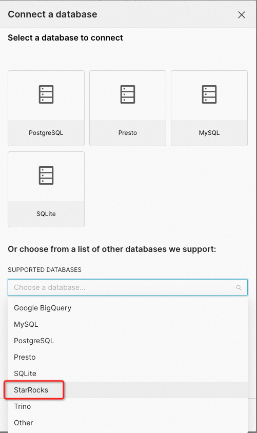
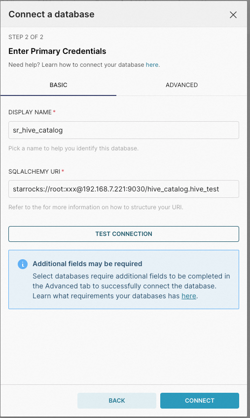

# Apache Superset

Apache Superset は、StarRocks の内部データと外部データの両方をクエリし、可視化することをサポートしています。

## 前提条件

以下のインストールを完了していることを確認してください。

1. Apache Superset サーバーに StarRocks 用の Python クライアントをインストールします。

   ```SQL
   pip install starrocks
   ```

2. 最新バージョンの Apache Superset をインストールします。詳細については、[Installing Superset](https://superset.apache.org/docs/intro) を参照してください。

## 統合

Apache Superset でデータベースを作成します。





次の点に注意してください。

- **SUPPORTED DATABASES** には、データソースとして使用する **StarRocks** を選択します。
- **SQLALCHEMY** **URI** には、以下のように StarRocks SQLAlchemy URI 形式で URI を入力します。

  ```SQL
  starrocks://<User>:<Password>@<Host>:<Port>/<Catalog>.<Database>
  ```

  URI のパラメータは次の通りです。

  - `User`: StarRocks クラスターにログインするためのユーザー名、例: `admin`
  - `Password`: StarRocks クラスターにログインするためのパスワード
  - `Host`: StarRocks クラスターの FE ホスト IP アドレス
  - `Port`: StarRocks クラスターの FE クエリポート、例: `9030`
  - `Catalog`: StarRocks クラスター内のターゲット catalog。内部および external catalog の両方がサポートされています。
  - `Database`: StarRocks クラスター内のターゲットデータベース。内部および外部データベースの両方がサポートされています。