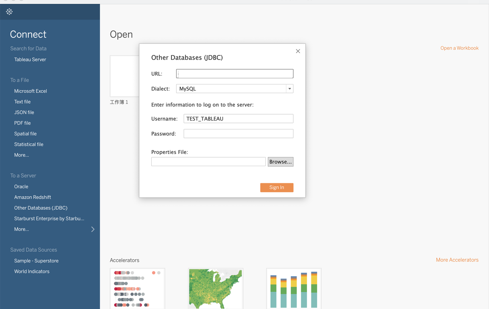

# Tableau Desktop

Tableau Desktop は、StarRocks 内部データと外部データの両方のクエリと可視化をサポートしています。

Tableau Desktop でデータベースを作成する:



次の点に注意してください:

- データソースとして **Other Databases(****JDBC****)** を選択します。
- **Dialect** には **MySQL** を選択します。
- **URL** には、以下の MySQL URI 形式の URL を入力します:

  ```SQL
  jdbc:mysql://<Host>:<Port>/<Catalog>.<Databases>
  ```

  URL 内のパラメータは次のように説明されています:

  - `Host`: StarRocks クラスターの FE ホスト IP アドレス。
  - `Port`: StarRocks クラスターの FE クエリポート。例えば、`9030`。
  - `Catalog`: StarRocks クラスター内のターゲット catalog。内部および外部 catalog の両方がサポートされています。
  - `Database`: StarRocks クラスター内のターゲットデータベース。内部および外部データベースの両方がサポートされています。
- **Username** と **Password** を設定します。
  - **Username**: StarRocks クラスターにログインするためのユーザー名。例えば、`admin`。
  - **Password**: StarRocks クラスターにログインするためのパスワード。