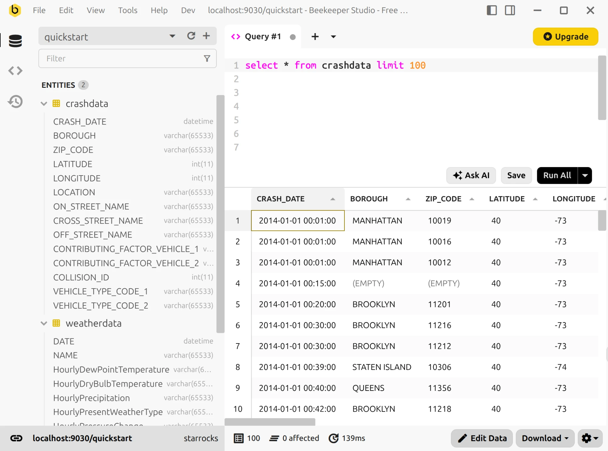
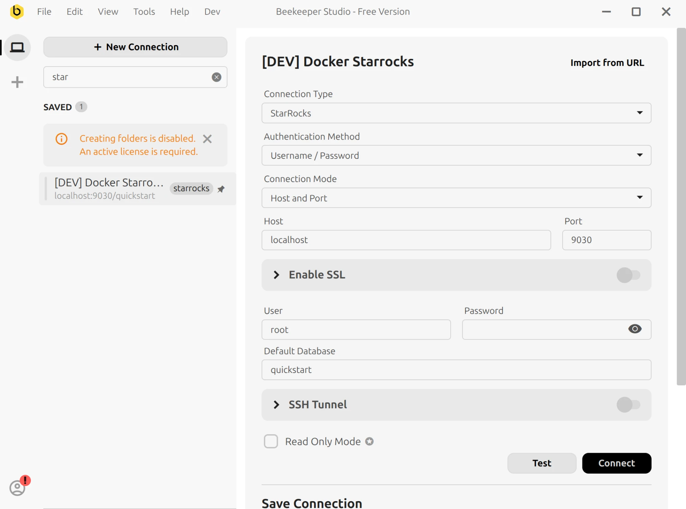

# Beekeeper Studio

Beekeeper Studio は、Windows、macOS、Linux に対応した[オープンソース](https://github.com/beekeeper-studio/beekeeper-studio)でクロスプラットフォームの SQL エディタおよびデータベース管理ツールであり、ネイティブの StarRocks ドライバーを搭載しています。

Beekeeper Studio は、アプリ内のプレミアム機能の販売によって運営されている独立系ソフトウェア企業です。トラッキングは一切行わず、使いやすさを重視しています。

StarRocks のサポートは Beekeeper Studio の無償のコミュニティエディションに含まれているため、他のサポート対象データベースと同じように、無料でスキーマの参照やクエリの実行を StarRocks に対して行えます。

## 前提条件

Beekeeper Studio 6.0 以降がインストールされていることを確認してください。
Beekeeper Studio は [公式サイト](https://www.beekeeperstudio.io/get) からダウンロードできます。

## 使い方

StarRocks に接続するには、以下の手順に従ってください：

1. Beekeeper Studio を起動します。

2. 接続画面の **Connection Type** ドロップダウンリストから **StarRocks** を選択します。

   

3. 以下の接続設定を構成します：

   - **Host**：StarRocks クラスターの FE ホスト IP アドレス。
   - **Port**：StarRocks クラスターの FE クエリポート。例：`9030`。
   - **User**：StarRocks クラスターへのログインに使用するユーザー名。例：`admin`。
   - **Password**：StarRocks クラスターへのログインに使用するパスワード。
   - **Default Database**：（オプション）接続後にデフォルトで使用するデータベース。

4. **Test** をクリックして接続設定の正確さを確認し、**Connect** をクリックします。**Save Connection** で接続に名前を付けて保存しておくと、後で再利用できます。

5. 接続が確立されると、左側のサイドバーでデータベースとテーブルを参照し、SQL エディタでクエリを作成・実行できます。

   
