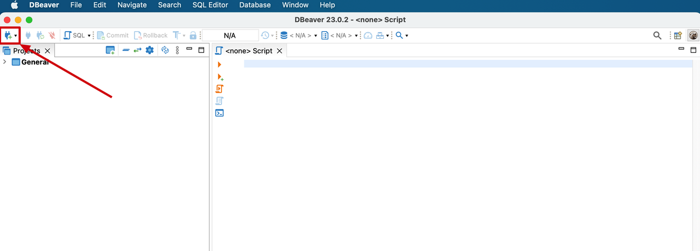
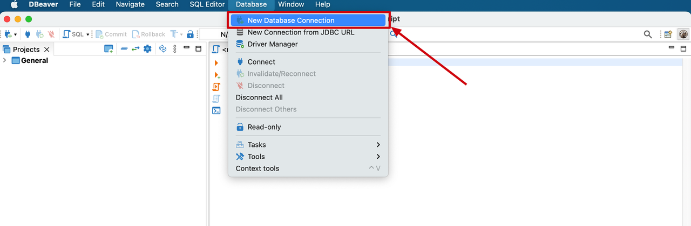
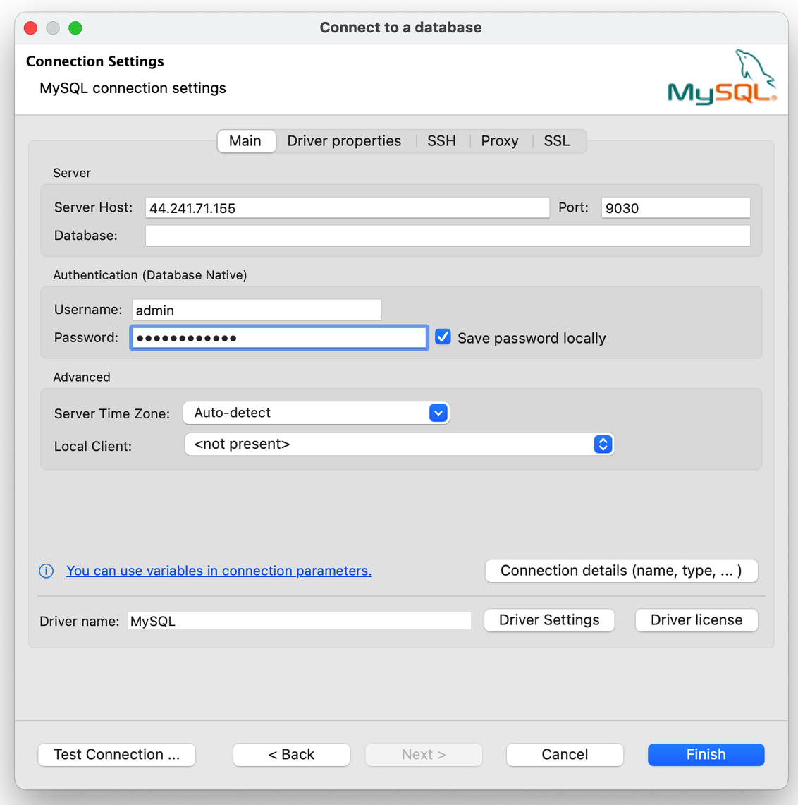
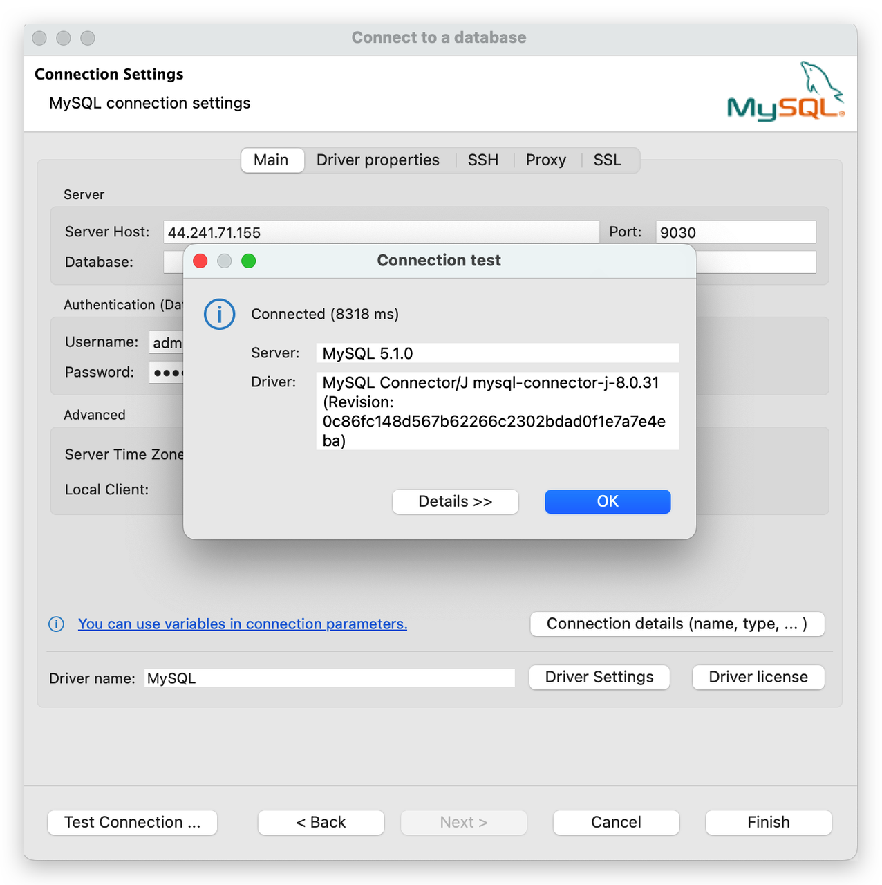
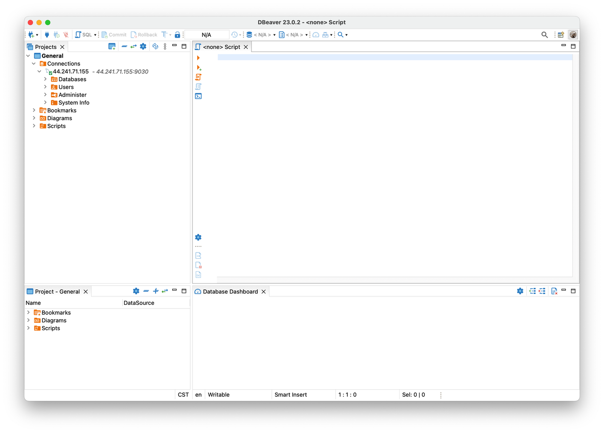

# DBeaver

DBeaver は SQL クライアントソフトウェアアプリケーションであり、データベース管理ツールです。データベースへの接続プロセスを案内する便利なアシスタントを提供します。

## 前提条件

DBeaver がインストールされていることを確認してください。

DBeaver Community エディションは [https://dbeaver.io](https://dbeaver.io/) から、DBeaver PRO エディションは [https://dbeaver.com](https://dbeaver.com/) からダウンロードできます。

## 統合

データベースに接続するために次の手順に従ってください。

1. DBeaver を起動します。

2. DBeaver ウィンドウの左上隅にあるプラス記号 (**+**) アイコンをクリックするか、メニューバーで **Database** > **New Database Connection** を選択してアシスタントにアクセスします。

   

   

3. MySQL ドライバーを選択します。

   **Select your database** ステップでは、利用可能なドライバーのリストが表示されます。左側のペインで **Analytical** をクリックして MySQL ドライバーをすばやく見つけます。その後、**MySQL** アイコンをダブルクリックします。

   

4. データベースへの接続を設定します。

   **Connection Settings** ステップで、**Main** タブに移動し、以下の基本的な接続設定を構成します。

   - **Server Host**: StarRocks クラスターの FE ホスト IP アドレス。
   - **Port**: StarRocks クラスターの FE クエリポート、例: `9030`。
   - **Database**: StarRocks クラスター内のターゲットデータベース。内部データベースと external catalog の両方がサポートされていますが、external catalog の機能は不完全な場合があります。
   - **Username**: StarRocks クラスターにログインするために使用されるユーザー名、例: `admin`。
   - **Password**: StarRocks クラスターにログインするために使用されるパスワード。

   

   必要に応じて、**Driver properties** タブで MySQL ドライバーのプロパティを表示および編集することもできます。特定のプロパティを編集するには、そのプロパティの **Value** 列の行をクリックします。

   

5. データベースへの接続をテストします。

   **Test Connection** をクリックして、接続設定の正確性を確認します。MySQL ドライバーの情報を表示するダイアログボックスが表示されます。ダイアログボックスで **OK** をクリックして情報を確認します。接続設定が正常に構成されたら、**Finish** をクリックしてプロセスを完了します。

   

6. データベースに接続します。

   接続が確立されると、左側のデータベース接続ツリーに表示され、DBeaver はデータベースに効果的に接続できます。

   