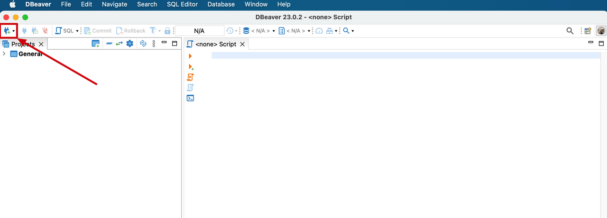
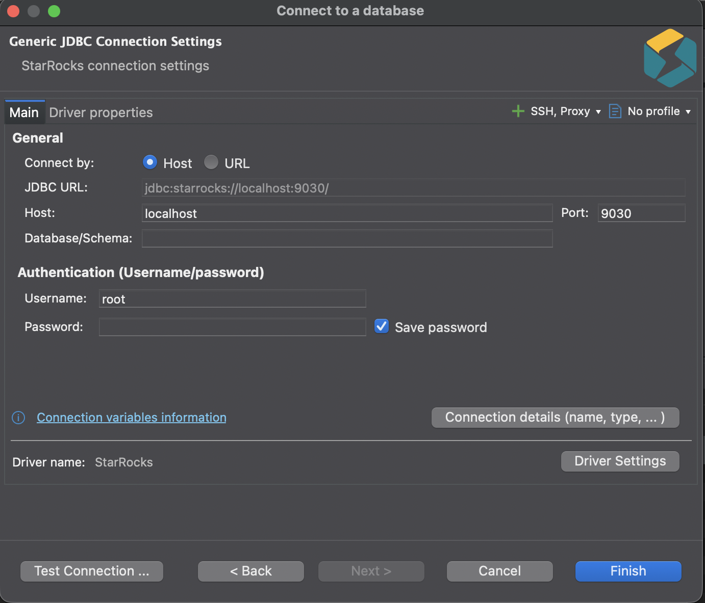
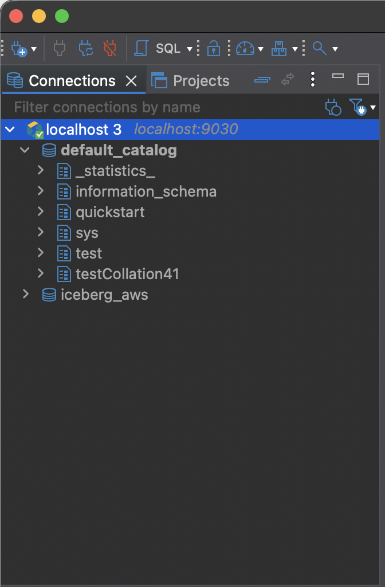

# DBeaver

DBeaverはSQLクライアントソフトウェアアプリケーションおよびデータベース管理ツールであり、データベースへの接続プロセスをガイドする便利なアシスタントを提供します。

## 前提条件

DBeaverがインストールされていることを確認してください。

DBeaver Communityエディションは[https://dbeaver.io](https://dbeaver.io/)から、DBeaver PROエディションは[https://dbeaver.com](https://dbeaver.com/)からダウンロードできます。

## インテグレーション

データベースに接続するには、以下の手順に従ってください：

1. DBeaverを起動します。

2. DBeaverウィンドウの左上隅にあるプラス記号（**+**）アイコンをクリックするか、メニューバーで**データベース** > **新しいデータベース接続**を選択してアシスタントにアクセスします。

   

   

3. StarRocksドライバーを選択します。

   **データベースを選択**ステップでは、利用可能なドライバーの一覧が表示されます。検索バーで**StarRocks**を検索するか、左側のペインで**分析**をクリックして見つけてください。次に、**StarRocks**アイコンをダブルクリックします。

   :::note
   お使いのDBeaverのバージョンにStarRocksドライバーが含まれていない場合は、代替として**MySQL**ドライバーを使用できます。
   :::

   

4. データベースへの接続を設定します。

   **接続設定**ステップで、**メイン**タブに移動し、以下の必須接続設定を構成します：

   - **ホスト**：StarRocksクラスターのFEホストIPアドレス。
   - **ポート**：StarRocks クラスターの FE クエリポート。例：`9030`。
   - **データベース/スキーマ**：StarRocks クラスターのターゲットデータベース。
   - **ユーザー名**：StarRocks クラスターへのログインに使用するユーザー名。例：`admin`。
   - **パスワード**：StarRocks クラスターへのログインに使用するパスワード。

   :::note
   DBeaver 26.0.5 以降、StarRocks ドライバーを使用する際にマルチカタログブラウジングがサポートされており、データベースを指定せずにクラスター内のすべてのカタログを参照できます。
   :::

   

   必要に応じて、**ドライバープロパティ**タブで StarRocks ドライバーのプロパティを表示・編集することもできます。特定のプロパティを編集するには、そのプロパティの**値**列の行をクリックしてください。

   

5. データベースへの接続をテストします。

   **接続のテスト**をクリックして接続設定の正確さを確認します。StarRocks ドライバーの情報を表示するダイアログボックスが表示されます。ダイアログボックスの**OK**をクリックして情報を確認します。接続設定が正常に構成されたら、**完了**をクリックしてプロセスを完了します。

   

6. データベースに接続します。

   接続が確立されると、左側のデータベース接続ツリーで確認でき、DBeaver はデータベースに効果的に接続できます。

   
