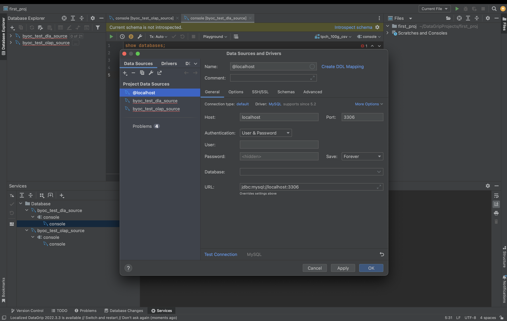

# DataGrip

DataGrip は、StarRocks 内部データと外部データの両方のクエリをサポートしています。

DataGrip でデータソースを作成します。データソースとして MySQL を選択する必要があることに注意してください。

設定が必要なパラメータは次のとおりです:

- **Host**: StarRocks クラスターの FE ホスト IP アドレス。
- **Port**: StarRocks クラスターの FE クエリポート。例えば、`9030`。
- **Authentication**: 使用したい認証方法を選択します。**Username & Password** を選択してください。
- **User**: StarRocks クラスターにログインするためのユーザー名。例えば、`admin`。
- **Password**: StarRocks クラスターにログインするためのパスワード。
- **Database**: StarRocks クラスター内でアクセスしたいデータソース。このパラメータの値は `<catalog_name>.<database_name>` 形式です。
  - `catalog_name`: StarRocks クラスター内のターゲット catalog の名前。内部および外部 catalog の両方がサポートされています。
  - `database_name`: StarRocks クラスター内のターゲットデータベースの名前。内部および外部データベースの両方がサポートされています。