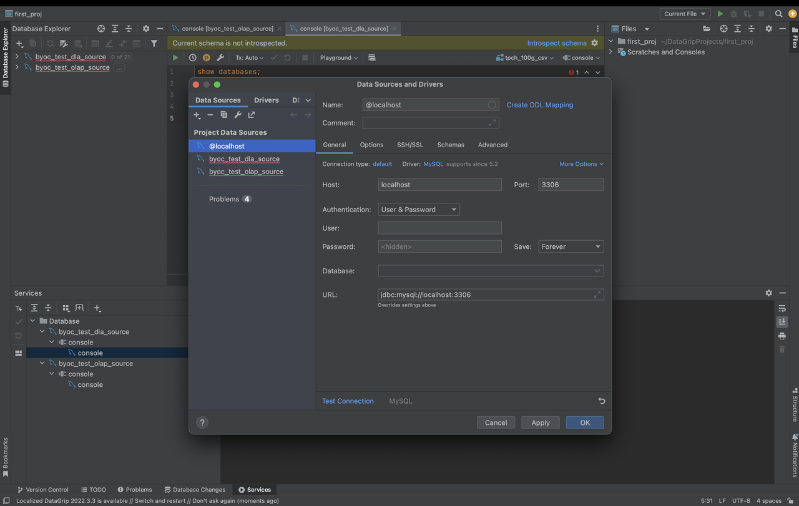

# データグリップ

データグリップは、StarRocksの内部データと外部データの両方のクエリをサポートしています。

:::tip
[データグリップ ドキュメント](https://www.jetbrains.com/help/datagrip/getting-started.html)
:::

データグリップからStarRocksに接続するには、ネイティブのStarRocks JDBCドライバー（推奨）またはMySQLドライバーを使用できます。

## StarRocks JDBCドライバーを使用して接続する（推奨）

StarRocks JDBCドライバーは正確なメタデータ検出を提供し、データグリップでのスキーマブラウジング、オートコンプリート、テーブルイントロスペクションを可能にします。

### 前提条件

StarRocks JDBCドライバーのJARをダウンロードします。[StarRocks JDBCドライバー](../JDBC_driver.md)でダウンロード手順を参照してください。

### 手順

1. データグリップで、**ファイル**>**データソース**（または**データベース**ツールバーのアイコンをクリックします）。

2. **+**をクリックし、**ドライバーとデータソース**を選択します。

3. **ドライバー**タブで、**+**をクリックして新しいドライバーを作成します。

   - **名前**を `StarRocks` に設定します。
   - **ドライバーファイル**の下で、**+**をクリックし、ダウンロードしたStarRocks JDBCドライバーのJARを追加します。
   - **クラス**を `com.starrocks.cj.jdbc.Driver` に設定します。
   - を設定します。**URLテンプレート**のいずれかに設定します。
     ```
     jdbc:starrocks://{host}:{port}
     jdbc:starrocks://{host}:{port}/{database}
     ```
   - クリック**OK**してドライバーを保存します。

   

4. に戻り、**データソース**タブで、**＋**をクリックし、**StarRocks**ドライバーを選択します。

5. 接続設定を構成します。

   - **ホスト**: StarRocksクラスターのFEホストIPアドレス。
   - **ポート**: StarRocksクラスターのFEクエリポート。例: `9030`。
   - **データベース**: 接続するデータベース。形式は`[{catalog_name}.]{database_name}`。内部および外部カタログの両方がサポートされています。カタログが省略された場合、`default_catalog`が使用されます。
     - `catalog_name`: StarRocksクラスター内のターゲットカタログの名前。
     - `database_name`: StarRocksクラスター内のターゲットデータベースの名前。
   - **ユーザー**: StarRocksクラスターにログインするためのユーザー名。例: `admin`。
   - **パスワード**: StarRocksクラスターにログインするためのパスワード。

6. クリック**接続テスト**して設定を確認し、次に**OK**をクリックします。

:::note
接続後、DataGripはデータベースリストのみをロードします。テーブルは、サイドバーでデータベースを右クリックして**更新**を選択するまでフェッチされません。これは予期された動作です。
:::

### サイドバーでカタログとデータベースを参照する

接続後、左サイドバーに表示される内容を制御する方法は2つあります。

**オプション1 — URLを使用して1つのカタログ/データベースに直接スコープを設定する（最も簡単）**

を編集して、**URL**フィールドに、上記のヒントに示すように`catalog.database`を含めます。DataGripは、追加の設定なしで、そのカタログとデータベースをサイドバーにすぐに表示します。

**オプション2 — データソースのプロパティでスキーマを選択する（複数のカタログ/データベース）**

1. データソースをダブルクリックする（または右クリック > **プロパティ**）。
2. **スキーマ**タブに移動します。
3. サイドバーに表示したいカタログとデータベースをチェックします。
4. **OK**をクリックします。DataGripが更新され、選択内容が表示されます。

## MySQLドライバーを使用して接続する

MySQLドライバーは、StarRocks JDBCドライバーのフォールバックです。

DataGripでデータソースを作成します。データソースとしてMySQLを選択する必要があることに注意してください。




設定する必要があるパラメーターは次のとおりです。

- **ホスト**：StarRocksクラスターのFEホストIPアドレス。
- **ポート**：StarRocksクラスターのFEクエリポート。例: `9030`。
- **認証**：使用したい認証方法。**ユーザー名とパスワード**を選択します。
- **ユーザー**：StarRocksクラスターにログインするために使用されるユーザー名。例: `admin`。
- **パスワード**：StarRocksクラスターにログインするために使用されるパスワード。
- **データベース**：StarRocksクラスターでアクセスしたいデータソース。このパラメーターの値は`<catalog_name>.<database_name>`形式です。
  - `catalog_name`：StarRocksクラスター内のターゲットカタログの名前。内部カタログと外部カタログの両方がサポートされています。
  - `database_name`：StarRocksクラスター内のターゲットデータベースの名前。内部データベースと外部データベースの両方がサポートされています。
