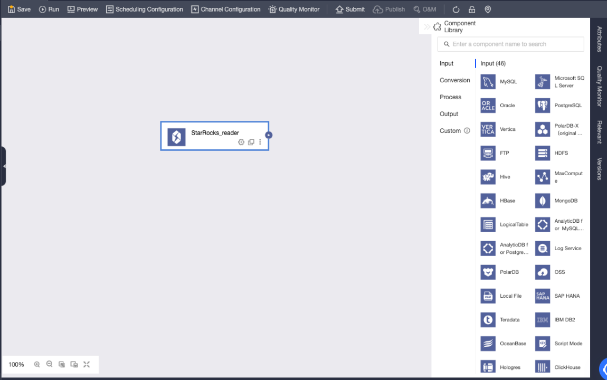
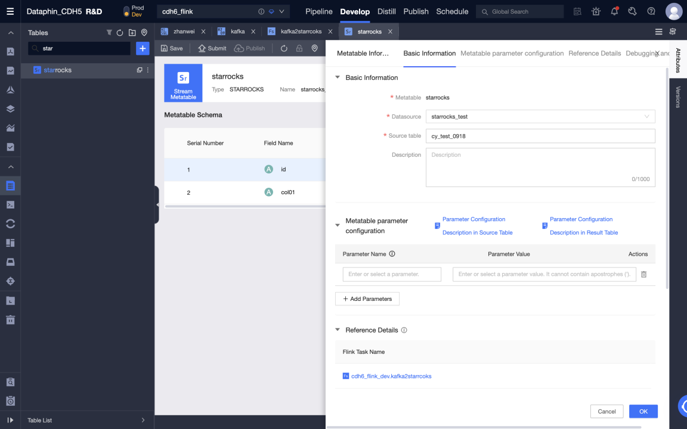
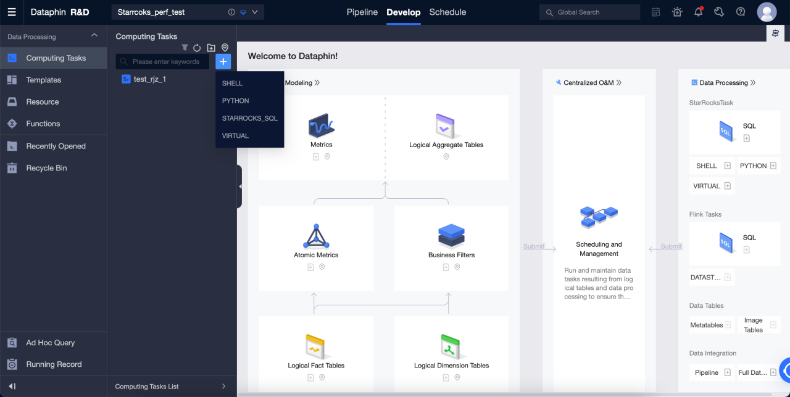

# Dataphin

Dataphin は、Alibaba Group の OneData データガバナンス手法の内部実践をクラウドベースで提供するものです。データ統合、構築、管理、利用のワンストップソリューションを提供し、ビッグデータのライフサイクル全体を通じて企業がデータガバナンスのレベルを大幅に向上させ、高品質で信頼性が高く、便利に消費でき、安全で経済的な生産を実現する企業レベルのデータミドルプラットフォームを構築することを目指しています。Dataphin は、さまざまなコンピューティングプラットフォームのサポートとスケーラブルなオープン機能を提供し、さまざまな業界の企業のプラットフォーム技術アーキテクチャと特定の要件を満たします。

Dataphin と StarRocks を統合する方法はいくつかあります。

- データ統合のソースまたはデスティネーションデータソースとして。StarRocks からデータを読み取り、他のデータソースにプッシュすることも、他のデータソースからデータをプルして StarRocks に書き込むこともできます。

- Flink SQL とデータストリーム開発のソーステーブル（無制限スキャン）、ディメンションテーブル（制限付きスキャン）、または結果テーブル（ストリーミングシンクおよびバッチシンク）として。

- データウェアハウスまたはデータマートとして。StarRocks はコンピュートソースとして登録でき、SQL スクリプトの開発、スケジューリング、データ品質検出、セキュリティ識別、その他のデータ調査およびガバナンスタスクに使用できます。

## データ統合

StarRocks データソースを作成し、オフライン統合タスクでソースデータベースまたはデスティネーションデータベースとして使用できます。手順は以下の通りです。

### StarRocks データソースを作成する

#### 基本情報

- **Name**: 必須。データソース名を入力します。中国語の文字、アルファベット、数字、アンダースコア (_)、ハイフン (-) のみを含むことができます。64 文字を超えることはできません。

- **Data source code**: 任意。データソースコードを設定した後、データソース内の Flink SQL を参照するために `data source code.table` または `data source code.schema.table` 形式を使用できます。対応する環境でデータソースに自動的にアクセスする場合は、`${data source code}.table` または `${data source code}.schema.table` 形式のアクセスを使用します。

  > **NOTE**
  >
  > 現在、MySQL、Hologres、MaxCompute データソースのみがサポートされています。

- **Support scenerios**: データソースが適用されるシナリオ。

- **Description**: 任意。データソースの簡単な説明を入力できます。最大 128 文字まで許可されます。

- **Environment**: ビジネスデータソースがプロダクションデータソースと開発データソースを区別する場合は、**Prod and Dev** を選択します。ビジネスデータソースがプロダクションと開発データソースを区別しない場合は、**Prod** を選択します。

- **Tags**: データソースにラベルを付けるためのタグを選択できます。

#### 設定情報

- **JDBC URL**: 必須。形式は `jdbc:mysql://<host>:<port>/<dbname>` です。`host` は StarRocks クラスター内の FE (Front End) ホストの IP アドレス、`port` は FE のクエリポート、`dbname` はデータベース名です。

- **Load URL**: 必須。形式は `fe_ip:http_port;fe_ip:http_port` です。`fe_ip` は FE (Front End) のホスト、`http_port` は FE のポートです。

- **Username**: 必須。データベースのユーザー名です。

- **Password**: 必須。データベースのパスワードです。

#### 高度な設定

- **connectTimeout**: データベースの接続タイムアウト（ミリ秒単位）。デフォルト値は 900000 ミリ秒（15 分）です。

- **socketTimeout**: データベースのソケットタイムアウト（ミリ秒単位）。デフォルト値は 1800000 ミリ秒（30 分）です。

### StarRocks データソースからデータを読み取り、他のデータソースにデータを書き込む

#### StarRocks 入力コンポーネントをオフライン統合タスクキャンバスにドラッグする

#### StarRocks 入力コンポーネントの設定

- **Step name**: 現在のコンポーネントのシナリオと位置に基づいて適切な名前を入力します。

- **Data source**: Dataphin で作成された StarRocks データソースまたはプロジェクトを選択します。データソースの読み取り権限が必要です。満足するデータソースがない場合は、データソースを追加するか、関連する権限を申請できます。

- **Source table**: 入力として同じテーブル構造を持つ単一または複数のテーブルを選択します。

- **Table**: ドロップダウンリストから StarRocks データソース内のテーブルを選択します。

- **Split key**: 同時実行設定と共に使用されます。ソースデータテーブルの列を分割キーとして使用できます。分割キーとしてプライマリキーまたはインデックス付き列を使用することをお勧めします。

- **Batch number**: バッチで抽出されるデータレコードの数。

- **Input Filtering**: 任意。

  以下の 2 つの場合、フィルター情報を入力する必要があります。
  
  - 特定のデータ部分をフィルタリングしたい場合。
  - 日次でデータを増分追加するか、完全なデータを取得する必要がある場合、Dataphin コンソールのシステム時間として設定された日付を入力する必要があります。例えば、StarRocks のトランザクションテーブルで、トランザクション作成日が `${bizdate}` として設定されている場合。

- **Output fields**: 入力テーブル情報に基づいて関連フィールドをリストします。フィールドの名前を変更、削除、追加、移動することができます。一般的に、フィールドの名前を変更して、下流データの可読性を高めたり、出力時のフィールドマッピングを容易にしたりします。アプリケーションシナリオで関連フィールドが必要ないため、入力段階でフィールドを削除することができます。複数の入力データがマージされる場合や下流側で出力される場合、異なる名前のフィールドを同じ行でマッピングすることで、データを効果的にマージしたり、出力データをマッピングしたりするためにフィールドの順序を変更します。

#### 出力コンポーネントをデスティネーションデータソースとして選択して設定する

### 他のデータソースからデータを読み取り、StarRocks データソースにデータを書き込む

#### オフライン統合タスクで入力コンポーネントを設定し、StarRocks 出力コンポーネントをデスティネーションデータソースとして選択して設定する

#### StarRocks 出力コンポーネントの設定

- **Step Name**: 現在のコンポーネントのシナリオと位置に基づいて適切な名前を入力します。

- **Data Source**: Dataphin で作成された StarRocks データソースまたはプロジェクトを選択します。設定担当者が同期書き込み権限を持っているデータソースです。満足するデータソースがない場合は、データソースを追加するか、関連する権限を申請できます。

- **Table**: ドロップダウンリストから StarRocks データソース内のテーブルを選択します。

- **Generate Target Table by One Click**: StarRocks データソースにターゲットテーブルを作成していない場合、上流から読み取ったフィールドの名前、タイプ、備考を自動的に取得し、テーブル作成ステートメントを生成できます。ワンクリックでターゲットテーブルを生成します。

- **CSV import column delimiter**: StreamLoad CSV を使用してインポートします。CSV インポート列区切り文字を設定できます。デフォルト値は `\t` です。ここでデフォルト値を指定しないでください。データ自体に `\t` が含まれている場合は、他の文字を区切り文字として使用する必要があります。

- **CSV import row delimiter**: StreamLoad CSV を使用してインポートします。CSV インポート行区切り文字を設定できます。デフォルト値は `\n` です。ここでデフォルト値を指定しないでください。データ自体に `\n` が含まれている場合は、他の文字を区切り文字として使用する必要があります。

- **Parse Solution**: 任意。データが書き込まれる前または後に行われる特別な処理です。準備ステートメントは、データが StarRocks データソースに書き込まれる前に実行され、完了ステートメントはデータが書き込まれた後に実行されます。

- **Field Mapping**: フィールドを手動で選択してマッピングすることができます。また、上流入力のフィールドとデスティネーションテーブルのフィールドに基づいて、名前ベースまたは位置ベースのマッピングを使用して複数のフィールドを一度に処理することもできます。

## リアルタイム開発

### 概要

StarRocks は、高速でスケーラブルなリアルタイム分析データベースです。リアルタイムデータ分析とクエリのニーズを満たすために、リアルタイムコンピューティングでデータを読み書きするために一般的に使用されます。企業のリアルタイムコンピューティングシナリオで広く使用されており、リアルタイムビジネスモニタリングと分析、リアルタイムユーザー行動分析、リアルタイム広告入札システム、リアルタイムリスク管理、詐欺防止、リアルタイムモニタリングと早期警告などのアプリケーションシナリオで使用できます。データをリアルタイムで分析およびクエリすることにより、企業はビジネス状況を迅速に把握し、意思決定を最適化し、より良いサービスを提供し、利益を保護することができます。

### StarRocks コネクタ

StarRocks コネクタは、以下の情報をサポートしています。

| **カテゴリ**                                           | **事実と数字**                               |
| ------------------------------------------------------ | ------------------------------------------- |
| サポートされているタイプ                                | ソーステーブル、ディメンションテーブル、結果テーブル |
| 実行モード                                             | ストリームモードとバッチモード               |
| データ形式                                             | JSON と CSV                                 |
| 特別なメトリクス                                       | なし                                        |
| API タイプ                                             | Datastream と SQL                           |
| 結果テーブルでのデータの更新または削除をサポートしますか？ | はい                                         |

### 使い方

Dataphin は、リアルタイムコンピュートの読み取りおよび書き込みターゲットとして StarRocks データソースをサポートしています。StarRocks メタテーブルを作成し、リアルタイムコンピュートタスクに使用できます。

#### StarRocks メタテーブルを作成する

1. **Dataphin** > **R & D** > **Develop** > **Tables** に移動します。

2. **Create** をクリックして、リアルタイムコンピュートテーブルを選択します。

   

   - **Table type**: **Metatable** を選択します。

   - **Metatable**: メタテーブルの名前を入力します。名前は変更できません。

   - **Datasource**: StarRocks データソースを選択します。

   - **Directory**: テーブルを作成したいディレクトリを選択します。

   - **Description**: 任意。

   

3. メタテーブルを作成した後、メタテーブルを編集できます。データソース、ソーステーブル、メタテーブルフィールドの変更やメタテーブルパラメータの設定が含まれます。

   

4. メタテーブルを提出します。

#### Flink SQL タスクを作成して Kafka から StarRocks にリアルタイムでデータを書き込む

1. **Dataphin** > **R & D** > **Develop** > **Computing Tasks** に移動します。

2. **Create Flink SQL task** をクリックします。

   

3. Flink SQL コードを編集し、事前コンパイルします。Kafka メタテーブルは入力テーブルとして使用され、StarRocks メタテーブルは出力テーブルとして使用されます。

   
​   

4. 事前コンパイルが成功した後、コードをデバッグして提出できます。

5. 開発環境でのテストは、ログを印刷してテストテーブルに書き込むことで実行できます。テストテーブルは、Meta Tables > Properties > デバッグテスト設定で設定できます。

   
   

6. 開発環境でタスクが正常に実行された後、タスクと使用されたメタテーブルを本番環境に公開できます。

   

7. 本番環境でタスクを開始して、Kafka から StarRocks にリアルタイムでデータを書き込みます。実行分析で各メトリックのステータスとログを表示してタスクの実行状況を把握したり、タスクの監視アラートを設定したりできます。

   
   

## データウェアハウスまたはデータマート

### 前提条件

- StarRocks のバージョンは 3.0.6 以降です。

- Dataphin がインストールされており、Dataphin のバージョンは 3.12 以降です。

- 統計収集が有効である必要があります。StarRocks をインストールした後、収集はデフォルトで有効になっています。詳細については、[Gather statistics for CBO](../../using_starrocks/Cost_based_optimizer.md) を参照してください。

- StarRocks 内部カタログ (デフォルトカタログ) がサポートされており、external catalog はサポートされていません。

### 接続設定

#### メタデータウェアハウスの設定

Dataphin は、メタデータに基づいて情報を表示し、テーブルの使用情報やメタデータの変更を表示できます。StarRocks を使用してメタデータを処理および計算するため、使用する前にメタデータコンピューティングエンジン (メタデータウェアハウス) を初期化する必要があります。手順は以下の通りです。

1. 管理者アカウントを使用して Dataphin メタデータウェアハウステナントにログインします。

2. 管理 > システム > メタデータウェアハウス設定に移動します。

   a. 開始をクリックします。

   b. StarRocks を選択します。

   c. パラメータを設定します。接続テストに合格したら、次へをクリックします。

   d. メタウェアハウスの初期化を完了します。

   

パラメータの説明は以下の通りです。

- **JDBC URL**: JDBC 接続文字列は 2 つの部分に分かれています。

  - パート I: 形式は `jdbc:mysql://<Host>:<Port>/` です。`Host` は StarRocks クラスター内の FE ホストの IP アドレスです。`Port` は FE のクエリポートです。デフォルト値は `9030` です。

  - パート II: 形式は `database? key1 = value1 & key2 = value2` で、`database` はメタデータ計算に使用される StarRocks データベースの名前で、必須です。'?' の後のパラメータは任意です。

- **Load URL**: 形式は `fe_ip:http_port;fe_ip:http_port` です。`fe_ip` は FE (Front End) のホストで、`http_port` は FE のポートです。

- **Username**: StarRocks に接続するために使用されるユーザー名です。

  ユーザーは、JDBC URL で指定されたデータベースに対する読み取りおよび書き込み権限を持っている必要があり、以下のデータベースおよびテーブルへのアクセス権限を持っている必要があります。

  - Information Schema 内のすべてのテーブル

  - _statistics_.column_statistics

  - _statistics_.table_statistic_v1

- **Password**: StarRocks のリンクのパスワードです。

- **Meta Project**: Dataphin でメタデータ処理に使用されるプロジェクトの名前です。Dataphin システム内でのみ使用されます。`dataphin_meta` をプロジェクト名として使用することをお勧めします。

#### StarRocks プロジェクトを作成し、データ開発を開始する

データ開発を開始するには、次の手順に従います。

1. コンピューティング設定。

2. StarRocks コンピューティングソースを作成します。

3. プロジェクトを作成します。

4. StarRocks SQL タスクを作成します。

##### コンピューティング設定

コンピューティング設定は、テナントのコンピューティングエンジンタイプとクラスターアドレスを設定します。詳細な手順は以下の通りです。

1. システム管理者またはスーパ管理者として Dataphin にログインします。

2. **管理** > **システム** > **計算設定** に移動します。

3. **StarRocks** を選択し、**次へ** をクリックします。

4. JDBC URL を入力して検証します。JDBC URL の形式は `jdbc:mysql://<Host>:<Port>/` です。`Host` は StarRocks クラスター内の FE ホストの IP アドレスです。`Port` は FE のクエリポートです。デフォルト値は `9030` です。

##### StarRocks コンピューティングソース

コンピューティングソースは Dataphin の概念です。その主な目的は、Dataphin プロジェクトスペースを StarRocks ストレージコンピューティングスペース (データベース) とバインドおよび登録することです。各プロジェクトに対してコンピューティングソースを作成する必要があります。詳細な手順は以下の通りです。

1. システム管理者またはスーパ管理者として Dataphin にログインします。

2. **計画** > **エンジン** に移動します。

3. 右上隅の **Add Computing Engine** をクリックしてコンピューティングソースを作成します。

詳細な設定情報は以下の通りです。

1. **基本情報**

   

   - **Computing Engine Type**: **StarRocks** を選択します。

   - **Computing Engine Name**: 作成するプロジェクトと同じ名前を使用することをお勧めします。開発プロジェクトの場合、サフィックスに `_dev` を追加します。

   - **Description**: 任意。コンピューティングソースの説明を入力します。

2. **設定情報**

   

   - **JDBC URL**: 形式は `jdbc:mysql://<Host>:<Port>/` です。`Host` は StarRocks クラスター内の FE ホストの IP アドレスです。`Port` は FE のクエリポートです。デフォルト値は `9030` です。

   - **Load URL**: 形式は `fe_ip:http_port;fe_ip:http_port` です。`fe_ip` は FE (Front End) のホストで、`http_port` は FE のポートです。

   - **Username**: StarRocks に接続するために使用されるユーザー名です。

   - **Password**: StarRocks のパスワードです。

   - **Task Resource Group**: 異なる優先度のタスクに対して異なる StarRocks リソースグループを指定できます。リソースグループを指定しない場合、StarRocks エンジンが実行するリソースグループを決定します。リソースグループを指定する場合、異なる優先度のタスクは Dataphin によって指定されたリソースグループに割り当てられます。SQL タスクのコードまたは論理テーブルのマテリアライズ設定でリソースグループが指定されている場合、タスクの実行時にコンピューティングソースタスクのリソースグループの設定は無視されます。

   

##### Dataphin プロジェクト

コンピューティングソースを作成した後、Dataphin プロジェクトにバインドできます。Dataphin プロジェクトは、プロジェクトメンバー、StarRocks ストレージおよびコンピューティングスペースを管理し、コンピューティングタスクを管理および維持します。

Dataphin プロジェクトを作成するには、次の手順に従います。

1. システム管理者またはスーパ管理者として Dataphin にログインします。

2. **計画** > **プロジェクト管理** に移動します。

3. 右上隅の **Create project** をクリックしてプロジェクトを作成します。

4. 基本情報を入力し、前のステップで作成した StarRocks エンジンをオフラインエンジンから選択します。

5. **Create** をクリックします。

##### StarRocks SQL

プロジェクトを作成した後、StarRocks で DDL または DML 操作を実行するための StarRocks SQL タスクを作成できます。

詳細な手順は以下の通りです。

1. **R & D** > **Develop** に移動します。

2. 右上隅の '+' をクリックして StarRocks SQL タスクを作成します。

   

3. 名前とスケジューリングタイプを入力して SQL タスクを作成します。

4. エディタに SQL を入力して、StarRocks で DDL および DML 操作を開始します。

   