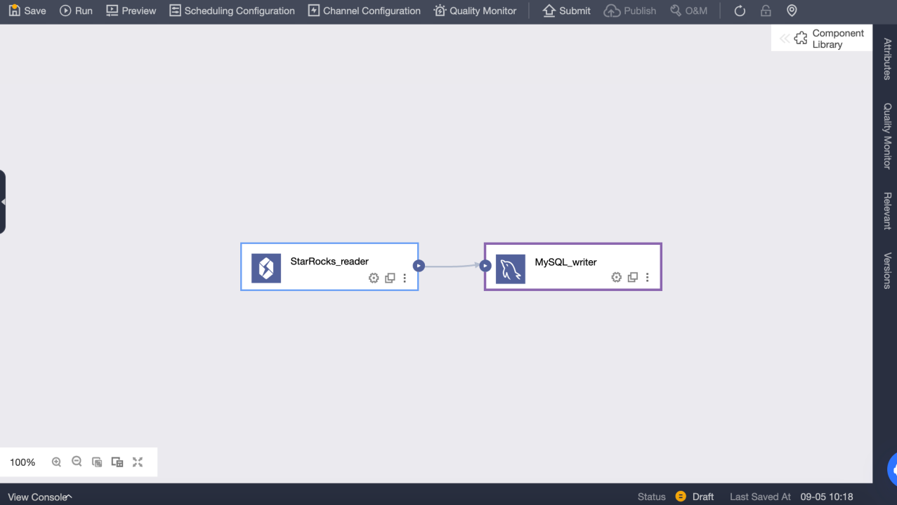
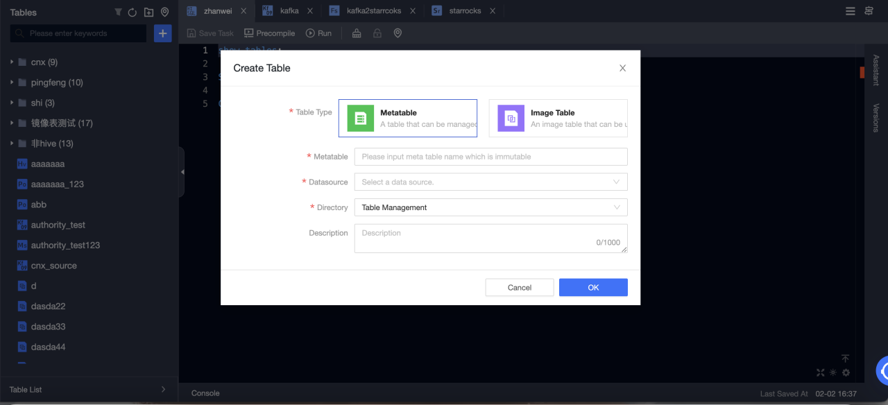

# Dataphin

Dataphin は、Alibaba Group の OneData データガバナンス手法の内部実践をクラウドベースで提供するものです。ビッグデータのライフサイクル全体を通じて、データの統合、構築、管理、利用のワンストップソリューションを提供し、企業がデータガバナンスのレベルを大幅に向上させ、高品質で信頼性が高く、便利で安全かつ経済的な生産を実現する企業レベルのデータミドルプラットフォームを構築することを目指しています。Dataphin は、さまざまな業界の企業のプラットフォーム技術アーキテクチャと特定の要件を満たすために、多様なコンピューティングプラットフォームのサポートと拡張可能なオープン機能を提供します。

Dataphin を StarRocks と統合する方法はいくつかあります。

- データ統合のためのソースまたはデスティネーションデータソースとして。データは StarRocks から読み取られ、他のデータソースにプッシュされるか、他のデータソースからプルされて StarRocks に書き込まれます。

- Flink SQL およびデータストリーム開発のソーステーブル（無制限スキャン）、ディメンションテーブル（制限スキャン）、または結果テーブル（ストリーミングシンクおよびバッチシンク）として。

- データウェアハウスまたはデータマートとして。StarRocks はコンピュートソースとして登録でき、SQL スクリプトの開発、スケジューリング、データ品質検出、セキュリティ識別、その他のデータ調査およびガバナンスタスクに使用できます。

## データ統合

StarRocks データソースを作成し、オフライン統合タスクでソースデータベースまたはデスティネーションデータベースとして使用できます。手順は以下の通りです。

### StarRocks データソースの作成

#### 基本情報

- **名前**: 必須。データソース名を入力します。中国語の文字、アルファベット、数字、アンダースコア (_)、ハイフン (-) のみを含むことができます。長さは 64 文字を超えることはできません。

- **データソースコード**: 任意。データソースコードを設定した後、`data source code.table` または `data source code.schema.table` 形式でデータソース内の Flink SQL を参照できます。対応する環境でデータソースに自動的にアクセスしたい場合は、`${data source code}.table` または `${data source code}.schema.table` 形式でアクセスします。

  > **注意**
  >
  > 現在、MySQL、Hologres、MaxCompute のデータソースのみがサポートされています。

- **サポートシナリオ**: データソースが適用されるシナリオ。

- **説明**: 任意。データソースの簡単な説明を入力できます。最大 128 文字まで入力可能です。

- **環境**: ビジネスデータソースがプロダクションデータソースと開発データソースを区別する場合は、**Prod and Dev** を選択します。ビジネスデータソースがプロダクションと開発データソースを区別しない場合は、**Prod** を選択します。

- **タグ**: データソースにラベルを付けるためのタグを選択できます。

#### 設定情報

- **JDBC URL**: 必須。形式は `jdbc:mysql://<host>:<port>/<dbname>` です。`host` は StarRocks クラスター内の FE (Front End) ホストの IP アドレス、`port` は FE のクエリポート、`dbname` はデータベース名です。

- **Load URL**: 必須。形式は `fe_ip:http_port;fe_ip:http_port` です。`fe_ip` は FE (Front End) のホスト、`http_port` は FE のポートです。

- **ユーザー名**: 必須。データベースのユーザー名です。

- **パスワード**: 必須。データベースのパスワードです。

#### 高度な設定

- **connectTimeout**: データベースの connectTimeout (ミリ秒単位)。デフォルト値は 900000 ミリ秒 (15 分) です。

- **socketTimeout**: データベースの socketTimeout (ミリ秒単位)。デフォルト値は 1800000 ミリ秒 (30 分) です。

### StarRocks データソースからデータを読み取り、他のデータソースにデータを書き込む

#### StarRocks 入力コンポーネントをオフライン統合タスクキャンバスにドラッグ

#### StarRocks 入力コンポーネントの設定

- **ステップ名**: 現在のコンポーネントのシナリオと位置に基づいて適切な名前を入力します。

- **データソース**: Dataphin で作成された StarRocks データソースまたはプロジェクトを選択します。データソースの読み取り権限が必要です。満足するデータソースがない場合は、データソースを追加するか、関連する権限を申請できます。

- **ソーステーブル**: 入力として同じテーブル構造を持つ単一または複数のテーブルを選択します。

- **テーブル**: ドロップダウンリストから StarRocks データソース内のテーブルを選択します。

- **スプリットキー**: 同時実行設定と共に使用されます。ソースデータテーブルの列をスプリットキーとして使用できます。スプリットキーとしてプライマリキーまたはインデックス付き列を使用することをお勧めします。

- **バッチ番号**: バッチで抽出されるデータレコードの数。

- **入力フィルタリング**: 任意。

  以下の 2 つの場合、フィルター情報を入力する必要があります。
  
  - 特定のデータをフィルタリングしたい場合。
  - 日次でデータを増分追加するか、完全なデータを取得する必要がある場合、Dataphin コンソールのシステム時間として設定された日付を入力する必要があります。たとえば、StarRocks のトランザクションテーブルで、トランザクション作成日が `${bizdate}` として設定されている場合。

- **出力フィールド**: 入力テーブル情報に基づいて関連フィールドをリストします。フィールドの名前変更、削除、追加、移動が可能です。一般的に、フィールドは下流データの可読性を高めるために名前が変更されるか、出力時のフィールドマッピングを容易にするために変更されます。アプリケーションシナリオで関連フィールドが必要ないため、入力段階でフィールドを削除することができます。複数の入力データがマージされるか、下流側で出力される際に、異なる名前のフィールドを同じ行でマッピングすることにより、データを効果的にマージまたはマッピングできるように、フィールドの順序が変更されます。

#### 出力コンポーネントをデスティネーションデータソースとして選択して設定

### 他のデータソースからデータを読み取り、StarRocks データソースにデータを書き込む

#### オフライン統合タスクで入力コンポーネントを設定し、StarRocks 出力コンポーネントをデスティネーションデータソースとして選択して設定

#### StarRocks 出力コンポーネントの設定

- **ステップ名**: 現在のコンポーネントのシナリオと位置に基づいて適切な名前を入力します。

- **データソース**: StarRocks で作成された Dataphin データソースまたはプロジェクトを選択します。設定担当者が同期書き込み権限を持っているデータソースです。満足するデータソースがない場合は、データソースを追加するか、関連する権限を申請できます。

- **テーブル**: ドロップダウンリストから StarRocks データソース内のテーブルを選択します。

- **ワンクリックでターゲットテーブルを生成**: StarRocks データソースにターゲットテーブルを作成していない場合、上流から読み取ったフィールドの名前、タイプ、および備考を自動的に取得し、テーブル作成文を生成できます。クリックしてワンクリックでターゲットテーブルを生成します。

- **CSV インポート列区切り文字**: StreamLoad CSV を使用してインポートします。CSV インポート列区切り文字を設定できます。デフォルト値は `\t` です。ここでデフォルト値を指定しないでください。データ自体に `\t` が含まれている場合は、他の文字を区切り文字として使用する必要があります。

- **CSV インポート行区切り文字**: StreamLoad CSV を使用してインポートします。CSV インポート行区切り文字を設定できます。デフォルト値は `\n` です。ここでデフォルト値を指定しないでください。データ自体に `\n` が含まれている場合は、他の文字を区切り文字として使用する必要があります。

- **解析ソリューション**: 任意。データが書き込まれる前または後に行われる特別な処理です。準備文はデータが StarRocks データソースに書き込まれる前に実行され、完了文はデータが書き込まれた後に実行されます。

- **フィールドマッピング**: フィールドを手動で選択してマッピングすることができ、上流入力からのフィールドとデスティネーションテーブル内のフィールドに基づいて、名前ベースまたは位置ベースのマッピングを使用して複数のフィールドを一度に処理することができます。

## リアルタイム開発

### 概要

StarRocks は、高速でスケーラブルなリアルタイム分析データベースです。リアルタイムデータ分析とクエリのニーズを満たすために、リアルタイムコンピューティングでデータの読み取りと書き込みに一般的に使用されます。企業のリアルタイムコンピューティングシナリオで広く使用されています。リアルタイムビジネスモニタリングと分析、リアルタイムユーザー行動分析、リアルタイム広告入札システム、リアルタイムリスク管理、詐欺防止、リアルタイムモニタリングと早期警告などのアプリケーションシナリオで使用できます。データをリアルタイムで分析およびクエリすることで、企業はビジネス状況を迅速に把握し、意思決定を最適化し、より良いサービスを提供し、利益を保護することができます。

### StarRocks コネクタ

StarRocks コネクタは以下の情報をサポートしています。

| **カテゴリ**                                           | **事実と数字**                               |
| ------------------------------------------------------ | ------------------------------------------- |
| サポートされているタイプ                                | ソーステーブル、ディメンションテーブル、結果テーブル |
| 実行モード                                             | ストリームモードとバッチモード               |
| データ形式                                             | JSON と CSV                                 |
| 特別なメトリクス                                       | なし                                        |
| API タイプ                                             | Datastream と SQL                           |
| 結果テーブルでのデータの更新または削除のサポート       | はい                                        |

### 使い方

Dataphin は、リアルタイムコンピュートの読み取りおよび書き込みターゲットとして StarRocks データソースをサポートしています。StarRocks メタテーブルを作成し、リアルタイムコンピュートタスクで使用できます。

#### StarRocks メタテーブルの作成

1. **Dataphin** > **R & D** > **Develop** > **Tables** に移動します。

2. **Create** をクリックして、リアルタイムコンピュートテーブルを選択します。

   

   - **テーブルタイプ**: **Metatable** を選択します。

   - **メタテーブル**: メタテーブルの名前を入力します。名前は変更できません。

   - **データソース**: StarRocks データソースを選択します。

   - **ディレクトリ**: テーブルを作成するディレクトリを選択します。

   - **説明**: 任意。

   

3. メタテーブルを作成した後、メタテーブルを編集できます。データソース、ソーステーブル、メタテーブルフィールドの変更、およびメタテーブルパラメータの設定を含みます。

   

4. メタテーブルを送信します。

#### Flink SQL タスクを作成して Kafka から StarRocks にリアルタイムでデータを書き込む

1. **Dataphin** > **R & D** > **Develop** > **Computing Tasks** に移動します。

2. **Create Flink SQL task** をクリックします。

   

3. Flink SQL コードを編集し、事前コンパイルします。Kafka メタテーブルは入力テーブルとして使用され、StarRocks メタテーブルは出力テーブルとして使用されます。

   
​   

4. 事前コンパイルが成功したら、コードをデバッグして送信できます。

5. 開発環境でのテストは、ログを印刷し、テストテーブルに書き込むことで実行できます。テストテーブルは、Meta Tables > Properties > デバッグテスト設定で設定できます。

   
   

6. 開発環境でタスクが正常に実行された後、タスクと使用されるメタテーブルを本番環境に公開できます。

   

7. 本番環境でタスクを開始し、Kafka から StarRocks にリアルタイムでデータを書き込みます。実行分析で各メトリックのステータスとログを表示して、タスクの実行状況を把握することができます。また、タスクの監視アラートを設定することもできます。

   
   

## データウェアハウスまたはデータマート

### 前提条件

- StarRocks のバージョンは 3.0.6 以降です。

- Dataphin がインストールされており、Dataphin のバージョンは 3.12 以降です。

- 統計収集が有効である必要があります。StarRocks がインストールされた後、収集はデフォルトで有効になっています。詳細については、[Gather statistics for CBO](../../using_starrocks/Cost_based_optimizer.md) を参照してください。

- StarRocks 内部カタログ (デフォルトカタログ) がサポートされており、外部カタログはサポートされていません。

### 接続設定

#### メタデータウェアハウス設定

Dataphin は、メタデータに基づいて情報を表示および表示できます。これには、テーブル使用情報やメタデータの変更が含まれます。StarRocks を使用してメタデータを処理および計算できます。したがって、使用する前にメタデータコンピューティングエンジン (メタデータウェアハウス) を初期化する必要があります。手順は以下の通りです。

1. 管理者アカウントを使用して Dataphin メタデータウェアハウステナントにログインします。

2. 管理 > システム > メタデータウェアハウス設定に移動します。

   a. 開始をクリックします。

   b. StarRocks を選択します。

   c. パラメータを設定します。テスト接続に合格したら、次へをクリックします。

   d. メタウェアハウスの初期化を完了します。

   

パラメータの説明は以下の通りです。

- **JDBC URL**: JDBC 接続文字列は、2 つの部分に分かれています。

  - パート I: 形式は `jdbc:mysql://<Host>:<Port>/` です。`Host` は StarRocks クラスター内の FE ホストの IP アドレスです。`Port` は FE のクエリポートです。デフォルト値は `9030` です。

  - パート II: 形式は `database? key1 = value1 & key2 = value2` で、`database` はメタデータ計算に使用される StarRocks データベースの名前で、必須です。`?` の後のパラメータは任意です。

- **Load URL**: 形式は `fe_ip:http_port;fe_ip:http_port` です。`fe_ip` は FE (Front End) のホストで、`http_port` は FE のポートです。

- **ユーザー名**: StarRocks に接続するために使用されるユーザー名です。

  ユーザーは、JDBC URL で指定されたデータベースに対する読み取りおよび書き込み権限を持っている必要があり、以下のデータベースおよびテーブルへのアクセス権限を持っている必要があります。

  - Information Schema 内のすべてのテーブル

  - _statistics_.column_statistics

  - _statistics_.table_statistic_v1

- **パスワード**: StarRocks のリンクのパスワードです。

- **メタプロジェクト**: Dataphin でメタデータ処理に使用されるプロジェクトの名前です。Dataphin システム内でのみ使用されます。`dataphin_meta` をプロジェクト名として使用することをお勧めします。

#### StarRocks プロジェクトを作成し、データ開発を開始する

データ開発を開始するには、以下の手順に従います。

1. コンピューティング設定。

2. StarRocks コンピューティングソースを作成します。

3. プロジェクトを作成します。

4. StarRocks SQL タスクを作成します。

##### コンピューティング設定

コンピューティング設定は、テナントのコンピューティングエンジンタイプとクラスターアドレスを設定します。詳細な手順は以下の通りです。

1. システム管理者またはスーパー管理者として Dataphin にログインします。

2. **管理** > **システム** > **計算設定** に移動します。

3. **StarRocks** を選択し、**次へ** をクリックします。

4. JDBC URL を入力して検証します。JDBC URL の形式は `jdbc:mysql://<Host>:<Port>/` です。`Host` は StarRocks クラスター内の FE ホストの IP アドレスです。`Port` は FE のクエリポートです。デフォルト値は `9030` です。

##### StarRocks コンピューティングソース

コンピューティングソースは Dataphin の概念です。主な目的は、Dataphin プロジェクトスペースを StarRocks ストレージコンピューティングスペース (データベース) とバインドおよび登録することです。各プロジェクトに対してコンピューティングソースを作成する必要があります。詳細な手順は以下の通りです。

1. システム管理者またはスーパー管理者として Dataphin にログインします。

2. **計画** > **エンジン** に移動します。

3. 右上隅の **Add Computing Engine** をクリックして、コンピューティングソースを作成します。

詳細な設定情報は以下の通りです。

1. **基本情報**

   

   - **コンピューティングエンジンタイプ**: **StarRocks** を選択します。

   - **コンピューティングエンジン名**: 作成するプロジェクトと同じ名前を使用することをお勧めします。開発プロジェクトの場合は、サフィックス `_dev` を追加します。

   - **説明**: 任意。コンピューティングソースの説明を入力します。

2. **設定情報**

   

   - **JDBC URL**: 形式は `jdbc:mysql://<Host>:<Port>/` です。`Host` は StarRocks クラスター内の FE ホストの IP アドレスです。`Port` は FE のクエリポートです。デフォルト値は `9030` です。

   - **Load URL**: 形式は `fe_ip:http_port;fe_ip:http_port` です。`fe_ip` は FE (Front End) のホストで、`http_port` は FE のポートです。

   - **ユーザー名**: StarRocks に接続するために使用されるユーザー名です。

   - **パスワード**: StarRocks のパスワードです。

   - **タスクリソースグループ**: 異なる優先度のタスクに対して異なる StarRocks リソースグループを指定できます。リソースグループを指定しない場合、StarRocks エンジンが実行するリソースグループを決定します。リソースグループを指定する場合、Dataphin によって異なる優先度のタスクが指定されたリソースグループに割り当てられます。SQL タスクのコードまたは論理テーブルのマテリアライズ設定でリソースグループが指定されている場合、タスクの実行時にコンピューティングソースタスクのリソースグループの設定は無視されます。

   

##### Dataphin プロジェクト

コンピューティングソースを作成した後、Dataphin プロジェクトにバインドできます。Dataphin プロジェクトは、プロジェクトメンバー、StarRocks ストレージおよびコンピューティングスペースを管理し、コンピューティングタスクを管理および維持します。

Dataphin プロジェクトを作成するには、以下の手順に従います。

1. システム管理者またはスーパー管理者として Dataphin にログインします。

2. **計画** > **プロジェクト管理** に移動します。

3. 右上隅の **Create project** をクリックしてプロジェクトを作成します。

4. 基本情報を入力し、前のステップで作成した StarRocks エンジンをオフラインエンジンから選択します。

5. **Create** をクリックします。

##### StarRocks SQL

プロジェクトを作成した後、StarRocks で DDL または DML 操作を実行するための StarRocks SQL タスクを作成できます。

詳細な手順は以下の通りです。

1. **R & D** > **Develop** に移動します。

2. 右上隅の '+' をクリックして StarRocks SQL タスクを作成します。

   

3. 名前とスケジューリングタイプを入力して SQL タスクを作成します。

4. エディタに SQL を入力して、StarRocks で DDL および DML 操作を開始します。

   