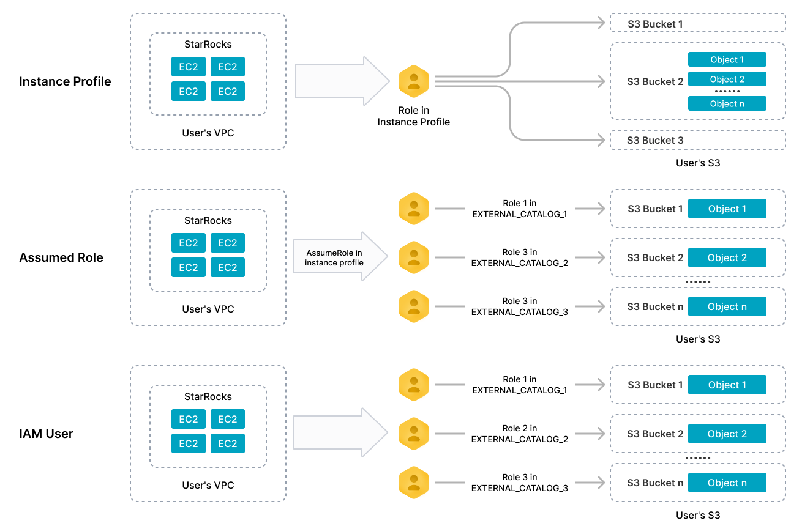

# AWS リソースへの認証

StarRocks は、AWS リソースと統合するために、インスタンスプロファイルベースの認証、役割引受けベースの認証、IAM ユーザーベースの認証の 3 つの認証方法をサポートしています。このトピックでは、これらの認証方法を使用して AWS 資格情報を設定する方法について説明します。

## 認証方法

### インスタンスプロファイルベースの認証

インスタンスプロファイルベースの認証方法では、StarRocks クラスターがクラスターが実行されている EC2 インスタンスのインスタンスプロファイルに指定された権限を継承することができます。理論的には、クラスターにログインできるクラスター ユーザーは、設定した AWS IAM ポリシーに従って AWS リソースに対して許可されたアクションを実行できます。このユースケースの典型的なシナリオは、クラスター内の複数のクラスター ユーザー間で AWS リソース アクセス制御が不要な場合です。この認証方法は、同じクラスター内での分離が不要であることを意味します。

ただし、この認証方法は、クラスターにログインできる人がクラスター管理者によって制御されているため、クラスター レベルの安全なアクセス制御ソリューションと見なすことができます。

### 役割引受けベースの認証

インスタンスプロファイルベースの認証とは異なり、役割引受けベースの認証方法は、AWS IAM ロールを引き受けて AWS リソースにアクセスすることをサポートしています。詳細については、[Assuming a role](https://docs.aws.amazon.com/awscloudtrail/latest/userguide/cloudtrail-sharing-logs-assume-role.html) を参照してください。

### IAM ユーザーベースの認証

IAM ユーザーベースの認証方法は、IAM ユーザー資格情報を使用して AWS リソースにアクセスすることをサポートしています。詳細については、[IAM users](https://docs.aws.amazon.com/IAM/latest/UserGuide/id_users.html) を参照してください。

## 準備

まず、StarRocks クラスターが実行されている EC2 インスタンスに関連付けられている IAM ロール (このトピックでは以降、EC2 インスタンスロールと呼びます) を見つけ、そのロールの ARN を取得します。インスタンスプロファイルベースの認証には EC2 インスタンスロールが必要であり、役割引受けベースの認証には EC2 インスタンスロールとその ARN が必要です。

次に、アクセスしたい AWS リソースの種類と StarRocks 内の特定の操作シナリオに基づいて IAM ポリシーを作成します。AWS IAM のポリシーは、特定の AWS リソースに対する一連の権限を宣言します。ポリシーを作成した後、それを IAM ロールまたはユーザーにアタッチする必要があります。このようにして、IAM ロールまたはユーザーは、ポリシーで宣言された権限を割り当てられ、指定された AWS リソースにアクセスできます。

> **注意**
>
> これらの準備を行うには、[AWS IAM コンソール](https://us-east-1.console.aws.amazon.com/iamv2/home#/home) にサインインして IAM ユーザーとロールを編集する権限が必要です。

特定の AWS リソースにアクセスするために必要な IAM ポリシーについては、次のセクションを参照してください。

- [Batch load data from AWS S3](../sql-reference/aws_iam_policies.md#batch-load-data-from-aws-s3)
- [Read/write AWS S3](../sql-reference/aws_iam_policies.md#readwrite-aws-s3)
- [Integrate with AWS Glue](../sql-reference/aws_iam_policies.md#integrate-with-aws-glue)

### インスタンスプロファイルベースの認証の準備

必要な AWS リソースにアクセスするための [IAM ポリシー](../sql-reference/aws_iam_policies.md) を EC2 インスタンスロールにアタッチします。

### 役割引受けベースの認証の準備

#### IAM ロールを作成し、ポリシーをアタッチする

アクセスしたい AWS リソースに応じて、1 つ以上の IAM ロールを作成します。詳細は [Creating IAM roles](https://docs.aws.amazon.com/IAM/latest/UserGuide/id_roles_create.html) を参照してください。その後、必要な AWS リソースにアクセスするための [IAM ポリシー](../sql-reference/aws_iam_policies.md) を作成した IAM ロールにアタッチします。

例えば、StarRocks クラスターが AWS S3 と AWS Glue にアクセスすることを望む場合、この状況では、1 つの IAM ロール (例えば `s3_assumed_role`) を作成し、AWS S3 にアクセスするためのポリシーと AWS Glue にアクセスするためのポリシーをそのロールに両方アタッチすることができます。あるいは、2 つの異なる IAM ロール (例えば `s3_assumed_role` と `glue_assumed_role`) を作成し、これらのポリシーをそれぞれのロールにアタッチすることもできます (つまり、AWS S3 にアクセスするためのポリシーを `s3_assumed_role` に、AWS Glue にアクセスするためのポリシーを `glue_assumed_role` にアタッチします)。

作成した IAM ロールは、指定された AWS リソースにアクセスするために StarRocks クラスターの EC2 インスタンスロールによって引き受けられます。

このセクションでは、1 つの引受けロール `s3_assumed_role` のみを作成し、そのロールに AWS S3 にアクセスするためのポリシーと AWS Glue にアクセスするためのポリシーを追加したと仮定します。

#### 信頼関係の設定

引受けロールを次のように設定します。

1. [AWS IAM コンソール](https://us-east-1.console.aws.amazon.com/iamv2/home#/home) にサインインします。
2. 左側のナビゲーションペインで、**Access management** > **Roles** を選択します。
3. 引受けロール (`s3_assumed_role`) を見つけ、その名前をクリックします。
4. ロールの詳細ページで、**Trust relationships** タブをクリックし、**Trust relationships** タブで **Edit trust policy** をクリックします。
5. **Edit trust policy** ページで、既存の JSON ポリシー ドキュメントを削除し、以下の IAM ポリシーを貼り付けます。このとき、上で取得した EC2 インスタンスロールの ARN を `<cluster_EC2_iam_role_ARN>` に置き換える必要があります。その後、**Update policy** をクリックします。

   ```JSON
   {
       "Version": "2012-10-17",
       "Statement": [
           {
               "Effect": "Allow",
               "Principal": {
                   "AWS": "<cluster_EC2_iam_role_ARN>"
               },
               "Action": "sts:AssumeRole"
           }
       ]
   }
   ```

異なる AWS リソースにアクセスするために異なる引受けロールを作成した場合、他の引受けロールを設定するために上記の手順を繰り返す必要があります。例えば、AWS S3 と AWS Glue にアクセスするために `s3_assumed_role` と `glue_assumed_role` を作成した場合、この状況では `glue_assumed_role` を設定するために上記の手順を繰り返す必要があります。

EC2 インスタンスロールを次のように設定します。

1. [AWS IAM コンソール](https://us-east-1.console.aws.amazon.com/iamv2/home#/home) にサインインします。
2. 左側のナビゲーションペインで、**Access management** > **Roles** を選択します。
3. EC2 インスタンスロールを見つけ、その名前をクリックします。
4. ロールの詳細ページの **Permissions policies** セクションで、**Add permissions** をクリックし、**Create inline policy** を選択します。
5. **Specify permissions** ステップで、**JSON** タブをクリックし、既存の JSON ポリシー ドキュメントを削除し、以下の IAM ポリシーを貼り付けます。このとき、引受けロール `s3_assumed_role` の ARN を `<s3_assumed_role_ARN>` に置き換える必要があります。その後、**Review policy** をクリックします。

   ```JSON
   {
       "Version": "2012-10-17",
       "Statement": [
           {
               "Effect": "Allow",
               "Action": ["sts:AssumeRole"],
               "Resource": [
                   "<s3_assumed_role_ARN>"
               ]
           }
       ]
   }
   ```

   異なる AWS リソースにアクセスするために異なる引受けロールを作成した場合、上記の IAM ポリシーの **Resource** 要素にこれらの引受けロールの ARN をすべて記入し、カンマ (,) で区切る必要があります。例えば、AWS S3 と AWS Glue にアクセスするために `s3_assumed_role` と `glue_assumed_role` を作成した場合、この状況では `s3_assumed_role` の ARN と `glue_assumed_role` の ARN を次の形式で **Resource** 要素に記入する必要があります: `"<s3_assumed_role_ARN>","<glue_assumed_role_ARN>"`。

6. **Review Policy** ステップで、ポリシー名を入力し、**Create policy** をクリックします。

### IAM ユーザーベースの認証の準備

IAM ユーザーを作成します。詳細は [Creating an IAM user in your AWS account](https://docs.aws.amazon.com/IAM/latest/UserGuide/id_users_create.html) を参照してください。

その後、必要な AWS リソースにアクセスするための [IAM ポリシー](../sql-reference/aws_iam_policies.md) を作成した IAM ユーザーにアタッチします。

## 認証方法の比較

次の図は、StarRocks におけるインスタンスプロファイルベースの認証、役割引受けベースの認証、および IAM ユーザーベースの認証のメカニズムの違いを高レベルで説明しています。



## AWS リソースとの接続の構築

### AWS S3 へのアクセスのための認証パラメータ

StarRocks が AWS S3 と統合する必要があるさまざまなシナリオ、例えば外部カタログやファイル外部テーブルを作成する場合や、AWS S3 からデータを取り込んだり、バックアップしたり、復元したりする場合には、AWS S3 へのアクセスのための認証パラメータを次のように設定します。

- インスタンスプロファイルベースの認証の場合、`aws.s3.use_instance_profile` を `true` に設定します。
- 役割引受けベースの認証の場合、`aws.s3.use_instance_profile` を `true` に設定し、`aws.s3.iam_role_arn` を AWS S3 にアクセスするために使用する引受けロールの ARN (例えば、上で作成した引受けロール `s3_assumed_role` の ARN) に設定します。
- IAM ユーザーベースの認証の場合、`aws.s3.use_instance_profile` を `false` に設定し、`aws.s3.access_key` と `aws.s3.secret_key` を AWS IAM ユーザーのアクセスキーとシークレットキーに設定します。

次の表は、パラメータを説明しています。

| パラメータ                   | 必須     | 説明                                                            |
| --------------------------- | -------- | ------------------------------------------------------------ |
| aws.s3.use_instance_profile | Yes      | インスタンスプロファイルベースの認証方法と役割引受けベースの認証方法を有効にするかどうかを指定します。 有効な値: `true` および `false`。 デフォルト値: `false`。 |
| aws.s3.iam_role_arn         | No       | AWS S3 バケットに対する権限を持つ IAM ロールの ARN。役割引受けベースの認証方法を使用して AWS S3 にアクセスする場合、このパラメータを指定する必要があります。  |
| aws.s3.access_key           | No       | IAM ユーザーのアクセスキー。IAM ユーザーベースの認証方法を使用して AWS S3 にアクセスする場合、このパラメータを指定する必要があります。 |
| aws.s3.secret_key           | No       | IAM ユーザーのシークレットキー。IAM ユーザーベースの認証方法を使用して AWS S3 にアクセスする場合、このパラメータを指定する必要があります。 |

### AWS Glue へのアクセスのための認証パラメータ

StarRocks が AWS Glue と統合する必要があるさまざまなシナリオ、例えば外部カタログを作成する場合には、AWS Glue へのアクセスのための認証パラメータを次のように設定します。

- インスタンスプロファイルベースの認証の場合、`aws.glue.use_instance_profile` を `true` に設定します。
- 役割引受けベースの認証の場合、`aws.glue.use_instance_profile` を `true` に設定し、`aws.glue.iam_role_arn` を AWS Glue にアクセスするために使用する引受けロールの ARN (例えば、上で作成した引受けロール `glue_assumed_role` の ARN) に設定します。
- IAM ユーザーベースの認証の場合、`aws.glue.use_instance_profile` を `false` に設定し、`aws.glue.access_key` と `aws.glue.secret_key` を AWS IAM ユーザーのアクセスキーとシークレットキーに設定します。

次の表は、パラメータを説明しています。

| パラメータ                     | 必須     | 説明                                                            |
| ----------------------------- | -------- | ------------------------------------------------------------ |
| aws.glue.use_instance_profile | Yes      | インスタンスプロファイルベースの認証方法と役割引受けベースの認証を有効にするかどうかを指定します。 有効な値: `true` および `false`。 デフォルト値: `false`。 |
| aws.glue.iam_role_arn         | No       | AWS Glue Data Catalog に対する権限を持つ IAM ロールの ARN。役割引受けベースの認証方法を使用して AWS Glue にアクセスする場合、このパラメータを指定する必要があります。 |
| aws.glue.access_key           | No       | AWS IAM ユーザーのアクセスキー。IAM ユーザーベースの認証方法を使用して AWS Glue にアクセスする場合、このパラメータを指定する必要があります。 |
| aws.glue.secret_key           | No       | AWS IAM ユーザーのシークレットキー。IAM ユーザーベースの認証方法を使用して AWS Glue にアクセスする場合、このパラメータを指定する必要があります。 |

## 統合の例

### external catalog

StarRocks クラスターで external catalog を作成することは、ターゲットデータレイクシステムとの統合を構築することを意味します。これは、次の 2 つの主要コンポーネントで構成されています。

- テーブルファイルを保存するための AWS S3 などのファイルストレージ
- テーブルファイルのメタデータと場所を保存するための Hive metastore や AWS Glue などのメタストア

StarRocks は次のタイプの catalog をサポートしています。

- [Hive catalog](../data_source/catalog/hive_catalog.md)
- [Iceberg catalog](../data_source/catalog/iceberg_catalog.md)
- [Hudi catalog](../data_source/catalog/hudi_catalog.md)
- [Delta Lake catalog](../data_source/catalog/deltalake_catalog.md)

次の例では、使用するメタストアのタイプに応じて、`hive_catalog_hms` または `hive_catalog_glue` という名前の Hive catalog を作成し、Hive クラスターからデータをクエリします。詳細な構文とパラメータについては、[Hive catalog](../data_source/catalog/hive_catalog.md) を参照してください。

#### インスタンスプロファイルベースの認証

- Hive クラスターで Hive metastore を使用する場合、次のようなコマンドを実行します。

```SQL
  CREATE EXTERNAL CATALOG hive_catalog_hms
  PROPERTIES
  (
      "type" = "hive",
      "aws.s3.use_instance_profile" = "true",
      "aws.s3.region" = "us-west-2",
      "hive.metastore.uris" = "thrift://xx.xx.xx.xx:9083"
  );
```

- Amazon EMR Hive クラスターで AWS Glue を使用する場合、次のようなコマンドを実行します。

```SQL
  CREATE EXTERNAL CATALOG hive_catalog_glue
  PROPERTIES
  (
      "type" = "hive",
      "aws.s3.use_instance_profile" = "true",
      "aws.s3.region" = "us-west-2",
      "hive.metastore.type" = "glue",
      "aws.glue.use_instance_profile" = "true",
      "aws.glue.region" = "us-west-2"
  );
```

#### 役割引受けベースの認証

- Hive クラスターで Hive metastore を使用する場合、次のようなコマンドを実行します。

```SQL
  CREATE EXTERNAL CATALOG hive_catalog_hms
  PROPERTIES
  (
      "type" = "hive",
      "aws.s3.use_instance_profile" = "true",
      "aws.s3.iam_role_arn" = "arn:aws:iam::081976408565:role/s3_assumed_role",
      "aws.s3.region" = "us-west-2",
      "hive.metastore.uris" = "thrift://xx.xx.xx.xx:9083"
  );
```

- Amazon EMR Hive クラスターで AWS Glue を使用する場合、次のようなコマンドを実行します。

```SQL
  CREATE EXTERNAL CATALOG hive_catalog_glue
  PROPERTIES
  (
      "type" = "hive",
      "aws.s3.use_instance_profile" = "true",
      "aws.s3.iam_role_arn" = "arn:aws:iam::081976408565:role/s3_assumed_role",
      "aws.s3.region" = "us-west-2",
      "hive.metastore.type" = "glue",
      "aws.glue.use_instance_profile" = "true",
      "aws.glue.iam_role_arn" = "arn:aws:iam::081976408565:role/glue_assumed_role",
      "aws.glue.region" = "us-west-2"
  );
```

#### IAM ユーザーベースの認証

- Hive クラスターで Hive metastore を使用する場合、次のようなコマンドを実行します。

```SQL
  CREATE EXTERNAL CATALOG hive_catalog_hms
  PROPERTIES
  (
      "type" = "hive",
      "aws.s3.use_instance_profile" = "false",
      "aws.s3.access_key" = "<iam_user_access_key>",
      "aws.s3.secret_key" = "<iam_user_access_key>",
      "aws.s3.region" = "us-west-2",
      "hive.metastore.uris" = "thrift://xx.xx.xx.xx:9083"
  );
```

- Amazon EMR Hive クラスターで AWS Glue を使用する場合、次のようなコマンドを実行します。

```SQL
  CREATE EXTERNAL CATALOG hive_catalog_glue
  PROPERTIES
  (
      "type" = "hive",
      "aws.s3.use_instance_profile" = "false",
      "aws.s3.access_key" = "<iam_user_access_key>",
      "aws.s3.secret_key" = "<iam_user_secret_key>",
      "aws.s3.region" = "us-west-2",
      "hive.metastore.type" = "glue",
      "aws.glue.use_instance_profile" = "false",
      "aws.glue.access_key" = "<iam_user_access_key>",
      "aws.glue.secret_key" = "<iam_user_secret_key>",
      "aws.glue.region" = "us-west-2"
  );
```

### ファイル外部テーブル

ファイル外部テーブルは、`default_catalog` という名前の内部カタログに作成する必要があります。

次の例では、`test_s3_db` という既存のデータベースに `file_table` という名前のファイル外部テーブルを作成します。詳細な構文とパラメータについては、[File external table](../data_source/file_external_table.md) を参照してください。

#### インスタンスプロファイルベースの認証

次のようなコマンドを実行します。

```SQL
CREATE EXTERNAL TABLE test_s3_db.file_table
(
    id varchar(65500),
    attributes map<varchar(100), varchar(2000)>
) 
ENGINE=FILE
PROPERTIES
(
    "path" = "s3://starrocks-test/",
    "format" = "ORC",
    "aws.s3.use_instance_profile" = "true",
    "aws.s3.region" = "us-west-2"
);
```

#### 役割引受けベースの認証

次のようなコマンドを実行します。

```SQL
CREATE EXTERNAL TABLE test_s3_db.file_table
(
    id varchar(65500),
    attributes map<varchar(100), varchar(2000)>
) 
ENGINE=FILE
PROPERTIES
(
    "path" = "s3://starrocks-test/",
    "format" = "ORC",
    "aws.s3.use_instance_profile" = "true",
    "aws.s3.iam_role_arn" = "arn:aws:iam::081976408565:role/s3_assumed_role",
    "aws.s3.region" = "us-west-2"
);
```

#### IAM ユーザーベースの認証

次のようなコマンドを実行します。

```SQL
CREATE EXTERNAL TABLE test_s3_db.file_table
(
    id varchar(65500),
    attributes map<varchar(100), varchar(2000)>
) 
ENGINE=FILE
PROPERTIES
(
    "path" = "s3://starrocks-test/",
    "format" = "ORC",
    "aws.s3.use_instance_profile" = "false",
    "aws.s3.access_key" = "<iam_user_access_key>",
    "aws.s3.secret_key" = "<iam_user_secret_key>",
    "aws.s3.region" = "us-west-2"
);
```

### データの取り込み

LOAD LABEL を使用して AWS S3 からデータをロードできます。

次の例では、`s3a://test-bucket/test_brokerload_ingestion` パスに保存されているすべての Parquet データファイルから、`test_s3_db` という既存のデータベース内の `test_ingestion_2` テーブルにデータをロードします。詳細な構文とパラメータについては、[BROKER LOAD](../sql-reference/sql-statements/loading_unloading/BROKER_LOAD.md) を参照してください。

#### インスタンスプロファイルベースの認証

次のようなコマンドを実行します。

```SQL
LOAD LABEL test_s3_db.test_credential_instanceprofile_7
(
    DATA INFILE("s3a://test-bucket/test_brokerload_ingestion/*")
    INTO TABLE test_ingestion_2
    FORMAT AS "parquet"
)
WITH BROKER
(
    "aws.s3.use_instance_profile" = "true",
    "aws.s3.region" = "us-west-1"
)
PROPERTIES
(
    "timeout" = "1200"
);
```

#### 役割引受けベースの認証

次のようなコマンドを実行します。

```SQL
LOAD LABEL test_s3_db.test_credential_instanceprofile_7
(
    DATA INFILE("s3a://test-bucket/test_brokerload_ingestion/*")
    INTO TABLE test_ingestion_2
    FORMAT AS "parquet"
)
WITH BROKER
(
    "aws.s3.use_instance_profile" = "true",
    "aws.s3.iam_role_arn" = "arn:aws:iam::081976408565:role/s3_assumed_role",
    "aws.s3.region" = "us-west-1"
)
PROPERTIES
(
    "timeout" = "1200"
);
```

#### IAM ユーザーベースの認証

次のようなコマンドを実行します。

```SQL
LOAD LABEL test_s3_db.test_credential_instanceprofile_7
(
    DATA INFILE("s3a://test-bucket/test_brokerload_ingestion/*")
    INTO TABLE test_ingestion_2
    FORMAT AS "parquet"
)
WITH BROKER
(
    "aws.s3.use_instance_profile" = "false",
    "aws.s3.access_key" = "<iam_user_access_key>",
    "aws.s3.secret_key" = "<iam_user_secret_key>",
    "aws.s3.region" = "us-west-1"
)
PROPERTIES
(
    "timeout" = "1200"
);
```
```