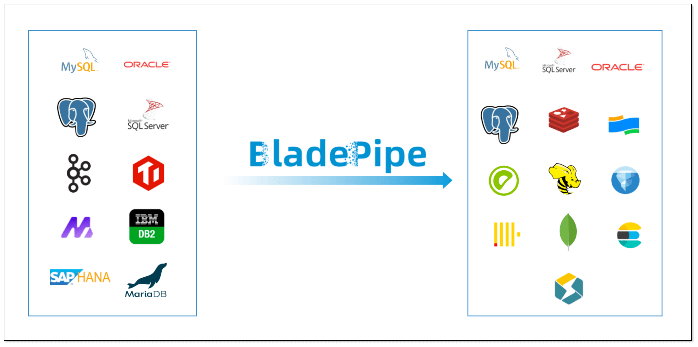
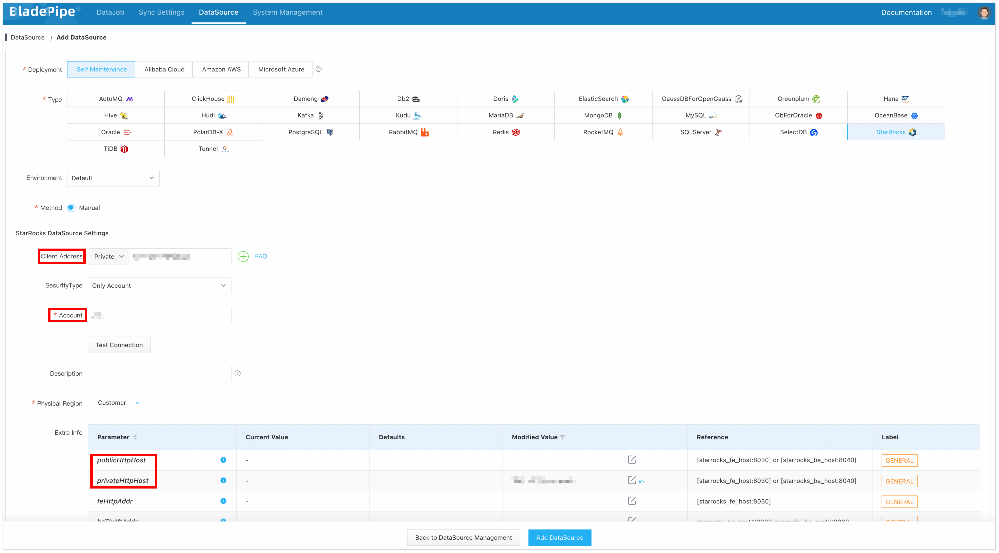
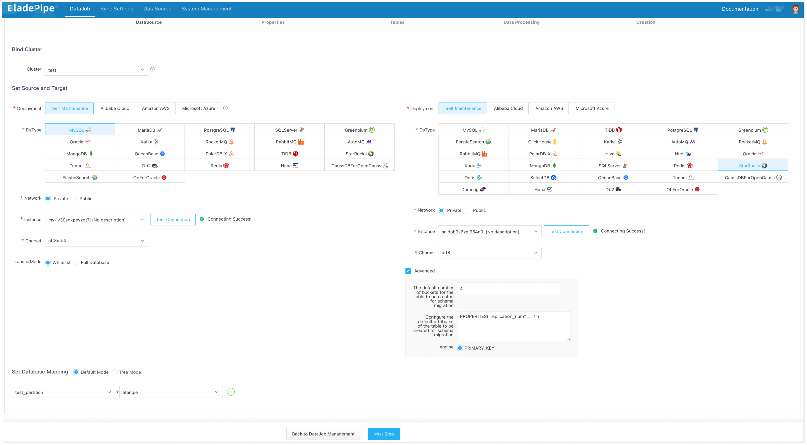
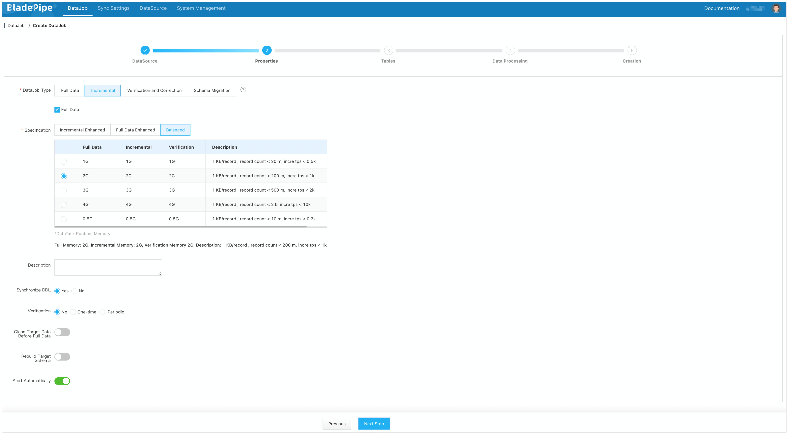
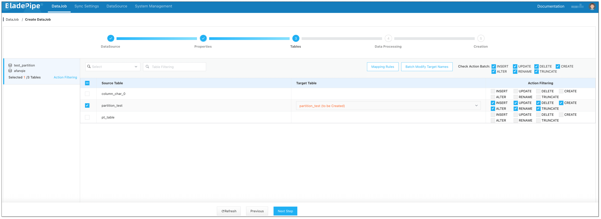
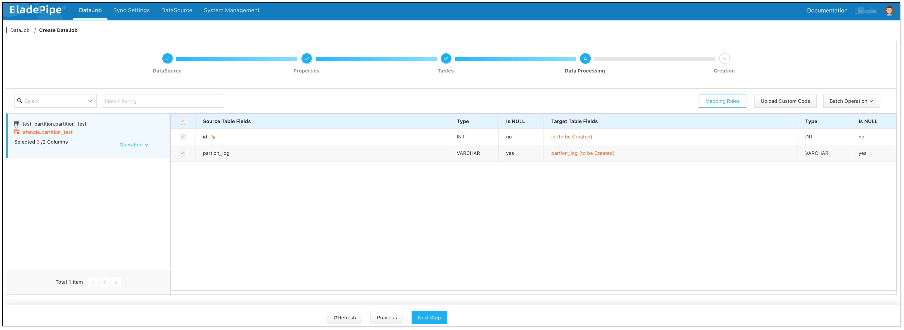
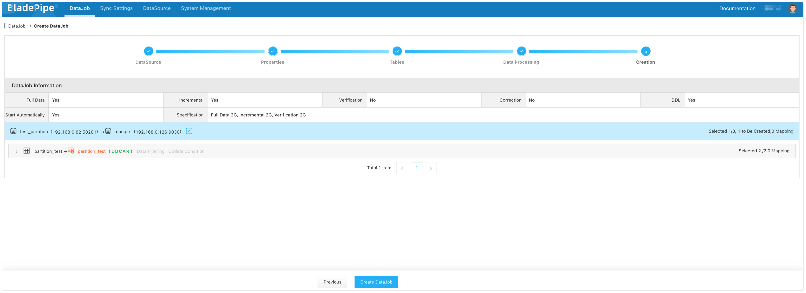
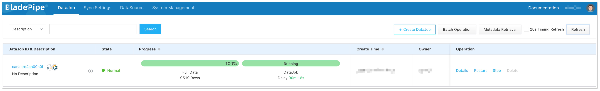

# BladePipe

## Introduction

BladePipe は、**リアルタイムのエンドツーエンドデータレプリケーションツール**であり、**30以上**のデータベース、メッセージキュー、検索エンジン、キャッシングシステム、リアルタイムデータウェアハウス、データレイクなどの間で、**超低レイテンシー**でデータを移動します。効率性、安定性、スケーラビリティ、多様なデータベースエンジンとの互換性、ワンストップ管理、強化されたセキュリティ、複雑なデータ変換を特徴としています。BladePipe はデータサイロを解消し、データの価値を高めます。

## Features

BladePipe は視覚化された管理インターフェースを提供し、**スキーマ移行、データ移行、同期、検証と修正**などを実現する DataJob を簡単に作成できます。さらに、パラメータ設定によってより詳細でカスタマイズされた設定をサポートします。現在、BladePipe は以下のソース DataSource から StarRocks へのデータ移動をサポートしています。

| Source DataSource           | Schema Migration | Data Migration | Data Sync | Verification & Correction |
| --------------------------- | ---------------- | -------------- | --------- | ------------------------- |
| MySQL/MariaDB/AuroraMySQL   | Yes              | Yes            | Yes       | Yes                       |
| Oracle                      | Yes              | Yes            | Yes       | Yes                       |
| PostgreSQL/AuroraPostgreSQL | Yes              | Yes            | Yes       | Yes                       |
| SQL Server                  | Yes              | Yes            | Yes       | Yes                       |
| Kafka                       | No               | No             | Yes       | No                        |
| AutoMQ                      | No               | No             | Yes       | No                        |
| TiDB                        | Yes              | Yes            | Yes       | Yes                       |
| Hana                        | Yes              | Yes            | Yes       | Yes                       |
| PolarDB for MySQL           | Yes              | Yes            | Yes       | Yes                       |
| Db2                         | Yes              | Yes            | Yes       | Yes                       |

:::info

サポートされている機能とパラメータ設定の詳細については、[BladePipe Connections](https://doc.bladepipe.com/dataMigrationAndSync/connection/mysql2?target=StarRocks) を参照してください。

:::

## Installation

[Install BladePipe Worker (Docker)](https://doc.bladepipe.com/productOP/docker/install_worker_docker) または [Install BladePipe Worker (Binary)](https://doc.bladepipe.com/productOP/binary/install_worker_binary) の指示に従って、BladePipe Worker をダウンロードしてインストールしてください。

## Example

MySQL インスタンスを例にとり、MySQL から StarRocks へのデータ移行方法を説明します。

### Add DataSources

1. [BladePipe Cloud](https://cloud.bladepipe.com/) にログインします。**DataSource** > **Add DataSource** をクリックします。
2. **StarRocks** を **Type** として選択し、セットアップフォームに記入します。
   - **Client Address**：MySQL クライアントに提供される StarRocks のポート。BladePipe はこれを介してデータベースのメタデータをクエリします。
   - **Account**: StarRocks データベースのユーザー名。StarRocks にデータを書き込むには INSERT 権限が必要です。[GRANT](../../sql-reference/sql-statements/account-management/GRANT.md) に記載された指示に従って、データベースユーザーに INSERT 権限を付与してください。
   - **Http Address**：BladePipe からのリクエストを受け取るために使用されるポート。

   

3. **Test Connection** をクリックします。接続が成功したら、**Add DataSource** をクリックして DataSource を追加します。
4. 上記の手順に従って MySQL DataSource を追加します。

### Create DataJob

1. **DataJob** > [**Create DataJob**](https://doc.bladepipe.com/operation/job_manage/create_job/create_full_incre_task) をクリックします。

2. ソースとターゲットの DataSource を選択し、**Test Connection** をクリックして、ソースとターゲットの DataSource への接続が両方とも成功していることを確認します。

   

3. DataJob Type に **Incremental** を選択し、**Full Data** オプションを選択します。

   

4. レプリケートするテーブルを選択します。**スキーマ移行後に自動的に作成されるターゲット StarRocks テーブルにはプライマリキーがあるため、プライマリキーのないソーステーブルは現在サポートされていません**。

   

5. レプリケートするカラムを選択します。

   

6. DataJob の作成を確認します。

   

7. DataJob は自動的に実行されます。BladePipe は以下の DataTasks を自動的に実行します:
   - **Schema Migration**: ソーステーブルのスキーマがターゲットインスタンスに移行されます。
   - **Full Data**: ソーステーブルの既存のすべてのデータがターゲットインスタンスに完全に移行されます。
   - **Incremental**: 継続的なデータ変更がターゲットインスタンスに継続的に同期されます（レイテンシーは1分未満）。

