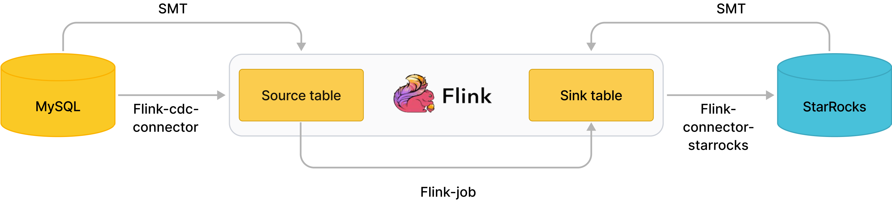

# StarRocks Migration Tool (SMT)

StarRocks Migration Tool (SMT) は、StarRocks が提供するデータ移行ツールで、Flink を通じてソースデータベースから StarRocks にデータをロードします。SMT の主な機能は次のとおりです:
- ソースデータベースとターゲットの StarRocks クラスターの情報に基づいて、StarRocks にテーブルを作成するためのステートメントを生成します。
- Flink の SQL クライアントで実行可能な SQL ステートメントを生成し、データ同期のための Flink ジョブを送信します。これにより、パイプラインでのフルまたは増分データ同期が簡素化されます。現在、SMT は以下のソースデータベースをサポートしています:

| ソースデータベース | StarRocks にテーブルを作成するためのステートメントを生成 | フルデータ同期 | 増分データ同期 |
| ----------------- | ----------------------------------------------------- | ------------- | -------------- |
| MySQL             | サポート                                               | サポート       | サポート       |
| PostgreSQL        | サポート                                               | サポート       | サポート       |
| Oracle            | サポート                                               | サポート       | サポート       |
| Hive              | サポート                                               | サポート       | サポートされていない |
| ClickHouse        | サポート                                               | サポート       | サポートされていない |
| SQL Server        | サポート                                               | サポート       | サポート       |
| TiDB              | サポート                                               | サポート       | サポート       |

ダウンロードリンク: https://cdn-thirdparty.starrocks.com/smt.tar.gz?r=2

## SMT の使用手順

一般的な手順は次のとおりです:

1. **conf/config_prod.conf** ファイルを設定します。

2. **starrocks-migration-tool** を実行します。

3. 実行後、SQL スクリプトがデフォルトで **result** ディレクトリに生成されます。

   その後、**result** ディレクトリ内の SQL スクリプトを使用して、メタデータまたはデータの同期を行うことができます。

## SMT の設定

- `[db]`: データソースに接続するための情報。`type` パラメータで指定されたデータベースタイプに対応するデータソースに接続するための情報を設定します。

- `[other]`: 追加の設定。`be_num` パラメータに実際の BE ノードの数を指定することをお勧めします。

- `flink.starrocks.sink.*`: flink-connector-starrocks の設定。詳細な設定と説明については、[configuration description](https://github.com/StarRocks/flink-connector-starrocks#sink-options) を参照してください。

- `[table-rule.1]`: データソース内のテーブルをマッチングするためのルール。このルールで設定された正規表現に基づいて CREATE TABLE ステートメントが生成され、データソース内のデータベースとテーブルの名前にマッチします。複数のルールを設定でき、各ルールは対応する結果ファイルを生成します。例えば:

  - `[table-rule.1]` -> `result/starrocks-create.1.sql`
  - `[table-rule.2]` -> `result/starrocks-create.2.sql`

  各ルールには、データベース、テーブル、および flink-connector-starrocks の設定が含まれている必要があります。

   ```Bash
   [table-rule.1]
   # プロパティを設定するためのデータベースをマッチングするパターン
   database = ^database1.*$
   # プロパティを設定するためのテーブルをマッチングするパターン
   table = ^.*$
   schema = ^.*$
   ############################################
   ### flink sink の設定
   ### `connector`、`table-name`、`database-name` は設定しないでください。自動生成されます。
   ############################################
   flink.starrocks.jdbc-url=jdbc:mysql://192.168.1.1:9030
   flink.starrocks.load-url=192.168.1.1:8030
   flink.starrocks.username=root
   flink.starrocks.password=
   flink.starrocks.sink.max-retries=10
   flink.starrocks.sink.buffer-flush.interval-ms=15000
   flink.starrocks.sink.properties.format=json
   flink.starrocks.sink.properties.strip_outer_array=true
  
   [table-rule.2]
   # プロパティを設定するためのデータベースをマッチングするパターン
   database = ^database2.*$
   # プロパティを設定するためのテーブルをマッチングするパターン
   table = ^.*$
   schema = ^.*$
   ############################################
   ### flink sink の設定
   ### `connector`、`table-name`、`database-name` は設定しないでください。自動生成されます。
   ############################################
   flink.starrocks.jdbc-url=jdbc:mysql://192.168.1.1:9030
   flink.starrocks.load-url=192.168.1.1:8030
   flink.starrocks.username=root
   flink.starrocks.password=
   flink.starrocks.sink.max-retries=10
   flink.starrocks.sink.buffer-flush.interval-ms=15000
   flink.starrocks.sink.properties.format=json
   flink.starrocks.sink.properties.strip_outer_array=true
   ```

- データベース内でシャードに分割された大きなテーブルに対して、別のルールを設定することができます。例えば、`edu_db_1` と `edu_db_2` の 2 つのデータベースにそれぞれ `course_1` と `course_2` というテーブルが含まれており、これらのテーブルが同じ構造を持っているとします。これら 2 つのテーブルから 1 つの StarRocks テーブルにデータをロードして分析するために、次のルールを使用できます。

  ```Bash
  [table-rule.3]
  # プロパティを設定するためのデータベースをマッチングするパターン
  database = ^edu_db_[0-9]*$
  # プロパティを設定するためのテーブルをマッチングするパターン
  table = ^course_[0-9]*$
  schema = ^.*$
  ```

  このルールは自動的に多対一のロード関係を形成します。StarRocks に生成されるテーブルのデフォルト名は `course__auto_shard` であり、関連する SOL スクリプトでテーブル名を変更することもできます。例えば `result/starrocks-create.3.sql` です。

## MySQL から StarRocks への同期

### 概要

Flink CDC コネクタと SMT を使用すると、MySQL からサブセカンドでデータを同期できます。



画像に示されているように、SMT は MySQL と StarRocks のクラスター情報とテーブル構造に基づいて、Flink のソーステーブルとシンクテーブルの CREATE TABLE ステートメントを自動生成します。Flink CDC コネクタは MySQL Binlog を読み取り、Flink-connector-starrocks はデータを StarRocks に書き込みます。

### 手順

1. [Flink](https://flink.apache.org/downloads.html) をダウンロードします。Flink のバージョンは 1.11 以降がサポートされています。

2. [Flink CDC コネクタ](https://github.com/ververica/flink-cdc-connectors/releases) をダウンロードします。Flink のバージョンに対応する `flink-sql-connector-mysql-cdc-xxx.jar` をダウンロードしてください。

3. [Flink-connector-starrocks](https://github.com/StarRocks/flink-connector-starrocks) をダウンロードします。

4. **flink-sql-connector-mysql-cdc-xxx.jar** と **flink-connector-starrocks-xxx.jar** を **flink-xxx/lib/** にコピーします。

5. [smt.tar.gz](https://cdn-thirdparty.starrocks.com/smt.tar.gz?r=2) をダウンロードします。

6. SMT の設定ファイルを抽出して修正します。

   ```Bash
   [db]
   host = 192.168.1.1
   port = 3306
   user = root
   password =  
   type = mysql
   
   [other]
   # StarRocks のバックエンドの数
   be_num = 3
   # `decimal_v3` は StarRocks-1.18.1 以降でサポートされています
   use_decimal_v3 = false
   # 変換された DDL SQL を保存するディレクトリ
   output_dir = ./result
   
   [table-rule.1]
   # プロパティを設定するためのデータベースをマッチングするパターン
   database = ^db$
   # プロパティを設定するためのテーブルをマッチングするパターン
   table = ^table$
   schema = ^.*$
   
   ############################################
   ### flink sink の設定
   ### `connector`、`table-name`、`database-name` は設定しないでください。自動生成されます。
   ############################################
   flink.starrocks.jdbc-url=jdbc:mysql://192.168.1.1:9030
   flink.starrocks.load-url=192.168.1.1:8030
   flink.starrocks.username=root
   flink.starrocks.password=
   flink.starrocks.sink.max-retries=10
   flink.starrocks.sink.buffer-flush.interval-ms=15000
   flink.starrocks.sink.properties.format=json
   flink.starrocks.sink.properties.strip_outer_array=true
   ```

7. **starrocks-migrate-tool** を実行します。すべての SQL スクリプトが result ディレクトリに生成されます。

   ```Bash
   $./starrocks-migrate-tool
   $ls result
   flink-create.1.sql    smt.tar.gz              starrocks-create.all.sql
   flink-create.all.sql  starrocks-create.1.sql  starrocks-external-create.all.sql
   ```

8. プレフィックスが **starrocks-create** の SQL スクリプトを使用して、StarRocks にテーブルを生成します。

   ```Bash
   mysql -hxx.xx.xx.x -P9030 -uroot -p < starrocks-create.all.sql
   ```

9. プレフィックスが **flink-create** の SQL スクリプトを使用して、Flink のソーステーブルとシンクテーブルを生成し、データを同期するための Flink ジョブを開始します。

   ```Bash
   bin/sql-client.sh embedded < flink-create.all.sql
   ```

   上記のコマンドが正常に実行されると、データを同期するための Flink ジョブが実行され続けます。

10. Flink ジョブのステータスを確認します。

    ```Bash
    bin/flink list 
    ```

    ジョブの実行中にエラーが発生した場合は、Flink のログで詳細なエラー情報を確認できます。また、**conf/flink-conf.yaml** ファイルで Flink の設定を変更することもできます。例えば、メモリやスロットなどです。

### 注意事項

- MySQL binlog を有効にする方法

  1. /etc/my.cnf を修正します:

     ```plaintext
     # binlog を有効にする
     log-bin=/var/lib/mysql/mysql-bin
     
     #log_bin=ON
     ## binlog ファイルのベース名
     #log_bin_basename=/var/lib/mysql/mysql-bin
     ## すべての binlog ファイルを管理するインデックスファイル
     #log_bin_index=/var/lib/mysql/mysql-bin.index
     # サーバー ID を設定
     server-id=1
     binlog_format = row
     ```

  2. mysqld を再起動します。`SHOW VARIABLES LIKE 'log_bin';` を実行して、MySQL binlog が有効かどうかを確認できます。

## PostgreSQL から StarRocks への同期

### 概要

Flink CDC コネクタと SMT を使用すると、PostgreSQL からサブセカンドでデータを同期できます。

SMT は PostgreSQL と StarRocks のクラスター情報とテーブル構造に基づいて、Flink のソーステーブルとシンクテーブルの CREATE TABLE ステートメントを自動生成します。

Flink CDC コネクタは PostgreSQL の WAL を読み取り、Flink-connector-starrocks はデータを StarRocks に書き込みます。

### 手順

1. [Flink](https://flink.apache.org/downloads.html) をダウンロードします。Flink のバージョンは 1.11 以降がサポートされています。

2. [Flink CDC コネクタ](https://github.com/ververica/flink-cdc-connectors/releases) をダウンロードします。Flink のバージョンに対応する `flink-sql-connector-postgres-cdc-xxx.jar` をダウンロードしてください。

3. [Flink StarRocks コネクタ](https://github.com/StarRocks/flink-connector-starrocks) をダウンロードします。

4. **flink-sql-connector-postgres-cdc-xxx.jar** と **flink-connector-starrocks-xxx.jar** を **flink-xxx/lib/** にコピーします。

5. [smt.tar.gz](https://cdn-thirdparty.starrocks.com/smt.tar.gz?r=2) をダウンロードします。

6. SMT の設定ファイルを抽出して修正します。

   ```Bash
   [db]
   host = 192.168.1.1
   port = 5432
   user = xxx
   password = xxx
   type = pgsql
   
   [other]
   # StarRocks のバックエンドの数
   be_num = 3
   # `decimal_v3` は StarRocks-1.18.1 以降でサポートされています
   use_decimal_v3 = false
   # 変換された DDL SQL を保存するディレクトリ
   output_dir = ./result
   
   [table-rule.1]
   # プロパティを設定するためのデータベースをマッチングするパターン
   database = ^db$
   # プロパティを設定するためのテーブルをマッチングするパターン
   table = ^table$
   # プロパティを設定するためのスキーマをマッチングするパターン
   schema = ^.*$
   
   ############################################
   ### flink sink の設定
   ### `connector`、`table-name`、`database-name` は設定しないでください。自動生成されます。
   ############################################
   flink.starrocks.jdbc-url=jdbc:mysql://192.168.1.1:9030
   flink.starrocks.load-url=192.168.1.1:8030
   flink.starrocks.username=root
   flink.starrocks.password=
   flink.starrocks.sink.max-retries=10
   flink.starrocks.sink.buffer-flush.interval-ms=15000
   flink.starrocks.sink.properties.format=json
   flink.starrocks.sink.properties.strip_outer_array=true
   ```

7. **starrocks-migrate-tool** を実行します。すべての SQL スクリプトが result ディレクトリに生成されます。

   ```Bash
   $./starrocks-migrate-tool
   $ls result
   flink-create.1.sql    smt.tar.gz              starrocks-create.all.sql
   flink-create.all.sql  starrocks-create.1.sql 
   ```

8. プレフィックスが **starrocks-create** の SQL スクリプトを使用して、StarRocks にテーブルを生成します。

   ```Bash
   mysql -hxx.xx.xx.x -P9030 -uroot -p < starrocks-create.all.sql
   ```

9. プレフィックスが **flink-create** の SQL スクリプトを使用して、Flink のソーステーブルとシンクテーブルを生成し、データを同期するための Flink ジョブを開始します。

   ```Bash
   bin/sql-client.sh embedded < flink-create.all.sql
   ```

   上記のコマンドが正常に実行されると、データを同期するための Flink ジョブが実行され続けます。

10. Flink ジョブのステータスを確認します。

    ```Bash
    bin/flink list 
    ```

    ジョブの実行中にエラーが発生した場合は、Flink のログで詳細なエラー情報を確認できます。また、**conf/flink-conf.yaml** ファイルで Flink の設定を変更することもできます。例えば、メモリやスロットなどです。

### 注意事項

- PostgreSQL `v9.*` の場合、以下のような特別な flink-cdc 設定が必要です（PostgreSQL `v10.*` 以降を使用することをお勧めします。そうでない場合は、WAL デコードプラグインをインストールする必要があります）:

```Bash
   ############################################
   ############################################
   ### `postgresql` 用の flink-cdc プラグイン設定
   ############################################
   ### `9.*` 用 decoderbufs, wal2json, wal2json_rds, wal2json_streaming, wal2json_rds_streaming
   ### https://ververica.github.io/flink-cdc-connectors/master/content/connectors/postgres-cdc.html 
   ### および https://debezium.io/documentation/reference/postgres-plugins.html を参照
   ### flink.cdc.decoding.plugin.name = decoderbufs
   ```

- PostgreSQL WAL を有効にする方法

   ```Bash
   # 接続権限を開く
   echo "host all all 0.0.0.0/32 trust" >> pg_hba.conf
   echo "host replication all 0.0.0.0/32 trust" >> pg_hba.conf
   # WAL 論理レプリケーションを有効にする
   echo "wal_level = logical" >> postgresql.conf
   echo "max_wal_senders = 2" >> postgresql.conf
   echo "max_replication_slots = 8" >> postgresql.conf
   ```

   同期が必要なテーブルに対してレプリカアイデンティティ FULL を指定します。

    ```SQL
    ALTER TABLE schema_name.table_name REPLICA IDENTITY FULL
    ```

    これらの変更を行った後、PostgreSQL を再起動します。

## Oracle から StarRocks への同期

### 概要

Flink CDC コネクタと SMT を使用すると、Oracle からサブセカンドでデータを同期できます。

SMT は Oracle と StarRocks のクラスター情報とテーブル構造に基づいて、Flink のソーステーブルとシンクテーブルの CREATE TABLE ステートメントを自動生成します。

Flink CDC コネクタは Oracle の logminer を読み取り、Flink-connector-starrocks はデータを StarRocks に書き込みます。

### 手順

1. [Flink](https://flink.apache.org/downloads.html) をダウンロードします。Flink のバージョンは 1.11 以降がサポートされています。

2. [Flink CDC コネクタ](https://github.com/ververica/flink-cdc-connectors/releases) をダウンロードします。Flink のバージョンに対応する `flink-sql-connector-oracle-cdc-xxx.jar` をダウンロードしてください。

3. [Flink StarRocks コネクタ](https://github.com/StarRocks/flink-connector-starrocks) をダウンロードします。

4. `flink-sql-connector-oracle-cdc-xxx.jar` と `flink-connector-starrocks-xxx.jar` を `flink-xxx/lib/` にコピーします。

5. [smt.tar.gz](https://cdn-thirdparty.starrocks.com/smt.tar.gz?r=2) をダウンロードします。

6. SMT の設定ファイルを抽出して修正します。

   ```Bash
   [db]
   host = 192.168.1.1
   port = 1521
   user = xxx
   password = xxx
   type = oracle
   
   [other]
   # StarRocks のバックエンドの数
   be_num = 3
   # `decimal_v3` は StarRocks-1.18.1 以降でサポートされています
   use_decimal_v3 = false
   # 変換された DDL SQL を保存するディレクトリ
   output_dir = ./result
   
   [table-rule.1]
   # プロパティを設定するためのデータベースをマッチングするパターン
   database = ^db$
   # プロパティを設定するためのテーブルをマッチングするパターン
   table = ^table$
   # プロパティを設定するためのスキーマをマッチングするパターン
   schema = ^.*$
   
   ############################################
   ### flink sink の設定
   ### `connector`、`table-name`、`database-name` は設定しないでください。自動生成されます。
   ############################################
   flink.starrocks.jdbc-url=jdbc:mysql://192.168.1.1:9030
   flink.starrocks.load-url=192.168.1.1:8030
   flink.starrocks.username=root
   flink.starrocks.password=
   flink.starrocks.sink.max-retries=10
   flink.starrocks.sink.buffer-flush.interval-ms=15000
   flink.starrocks.sink.properties.format=json
   flink.starrocks.sink.properties.strip_outer_array=true
   ```

7. **starrocks-migrate-tool** を実行します。すべての SQL スクリプトが result ディレクトリに生成されます。

   ```Bash
   $./starrocks-migrate-tool
   $ls result
   flink-create.1.sql    smt.tar.gz              starrocks-create.all.sql
   flink-create.all.sql  starrocks-create.1.sql 
   ```

8. プレフィックスが starrocks-create の SQL スクリプトを使用して、StarRocks にテーブルを生成します。

   ```Bash
   mysql -hxx.xx.xx.x -P9030 -uroot -p < starrocks-create.all.sql
   ```

9. プレフィックスが flink-create の SQL スクリプトを使用して、Flink のソーステーブルとシンクテーブルを生成し、データを同期するための Flink ジョブを開始します。

   ```Bash
   bin/sql-client.sh embedded < flink-create.all.sql
   ```

   上記のコマンドが正常に実行されると、データを同期するための Flink ジョブが実行され続けます。

10. Flink ジョブのステータスを確認します。

    ```Bash
    bin/flink list 
    ```

 	ジョブの実行中にエラーが発生した場合は、Flink のログで詳細なエラー情報を確認できます。また、**conf/flink-conf.yaml** ファイルで Flink の設定を変更することもできます。例えば、メモリやスロットなどです。

### 注意事項

- logminer を使用して Oracle を同期する方法:

  ```SQL
  # ロギングを有効にする
  alter system set db_recovery_file_dest = '/home/oracle/data' scope=spfile;
  alter system set db_recovery_file_dest_size = 10G;
  shutdown immediate;
  startup mount;
  alter database archivelog;
  alter database open;
  
  ALTER TABLE schema_name.table_name ADD SUPPLEMENTAL LOG DATA (ALL) COLUMNS;
  ALTER DATABASE ADD SUPPLEMENTAL LOG DATA;
  
  # ユーザー作成と権限付与
  GRANT CREATE SESSION TO flinkuser;
  GRANT SET CONTAINER TO flinkuser;
  GRANT SELECT ON V_$DATABASE TO flinkuser;
  GRANT FLASHBACK ANY TABLE TO flinkuser;
  GRANT SELECT ANY TABLE TO flinkuser;
  GRANT SELECT_CATALOG_ROLE TO flinkuser;
  GRANT EXECUTE_CATALOG_ROLE TO flinkuser;
  GRANT SELECT ANY TRANSACTION TO flinkuser;
  GRANT LOGMINING TO flinkuser;
  GRANT CREATE TABLE TO flinkuser;
  GRANT LOCK ANY TABLE TO flinkuser;
  GRANT ALTER ANY TABLE TO flinkuser;
  GRANT CREATE SEQUENCE TO flinkuser;
  GRANT EXECUTE ON DBMS_LOGMNR TO flinkuser;
  GRANT EXECUTE ON DBMS_LOGMNR_D TO flinkuser;
  GRANT SELECT ON V_$LOG TO flinkuser;
  GRANT SELECT ON V_$LOG_HISTORY TO flinkuser;
  GRANT SELECT ON V_$LOGMNR_LOGS TO flinkuser;
  GRANT SELECT ON V_$LOGMNR_CONTENTS TO flinkuser;
  GRANT SELECT ON V_$LOGMNR_PARAMETERS TO flinkuser;
  GRANT SELECT ON V_$LOGFILE TO flinkuser;
  GRANT SELECT ON V_$ARCHIVED_LOG TO flinkuser;
  GRANT SELECT ON V_$ARCHIVE_DEST_STATUS TO flinkuser;
  ```

- [table-rule.1] のデータベース設定は正規表現をサポートしていないため、完全なデータベース名を指定する必要があります。
- Oracle12c は CDB モードをサポートしているため、SMT は内部的に CDB が有効かどうかを自動的に判断し、flink-cdc の設定を変更します。ただし、ユーザーは `[db].user` の設定に c## プレフィックスを追加する必要があるかどうかに注意を払う必要があります。権限不足の問題を避けるためです。

## Hive から StarRocks への同期

### 概要

このガイドでは、SMT を使用して Hive データを StarRocks に同期する方法を説明します。同期中に、StarRocks に Duplicate テーブルが作成され、Flink ジョブがデータを同期するために実行され続けます。

### 手順

#### 準備

```SQL
[db]
# hiveserver2 サービスの IP
host = 127.0.0.1
# hiveserver2 サービスのポート
port = 10000        
user = hive/emr-header-1.cluster-49148
password = 
type = hive
# `type = hive` の場合にのみ有効です。
# 利用可能な値: kerberos, none, nosasl, kerberos_http, none_http, zk, ldap
authentication = kerberos
```

 サポートされている認証方法は次のとおりです:

- nosasl, zk: `user` と `password` を指定する必要はありません。
- none, none_http, ldap: `user` と `password` を指定します。
- kerberos, kerberos_http: 次の手順を実行します:
  - Hive クラスターで `kadmin.local` を実行し、`list_principals` を確認して対応するプリンシパル名を見つけます。例えば、プリンシパル名が `hive/emr-header-1.cluster-49148@EMR.49148.COM` の場合、ユーザーは `hive/emr-header-1.cluster-49148` に設定し、パスワードは空のままにします。
  - SMT を実行するマシンで `kinit -kt /path/to/keytab principal` を実行し、`klist` を実行して正しいトークンが生成されているか確認します。

#### データ同期

1. **starrocks-migrate-tool** を実行します。
2. プレフィックスが **starrocks-create** の SQL スクリプトを使用して、StarRocks にテーブルを生成します。

   ```Bash
   mysql -hxx.xx.xx.x -P9030 -uroot -p < starrocks-create.all.sql
   ```

3. **flink/conf/** に **sql-client-defaults.yaml** ファイルを作成して編集します:

    ```YAML
    execution:
    planner: blink
    type: batch
    current-catalog: hive-starrocks
    catalogs:
    - name: hive-starrocks
    type: hive
    hive-conf-dir: /path/to/apache-hive-xxxx-bin/conf
    ```

4. Flink の対応するバージョンの Hive ページから [依存パッケージ](https://nightlies.apache.org/flink/flink-docs-release-1.13/zh/docs/connectors/table/hive/overview/) (flink-sql-connector-hive-xxxx) をダウンロードし、`flink/lib` ディレクトリに配置します。
5. Flink クラスターを起動し、`flink/bin/sql-client.sh embedded < result/flink-create.all.sql` を実行してデータ同期を開始します。

## SQL Server から StarRocks への同期

### 概要

Flink CDC コネクタと SMT を使用すると、SQL Server からサブセカンドでデータを同期できます。

SMT は SQL Server と StarRocks のクラスター情報とテーブル構造に基づいて、Flink のソーステーブルとシンクテーブルの CREATE TABLE ステートメントを自動生成します。

Flink CDC コネクタは、SQL Server データベースサーバーで発生する行レベルの変更をキャプチャして記録します。原理は、SQL Server 自体が提供する CDC 機能を使用することです。SQL Server 自体の CDC 機能は、データベース内の指定された変更を指定された変更テーブルにアーカイブできます。SQL Server CDC コネクタは、JDBC を使用してテーブルから履歴データを最初に読み取り、次に変更テーブルから増分変更を取得し、フル増分同期を実現します。その後、Flink-connector-starrocks はデータを StarRocks に書き込みます。

### 手順

1. [Flink](https://flink.apache.org/downloads.html) をダウンロードします。Flink のバージョンは 1.11 以降がサポートされています。
2. [Flink CDC コネクタ](https://github.com/ververica/flink-cdc-connectors/releases) をダウンロードします。Flink のバージョンに対応する **flink-sql-connector-sqlserver-cdc-xxx.jar** をダウンロードしてください。
3. [Flink StarRocks コネクタ](https://github.com/StarRocks/flink-connector-starrocks) をダウンロードします。
4. **flink-sql-connector-sqlserver-cdc-xxx.jar**、**flink-connector-starrocks-xxx.jar** を **flink-xxx/lib/** にコピーします。
5. [smt.tar.gz](https://cdn-thirdparty.starrocks.com/smt.tar.gz?r=2) をダウンロードします。
6. SMT の設定ファイルを抽出して修正します。

    ```Bash
    [db]
    host = 127.0.0.1
    port = 1433
    user = xxx
    password = xxx 

    # 現在利用可能なタイプ: `mysql`, `pgsql`, `oracle`, `hive`, `clickhouse`
    type = sqlserver 

    [other]
    # StarRocks のバックエンドの数
    be_num = 3
    # `decimal_v3` は StarRocks-1.18.1 以降でサポートされています
    use_decimal_v3 = false
    # 変換された DDL SQL を保存するディレクトリ
    output_dir = ./result

    [table-rule.1]
    # プロパティを設定するためのデータベースをマッチングするパターン
    database = ^db$
    # プロパティを設定するためのテーブルをマッチングするパターン
    table = ^table$
    schema = ^.*$

    ############################################
    ### flink sink の設定
    ### `connector`、`table-name`、`database-name` は設定しないでください。自動生成されます。
    ############################################
    flink.starrocks.jdbc-url=jdbc:mysql://192.168.1.1:9030
    flink.starrocks.load-url=192.168.1.1:8030
    flink.starrocks.username=root
    flink.starrocks.password=
    flink.starrocks.sink.max-retries=10
    flink.starrocks.sink.buffer-flush.interval-ms=15000
    flink.starrocks.sink.properties.format=json
    flink.starrocks.sink.properties.strip_outer_array=true
    ```

7. **starrocks-migrate-tool** を実行します。すべての SQL スクリプトが `result` ディレクトリに生成されます。

    ```Bash
    $./starrocks-migrate-tool
    $ls result
    flink-create.1.sql    smt.tar.gz              starrocks-create.all.sql
    flink-create.all.sql  starrocks-create.1.sql  starrocks-external-create.all.sql
    ```

8. プレフィックスが `starrocks-create` の SQL スクリプトを使用して、StarRocks にテーブルを生成します。

    ```Bash
    mysql -hxx.xx.xx.x -P9030 -uroot -p < starrocks-create.all.sql
    ```

9. プレフィックスが `flink-create` の SQL スクリプトを使用して、Flink のソーステーブルとシンクテーブルを生成し、データを同期するための Flink ジョブを開始します。

    ```Bash
    bin/sql-client.sh embedded < flink-create.all.sql     
    ```

    上記のコマンドが正常に実行されると、データを同期するための Flink ジョブが実行され続けます。

10. Flink ジョブのステータスを確認します。 

    ```Bash
    bin/flink list 
    ```
    ジョブの実行中にエラーが発生した場合は、Flink のログで詳細なエラー情報を確認できます。また、**conf/flink-conf.yaml** ファイルで Flink の設定を変更することもできます。例えば、メモリやスロットなどです。

### 注意事項

1. サーバーエージェントサービスが有効になっていることを確認します。

    サーバーエージェントサービスが正常に動作しているか確認します。
    
    ```sql
    EXEC master.dbo.xp_servicecontrol N'QUERYSTATE', N'SQLSERVERAGENT'
    GO
    ```
  
    サーバーエージェントサービスを有効にします。

    ```Bash
    /opt/mssql/bin/mssql-conf set sqlagent.enabled true
    ```

2. 対応するデータベースの CDC が有効になっていることを確認します。

    対応するデータベースの CDC が有効になっているか確認します。

    ```sql
    select is_cdc_enabled, name from sys.databases where name = 'XXX_databases'
    GO
    ```

CDC を有効にします。

:::note

このコマンドを実行する際は、ユーザー `serverRole` が `sysadmin` であることを確認してください。

:::

```SQL
USE XXX_databases
GO
EXEC sys.sp_cdc_enable_db
GO
```

3. 対応するテーブルの CDC が有効になっていることを確認します。

```SQL
EXEC sys.sp_cdc_enable_table 
@source_schema = 'XXX_schema', 
@source_name = 'XXX_table', 
@role_name = NULL, 
@supports_net_changes = 0;
GO
```

## TiDB から StarRocks への同期

### 概要

Flink CDC コネクタと SMT を使用すると、TiDB からサブセカンドでデータを同期できます。

SMT は TiDB と StarRocks のクラスター情報とテーブル構造に基づいて、Flink のソーステーブルとシンクテーブルの DDL ステートメントを自動生成します。

Flink CDC コネクタは、TiKV ストレージの基盤からフルおよび増分データを直接読み取ることでデータをキャプチャします。フルデータはキーに基づいてパーティション化された範囲から取得され、増分データは TiDB が提供する CDC クライアントを使用して取得されます。その後、データは Flink-connector-starrocks を通じて StarRocks に書き込まれます。

### 手順

1. [Flink](https://flink.apache.org/downloads.html) をダウンロードします。Flink のバージョンは 1.11 以降がサポートされています。
2. [Flink CDC コネクタ](https://github.com/ververica/flink-cdc-connectors/releases) をダウンロードします。Flink のバージョンに対応する **flink-sql-connector-tidb-cdc-xxx.jar** をダウンロードしてください。
3. [Flink StarRocks コネクタ](https://github.com/StarRocks/flink-connector-starrocks) をダウンロードします。
4. **flink-sql-connector-tidb-cdc-xxx.jar**、**flink-connector-starrocks-xxx.jar** を **flink-xxx/lib/** にコピーします。
5. [smt.tar.gz](https://cdn-thirdparty.starrocks.com/smt.tar.gz?r=2) をダウンロードします。
6. SMT の設定ファイルを抽出して修正します。

    ```Bash
    [db]
    host = 127.0.0.1
    port = 4000
    user = root
    password = 
    # 現在利用可能なタイプ: `mysql`, `pgsql`, `oracle`, `hive`, `clickhouse`, `sqlserver`, `tidb`
    type = tidb 
    # # `type == hive` の場合にのみ有効です。 
    # # 利用可能な値: kerberos, none, nosasl, kerberos_http, none_http, zk, ldap
    # authentication = kerberos

    [other]
    # StarRocks のバックエンドの数
    be_num = 3
    # `decimal_v3` は StarRocks-1.18.1 以降でサポートされています
    use_decimal_v3 = false
    # 変換された DDL SQL を保存するディレクトリ
    output_dir = ./result

    [table-rule.1]
    # プロパティを設定するためのデータベースをマッチングするパターン
    database = ^db$
    # プロパティを設定するためのテーブルをマッチングするパターン
    table = ^table$
    schema = ^.*$

    ############################################
    ### flink sink の設定
    ### `connector`、`table-name`、`database-name` は設定しないでください。自動生成されます。
    ############################################
    flink.starrocks.jdbc-url=jdbc:mysql://192.168.1.1:9030
    flink.starrocks.load-url=192.168.1.1:8030
    flink.starrocks.username=root
    flink.starrocks.password=
    flink.starrocks.sink.max-retries=10
    flink.starrocks.sink.buffer-flush.interval-ms=15000
    flink.starrocks.sink.properties.format=json
    flink.starrocks.sink.properties.strip_outer_array=true

    ############################################
    ### `tidb` 用の flink-cdc 設定
    ############################################
    # # TiDB v4.0.0 以前にのみ有効です。 
    # # TiKV クラスターの PD アドレス。
    # flink.cdc.pd-addresses = 127.0.0.1:2379
    ```

7. **starrocks-migrate-tool** を実行します。すべての SQL スクリプトが `result` ディレクトリに生成されます。
    
    ```Bash
    $./starrocks-migrate-tool
    $ls result
    flink-create.1.sql    smt.tar.gz              starrocks-create.all.sql
    flink-create.all.sql  starrocks-create.1.sql  starrocks-external-create.all.sql
    ```

8. プレフィックスが `starrocks-create` の SQL スクリプトを使用して、StarRocks にテーブルを生成します。

    ```Bash
    mysql -hxx.xx.xx.x -P9030 -uroot -p < starrocks-create.all.sql
    ```

9. プレフィックスが `flink-create` の SQL スクリプトを使用して、Flink のソーステーブルとシンクテーブルを生成し、データを同期するための Flink ジョブを開始します。

    ```Bash
    bin/sql-client.sh embedded < flink-create.all.sql     
    ```

    上記のコマンドが正常に実行されると、データを同期するための Flink ジョブが実行され続けます。

10. Flink ジョブのステータスを確認します。 
    ```Bash
    bin/flink list 
    ```

    ジョブの実行中にエラーが発生した場合は、Flink のログで詳細なエラー情報を確認できます。また、**conf/flink-conf.yaml** ファイルで Flink の設定を変更することもできます。例えば、メモリやスロットなどです。

### 注意事項

TiDB のバージョンが v4.0.0 より前の場合、`flink.cdc.pd-addresses` の追加設定が必要です。

```Bash
############################################
### `tidb` 用の flink-cdc 設定
############################################
# # TiDB v4.0.0 以前にのみ有効です。 
# # TiKV クラスターの PD アドレス。
# flink.cdc.pd-addresses = 127.0.0.1:2379
```