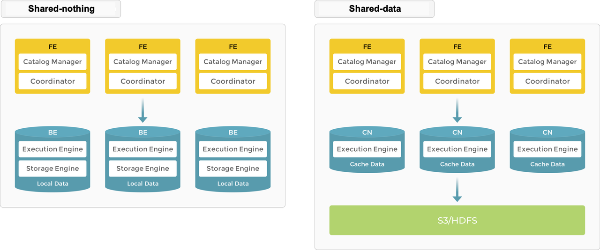
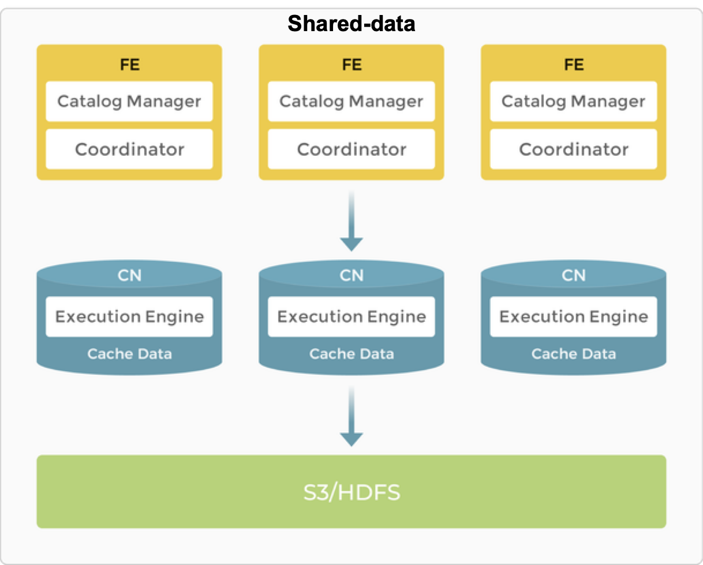

import QSOverview from '../_assets/commonMarkdown/quickstart-overview-tip.mdx'

# アーキテクチャ

StarRocks はシンプルなアーキテクチャを持っています。システム全体はフロントエンドとバックエンドの2種類のコンポーネントのみで構成されています。フロントエンドノードは **FE** と呼ばれます。バックエンドノードには **BE** と **CN** (Compute Nodes) の2種類があります。データがローカルストレージに保存される場合は BE が、オブジェクトストレージや HDFS に保存される場合は CN がデプロイされます。StarRocks は外部コンポーネントに依存しないため、デプロイとメンテナンスが簡単です。ノードはサービスのダウンタイムなしで水平スケールできます。さらに、StarRocks にはメタデータとサービスデータのレプリカメカニズムがあり、データの信頼性を高め、単一障害点 (SPOF) を効率的に防ぎます。

StarRocks は MySQL プロトコルと互換性があり、標準 SQL をサポートしています。ユーザーは MySQL クライアントから簡単に StarRocks に接続し、即座に価値あるインサイトを得ることができます。

## アーキテクチャの選択

StarRocks は共有なし (各 BE がローカルストレージにデータの一部を持つ) と共有データ (すべてのデータがオブジェクトストレージまたは HDFS にあり、各 CN はローカルストレージにキャッシュのみを持つ) をサポートしています。ニーズに応じてデータの保存場所を決定できます。

### 共有なし

ローカルストレージはリアルタイムクエリのクエリレイテンシを改善します。

典型的な大規模並列処理 (MPP) データベースとして、StarRocks は共有なしアーキテクチャをサポートしています。このアーキテクチャでは、BEs がデータの保存と計算の両方を担当します。BE モードでのローカルデータへの直接アクセスにより、データ転送やデータコピーを回避し、超高速のクエリと分析パフォーマンスを提供します。このアーキテクチャは、マルチレプリカデータストレージをサポートし、クラスタの高い同時実行クエリ処理能力を強化し、データの信頼性を確保します。最適なクエリパフォーマンスを追求するシナリオに適しています。

#### ノード

ストレージなしアーキテクチャでは、StarRocks は FEs と BEs の2種類のノードで構成されています。

- FEs はメタデータ管理と実行プランの構築を担当します。
- BEs はクエリプランを実行し、データを保存します。BEs はローカルストレージを利用してクエリを加速し、マルチレプリカメカニズムを使用して高いデータ可用性を確保します。

##### FE

FEs はメタデータ管理、クライアント接続管理、クエリプランニング、クエリスケジューリングを担当します。各 FE は BDB JE (Berkeley DB Java Edition) を使用してメタデータの完全なコピーをメモリに保存および維持し、すべての FE にわたって一貫したサービスを確保します。FEs はリーダー、フォロワー、オブザーバーとして機能できます。リーダーノードがクラッシュした場合、フォロワーが Raft プロトコルに基づいてリーダーを選出します。

| **FE の役割** | **メタデータ管理**                                                                                                                                                                                                                                                                                                                                                                                                | **リーダー選出**                |
| ----------- |------------------------------------------------------------------------------------------------------------------------------------------------------------------------------------------------------------------------------------------------------------------------------------------------------------------------------------------------------------------------------------------------------------------------| ---------------------------------- |
| Leader      | リーダー FE はメタデータの読み書きを行います。フォロワーとオブザーバーの FEs はメタデータを読み取ることしかできません。彼らはメタデータの書き込み要求をリーダー FE にルーティングします。リーダー FE はメタデータを更新し、その後 Raft プロトコルを使用してメタデータの変更をフォロワーとオブザーバーの FEs に同期します。メタデータの変更がフォロワー FEs の半数以上に同期された後にのみ、データの書き込みが成功したと見なされます。 | リーダー FE は技術的にはフォロワーノードでもあり、フォロワー FEs から選出されます。リーダー選出を行うには、クラスタ内のフォロワー FEs の半数以上がアクティブである必要があります。リーダー FE が失敗した場合、フォロワー FEs は別のリーダー選出を開始します。 |
| Follower    | フォロワーはメタデータを読み取ることしかできません。彼らはリーダー FE からログを同期して再生し、メタデータを更新します。                                                                                                                                                                                                                                                                                                              | フォロワーはリーダー選出に参加し、クラスタ内のフォロワーの半数以上がアクティブである必要があります。 |
| Observer   | オブザーバーはリーダー FE からログを同期して再生し、メタデータを更新します。                                                                                                                                                                                                                                                                                                                                           | オブザーバーはクラスタのクエリ同時実行性を高めるために主に使用されます。オブザーバーはリーダー選出に参加せず、したがってクラスタにリーダー選出の負担をかけません。|

##### BE

BEs はデータストレージと SQL 実行を担当します。

- データストレージ: BEs は同等のデータストレージ能力を持っています。FEs は事前に定義されたルールに基づいてデータを BEs に分配します。BEs は取り込んだデータを変換し、必要な形式でデータを書き込み、データのインデックスを生成します。

- SQL 実行: FEs は各 SQL クエリをクエリのセマンティクスに基づいて論理実行プランに解析し、その後、論理プランを BEs で実行可能な物理実行プランに変換します。目的のデータを保存している BEs がクエリを実行します。これにより、データの転送やコピーが不要になり、高いクエリパフォーマンスを実現します。

### 共有データ

オブジェクトストレージと HDFS はコスト、信頼性、スケーラビリティの利点を提供します。ストレージのスケーラビリティに加えて、CN ノードはデータの再バランスを必要とせずに追加および削除できます。ストレージとコンピュートが分離されているためです。

共有データアーキテクチャでは、BE は「コンピュートノード (CN)」に置き換えられ、データの計算タスクとホットデータのキャッシュのみを担当します。データは、Amazon S3、Google Cloud Storage、Azure Blob Storage、MinIO などの低コストで信頼性の高いリモートストレージシステムに保存されます。キャッシュがヒットした場合、クエリパフォーマンスは共有なしアーキテクチャと同等です。CN ノードは数秒でオンデマンドで追加または削除できます。このアーキテクチャはストレージコストを削減し、より良いリソース分離、高い弾力性とスケーラビリティを確保します。

共有データアーキテクチャは、共有なしアーキテクチャと同様にシンプルなアーキテクチャを維持しています。FE と CN の2種類のノードのみで構成されています。唯一の違いは、ユーザーがバックエンドオブジェクトストレージをプロビジョニングする必要があることです。

#### ノード

共有データアーキテクチャの FEs は、共有なしアーキテクチャと同じ機能を提供します。

BEs は CNs (Compute Nodes) に置き換えられ、ストレージ機能はオブジェクトストレージまたは HDFS にオフロードされます。CNs はステートレスなコンピュートノードであり、データの保存を除くすべての BE の機能を実行します。

#### ストレージ

StarRocks 共有データクラスタは、2つのストレージソリューションをサポートしています: オブジェクトストレージ (例えば、AWS S3、Google GCS、Azure Blob Storage、または MinIO) と HDFS。

共有データクラスタでは、データファイル形式は共有なしクラスタ (ストレージとコンピュートが結合された) と一致しています。データはセグメントファイルに整理され、クラウドネイティブテーブルで再利用されるさまざまなインデックス技術が使用されます。これらは、共有データクラスタで特に使用されるテーブルです。

#### キャッシュ

StarRocks 共有データクラスタは、データストレージと計算を分離し、それぞれを独立してスケールできるようにすることで、コストを削減し、弾力性を高めます。しかし、このアーキテクチャはクエリパフォーマンスに影響を与える可能性があります。

その影響を軽減するために、StarRocks はメモリ、ローカルディスク、リモートストレージを含む多層データアクセスシステムを確立し、さまざまなビジネスニーズによりよく対応します。

ホットデータに対するクエリはキャッシュを直接スキャンし、その後ローカルディスクをスキャンしますが、コールドデータはオブジェクトストレージからローカルキャッシュにロードされ、後続のクエリを加速します。ホットデータをコンピュートユニットの近くに保持することで、StarRocks は真に高性能な計算とコスト効率の高いストレージを実現します。さらに、コールドデータへのアクセスはデータプリフェッチ戦略で最適化されており、クエリのパフォーマンス制限を効果的に排除しています。

テーブルを作成する際にキャッシングを有効にすることができます。キャッシングが有効な場合、データはローカルディスクとバックエンドオブジェクトストレージの両方に書き込まれます。クエリ中、CN ノードはまずローカルディスクからデータを読み取ります。データが見つからない場合は、バックエンドオブジェクトストレージから取得され、同時にローカルディスクにキャッシュされます。

<QSOverview />
