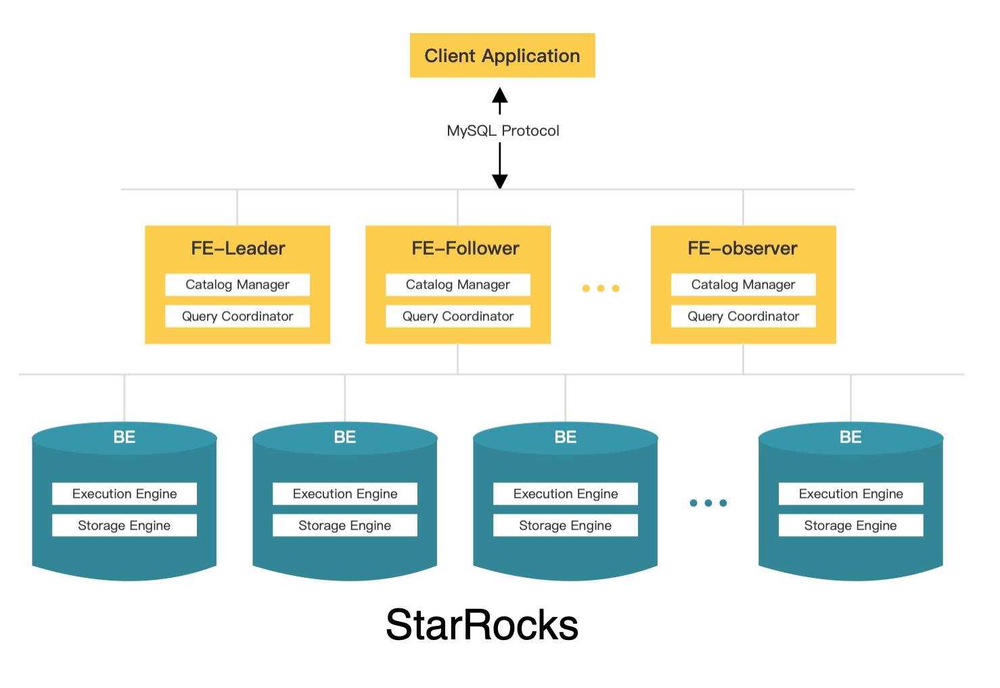
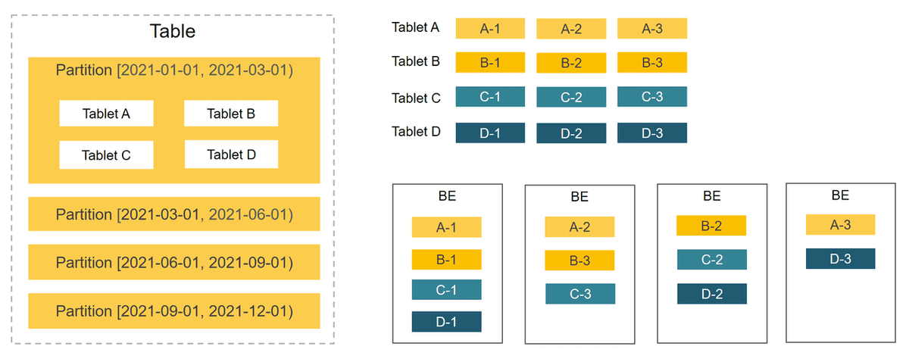

# アーキテクチャ

StarRocks はシンプルなアーキテクチャを持っています。システム全体は、フロントエンド (FE) とバックエンド (BE) の2種類のコンポーネントのみで構成されています。StarRocks は外部コンポーネントに依存せず、デプロイとメンテナンスが簡単です。FE と BE はサービスのダウンタイムなしで水平スケーリングが可能です。さらに、StarRocks にはメタデータとサービスデータのレプリカメカニズムがあり、データの信頼性を高め、単一障害点 (SPOF) を効率的に防ぎます。

StarRocks は MySQL プロトコルと互換性があり、標準 SQL をサポートしています。ユーザーは MySQL クライアントから簡単に StarRocks に接続し、即座に貴重なインサイトを得ることができます。

以下の図は StarRocks のアーキテクチャを示しています。

## FE と BE

FE はメタデータ管理、クライアント接続管理、クエリプランニング、クエリスケジューリングを担当します。各 FE はメモリ内にメタデータの完全なコピーを保持しており、FE 間でのサービスの差異を保証します。FE はリーダー、フォロワー、オブザーバーとして機能します。フォロワーは Paxos に似た BDB JE プロトコルに従ってリーダーを選出できます。BDB JE は Berkeley DB Java Edition の略です。

- リーダー
  - リーダー FE はフォロワー FE から選出されます。リーダー選出を行うには、クラスタ内のフォロワー FE の半数以上がアクティブである必要があります。リーダー FE が故障した場合、フォロワー FE は別のリーダー選出を開始します。
  - リーダー FE はメタデータの読み書きを行います。フォロワーとオブザーバー FE はメタデータを読み取ることしかできません。彼らはメタデータの書き込み要求をリーダー FE にルーティングします。リーダー FE はメタデータを更新し、その後 BDB JE を使用してメタデータの変更をフォロワーとオブザーバー FE に同期します。メタデータの変更がフォロワー FE の半数以上に同期された後にのみ、データの書き込みが成功したと見なされます。

- フォロワー
  - フォロワーはメタデータを読み取ることしかできません。彼らはリーダー FE からログを同期して再生し、メタデータを更新します。
  - フォロワーはリーダー選出に参加し、クラスタ内のフォロワーの半数以上がアクティブである必要があります。

- オブザーバー
  - オブザーバーは主にクラスタのクエリ同時実行性を高めるために使用されます。
  - オブザーバーはリーダー選出に参加しないため、クラスタにリーダー選出の負荷をかけません。
  - オブザーバーはリーダー FE からログを同期して再生し、メタデータを更新します。

BE はデータストレージと SQL 実行を担当します。

- データストレージ: BE は同等のデータストレージ能力を持っています。FE は事前に定義されたルールに基づいてデータを BE に分配します。BE は取り込んだデータを変換し、必要な形式でデータを書き込み、データのインデックスを生成します。

- SQL 実行: SQL クエリが到着すると、FE はクエリのセマンティクスに従ってそれを論理実行プランに解析し、BE で実行可能な物理実行プランに変換します。目的のデータを格納する BE がクエリを実行します。これにより、データの転送やコピーが不要になり、高いクエリパフォーマンスを実現します。

## データ管理

StarRocks はカラム指向のデータベースシステムです。データを管理するためにパーティショニングとバケッティングのメカニズムを使用します。テーブル内のデータはまず複数のパーティションに分割され、その後複数のタブレットに分割されます。タブレットは StarRocks におけるデータ管理の基本的な論理単位です。各タブレットは複数のレプリカを持つことができ、異なる BE に格納されます。タブレットの数を指定し、StarRocks にタブレットの管理を任せることができます。

パーティションとタブレットはテーブルスキャンを減少させ、クエリの同時実行性を高めます。レプリカはデータのバックアップと復元を容易にし、データ損失を防ぎます。

以下の図では、テーブルが時間に基づいて4つのパーティションに分割されています。最初のパーティション内のデータはさらに4つのタブレットに分割されています。各タブレットは3つのレプリカを持ち、それぞれ異なる BE に格納されています。

1つのテーブルが複数のタブレットに分割されているため、StarRocks は1つの SQL ステートメントをすべてのタブレットにスケジュールして並列処理を行い、複数の物理マシンとコアの計算能力を最大限に活用できます。これにより、クエリの負荷を複数のノードに分散させ、サービスの可用性を向上させます。必要に応じて物理マシンを追加して、高い同時実行性を実現できます。

タブレットの分布は物理ノードによって影響を受けたり制約されたりしません。BE の数が変わった場合 (例えば、BE を追加または削除した場合)、進行中のサービスは中断されることなく続行できます。ノードの変更はタブレットの自動移行をトリガーします。BE が追加されると、一部のタブレットは新しい BE に自動的に移行され、より均等なデータ分布が実現されます。BE が削除されると、これらの BE 上のタブレットは他の BE に自動的に移行され、レプリカの数が変わらないようにします。自動タブレット移行は、StarRocks クラスタの自動スケーリングを容易に実現し、手動でのデータ再配布の必要を排除します。

StarRocks はタブレットに対してマルチレプリカメカニズム (デフォルトで3) を使用します。レプリカは高いデータ信頼性とサービス可用性を保証します。1つのノードが故障しても、全体のサービスの可用性には影響しません。また、レプリカの数を増やして高いクエリの同時実行性を実現することもできます。