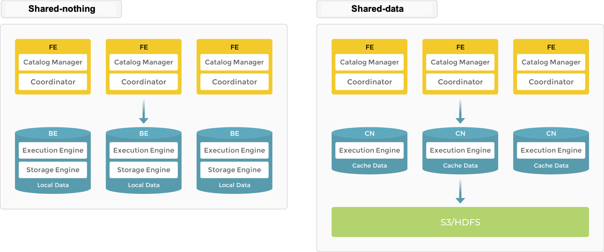
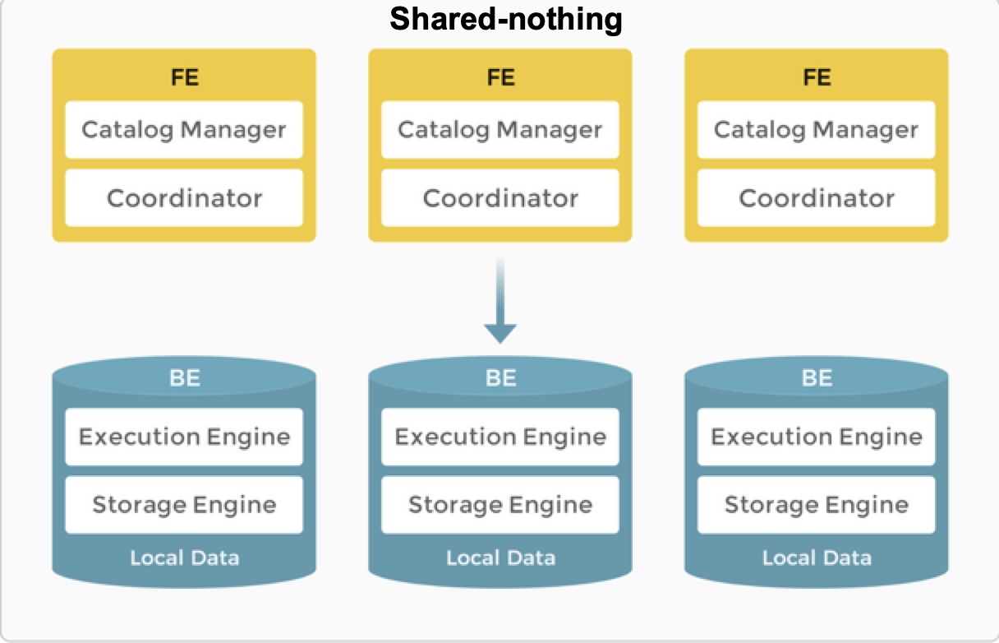
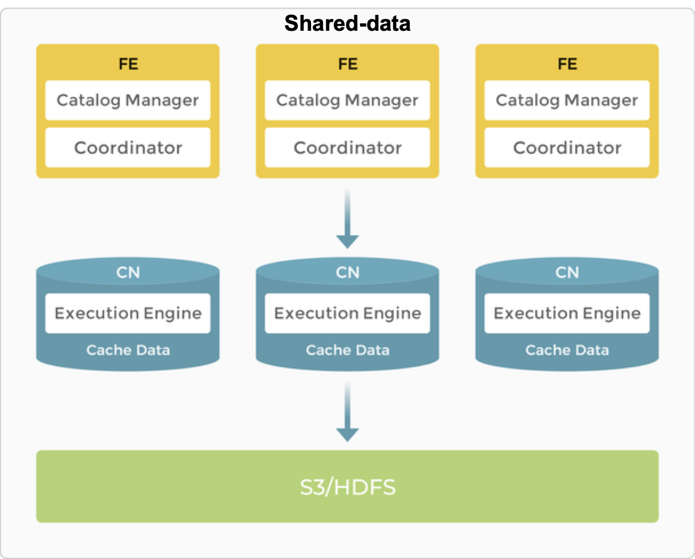

import QSOverview from '../_assets/commonMarkdown/quickstart-overview-tip.mdx'
import EditionSpecificFeature from '../_assets/commonMarkdown/Edition_Specific_Feature.mdx'

# アーキテクチャ

StarRocks はシンプルなアーキテクチャを持っています。システム全体は、フロントエンドとバックエンドの2種類のコンポーネントで構成されています。フロントエンドノードは **FE** と呼ばれます。バックエンドノードには **BE** と **CN** (Compute Nodes) の2種類があります。データがローカルストレージに保存される場合は BE が、オブジェクトストレージや HDFS に保存される場合は CN がデプロイされます。StarRocks は外部コンポーネントに依存せず、デプロイとメンテナンスが簡単です。ノードはサービスのダウンタイムなしに水平スケーリングできます。さらに、StarRocks にはメタデータとサービスデータのレプリカメカニズムがあり、データの信頼性を高め、単一障害点 (SPOF) を効率的に防ぎます。

StarRocks は MySQL プロトコルと互換性があり、標準 SQL をサポートしています。ユーザーは MySQL クライアントから簡単に StarRocks に接続し、即座に貴重なインサイトを得ることができます。

## アーキテクチャの選択

StarRocks は共有なし (各 BE がローカルストレージにデータの一部を持つ) と共有データ (すべてのデータがオブジェクトストレージまたは HDFS にあり、各 CN はローカルストレージにキャッシュのみを持つ) をサポートしています。ニーズに応じてデータの保存場所を決定できます。

### 共有なし

ローカルストレージはリアルタイムクエリのクエリ遅延を改善します。

典型的な大規模並列処理 (MPP) データベースとして、StarRocks は共有なしアーキテクチャをサポートしています。このアーキテクチャでは、BE がデータストレージと計算の両方を担当します。BE モードでのローカルデータへの直接アクセスにより、データ転送やデータコピーを避け、超高速のクエリと分析パフォーマンスを提供するローカル計算が可能になります。このアーキテクチャはマルチレプリカデータストレージをサポートし、高い同時実行クエリを処理するクラスタの能力を強化し、データの信頼性を確保します。最適なクエリパフォーマンスを追求するシナリオに適しています。

#### ノード

共有なしアーキテクチャでは、StarRocks は FE と BE の2種類のノードで構成されています。

- FE はメタデータ管理と実行計画の構築を担当します。
- BE はクエリ計画を実行し、データを保存します。BE はローカルストレージを利用してクエリを加速し、マルチレプリカメカニズムで高いデータ可用性を確保します。

##### FE

FE はメタデータ管理、クライアント接続管理、クエリ計画、クエリスケジューリングを担当します。各 FE は BDB JE (Berkeley DB Java Edition) を使用してメタデータの完全なコピーをメモリ内に保存および維持し、すべての FE 間で一貫したサービスを提供します。FE はリーダー、フォロワー、オブザーバーとして機能できます。リーダーノードがクラッシュした場合、フォロワーが Raft プロトコルに基づいてリーダーを選出します。

| **FE の役割** | **メタデータ管理**                                                                                                                                                                                                                                                                                                                                                                                                | **リーダー選出**                |
| ----------- |------------------------------------------------------------------------------------------------------------------------------------------------------------------------------------------------------------------------------------------------------------------------------------------------------------------------------------------------------------------------------------------------------------------------| ---------------------------------- |
| Leader      | リーダー FE はメタデータの読み書きを行います。フォロワーとオブザーバー FE はメタデータを読み取ることしかできません。彼らはメタデータの書き込み要求をリーダー FE にルーティングします。リーダー FE はメタデータを更新し、Raft プロトコルを使用してメタデータの変更をフォロワーとオブザーバー FE に同期します。メタデータの変更がフォロワー FE の半数以上に同期された後にのみ、データの書き込みが成功したと見なされます。 | リーダー FE は技術的にはフォロワーノードでもあり、フォロワー FE から選出されます。リーダー選出を行うには、クラスタ内のフォロワー FE の半数以上がアクティブである必要があります。リーダー FE が障害を起こした場合、フォロワー FE は新たなリーダー選出を開始します。 |
| Follower    | フォロワーはメタデータを読み取ることしかできません。彼らはリーダー FE からログを同期して再生し、メタデータを更新します。                                                                                                                                                                                                                                                                                                              | フォロワーはリーダー選出に参加し、クラスタ内のフォロワーの半数以上がアクティブである必要があります。 |
| Observer   | オブザーバーはリーダー FE からログを同期して再生し、メタデータを更新します。                                                                                                                                                                                                                                                                                                                                           | オブザーバーはクラスタのクエリ同時実行性を高めるために主に使用されます。オブザーバーはリーダー選出に参加せず、したがってクラスタにリーダー選出の負担をかけません。|

##### BE

BE はデータストレージと SQL 実行を担当します。

- データストレージ: BE は同等のデータストレージ能力を持っています。FE は事前定義されたルールに基づいてデータを BE に分配します。BE は取り込んだデータを変換し、必要な形式にデータを書き込み、データのインデックスを生成します。

- SQL 実行: FE は各 SQL クエリをクエリのセマンティクスに従って論理実行計画に解析し、その後、論理計画を BE で実行可能な物理実行計画に変換します。目的のデータを保存している BE がクエリを実行します。これにより、データの転送やコピーが不要になり、高いクエリパフォーマンスを実現します。

### 共有データ

オブジェクトストレージと HDFS はコスト、信頼性、スケーラビリティの利点を提供します。ストレージのスケーラビリティに加えて、CN ノードはデータの再バランスを必要とせずに追加および削除できます。

共有データアーキテクチャでは、BE は「コンピュートノード (CN)」に置き換えられ、データの計算タスクとホットデータのキャッシュのみを担当します。データは、Amazon S3、Google Cloud Storage、Azure Blob Storage、MinIO などの低コストで信頼性の高いリモートストレージシステムに保存されます。キャッシュがヒットした場合、クエリパフォーマンスは共有なしアーキテクチャと同等です。CN ノードは数秒でオンデマンドで追加または削除できます。このアーキテクチャはストレージコストを削減し、より良いリソース分離、高い弾力性とスケーラビリティを確保します。

共有データアーキテクチャは、共有なしアーキテクチャと同様にシンプルなアーキテクチャを維持しています。FE と CN の2種類のノードのみで構成されています。唯一の違いは、ユーザーがバックエンドオブジェクトストレージをプロビジョニングする必要があることです。

#### ノード

共有データアーキテクチャの FE は、共有なしアーキテクチャと同じ機能を提供します。

BE は CN (Compute Nodes) に置き換えられ、ストレージ機能はオブジェクトストレージまたは HDFS にオフロードされます。CN はステートレスなコンピュートノードで、データのストレージを除く BE のすべての機能を実行します。

#### ストレージ

StarRocks 共有データクラスタは、オブジェクトストレージ (例えば、AWS S3、Google GCS、Azure Blob Storage、MinIO) と HDFS の2つのストレージソリューションをサポートしています。

共有データクラスタでは、データファイル形式は共有なしクラスタと一致しています (ストレージと計算が結合されています)。データはセグメントファイルに組織化され、クラウドネイティブテーブルでさまざまなインデックス技術が再利用されます。これらのテーブルは、特に共有データクラスタで使用されます。

#### キャッシュ

StarRocks 共有データクラスタは、データストレージと計算を分離し、それぞれを独立してスケールさせることができるため、コストを削減し、弾力性を高めます。ただし、このアーキテクチャはクエリパフォーマンスに影響を与える可能性があります。

その影響を軽減するために、StarRocks はメモリ、ローカルディスク、リモートストレージを含む多層データアクセスシステムを確立し、さまざまなビジネスニーズによりよく対応します。

ホットデータに対するクエリはキャッシュを直接スキャンし、その後ローカルディスクをスキャンしますが、コールドデータはオブジェクトストレージからローカルキャッシュにロードされ、後続のクエリを加速します。ホットデータをコンピュートユニットに近づけることで、StarRocks は真に高性能な計算とコスト効率の高いストレージを実現します。さらに、コールドデータへのアクセスはデータプリフェッチ戦略で最適化されており、クエリのパフォーマンス制限を効果的に排除しています。

テーブルを作成する際にキャッシングを有効にすることができます。キャッシングが有効になっている場合、データはローカルディスクとバックエンドオブジェクトストレージの両方に書き込まれます。クエリ中、CN ノードはまずローカルディスクからデータを読み取ります。データが見つからない場合、バックエンドオブジェクトストレージから取得され、同時にローカルディスクにキャッシュされます。

## Shared-nothingとShared-dataクラスター間の機能の違い

このセクションでは、Shared-nothing クラスターと Shared-data クラスターでサポートされている機能の違いを一覧表示します。

### リアルタイム分析と主キーテーブル

| 機能 | Shared-nothing | Shared-data |
| ---------------------------------------------------- | -------------- | --------------- |
| 条件付き更新 | v2.5+ | v3.1+ |
| 部分更新 (列モード) | v3.1 | サポート予定 |
| 部分更新 (行モード) | v2.3+ | v3.1+ |
| 条件付き更新を伴う部分更新 | v3.1+ | v3.4.1+ |
| 主キーインデックスの永続化 | v2.3+ | v3.2+ |
| 主キーからの ORDER BY 列の分離 | v3.0+ | v3.1+ |
| 主キーテーブルの豊富な UPDATE およびDELETE構文 | v3.0+ | v3.1+ |

### ストレージエンジン

| 機能 | Shared-nothing | Shared-data |
| ---------------------------------------------------- | -------------- | --------------- |
| 高速スキーマ進化 | v3.2+ | v4.0+ |
| ファイルバンドリング | 該当なし | v4.0+ |
| 転置インデックス | v3.3+ | v4.1+ |
| 手動コンパクション | v3.1+ | v3.3+ |
| 行ストア | v3.2+ | サポート予定 |
| STRUCT フィールドの追加/削除 | v3.3.2+ | v3.3.5+ |
| ベクトルインデックス | v3.4+ | サポート予定 |

### データ分散

| 機能 | Shared-nothing | Shared-data |
| ---------------------------------------------------- | -------------- | --------------- |
| 式パーティショニング | v3.0+ | v3.1.1+ |
| リストパーティショニング | v3.1+ | v3.1.1+ |
| ランダムバケット化 | v3.1+ | v3.2+ |
| ランダムバケット化の最適化 (サブパーティション付き) | v3.2+ | v3.2+ |
| 多段階式パーティションの統合構文 | v3.4+ | v3.4+ |
| テーブルの最適化: バケット化の変更 | v3.2+ | v3.3+ |
| テーブルの最適化: オンラインでのバケット化の変更 | v3.3.3+ | 該当なし |
| 範囲ベースの分散 | v4.1+ | v4.1+ |

### クエリパフォーマンス

| 機能 | Shared-nothing | Shared-data |
| ---------------------------------------------------- | -------------- | --------------- |
| クロスノードデータキャッシュ共有 | 該当なし | v3.5.1+ |
| 生成列 | v3.1+ | v3.5+ |
| クエリキャッシュ | v2.5+ | v3.4+ |
| ロールアップと同期マテリアライズドビュー | v1.x+ | v3.3+ |

<EditionSpecificFeature />

<QSOverview />