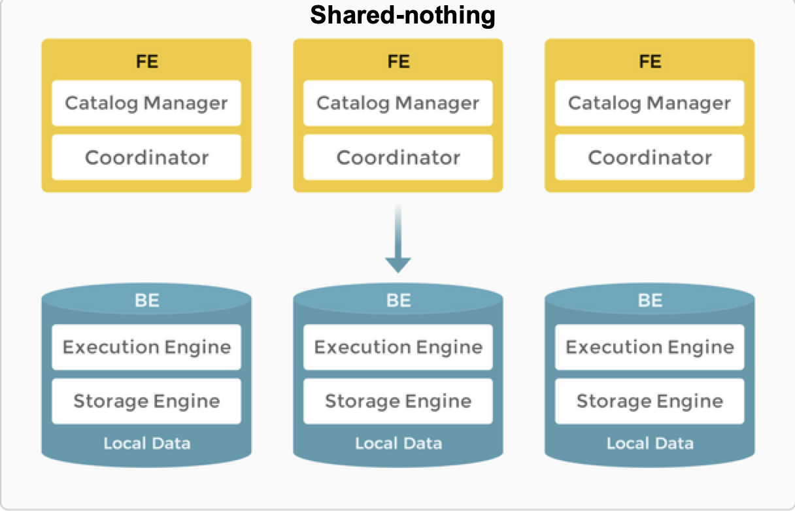

import QSOverview from '../_assets/commonMarkdown/quickstart-overview-tip.mdx'

# アーキテクチャ

StarRocks のアーキテクチャはシンプルです。システム全体はフロントエンドとバックエンドの2種類のコンポーネントのみで構成されています。フロントエンドノードは **FE** と呼ばれます。バックエンドノードには **BE** と **CN** (Compute Nodes) の2種類があります。データのローカルストレージを使用する場合は BE が、データがオブジェクトストレージや HDFS に保存される場合は CN がデプロイされます。StarRocks は外部コンポーネントに依存しないため、デプロイとメンテナンスが簡単です。ノードはサービスのダウンタイムなしで水平スケーリングできます。さらに、StarRocks にはメタデータとサービスデータのレプリカメカニズムがあり、データの信頼性を高め、単一障害点 (SPOF) を効率的に防ぎます。

StarRocks は MySQL プロトコルと互換性があり、標準 SQL をサポートしています。ユーザーは MySQL クライアントから簡単に StarRocks に接続し、即座に貴重なインサイトを得ることができます。

## アーキテクチャの選択

StarRocks は、共有なし (各 BE がローカルストレージにデータの一部を持つ) と共有データ (すべてのデータがオブジェクトストレージまたは HDFS にあり、各 CN はローカルストレージにキャッシュのみを持つ) をサポートしています。ニーズに応じてデータの保存場所を決定できます。

### 共有なし

ローカルストレージはリアルタイムクエリのクエリレイテンシを改善します。

典型的な大規模並列処理 (MPP) データベースとして、StarRocks は共有なしアーキテクチャをサポートしています。このアーキテクチャでは、BE がデータストレージと計算の両方を担当します。BE モードでのローカルデータへの直接アクセスにより、データ転送やデータコピーを避け、超高速のクエリと分析パフォーマンスを提供するローカル計算が可能です。このアーキテクチャは、マルチレプリカデータストレージをサポートし、クラスタの高い同時実行クエリ処理能力を強化し、データの信頼性を確保します。最適なクエリパフォーマンスを追求するシナリオに適しています。

#### ノード

ストレージなしアーキテクチャでは、StarRocks は FE と BE の2種類のノードで構成されています。

- FE はメタデータ管理と実行プランの構築を担当します。
- BE はクエリプランを実行し、データを保存します。BE はローカルストレージを利用してクエリを高速化し、マルチレプリカメカニズムを使用して高いデータ可用性を確保します。

##### FE

FE はメタデータ管理、クライアント接続管理、クエリプランニング、クエリスケジューリングを担当します。各 FE は BDB JE (Berkeley DB Java Edition) を使用してメタデータの完全なコピーをメモリに保存および維持し、すべての FE 間で一貫したサービスを確保します。FE はリーダー、フォロワー、オブザーバーとして機能できます。リーダーノードがクラッシュした場合、フォロワーが Raft プロトコルに基づいてリーダーを選出します。

| **FE の役割** | **メタデータ管理**                                                                                                                                                                                                                                                                                                                                                                                                | **リーダー選出**                |
| ----------- |------------------------------------------------------------------------------------------------------------------------------------------------------------------------------------------------------------------------------------------------------------------------------------------------------------------------------------------------------------------------------------------------------------------------| ---------------------------------- |
| Leader      | リーダー FE はメタデータの読み書きを行います。フォロワーとオブザーバー FE はメタデータを読み取ることしかできません。彼らはメタデータの書き込み要求をリーダー FE にルーティングします。リーダー FE はメタデータを更新し、Raft プロトコルを使用してメタデータの変更をフォロワーとオブザーバー FE に同期します。メタデータの変更がフォロワー FE の半数以上に同期された後にのみ、データの書き込みが成功と見なされます。 | リーダー FE は技術的にはフォロワーノードでもあり、フォロワー FE から選出されます。リーダー選出を行うには、クラスタ内のフォロワー FE の半数以上がアクティブである必要があります。リーダー FE が失敗した場合、フォロワー FE は別のリーダー選出ラウンドを開始します。 |
| Follower    | フォロワーはメタデータを読み取ることしかできません。彼らはリーダー FE からログを同期して再生し、メタデータを更新します。                                                                                                                                                                                                                                                                                                              | フォロワーはリーダー選出に参加し、クラスタ内のフォロワーの半数以上がアクティブである必要があります。 |
| Observer   | オブザーバーはリーダー FE からログを同期して再生し、メタデータを更新します。                                                                                                                                                                                                                                                                                                                                           | オブザーバーはクラスタのクエリ同時実行性を高めるために主に使用されます。オブザーバーはリーダー選出に参加せず、したがってクラスタにリーダー選出の負荷をかけません。|

##### BE

BE はデータストレージと SQL 実行を担当します。

- データストレージ: BE は同等のデータストレージ機能を持っています。FE は事前定義されたルールに基づいてデータを BE に分配します。BE は取り込まれたデータを変換し、必要な形式にデータを書き込み、データのインデックスを生成します。

- SQL 実行: FE は各 SQL クエリをクエリのセマンティクスに従って論理実行プランに解析し、その後、BE で実行可能な物理実行プランに変換します。目的のデータを保存する BE がクエリを実行します。これにより、データの転送やコピーが不要になり、高いクエリパフォーマンスを実現します。

### 共有データ

オブジェクトストレージと HDFS はコスト、信頼性、スケーラビリティの利点を提供します。ストレージのスケーラビリティに加えて、CN ノードはデータの再バランスを必要とせずに追加および削除できます。ストレージとコンピュートが分離されているためです。

共有データアーキテクチャでは、BE は「コンピュートノード (CN)」に置き換えられ、データの計算タスクとホットデータのキャッシュのみを担当します。データは Amazon S3、GCP、Azure Blob Storage、MinIO などの低コストで信頼性の高いリモートストレージシステムに保存されます。キャッシュがヒットした場合、クエリパフォーマンスは共有なしアーキテクチャと同等です。CN ノードは数秒でオンデマンドで追加または削除できます。このアーキテクチャは、ストレージコストを削減し、リソースの分離を改善し、高い弾力性とスケーラビリティを確保します。

共有データアーキテクチャは、共有なしアーキテクチャと同様にシンプルなアーキテクチャを維持しています。FE と CN の2種類のノードのみで構成されています。唯一の違いは、ユーザーがバックエンドオブジェクトストレージをプロビジョニングする必要があることです。

#### ノード

共有データアーキテクチャの FE は、共有なしアーキテクチャと同じ機能を提供します。

BE は CN (Compute Nodes) に置き換えられ、ストレージ機能はオブジェクトストレージまたは HDFS にオフロードされます。CN はステートレスなコンピュートノードであり、データのストレージを除く BE のすべての機能を実行します。

#### ストレージ

StarRocks 共有データクラスタは、オブジェクトストレージ (例えば、AWS S3、Google GCS、Azure Blob Storage、または MinIO) と HDFS の2つのストレージソリューションをサポートしています。

共有データクラスタでは、データファイル形式は共有なしクラスタ (ストレージとコンピュートが結合されたもの) と一貫しています。データはセグメントファイルに整理され、クラウドネイティブテーブル (共有データクラスタで特に使用されるテーブル) でさまざまなインデックス技術が再利用されます。

#### キャッシュ

StarRocks 共有データクラスタは、データストレージと計算を分離し、それぞれを独立してスケーリングできるようにすることで、コストを削減し、弾力性を向上させます。しかし、このアーキテクチャはクエリパフォーマンスに影響を与える可能性があります。

その影響を軽減するために、StarRocks はメモリ、ローカルディスク、リモートストレージを含むマルチティアデータアクセスシステムを確立し、さまざまなビジネスニーズにより適切に対応します。

ホットデータに対するクエリはキャッシュを直接スキャンし、その後ローカルディスクをスキャンしますが、コールドデータはオブジェクトストレージからローカルキャッシュにロードされ、後続のクエリを高速化します。ホットデータをコンピュートユニットの近くに保持することで、StarRocks は真に高性能な計算とコスト効率の高いストレージを実現します。さらに、コールドデータへのアクセスはデータプリフェッチ戦略で最適化されており、クエリのパフォーマンス制限を効果的に排除します。

キャッシュはテーブル作成時に有効にできます。キャッシュが有効になっている場合、データはローカルディスクとバックエンドオブジェクトストレージの両方に書き込まれます。クエリ中、CN ノードはまずローカルディスクからデータを読み取ります。データが見つからない場合は、バックエンドオブジェクトストレージから取得され、同時にローカルディスクにキャッシュされます。

<QSOverview />