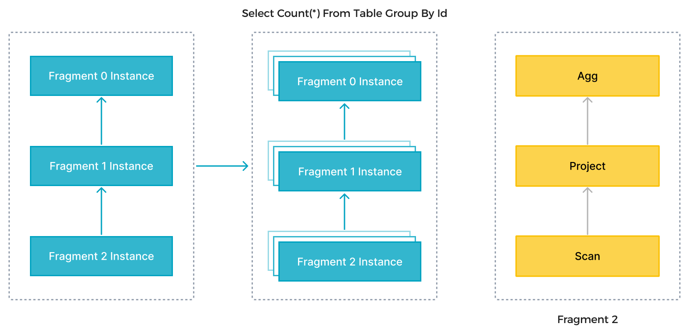
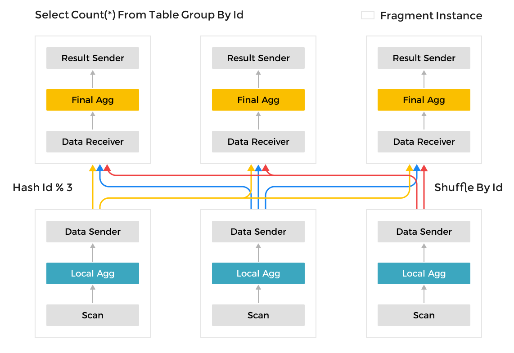
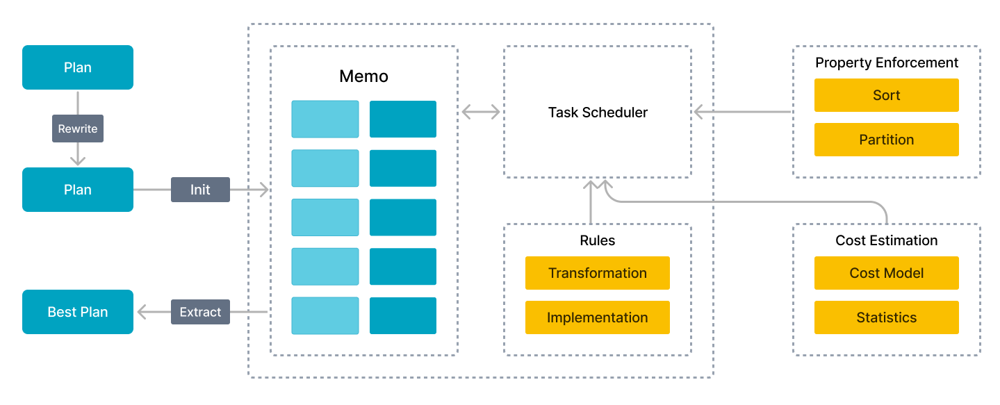
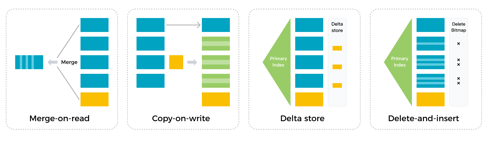
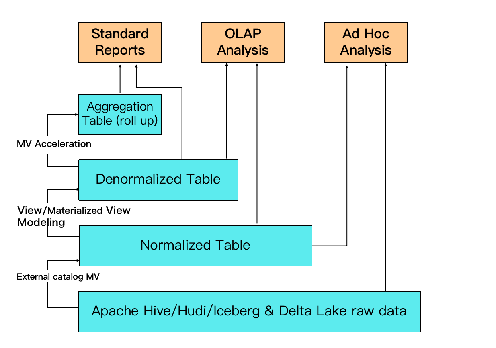
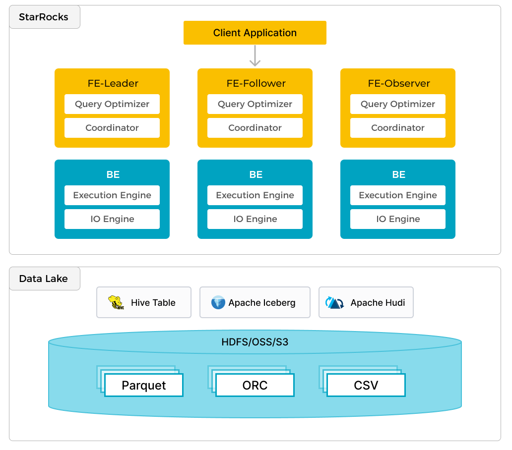

# Features

StarRocks は、スケールに応じたデータに対して高速でリアルタイムな分析体験を提供する豊富な機能を備えています。

## MPP フレームワーク

StarRocks は、マッシブリー・パラレル・プロセッシング (MPP) フレームワークを採用しています。1 つのクエリリクエストは、複数の物理的な計算ユニットに分割され、複数のマシンで並行して実行されます。各マシンには専用の CPU とメモリリソースがあります。MPP フレームワークは、すべての CPU コアとマシンのリソースをフルに活用します。クラスターをスケールアウトすることで、単一クエリのパフォーマンスを継続的に向上させることができます。

上の図では、StarRocks は SQL ステートメントをそのセマンティクスに基づいて複数の論理実行ユニット（クエリフラグメント）に解析します。各フラグメントは、計算の複雑さに基づいて、1 つまたは複数の物理実行ユニット（フラグメントインスタンス）によって実装されます。物理実行ユニットは、StarRocks における最小のスケジューリングユニットです。これらはバックエンド (BEs) にスケジュールされて実行されます。1 つの論理実行ユニットは、Scan、Project、Agg オペレーターなど、1 つ以上のオペレーターを含むことができます。各物理実行ユニットはデータの一部のみを処理し、その結果がマージされて最終的なデータが生成されます。**論理実行ユニットの並列実行は、すべての CPU コアと物理マシンのリソースをフルに活用し、クエリ速度を加速します。**

多くの他のデータ分析システムで使用される Scatter-Gather フレームワークとは異なり、MPP フレームワークはクエリリクエストを処理するためにより多くのリソースを活用できます。Scatter-Gather フレームワークでは、最終的なマージ操作を実行できるのは Gather ノードのみです。MPP フレームワークでは、データはマージ操作のために複数のノードにシャッフルされます。高カーディナリティフィールドでの Group By や大規模テーブルジョインなどの複雑なクエリにおいて、StarRocks の MPP フレームワークは Scatter-Gather フレームワークに比べて顕著なパフォーマンスの優位性を持っています。

## 完全ベクトル化された実行エンジン

完全ベクトル化された実行エンジンは、データを列指向で組織し処理するため、CPU 処理能力をより効率的に活用します。具体的には、StarRocks はデータを保存し、メモリ内でデータを組織し、SQL オペレーターをすべて列指向で計算します。列指向の組織は CPU キャッシュをフルに活用します。列指向の計算は、仮想関数呼び出しと分岐判断の数を減らし、より十分な CPU 命令フローを実現します。

ベクトル化された実行エンジンはまた、SIMD 命令をフルに活用します。このエンジンは、より少ない命令でより多くのデータ操作を完了できます。標準データセットに対するテストでは、このエンジンがオペレーターの全体的なパフォーマンスを 3 倍から 10 倍向上させることが示されています。

オペレーターのベクトル化に加えて、StarRocks はクエリエンジンのために他の最適化も実装しています。例えば、StarRocks は Operation on Encoded Data 技術を使用して、エンコードされた文字列上で直接オペレーターを実行し、デコードの必要をなくしています。これにより、SQL の複雑さが顕著に減少し、クエリ速度が 2 倍以上向上します。

## ストレージとコンピュートの分離

[storage-compute separation architecture](./Architecture.md) は 3.0 から導入されました。このアーキテクチャでは、コンピューティングとストレージが分離され、リソースの分離、コンピュートノードの弾力的なスケーリング、高性能なクエリを実現します。ストレージとコンピュートの分離は、StarRocks により高い柔軟性、性能、データの可用性、低コストをもたらします。

ストレージとコンピュートの分離モードでは、コンピューティングとストレージが分離され、独立してスケーリング可能であり、ユーザーがコンピュートノードを追加したいときにストレージをスケールする必要があるというストレージとコンピュートが結合されたモードで長く存在していたコストを排除します。さらに、コンピューティングは数秒以内に動的にスケールし、特にトラフィックのピークと谷が顕著な場合にリソース利用率を向上させます。

ストレージ層は、オブジェクトストレージのほぼ無制限の容量と高い信頼性を活用して、大量のデータストレージとデータの永続性を実現します。StarRocks は、AWS S3、Google Cloud Storage、Azure Blob Storage、HDFS、その他の S3 互換ストレージ（MinIO など）と連携できます。

ユーザーは、StarRocks をパブリッククラウド、プライベートクラウド、またはオンプレミスのデータセンターにデプロイすることができます。StarRocks は Kubernetes ベースのデプロイメントをサポートし、ストレージとコンピュートが分離されたクラスターの自動デプロイメントのための Operator を提供します。

ストレージとコンピュートの分離モードにおける StarRocks は、ストレージとコンピュートが結合されたモードと同じ機能を提供します。データの書き込みとホットデータのクエリパフォーマンスも同様です。ユーザーは、ストレージとコンピュートが結合されたモードと同様に、データの更新、データレイク分析、マテリアライズドビューの加速を行うことができます。

## コストベースオプティマイザ

複数テーブルジョインクエリのパフォーマンスを最適化するのは難しいです。実行エンジンだけでは、複数テーブルジョインクエリのシナリオで実行計画の複雑さが数桁異なる可能性があるため、優れたパフォーマンスを提供することはできません。関連するテーブルが多いほど、実行計画も多くなり、最適な計画を選ぶのが NP 難しい問題になります。優れたクエリオプティマイザだけが、効率的な複数テーブル分析のための比較的最適なクエリ計画を選択できます。

StarRocks は、ゼロから新しい [CBO](../using_starrocks/Cost_based_optimizer.md) を設計しました。この CBO は、カスケードのようなフレームワークを採用し、ベクトル化された実行エンジンのために深くカスタマイズされ、多くの最適化と革新を備えています。これらの最適化には、共通テーブル式 (CTE) の再利用、サブクエリの書き換え、Lateral Join、Join Reorder、分散ジョイン実行の戦略選択、低カーディナリティの最適化が含まれます。CBO は、合計 99 の TPC-DS SQL ステートメントをサポートしています。

CBO により、StarRocks は競合他社よりも優れた複数テーブルジョインクエリパフォーマンスを提供し、特に複雑な複数テーブルジョインクエリにおいて優れています。

## リアルタイムで更新可能な列指向ストレージエンジン

StarRocks は、同じタイプのデータを連続して保存できる列指向ストレージエンジンです。列指向ストレージでは、データをより効率的にエンコードでき、圧縮率を高め、ストレージコストを削減します。列指向ストレージは、総データ読み取り I/O を削減し、クエリパフォーマンスを向上させます。さらに、ほとんどの OLAP シナリオでは、特定の列のみがクエリされます。列指向ストレージにより、ユーザーは列の一部のみをクエリでき、ディスク I/O を大幅に削減します。

StarRocks は、ほぼリアルタイムの分析のために数秒以内にデータをロードできます。StarRocks のストレージエンジンは、各データ取り込み操作の原子性、一貫性、分離性、耐久性 (ACID) を保証します。データロードトランザクションでは、トランザクション全体が成功するか失敗するかのいずれかです。並行トランザクションは互いに影響を与えず、トランザクションレベルの分離を提供します。

StarRocks のストレージエンジンは、Delete-and-insert パターンを使用しており、効率的な部分更新と Upsert 操作を可能にします。ストレージエンジンは、プライマリキーインデックスを使用してデータを迅速にフィルタリングし、データ読み取り時に Sort や Merge 操作を必要としません。このエンジンは、セカンダリインデックスもフルに活用できます。大量のデータ更新でも高速で予測可能なクエリパフォーマンスを提供します。

## インテリジェントなマテリアライズドビュー

StarRocks は、インテリジェントな [materialized views](../using_starrocks/async_mv/Materialized_view.md) を使用して、クエリとデータウェアハウスのレイヤリングを加速します。他の類似製品のマテリアライズドビューとは異なり、ベーステーブルとの手動データ同期が必要なところ、StarRocks のマテリアライズドビューは、ベーステーブルのデータ変更に応じて自動的にデータを更新し、追加のメンテナンス操作を必要としません。さらに、マテリアライズドビューの選択も自動です。StarRocks がクエリパフォーマンスを向上させる適切なマテリアライズドビュー (MV) を特定した場合、クエリを自動的に書き換えて MV を利用します。このインテリジェントなプロセスは、手動の介入を必要とせずにクエリ効率を大幅に向上させます。

StarRocks の MV は、従来の ETL データモデリングプロセスを置き換えることができます。上流のアプリケーションでデータを変換する代わりに、StarRocks 内で MV を使用してデータを変換するオプションがあり、データ処理パイプラインを簡素化します。

例えば、図では、データレイク上の生データを使用して、外部 MV に基づいて正規化テーブルを作成できます。非正規化テーブルは、非同期マテリアライズドビューを通じて正規化テーブルから作成できます。別の MV は、正規化テーブルから作成され、高い同時実行クエリとより良いクエリパフォーマンスをサポートします。

## データレイク分析

ローカルデータの効率的な分析に加えて、StarRocks は [data lakes](../data_source/catalog/catalog_overview.md) に保存されたデータを分析するためのコンピュートエンジンとして機能します。Apache Hive、Apache Iceberg、Apache Hudi、Delta Lake などが含まれます。StarRocks の重要な機能の 1 つは、外部カタログであり、外部で管理されるメタストアへのリンクとして機能します。この機能により、データ移行の必要なく、外部データソースをシームレスにクエリすることができます。このため、ユーザーは HDFS や Amazon S3 などの異なるシステムから、Parquet、ORC、CSV などのさまざまなファイル形式でデータを分析できます。

前述の図は、StarRocks がデータの計算と分析を担当し、データレイクがデータの保存、組織化、メンテナンスを担当するデータレイク分析シナリオを示しています。データレイクは、オープンストレージ形式でデータを保存し、柔軟なスキーマを使用して、さまざまな BI、AI、アドホック、レポートのユースケースに対して「単一の真実の源」に基づくレポートを生成することを可能にします。StarRocks は、そのベクトル化エンジンと CBO の利点をフルに活用し、データレイク分析のパフォーマンスを大幅に向上させます。