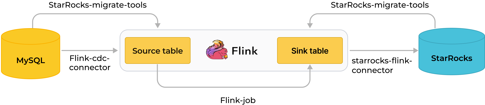
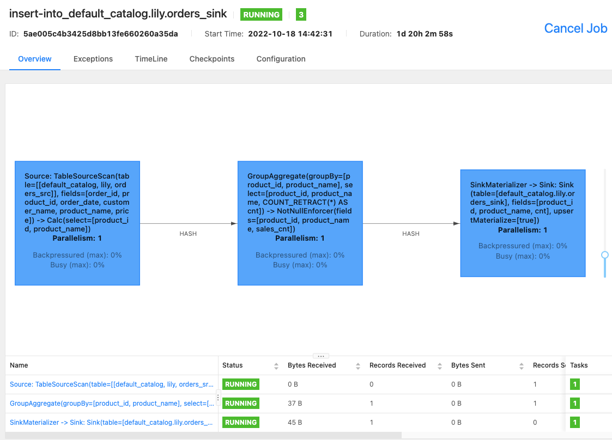

# MySQL からのリアルタイム同期

import InsertPrivNote from '../_assets/commonMarkdown/insertPrivNote.md'

StarRocks は、MySQL から StarRocks へのデータをリアルタイムで同期する複数の方法をサポートしており、大量データの低遅延リアルタイム分析を実現します。

このトピックでは、Apache Flink® を通じて MySQL から StarRocks へデータをリアルタイム（数秒以内）で同期する方法を説明します。

<InsertPrivNote />

## 仕組み

:::tip

Flink CDC は MySQL から Flink への同期に使用されます。このトピックでは、バージョン 3.0 未満の Flink CDC を使用しているため、SMT を使用してテーブルスキーマを同期します。ただし、Flink CDC 3.0 を使用する場合、StarRocks へのテーブルスキーマの同期に SMT を使用する必要はありません。Flink CDC 3.0 は、MySQL データベース全体のスキーマ、シャード化されたデータベースとテーブルのスキーマを同期することもでき、スキーマ変更の同期もサポートしています。詳細な使用方法については、[Streaming ELT from MySQL to StarRocks](https://nightlies.apache.org/flink/flink-cdc-docs-stable/docs/get-started/quickstart/mysql-to-starrocks) を参照してください。

:::

以下の図は、同期プロセス全体を示しています。



MySQL から Flink を通じて StarRocks へのリアルタイム同期は、データベース & テーブルスキーマの同期とデータの同期の 2 段階で実装されます。まず、SMT が MySQL データベース & テーブルスキーマを StarRocks のテーブル作成文に変換します。その後、Flink クラスターが Flink ジョブを実行して、MySQL のフルデータと増分データを StarRocks に同期します。

:::info

同期プロセスは、正確に一度だけのセマンティクスを保証します。

:::

**同期プロセス**:

1. データベース & テーブルスキーマの同期。

   SMT は、同期対象の MySQL データベース & テーブルのスキーマを読み取り、StarRocks に宛先データベース & テーブルを作成するための SQL ファイルを生成します。この操作は、SMT の設定ファイルに基づいて MySQL と StarRocks の情報を使用して行われます。

2. データの同期。

   a. Flink SQL クライアントがデータロード文 `INSERT INTO SELECT` を実行し、Flink クラスターに 1 つ以上の Flink ジョブを送信します。

   b. Flink クラスターが Flink ジョブを実行してデータを取得します。Flink CDC コネクタは、最初にソースデータベースから完全な履歴データを読み取り、シームレスに増分読み取りに切り替えて、データを flink-connector-starrocks に送信します。

   c. flink-connector-starrocks はデータをミニバッチで蓄積し、各バッチのデータを StarRocks に同期します。

    :::info

    MySQL のデータ操作言語 (DML) 操作のみが StarRocks に同期されます。データ定義言語 (DDL) 操作は同期されません。

    :::

## シナリオ

MySQL からのリアルタイム同期は、データが常に変化する幅広いユースケースに対応しています。実際のユースケースとして「商品の売上ランキングのリアルタイム表示」を例にとります。

Flink は MySQL の元の注文テーブルに基づいて商品の売上ランキングをリアルタイムで計算し、そのランキングを StarRocks の主キーテーブルにリアルタイムで同期します。ユーザーは StarRocks にビジュアライゼーションツールを接続して、ランキングをリアルタイムで確認し、オンデマンドで運用上の洞察を得ることができます。

## 準備

### 同期ツールのダウンロードとインストール

MySQL からデータを同期するには、以下のツールをインストールする必要があります: SMT、Flink、Flink CDC コネクタ、および flink-connector-starrocks。

1. Flink をダウンロードしてインストールし、Flink クラスターを起動します。この手順は [Flink 公式ドキュメント](https://nightlies.apache.org/flink/flink-docs-release-1.13/docs/try-flink/local_installation/) に従って実行することもできます。

   a. Flink を実行する前に、オペレーティングシステムに Java 8 または Java 11 をインストールします。以下のコマンドを実行して、インストールされている Java のバージョンを確認できます。

    ```Bash
        # Java のバージョンを表示します。
        java -version
        
        # 以下の出力が返された場合、Java 8 がインストールされています。
        java version "1.8.0_301"
        Java(TM) SE Runtime Environment (build 1.8.0_301-b09)
        Java HotSpot(TM) 64-Bit Server VM (build 25.301-b09, mixed mode)
    ```

   b. [Flink インストールパッケージ](https://flink.apache.org/downloads.html) をダウンロードして解凍します。Flink 1.14 以降を使用することをお勧めします。最小許可バージョンは Flink 1.11 です。このトピックでは Flink 1.14.5 を使用します。

   ```Bash
      # Flink をダウンロードします。
      wget https://archive.apache.org/dist/flink/flink-1.14.5/flink-1.14.5-bin-scala_2.11.tgz
      # Flink を解凍します。  
      tar -xzf flink-1.14.5-bin-scala_2.11.tgz
      # Flink ディレクトリに移動します。
      cd flink-1.14.5
    ```

   c. Flink クラスターを起動します。

   ```Bash
      # Flink クラスターを起動します。
      ./bin/start-cluster.sh
      
      # 以下の出力が返された場合、Flink クラスターが起動されています。
      Starting cluster.
      Starting standalonesession daemon on host.
      Starting taskexecutor daemon on host.
    ```

2. [Flink CDC コネクタ](https://github.com/ververica/flink-cdc-connectors/releases) をダウンロードします。このトピックではデータソースとして MySQL を使用しているため、`flink-sql-connector-mysql-cdc-x.x.x.jar` をダウンロードします。コネクタのバージョンは [Flink](https://github.com/ververica/flink-cdc-connectors/releases) バージョンと一致している必要があります。このトピックでは Flink 1.14.5 を使用し、`flink-sql-connector-mysql-cdc-2.2.0.jar` をダウンロードできます。

    ```Bash
    wget https://repo1.maven.org/maven2/com/ververica/flink-sql-connector-mysql-cdc/2.1.1/flink-sql-connector-mysql-cdc-2.2.0.jar
    ```

3. [flink-connector-starrocks](https://search.maven.org/artifact/com.starrocks/flink-connector-starrocks) をダウンロードします。バージョンは Flink バージョンと一致している必要があります。

    > flink-connector-starrocks パッケージ `x.x.x_flink-y.yy _ z.zz.jar` には 3 つのバージョン番号が含まれています:
    >
    > - `x.x.x` は flink-connector-starrocks のバージョン番号です。
    > - `y.yy` はサポートされている Flink バージョンです。
    > - `z.zz` は Flink がサポートする Scala バージョンです。Flink バージョンが 1.14.x 以前の場合、Scala バージョンを持つパッケージをダウンロードする必要があります。
    >
    > このトピックでは Flink 1.14.5 と Scala 2.11 を使用しています。そのため、以下のパッケージをダウンロードできます: `1.2.3_flink-14_2.11.jar`。

4. Flink CDC コネクタ (`flink-sql-connector-mysql-cdc-2.2.0.jar`) と flink-connector-starrocks (`1.2.3_flink-1.14_2.11.jar`) の JAR パッケージを Flink の `lib` ディレクトリに移動します。

    > **Note**
    >
    > システムに Flink クラスターが既に実行されている場合、Flink クラスターを停止し、JAR パッケージをロードして検証するために再起動する必要があります。
    >
    > ```Bash
    > $ ./bin/stop-cluster.sh
    > $ ./bin/start-cluster.sh
    > ```

5. [SMT パッケージ](https://www.starrocks.io/download/community) をダウンロードして解凍し、`flink-1.14.5` ディレクトリに配置します。StarRocks は Linux x86 と macOS ARM64 用の SMT パッケージを提供しています。オペレーティングシステムと CPU に基づいて選択できます。

    ```Bash
    # Linux x86 用
    wget https://releases.starrocks.io/resources/smt.tar.gz
    # macOS ARM64 用
    wget https://releases.starrocks.io/resources/smt_darwin_arm64.tar.gz
    ```

### MySQL バイナリログを有効にする

MySQL からリアルタイムでデータを同期するには、システムが MySQL バイナリログ (binlog) からデータを読み取り、データを解析して StarRocks に同期する必要があります。MySQL バイナリログが有効になっていることを確認してください。

1. MySQL バイナリログを有効にするために、MySQL 設定ファイル `my.cnf`（デフォルトパス: `/etc/my.cnf`）を編集します。

    ```Bash
    # MySQL Binlog を有効にします。
    log_bin = ON
    # Binlog の保存パスを設定します。
    log_bin =/var/lib/mysql/mysql-bin
    # server_id を設定します。
    # MySQL 5.7.3 以降で server_id が設定されていない場合、MySQL サービスを使用できません。
    server_id = 1
    # Binlog フォーマットを ROW に設定します。
    binlog_format = ROW
    # Binlog ファイルのベース名。各 Binlog ファイルを識別するための識別子が追加されます。
    log_bin_basename =/var/lib/mysql/mysql-bin
    # Binlog ファイルのインデックスファイル。すべての Binlog ファイルのディレクトリを管理します。
    log_bin_index =/var/lib/mysql/mysql-bin.index
    ```

2. 修正された設定ファイルを有効にするために、次のいずれかのコマンドを実行して MySQL を再起動します。

    ```Bash
    # service を使用して MySQL を再起動します。
    service mysqld restart
    # mysqld スクリプトを使用して MySQL を再起動します。
    /etc/init.d/mysqld restart
    ```

3. MySQL に接続し、MySQL バイナリログが有効になっているかどうかを確認します。

    ```Plain
    -- MySQL に接続します。
    mysql -h xxx.xx.xxx.xx -P 3306 -u root -pxxxxxx

    -- MySQL バイナリログが有効になっているかどうかを確認します。
    mysql> SHOW VARIABLES LIKE 'log_bin'; 
    +---------------+-------+
    | Variable_name | Value |
    +---------------+-------+
    | log_bin       | ON    |
    +---------------+-------+
    1 row in set (0.00 sec)
    ```

## データベース & テーブルスキーマの同期

1. SMT 設定ファイルを編集します。
   SMT の `conf` ディレクトリに移動し、設定ファイル `config_prod.conf` を編集します。MySQL 接続情報、同期対象のデータベース & テーブルのマッチングルール、および flink-connector-starrocks の設定情報を含みます。

    ```Bash
    [db]
    type = mysql
    host = xxx.xx.xxx.xx
    port = 3306
    user = user1
    password = xxxxxx

    [other]
    # StarRocks の BEs の数
    be_num = 3
    # `decimal_v3` は StarRocks-1.18.1 以降でサポートされています。
    use_decimal_v3 = true
    # 変換された DDL SQL を保存するファイル
    output_dir = ./result

    [table-rule.1]
    # プロパティを設定するためのデータベースのパターン
    database = ^demo.*$
    # プロパティを設定するためのテーブルのパターン
    table = ^.*$

    ############################################
    ### Flink sink 設定
    ### `connector`、`table-name`、`database-name` を設定しないでください。自動生成されます。
    ############################################
    flink.starrocks.jdbc-url=jdbc:mysql://<fe_host>:<fe_query_port>
    flink.starrocks.load-url= <fe_host>:<fe_http_port>
    flink.starrocks.username=user2
    flink.starrocks.password=xxxxxx
    flink.starrocks.sink.properties.format=csv
    flink.starrocks.sink.properties.column_separator=\x01
    flink.starrocks.sink.properties.row_delimiter=\x02
    flink.starrocks.sink.buffer-flush.interval-ms=15000
    ```

    - `[db]`: ソースデータベースにアクセスするための情報。
       - `type`: ソースデータベースのタイプ。このトピックでは、ソースデータベースは `mysql` です。
       - `host`: MySQL サーバーの IP アドレス。
       - `port`: MySQL データベースのポート番号。デフォルトは `3306`。
       - `user`: MySQL データベースにアクセスするためのユーザー名。
       - `password`: ユーザー名のパスワード。

    - `[table-rule]`: データベース & テーブルのマッチングルールと対応する flink-connector-starrocks の設定。

       - `Database`, `table`: MySQL のデータベース & テーブルの名前。正規表現がサポートされています。
       - `flink.starrocks.*`: flink-connector-starrocks の設定情報。詳細な設定と情報については、[flink-connector-starrocks](../loading/Flink-connector-starrocks.md) を参照してください。

       > 異なるテーブルに対して異なる flink-connector-starrocks 設定を使用する必要がある場合。たとえば、一部のテーブルが頻繁に更新され、データロードを加速する必要がある場合は、[異なるテーブルに対して異なる flink-connector-starrocks 設定を使用する](#use-different-flink-connector-starrocks-configurations-for-different-tables) を参照してください。MySQL シャーディングから取得した複数のテーブルを同じ StarRocks テーブルにロードする必要がある場合は、[MySQL シャーディング後の複数のテーブルを StarRocks の 1 つのテーブルに同期する](#synchronize-multiple-tables-after-mysql-sharding-to-one-table-in-starrocks) を参照してください。

    - `[other]`: その他の情報
       - `be_num`: StarRocks クラスター内の BEs の数（このパラメータは、後続の StarRocks テーブル作成で合理的なタブレット数を設定するために使用されます）。
       - `use_decimal_v3`: [Decimal V3](../sql-reference/data-types/numeric/DECIMAL.md) を有効にするかどうか。Decimal V3 が有効になると、MySQL の decimal データは StarRocks に同期される際に Decimal V3 データに変換されます。
       - `output_dir`: 生成される SQL ファイルを保存するパス。SQL ファイルは、StarRocks にデータベース & テーブルを作成し、Flink クラスターに Flink ジョブを送信するために使用されます。デフォルトのパスは `./result` であり、デフォルト設定を保持することをお勧めします。

2. SMT を実行して MySQL のデータベース & テーブルスキーマを読み取り、設定ファイルに基づいて `./result` ディレクトリに SQL ファイルを生成します。`starrocks-create.all.sql` ファイルは StarRocks にデータベース & テーブルを作成するために使用され、`flink-create.all.sql` ファイルは Flink クラスターに Flink ジョブを送信するために使用されます。

    ```Bash
    # SMT を実行します。
    ./starrocks-migrate-tool

    # 結果ディレクトリに移動し、このディレクトリ内のファイルを確認します。
    cd result
    ls result
    flink-create.1.sql    smt.tar.gz              starrocks-create.all.sql
    flink-create.all.sql  starrocks-create.1.sql
    ```

3. 次のコマンドを実行して StarRocks に接続し、`starrocks-create.all.sql` ファイルを実行して StarRocks にデータベースとテーブルを作成します。SQL ファイルのデフォルトのテーブル作成文を使用して [主キーテーブル](../table_design/table_types/primary_key_table.md) を作成することをお勧めします。

    > **Note**
    >
    > ビジネスニーズに基づいてテーブル作成文を変更し、主キーテーブルを使用しないテーブルを作成することもできます。ただし、ソース MySQL データベースの DELETE 操作は、非主キーテーブルに同期されません。このようなテーブルを作成する際は注意が必要です。

    ```Bash
    mysql -h <fe_host> -P <fe_query_port> -u user2 -pxxxxxx < starrocks-create.all.sql
    ```

    データが宛先 StarRocks テーブルに書き込まれる前に Flink によって処理される必要がある場合、ソーステーブルと宛先テーブルのスキーマは異なります。この場合、テーブル作成文を変更する必要があります。この例では、宛先テーブルには `product_id` と `product_name` 列、および商品の売上ランキングのみが必要です。次のテーブル作成文を使用できます。

    ```Bash
    CREATE DATABASE IF NOT EXISTS `demo`;

    CREATE TABLE IF NOT EXISTS `demo`.`orders` (
    `product_id` INT(11) NOT NULL COMMENT "",
    `product_name` STRING NOT NULL COMMENT "",
    `sales_cnt` BIGINT NOT NULL COMMENT ""
    ) ENGINE=olap
    PRIMARY KEY(`product_id`)
    DISTRIBUTED BY HASH(`product_id`)
    PROPERTIES (
    "replication_num" = "3"
    );
    ```

    > **NOTICE**
    >
    > バージョン 2.5.7 以降、StarRocks はテーブルを作成する際やパーティションを追加する際にバケット数 (BUCKETS) を自動的に設定できます。バケット数を手動で設定する必要はありません。詳細情報については、[バケット数の設定](../table_design/data_distribution/Data_distribution.md#set-the-number-of-buckets) を参照してください。

## データの同期

Flink クラスターを実行し、Flink ジョブを送信して MySQL から StarRocks へのフルデータと増分データを継続的に同期します。

1. Flink ディレクトリに移動し、次のコマンドを実行して Flink SQL クライアントで `flink-create.all.sql` ファイルを実行します。

    ```Bash
    ./bin/sql-client.sh -f flink-create.all.sql
    ```

    この SQL ファイルは、動的テーブル `source table` と `sink table`、クエリ文 `INSERT INTO SELECT` を定義し、コネクタ、ソースデータベース、および宛先データベースを指定します。このファイルが実行されると、Flink ジョブが Flink クラスターに送信され、データ同期が開始されます。

    > **Note**
    >
    > - Flink クラスターが起動していることを確認してください。`flink/bin/start-cluster.sh` を実行して Flink クラスターを起動できます。
    > - Flink バージョンが 1.13 より前の場合、SQL ファイル `flink-create.all.sql` を直接実行できない場合があります。このファイル内の SQL 文を SQL クライアントのコマンドラインインターフェース (CLI) で 1 つずつ実行する必要があります。また、`\` 文字をエスケープする必要があります。
    >
    > ```Bash
    > 'sink.properties.column_separator' = '\\x01'
    > 'sink.properties.row_delimiter' = '\\x02'  
    > ```

    **同期中のデータ処理**:

    同期中にデータを処理する必要がある場合、たとえばデータに対して GROUP BY や JOIN を実行する場合、`flink-create.all.sql` ファイルを変更できます。次の例では、COUNT (*) と GROUP BY を実行して商品の売上ランキングをリアルタイムで計算します。

    ```Bash
        $ ./bin/sql-client.sh -f flink-create.all.sql
        No default environment is specified.
        Searching for '/home/disk1/flink-1.13.6/conf/sql-client-defaults.yaml'...not found.
        [INFO] Executing SQL from file.

        Flink SQL> CREATE DATABASE IF NOT EXISTS `default_catalog`.`demo`;
        [INFO] Execute statement succeed.

        -- MySQL の注文テーブルに基づいて動的テーブル `source table` を作成します。
        Flink SQL> 
        CREATE TABLE IF NOT EXISTS `default_catalog`.`demo`.`orders_src` (`order_id` BIGINT NOT NULL,
        `product_id` INT NULL,
        `order_date` TIMESTAMP NOT NULL,
        `customer_name` STRING NOT NULL,
        `product_name` STRING NOT NULL,
        `price` DECIMAL(10, 5) NULL,
        PRIMARY KEY(`order_id`)
        NOT ENFORCED
        ) with ('connector' = 'mysql-cdc',
        'hostname' = 'xxx.xx.xxx.xxx',
        'port' = '3306',
        'username' = 'root',
        'password' = '',
        'database-name' = 'demo',
        'table-name' = 'orders'
        );
        [INFO] Execute statement succeed.

        -- 動的テーブル `sink table` を作成します。
        Flink SQL> 
        CREATE TABLE IF NOT EXISTS `default_catalog`.`demo`.`orders_sink` (`product_id` INT NOT NULL,
        `product_name` STRING NOT NULL,
        `sales_cnt` BIGINT NOT NULL,
        PRIMARY KEY(`product_id`)
        NOT ENFORCED
        ) with ('sink.max-retries' = '10',
        'jdbc-url' = 'jdbc:mysql://<fe_host>:<fe_query_port>',
        'password' = '',
        'sink.properties.strip_outer_array' = 'true',
        'sink.properties.format' = 'json',
        'load-url' = '<fe_host>:<fe_http_port>',
        'username' = 'root',
        'sink.buffer-flush.interval-ms' = '15000',
        'connector' = 'starrocks',
        'database-name' = 'demo',
        'table-name' = 'orders'
        );
        [INFO] Execute statement succeed.

        -- 商品の売上ランキングをリアルタイムで実装し、`sink table` は `source table` のデータ変更を反映するように動的に更新されます。
        Flink SQL> 
        INSERT INTO `default_catalog`.`demo`.`orders_sink` select product_id,product_name, count(*) as cnt from `default_catalog`.`demo`.`orders_src` group by product_id,product_name;
        [INFO] Submitting SQL update statement to the cluster...
        [INFO] SQL update statement has been successfully submitted to the cluster:
        Job ID: 5ae005c4b3425d8bb13fe660260a35da
    ```

    データの一部のみを同期する必要がある場合、たとえば支払い時間が 2021 年 12 月 21 日以降のデータのみを同期する場合、`INSERT INTO SELECT` の `WHERE` 句を使用してフィルター条件を設定できます。たとえば、`WHERE pay_dt > '2021-12-21'` です。この条件を満たさないデータは StarRocks に同期されません。

    次の結果が返された場合、Flink ジョブがフルデータと増分データの同期のために送信されています。

    ```SQL
    [INFO] Submitting SQL update statement to the cluster...
    [INFO] SQL update statement has been successfully submitted to the cluster:
    Job ID: 5ae005c4b3425d8bb13fe660260a35da
    ```

2. [Flink WebUI](https://nightlies.apache.org/flink/flink-docs-master/docs/try-flink/flink-operations-playground/#flink-webui) を使用するか、Flink SQL クライアントで `bin/flink list -running` コマンドを実行して、Flink クラスターで実行中の Flink ジョブとジョブ ID を確認できます。

    - Flink WebUI
      

    - `bin/flink list -running`

    ```Bash
        $ bin/flink list -running
        Waiting for response...
        ------------------ Running/Restarting Jobs -------------------
        13.10.2022 15:03:54 : 040a846f8b58e82eb99c8663424294d5 : insert-into_default_catalog.lily.example_tbl1_sink (RUNNING)
        --------------------------------------------------------------
    ```

    > **Note**
    >
    > ジョブが異常な場合、Flink WebUI を使用するか、Flink 1.14.5 の `/log` ディレクトリ内のログファイルを確認してトラブルシューティングを行うことができます。

## FAQ

### 異なるテーブルに対して異なる flink-connector-starrocks 設定を使用する

データソース内の一部のテーブルが頻繁に更新され、flink-connector-starrocks のロード速度を加速したい場合、SMT 設定ファイル `config_prod.conf` 内の各テーブルに対して個別の flink-connector-starrocks 設定を設定する必要があります。

```Bash
[table-rule.1]
# プロパティを設定するためのデータベースのパターン
database = ^order.*$
# プロパティを設定するためのテーブルのパターン
table = ^.*$

############################################
### Flink sink 設定
### `connector`、`table-name`、`database-name` を設定しないでください。自動生成されます。
############################################
flink.starrocks.jdbc-url=jdbc:mysql://<fe_host>:<fe_query_port>
flink.starrocks.load-url= <fe_host>:<fe_http_port>
flink.starrocks.username=user2
flink.starrocks.password=xxxxxx
flink.starrocks.sink.properties.format=csv
flink.starrocks.sink.properties.column_separator=\x01
flink.starrocks.sink.properties.row_delimiter=\x02
flink.starrocks.sink.buffer-flush.interval-ms=15000[table-rule.2]
# プロパティを設定するためのデータベースのパターン
database = ^order2.*$
# プロパティを設定するためのテーブルのパターン
table = ^.*$

############################################
### Flink sink 設定
### `connector`、`table-name`、`database-name` を設定しないでください。自動生成されます。
############################################
flink.starrocks.jdbc-url=jdbc:mysql://<fe_host>:<fe_query_port>
flink.starrocks.load-url= <fe_host>:<fe_http_port>
flink.starrocks.username=user2
flink.starrocks.password=xxxxxx
flink.starrocks.sink.properties.format=csv
flink.starrocks.sink.properties.column_separator=\x01
flink.starrocks.sink.properties.row_delimiter=\x02
flink.starrocks.sink.buffer-flush.interval-ms=10000
```

### MySQL シャーディング後の複数のテーブルを StarRocks の 1 つのテーブルに同期する

シャーディングが行われた後、1 つの MySQL テーブルのデータが複数のテーブルに分割されることがあります。すべてのテーブルは同じスキーマを持っています。この場合、`[table-rule]` を設定してこれらのテーブルを 1 つの StarRocks テーブルに同期できます。たとえば、MySQL には `edu_db_1` と `edu_db_2` の 2 つのデータベースがあり、それぞれに `course_1` と `course_2` の 2 つのテーブルがあり、すべてのテーブルのスキーマは同じです。次の `[table-rule]` 設定を使用して、すべてのテーブルを 1 つの StarRocks テーブルに同期できます。

> **Note**
>
> StarRocks テーブルの名前はデフォルトで `course__auto_shard` になります。異なる名前を使用する必要がある場合は、SQL ファイル `starrocks-create.all.sql` と `flink-create.all.sql` で変更できます。

```Bash
[table-rule.1]
# プロパティを設定するためのデータベースのパターン
database = ^edu_db_[0-9]*$
# プロパティを設定するためのテーブルのパターン
table = ^course_[0-9]*$

############################################
### Flink sink 設定
### `connector`、`table-name`、`database-name` を設定しないでください。自動生成されます。
############################################
flink.starrocks.jdbc-url = jdbc: mysql://xxx.xxx.x.x:xxxx
flink.starrocks.load-url = xxx.xxx.x.x:xxxx
flink.starrocks.username = user2
flink.starrocks.password = xxxxxx
flink.starrocks.sink.properties.format=csv
flink.starrocks.sink.properties.column_separator =\x01
flink.starrocks.sink.properties.row_delimiter =\x02
flink.starrocks.sink.buffer-flush.interval-ms = 5000
```

### JSON 形式でデータをインポートする

前述の例では、データは CSV 形式でインポートされます。適切な区切り文字を選択できない場合、`[table-rule]` 内の `flink.starrocks.*` の次のパラメータを置き換える必要があります。

```Plain
flink.starrocks.sink.properties.format=csv
flink.starrocks.sink.properties.column_separator =\x01
flink.starrocks.sink.properties.row_delimiter =\x02
```

次のパラメータを渡すと、データは JSON 形式でインポートされます。

```Plain
flink.starrocks.sink.properties.format=json
flink.starrocks.sink.properties.strip_outer_array=true
```

> **Note**
>
> この方法はロード速度をわずかに低下させます。

### 複数の INSERT INTO 文を 1 つの Flink ジョブとして実行する

`flink-create.all.sql` ファイルで [STATEMENT SET](https://nightlies.apache.org/flink/flink-docs-master/docs/dev/table/sqlclient/#execute-a-set-of-sql-statements) 構文を使用して、複数の INSERT INTO 文を 1 つの Flink ジョブとして実行できます。これにより、複数の文が Flink ジョブリソースを過剰に消費するのを防ぎ、複数のクエリを実行する効率が向上します。

> **Note**
>
> Flink はバージョン 1.13 以降で STATEMENT SET 構文をサポートしています。

1. `result/flink-create.all.sql` ファイルを開きます。

2. ファイル内の SQL 文を変更します。すべての INSERT INTO 文をファイルの末尾に移動します。最初の INSERT INTO 文の前に `EXECUTE STATEMENT SET BEGIN` を配置し、最後の INSERT INTO 文の後に `END;` を配置します。

> **Note**
>
> CREATE DATABASE と CREATE TABLE の位置は変更されません。

```SQL
CREATE DATABASE IF NOT EXISTS db;
CREATE TABLE IF NOT EXISTS db.a1;
CREATE TABLE IF NOT EXISTS db.b1;
CREATE TABLE IF NOT EXISTS db.a2;
CREATE TABLE IF NOT EXISTS db.b2;
EXECUTE STATEMENT SET 
BEGIN-- 1 つ以上の INSERT INTO 文
INSERT INTO db.a1 SELECT * FROM db.b1;
INSERT INTO db.a2 SELECT * FROM db.b2;
END;
```