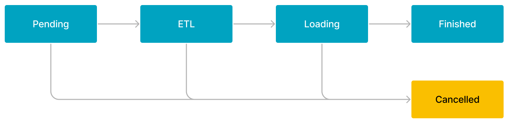
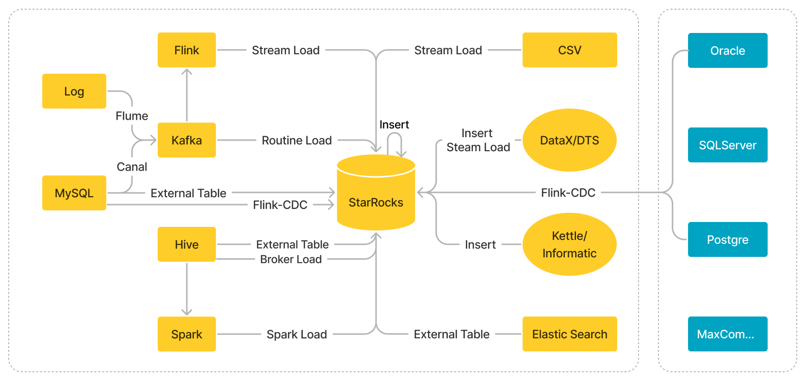

# データロードの概要

import InsertPrivNote from '../_assets/commonMarkdown/insertPrivNote.md'

データロードは、さまざまなデータソースからの生データをビジネス要件に基づいてクレンジングおよび変換し、その結果を StarRocks にロードして、高速なデータ分析を可能にするプロセスです。

データを StarRocks にロードするには、ロードジョブを実行します。各ロードジョブには、ユーザーが指定するか StarRocks が自動生成する一意のラベルがあり、ジョブを識別します。各ラベルは 1 つのロードジョブにのみ使用できます。ロードジョブが完了すると、そのラベルは他のロードジョブには再利用できません。失敗したロードジョブのラベルのみが再利用可能です。このメカニズムにより、特定のラベルに関連付けられたデータが一度だけロードされることが保証され、At-Most-Once セマンティクスが実現されます。

StarRocks が提供するすべてのロード方法は原子性を保証できます。原子性とは、ロードジョブ内の適格なデータがすべて正常にロードされるか、まったくロードされないことを意味します。適格なデータの一部がロードされ、他のデータがロードされないということはありません。適格なデータには、データ型変換エラーなどの品質問題のためにフィルタリングされたデータは含まれません。

StarRocks は、ロードジョブを送信するために使用できる 2 つの通信プロトコルをサポートしています: MySQL と HTTP。各ロード方法でサポートされているプロトコルの詳細については、このトピックの [Loading methods](#loading-methods) セクションを参照してください。

<InsertPrivNote />

## サポートされているデータ型

StarRocks はすべてのデータ型のデータロードをサポートしています。いくつかの特定のデータ型のロードに関する制限に注意するだけで済みます。詳細については、[Data types](../sql-reference/data-types/numeric/BIGINT.md) を参照してください。

## ロードモード

StarRocks は 2 つのロードモードをサポートしています: 同期ロードモードと非同期ロードモード。

> **NOTE**
>
> 外部プログラムを使用してデータをロードする場合、ビジネス要件に最適なロードモードを選択してから、ロード方法を決定する必要があります。

### 同期ロード

同期ロードモードでは、ロードジョブを送信した後、StarRocks はジョブを同期的に実行してデータをロードし、ジョブが終了した後にジョブの結果を返します。ジョブの結果に基づいて、ジョブが成功したかどうかを確認できます。

StarRocks は、同期ロードをサポートする 2 つのロード方法を提供しています: [Stream Load](./StreamLoad.md) と [INSERT](./InsertInto.md)。

同期ロードのプロセスは次のとおりです。

1. ロードジョブを作成します。

2. StarRocks によって返されたジョブ結果を確認します。

3. ジョブ結果に基づいてジョブが成功したかどうかを確認します。ジョブ結果がロード失敗を示している場合、ジョブを再試行できます。

### 非同期ロード

非同期ロードモードでは、ロードジョブを送信した後、StarRocks はすぐにジョブ作成結果を返します。

- 結果がジョブ作成の成功を示している場合、StarRocks はジョブを非同期で実行します。ただし、それはデータが正常にロードされたことを意味しません。ジョブのステータスを確認するためにステートメントやコマンドを使用する必要があります。その後、ジョブのステータスに基づいてデータが正常にロードされたかどうかを判断できます。

- 結果がジョブ作成の失敗を示している場合、失敗情報に基づいてジョブを再試行する必要があるかどうかを判断できます。

StarRocks は、非同期ロードをサポートする 3 つのロード方法を提供しています: [Broker Load](../sql-reference/sql-statements/loading_unloading/BROKER_LOAD.md)、[Routine Load](../sql-reference/sql-statements/loading_unloading/routine_load/CREATE_ROUTINE_LOAD.md)、および [Spark Load](../sql-reference/sql-statements/loading_unloading/SPARK_LOAD.md)。

非同期ロードのプロセスは次のとおりです。

1. ロードジョブを作成します。

2. StarRocks によって返されたジョブ作成結果を確認し、ジョブが正常に作成されたかどうかを判断します。
   a. ジョブ作成が成功した場合、ステップ 3 に進みます。
   b. ジョブ作成が失敗した場合、ステップ 1 に戻ります。

3. ジョブのステータスが **FINISHED** または **CANCELLED** になるまで、ステートメントやコマンドを使用してジョブのステータスを確認します。

Broker Load または Spark Load ジョブのワークフローは、次の図に示すように 5 つのステージで構成されています。

ワークフローは次のように説明されます。

1. **PENDING**

   ジョブは FE によってスケジュールされるのを待っているキューにあります。

2. **ETL**

   FE はデータを前処理し、クレンジング、パーティショニング、ソート、および集計を行います。
   > **NOTE**
   >
   > ジョブが Broker Load ジョブの場合、このステージは直接終了します。

3. **LOADING**

   FE はデータをクレンジングおよび変換し、データを BEs に送信します。すべてのデータがロードされた後、データは効果を発揮するのを待っているキューにあります。この時点で、ジョブのステータスは **LOADING** のままです。

4. **FINISHED**

   すべてのデータが効果を発揮すると、ジョブのステータスは **FINISHED** になります。この時点で、データをクエリできます。**FINISHED** は最終的なジョブ状態です。

5. **CANCELLED**

   ジョブのステータスが **FINISHED** になる前に、いつでもジョブをキャンセルできます。さらに、StarRocks はロードエラーが発生した場合に自動的にジョブをキャンセルできます。ジョブがキャンセルされると、ジョブのステータスは **CANCELLED** になります。**CANCELLED** も最終的なジョブ状態です。

Routine ジョブのワークフローは次のように説明されます。

1. ジョブは MySQL クライアントから FE に送信されます。

2. FE はジョブを複数のタスクに分割します。各タスクは複数のパーティションからデータをロードするように設計されています。

3. FE はタスクを指定された BEs に配布します。

4. BEs はタスクを実行し、タスクが完了した後に FE に報告します。

5. FE は後続のタスクを生成し、失敗したタスクがある場合は再試行し、BEs からの報告に基づいてタスクのスケジューリングを一時停止します。

## ロード方法

StarRocks は、さまざまなビジネスシナリオでデータをロードするための 5 つのロード方法を提供しています: [Stream Load](../sql-reference/sql-statements/loading_unloading/STREAM_LOAD.md)、[Broker Load](../sql-reference/sql-statements/loading_unloading/BROKER_LOAD.md)、[Routine Load](../sql-reference/sql-statements/loading_unloading/routine_load/CREATE_ROUTINE_LOAD.md)、[Spark Load](../sql-reference/sql-statements/loading_unloading/SPARK_LOAD.md)、および [INSERT](../sql-reference/sql-statements/loading_unloading/INSERT.md)。

| ロード方法         | データソース                                        | ビジネスシナリオ                                            | ロードジョブごとのデータ量                                     | データファイル形式                                | ロードモード | プロトコル |
| ------------------ | -------------------------------------------------- | ------------------------------------------------------------ | ------------------------------------------------------------ | ----------------------------------------------- | ------------ | -------- |
| Stream Load        |  <ul><li>ローカルファイル</li><li>データストリーム</li></ul>| ローカルファイルシステムからデータファイルをロードするか、プログラムを使用してデータストリームをロードします。 | 10 GB 以下                             |<ul><li>CSV</li><li>JSON</li></ul>               | 同期  | HTTP     |
| Broker Load        | <ul><li>HDFS</li><li>Amazon S3</li><li>Google GCS</li><li>Microsoft Azure Storage</li><li>Alibaba Cloud OSS</li><li>Tencent Cloud COS</li><li>Huawei Cloud OBS</li><li>その他の S3 互換ストレージシステム（MinIO など）</li></ul>| HDFS またはクラウドストレージからデータをロードします。                        | 数十 GB から数百 GB                               | <ul><li>CSV</li><li>Parquet</li><li>ORC</li></ul>| 非同期 | MySQL    |
| Routine Load       | Apache Kafka®                                       | Kafka からリアルタイムでデータをロードします。                   | MB から GB のデータをミニバッチとしてロードします。                           |<ul><li>CSV</li><li>JSON</li><li>Avro (v3.0.1 以降でサポート)</li></ul>          | 非同期 | MySQL    |
| Spark Load         | <ul><li>HDFS</li><li>Hive</li></ul>     |<ul><li>Apache Spark™ クラスターを使用して HDFS または Hive から大量のデータを移行します。</li><li>重複排除のためにグローバルデータ辞書を使用してデータをロードします。</li></ul>| 数十 GB から TB                                         |<ul><li>CSV</li><li>ORC (v2.0 以降でサポート)</li><li>Parquet (v2.0 以降でサポート)</li></ul>       | 非同期 | MySQL    |
| INSERT INTO SELECT | <ul><li>StarRocks テーブル</li><li>外部テーブル</li><li>AWS S3</li></ul>**NOTICE** AWS S3 からデータをロードする場合、Parquet 形式または ORC 形式のファイルのみがサポートされます。     |<ul><li>外部テーブルからデータをロードします。</li><li>StarRocks テーブル間でデータをロードします。</li></ul>| 固定されていません（データ量はメモリサイズに基づいて変動します。） | StarRocks テーブル      | 同期  | MySQL    |
| INSERT INTO VALUES | <ul><li>プログラム</li><li>ETL ツール</li></ul>    |<ul><li>個々のレコードとして少量のデータを挿入します。</li><li>JDBC などの API を使用してデータをロードします。</li></ul>| 少量                                          | SQL                   | 同期  | MySQL    |

ビジネスシナリオ、データ量、データソース、データファイル形式、ロード頻度に基づいて、選択するロード方法を決定できます。さらに、ロード方法を選択する際には、次の点に注意してください。

- Kafka からデータをロードする場合、[Routine Load](./RoutineLoad.md) を使用することをお勧めします。ただし、データがマルチテーブルジョインや ETL 操作を必要とする場合、Apache Flink® を使用して Kafka からデータを読み取り、前処理を行い、その後 [flink-connector-starrocks](./Flink-connector-starrocks.md) を使用してデータを StarRocks にロードできます。

- Hive、Iceberg、Hudi、または Delta Lake からデータをロードする場合、[Hive catalog](../data_source/catalog/hive_catalog.md)、[Iceberg catalog](../data_source/catalog/iceberg_catalog.md)、[Hudi Catalog](../data_source/catalog/hudi_catalog.md)、または [Delta Lake Catalog](../data_source/catalog/deltalake_catalog.md) を作成し、その後 [INSERT](./InsertInto.md) を使用してデータをロードすることをお勧めします。

- 別の StarRocks クラスターまたは Elasticsearch クラスターからデータをロードする場合、[StarRocks external table](../data_source/External_table.md#starrocks-external-table) または [Elasticsearch external table](../data_source/External_table.md#deprecated-elasticsearch-external-table) を作成し、その後 [INSERT](./InsertInto.md) を使用してデータをロードすることをお勧めします。

  > **NOTICE**
  >
  > StarRocks external tables はデータの書き込みのみをサポートします。データの読み取りはサポートしていません。

- MySQL データベースからデータをロードする場合、[MySQL external table](../data_source/External_table.md#deprecated-mysql-external-table) を作成し、その後 [INSERT](./InsertInto.md) を使用してデータをロードすることをお勧めします。リアルタイムでデータをロードしたい場合は、[Realtime synchronization from MySQL](./Flink_cdc_load.md) に記載されている手順に従ってデータをロードすることをお勧めします。

- Oracle、PostgreSQL、SQL Server などの他のデータソースからデータをロードする場合、[JDBC external table](../data_source/External_table.md#external-table-for-a-jdbc-compatible-database) を作成し、その後 [INSERT](./InsertInto.md) を使用してデータをロードすることをお勧めします。

次の図は、StarRocks がサポートするさまざまなデータソースと、これらのデータソースからデータをロードするために使用できるロード方法の概要を示しています。

## メモリ制限

StarRocks は、各ロードジョブのメモリ使用量を制限するためのパラメータを提供し、特に高い同時実行性のシナリオでメモリ消費を削減します。ただし、過度に低いメモリ使用量制限を指定しないでください。メモリ使用量制限が過度に低い場合、ロードジョブのメモリ使用量が指定された制限に達するため、データが頻繁にメモリからディスクにフラッシュされる可能性があります。ビジネスシナリオに基づいて適切なメモリ使用量制限を指定することをお勧めします。

メモリ使用量を制限するために使用されるパラメータは、各ロード方法によって異なります。詳細については、[Stream Load](../sql-reference/sql-statements/loading_unloading/STREAM_LOAD.md)、[Broker Load](../sql-reference/sql-statements/loading_unloading/BROKER_LOAD.md)、[Routine Load](../sql-reference/sql-statements/loading_unloading/routine_load/CREATE_ROUTINE_LOAD.md)、[Spark Load](../sql-reference/sql-statements/loading_unloading/SPARK_LOAD.md)、および [INSERT](../sql-reference/sql-statements/loading_unloading/INSERT.md) を参照してください。ロードジョブは通常、複数の BEs で実行されるため、パラメータは関与する各 BE での各ロードジョブのメモリ使用量を制限し、すべての関与する BEs でのロードジョブの総メモリ使用量を制限するものではありません。

StarRocks はまた、各個別の BE で実行されるすべてのロードジョブの総メモリ使用量を制限するためのパラメータを提供しています。詳細については、このトピックの "[System configurations](#system-configurations)" セクションを参照してください。

## 使用上の注意

### ロード中に宛先列を自動的に埋める

データをロードする際、データファイルの特定のフィールドからデータをロードしないことを選択できます。

- StarRocks テーブルを作成する際に、ソースフィールドにマッピングされる宛先 StarRocks テーブル列に `DEFAULT` キーワードを指定した場合、StarRocks は指定されたデフォルト値を宛先列に自動的に埋めます。

  [Stream Load](../sql-reference/sql-statements/loading_unloading/STREAM_LOAD.md)、[Broker Load](../sql-reference/sql-statements/loading_unloading/BROKER_LOAD.md)、[Routine Load](../sql-reference/sql-statements/loading_unloading/routine_load/CREATE_ROUTINE_LOAD.md)、および [INSERT](../sql-reference/sql-statements/loading_unloading/INSERT.md) は、`DEFAULT current_timestamp`、`DEFAULT <default_value>`、および `DEFAULT (<expression>)` をサポートしています。[Spark Load](../sql-reference/sql-statements/loading_unloading/SPARK_LOAD.md) は `DEFAULT current_timestamp` と `DEFAULT <default_value>` のみをサポートしています。

  > **NOTE**
  >
  > `DEFAULT (<expression>)` は、関数 `uuid()` および `uuid_numeric()` のみをサポートしています。

- StarRocks テーブルを作成する際に、ソースフィールドにマッピングされる宛先 StarRocks テーブル列に `DEFAULT` キーワードを指定しなかった場合、StarRocks は宛先列に `NULL` を自動的に埋めます。

  > **NOTE**
  >
  > 宛先列が `NOT NULL` と定義されている場合、ロードは失敗します。

  [Stream Load](../sql-reference/sql-statements/loading_unloading/STREAM_LOAD.md)、[Broker Load](../sql-reference/sql-statements/loading_unloading/BROKER_LOAD.md)、[Routine Load](../sql-reference/sql-statements/loading_unloading/routine_load/CREATE_ROUTINE_LOAD.md)、および [Spark Load](../sql-reference/sql-statements/loading_unloading/SPARK_LOAD.md) では、列マッピングを指定するために使用されるパラメータを使用して、宛先列に埋めたい値を指定することもできます。

`NOT NULL` および `DEFAULT` の使用法については、[CREATE TABLE](../sql-reference/sql-statements/table_bucket_part_index/CREATE_TABLE.md) を参照してください。

### データロードのための書き込みクォーラムを設定する

StarRocks クラスターに複数のデータレプリカがある場合、テーブルに対して異なる書き込みクォーラムを設定できます。つまり、StarRocks がロードタスクを成功と判断する前に、ロード成功を返す必要があるレプリカの数を指定できます。[CREATE TABLE](../sql-reference/sql-statements/table_bucket_part_index/CREATE_TABLE.md) 時に `write_quorum` プロパティを追加するか、[ALTER TABLE](../sql-reference/sql-statements/table_bucket_part_index/ALTER_TABLE.md) を使用して既存のテーブルにこのプロパティを追加できます。このプロパティは v2.5 からサポートされています。

## システム構成

このセクションでは、StarRocks が提供するすべてのロード方法に適用されるいくつかのパラメータ構成について説明します。

### FE 構成

各 FE の構成ファイル **fe.conf** で次のパラメータを構成できます。

- `max_load_timeout_second` および `min_load_timeout_second`
  
  これらのパラメータは、各ロードジョブの最大タイムアウト期間と最小タイムアウト期間を指定します。タイムアウト期間は秒単位で測定されます。デフォルトの最大タイムアウト期間は 3 日間で、デフォルトの最小タイムアウト期間は 1 秒です。指定する最大タイムアウト期間と最小タイムアウト期間は、1 秒から 3 日間の範囲内でなければなりません。これらのパラメータは、同期ロードジョブと非同期ロードジョブの両方に有効です。

- `desired_max_waiting_jobs`
  
  このパラメータは、キューで待機中のロードジョブの最大数を指定します。デフォルト値は **1024** です（v2.4 以前では 100、v2.5 以降では 1024）。FE 上の **PENDING** 状態のロードジョブの数が指定した最大数に達すると、FE は新しいロード要求を拒否します。このパラメータは非同期ロードジョブにのみ有効です。

- `max_running_txn_num_per_db`
  
  このパラメータは、StarRocks クラスターの各データベースで許可される進行中のロードトランザクションの最大数を指定します。ロードジョブは 1 つ以上のトランザクションを含むことができます。デフォルト値は **100** です。データベースで実行中のロードトランザクションの数が指定した最大数に達すると、送信した後続のロードジョブはスケジュールされません。この状況では、同期ロードジョブを送信すると、ジョブは拒否されます。非同期ロードジョブを送信すると、ジョブはキューで待機します。

  > **NOTE**
  >
  > StarRocks はすべてのロードジョブを一緒にカウントし、同期ロードジョブと非同期ロードジョブを区別しません。

- `label_keep_max_second`
  
  このパラメータは、**FINISHED** または **CANCELLED** 状態のロードジョブの履歴記録の保持期間を指定します。デフォルトの保持期間は 3 日間です。このパラメータは、同期ロードジョブと非同期ロードジョブの両方に有効です。

### BE 構成

各 BE の構成ファイル **be.conf** で次のパラメータを構成できます。

- `write_buffer_size`
  
  このパラメータは、最大メモリブロックサイズを指定します。デフォルトサイズは 100 MB です。ロードされたデータは最初に BE 上のメモリブロックに書き込まれます。ロードされたデータの量が指定した最大メモリブロックサイズに達すると、データはディスクにフラッシュされます。ビジネスシナリオに基づいて適切な最大メモリブロックサイズを指定する必要があります。

  - 最大メモリブロックサイズが非常に小さい場合、BE 上に多数の小さなファイルが生成される可能性があります。この場合、クエリパフォーマンスが低下します。生成されるファイルの数を減らすために、最大メモリブロックサイズを増やすことができます。
  - 最大メモリブロックサイズが非常に大きい場合、リモートプロシージャコール (RPC) がタイムアウトする可能性があります。この場合、ビジネスニーズに基づいてこのパラメータの値を調整できます。

- `streaming_load_rpc_max_alive_time_sec`
  
  各 Writer プロセスの待機タイムアウト期間。デフォルト値は 600 秒です。データロードプロセス中、StarRocks は各タブレットにデータを受信し、データを書き込むために Writer プロセスを開始します。指定した待機タイムアウト期間内に Writer プロセスがデータを受信しない場合、StarRocks は Writer プロセスを停止します。StarRocks クラスターが低速でデータを処理する場合、Writer プロセスは次のデータバッチを長時間受信せず、「TabletWriter add batch with unknown id」エラーを報告する可能性があります。この場合、このパラメータの値を増やすことができます。

- `load_process_max_memory_limit_bytes` および `load_process_max_memory_limit_percent`
  
  これらのパラメータは、各個別の BE でのすべてのロードジョブに対して消費されるメモリの最大量を指定します。StarRocks は、2 つのパラメータの値のうち、より小さいメモリ消費量を許可される最終的なメモリ消費量として識別します。

  - `load_process_max_memory_limit_bytes`: 最大メモリサイズを指定します。デフォルトの最大メモリサイズは 100 GB です。
  - `load_process_max_memory_limit_percent`: 最大メモリ使用量を指定します。デフォルト値は 30% です。このパラメータは `mem_limit` パラメータとは異なります。`mem_limit` パラメータは StarRocks クラスターの総最大メモリ使用量を指定し、デフォルト値は 90% x 90% です。

    BE が存在するマシンのメモリ容量が M の場合、ロードジョブに消費されるメモリの最大量は次のように計算されます: `M x 90% x 90% x 30%`。

### システム変数構成

次の [system variable](../sql-reference/System_variable.md) を構成できます。

- `query_timeout`

  クエリのタイムアウト期間。単位: 秒。値の範囲: `1` から `259200`。デフォルト値: `300`。この変数は、現在の接続内のすべてのクエリステートメント、および INSERT ステートメントに影響を与えます。

## トラブルシューティング

詳細については、[FAQ about data loading](../faq/loading/Loading_faq.md) を参照してください。