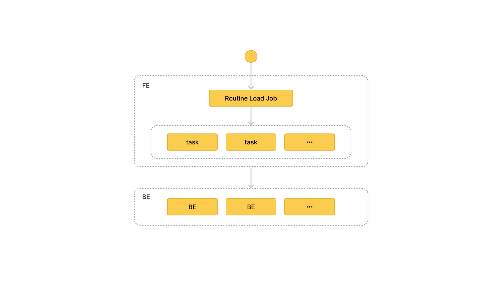

# Routine Load を使用したデータのロード

import InsertPrivNote from '../_assets/commonMarkdown/insertPrivNote.md'
import QSTip from '../_assets/commonMarkdown/quickstart-routine-load-tip.mdx'

<QSTip />

このトピックでは、Kafka メッセージ（イベント）を StarRocks にストリームするための Routine Load ジョブの作成方法を紹介し、Routine Load に関する基本的な概念を理解します。

ストリームのメッセージを StarRocks に継続的にロードするには、メッセージストリームを Kafka トピックに保存し、Routine Load ジョブを作成してメッセージを消費します。Routine Load ジョブは StarRocks に永続化され、トピック内のすべてまたは一部のパーティションのメッセージを消費する一連のロードタスクを生成し、メッセージを StarRocks にロードします。

Routine Load ジョブは、StarRocks にロードされたデータが失われたり重複したりしないことを保証するために、Exactly-once 配信セマンティクスをサポートしています。

Routine Load は、データロード時のデータ変換をサポートし、データロード中に UPSERT および DELETE 操作によるデータ変更をサポートします。詳細については、[Transform data at loading](../loading/Etl_in_loading.md) および [Change data through loading](../loading/Load_to_Primary_Key_tables.md) を参照してください。

<InsertPrivNote />

## サポートされているデータ形式

Routine Load は現在、Kafka クラスターからの CSV、JSON、および Avro（v3.0.1 以降でサポート）形式のデータの消費をサポートしています。

> **注意**
>
> CSV データについては、以下の点に注意してください:
>
> - テキスト区切り文字として、長さが 50 バイトを超えない UTF-8 文字列（カンマ（,）、タブ、パイプ（|）など）を使用できます。
> - Null 値は `\N` を使用して示されます。たとえば、データファイルが 3 列で構成されており、そのデータファイルのレコードが第 1 列と第 3 列にデータを持ち、第 2 列にデータを持たない場合、この状況では第 2 列に `\N` を使用して Null 値を示す必要があります。つまり、レコードは `a,\N,b` としてコンパイルする必要があり、`a,,b` ではありません。`a,,b` は、レコードの第 2 列が空の文字列を持っていることを示します。

## 基本概念



### 用語

- **Load job**

   Routine Load ジョブは長時間実行されるジョブです。そのステータスが RUNNING である限り、ロードジョブは継続的に 1 つまたは複数の同時ロードタスクを生成し、Kafka クラスターのトピック内のメッセージを消費し、データを StarRocks にロードします。

- **Load task**

  ロードジョブは特定のルールに従って複数のロードタスクに分割されます。ロードタスクはデータロードの基本単位です。個々のイベントとして、ロードタスクは [Stream Load](../loading/StreamLoad.md) に基づいてロードメカニズムを実装します。複数のロードタスクが同時にトピックの異なるパーティションからメッセージを消費し、データを StarRocks にロードします。

### ワークフロー

1. **Routine Load ジョブを作成します。**
   Kafka からデータをロードするには、[CREATE ROUTINE LOAD](../sql-reference/sql-statements/loading_unloading/routine_load/CREATE_ROUTINE_LOAD.md) ステートメントを実行して Routine Load ジョブを作成する必要があります。FE はステートメントを解析し、指定したプロパティに従ってジョブを作成します。

2. **FE はジョブを複数のロードタスクに分割します。**

    FE は特定のルールに基づいてジョブを複数のロードタスクに分割します。各ロードタスクは個別のトランザクションです。
    分割ルールは次のとおりです:
    - FE は、Kafka トピックのパーティション数と生存している BE ノードの数に基づいて、ロードタスクの実際の同時数を計算します。
    - FE は計算された実際の同時数に基づいてジョブをロードタスクに分割し、タスクをタスクキューに配置します。

    各 Kafka トピックは複数のパーティションで構成されています。トピックパーティションとロードタスクの関係は次のとおりです:
    - パーティションはロードタスクに一意に割り当てられ、そのパーティションからのすべてのメッセージはロードタスクによって消費されます。
    - ロードタスクは 1 つ以上のパーティションからメッセージを消費できます。
    - すべてのパーティションはロードタスク間で均等に分散されます。

3. **複数のロードタスクが同時に複数の Kafka トピックパーティションからメッセージを消費し、データを StarRocks にロードします。**

   1. **FE はロードタスクをスケジュールして提出します**: FE はキュー内のロードタスクをタイムリーにスケジュールし、選択された Coordinator BE ノードに割り当てます。ロードタスク間の間隔は、構成項目 `max_batch_interval` によって定義されます。FE はロードタスクをすべての BE ノードに均等に分配します。`max_batch_interval` に関する詳細は、[CREATE ROUTINE LOAD](../sql-reference/sql-statements/loading_unloading/routine_load/CREATE_ROUTINE_LOAD.md#examples) を参照してください。

   2. Coordinator BE はロードタスクを開始し、パーティション内のメッセージを消費し、データを解析およびフィルタリングします。ロードタスクは、事前に定義されたメッセージの量が消費されるか、事前に定義された時間制限に達するまで続きます。メッセージバッチサイズと時間制限は、FE 構成 `max_routine_load_batch_size` および `routine_load_task_consume_second` に定義されています。詳細については、[FE Configuration](../administration/management/FE_configuration.md) を参照してください。その後、Coordinator BE はメッセージを Executor BEs に分配します。Executor BEs はメッセージをディスクに書き込みます。

         > **注意**
         >
         > StarRocks は、SASL_SSL、SAS_PLAINTEXT、SSL、および PLAINTEXT を含むセキュリティプロトコルを介して Kafka へのアクセスをサポートしています。このトピックでは、PLAINTEXT を介して Kafka に接続する例を使用しています。他のセキュリティプロトコルを介して Kafka に接続する必要がある場合は、[CREATE ROUTINE LOAD](../sql-reference/sql-statements/loading_unloading/routine_load/CREATE_ROUTINE_LOAD.md) を参照してください。

4. **FE はデータを継続的にロードするための新しいロードタスクを生成します。**
   Executor BEs がデータをディスクに書き込んだ後、Coordinator BE はロードタスクの結果を FE に報告します。その結果に基づいて、FE はデータを継続的にロードするための新しいロードタスクを生成します。または、FE は失敗したタスクを再試行して、StarRocks にロードされたデータが失われたり重複したりしないようにします。

## Routine Load ジョブを作成する

次の 3 つの例では、Kafka で CSV 形式、JSON 形式、および Avro 形式のデータを消費し、Routine Load ジョブを作成してデータを StarRocks にロードする方法を説明します。詳細な構文とパラメータの説明については、[CREATE ROUTINE LOAD](../sql-reference/sql-statements/loading_unloading/routine_load/CREATE_ROUTINE_LOAD.md) を参照してください。

### CSV 形式のデータをロードする

このセクションでは、Kafka クラスターで CSV 形式のデータを消費し、データを StarRocks にロードするための Routine Load ジョブを作成する方法を説明します。

#### データセットを準備する

Kafka クラスターのトピック `ordertest1` に CSV 形式のデータセットがあるとします。データセットの各メッセージには、注文 ID、支払日、顧客名、国籍、性別、および価格の 6 つのフィールドが含まれています。

```Plain
2020050802,2020-05-08,Johann Georg Faust,Deutschland,male,895
2020050802,2020-05-08,Julien Sorel,France,male,893
2020050803,2020-05-08,Dorian Grey,UK,male,1262
2020050901,2020-05-09,Anna Karenina",Russia,female,175
2020051001,2020-05-10,Tess Durbeyfield,US,female,986
2020051101,2020-05-11,Edogawa Conan,japan,male,8924
```

#### テーブルを作成する

CSV 形式のデータのフィールドに従って、データベース `example_db` にテーブル `example_tbl1` を作成します。以下の例では、CSV 形式のデータの顧客性別フィールドを除く 5 つのフィールドを持つテーブルを作成します。

```SQL
CREATE TABLE example_db.example_tbl1 ( 
    `order_id` bigint NOT NULL COMMENT "Order ID",
    `pay_dt` date NOT NULL COMMENT "Payment date", 
    `customer_name` varchar(26) NULL COMMENT "Customer name", 
    `nationality` varchar(26) NULL COMMENT "Nationality", 
    `price`double NULL COMMENT "Price"
) 
ENGINE=OLAP 
DUPLICATE KEY (order_id,pay_dt) 
DISTRIBUTED BY HASH(`order_id`); 
```

> **注意**
>
> v2.5.7 以降、StarRocks はテーブルを作成する際やパーティションを追加する際に、バケット数（BUCKETS）を自動的に設定できます。バケット数を手動で設定する必要はありません。詳細については、[set the number of buckets](../table_design/data_distribution/Data_distribution.md#set-the-number-of-buckets) を参照してください。

#### Routine Load ジョブを送信する

次のステートメントを実行して、トピック `ordertest1` のメッセージを消費し、データをテーブル `example_tbl1` にロードする Routine Load ジョブ `example_tbl1_ordertest1` を送信します。ロードタスクは、トピックの指定されたパーティションの初期オフセットからメッセージを消費します。

```SQL
CREATE ROUTINE LOAD example_db.example_tbl1_ordertest1 ON example_tbl1
COLUMNS TERMINATED BY ",",
COLUMNS (order_id, pay_dt, customer_name, nationality, temp_gender, price)
PROPERTIES
(
    "desired_concurrent_number" = "5"
)
FROM KAFKA
(
    "kafka_broker_list" = "<kafka_broker1_ip>:<kafka_broker1_port>,<kafka_broker2_ip>:<kafka_broker2_port>",
    "kafka_topic" = "ordertest1",
    "kafka_partitions" = "0,1,2,3,4",
    "property.kafka_default_offsets" = "OFFSET_BEGINNING"
);
```

ロードジョブを送信した後、[SHOW ROUTINE LOAD](../sql-reference/sql-statements/loading_unloading/routine_load/SHOW_ROUTINE_LOAD.md) ステートメントを実行して、ロードジョブのステータスを確認できます。

- **ロードジョブ名**

  テーブルに複数のロードジョブが存在する可能性があります。そのため、ロードジョブには対応する Kafka トピックとロードジョブが送信された時間を名前として付けることをお勧めします。これにより、各テーブルのロードジョブを区別するのに役立ちます。

- **カラムセパレータ**

  プロパティ `COLUMN TERMINATED BY` は、CSV 形式データのカラムセパレータを定義します。デフォルトは `\t` です。

- **Kafka トピックパーティションとオフセット**

  プロパティ `kafka_partitions` と `kafka_offsets` を指定して、メッセージを消費するパーティションとオフセットを指定できます。たとえば、ロードジョブがトピック `ordertest1` の Kafka パーティション `"0,1,2,3,4"` から初期オフセットでメッセージを消費するようにしたい場合、プロパティを次のように指定できます。ロードジョブが Kafka パーティション `"0,1,2,3,4"` からメッセージを消費し、各パーティションに個別の開始オフセットを指定する必要がある場合、次のように構成できます。

    ```SQL
    "kafka_partitions" ="0,1,2,3,4",
    "kafka_offsets" = "OFFSET_BEGINNING, OFFSET_END, 1000, 2000, 3000"
    ```

  プロパティ `property.kafka_default_offsets` を使用して、すべてのパーティションのデフォルトオフセットを設定することもできます。

    ```SQL
    "kafka_partitions" ="0,1,2,3,4",
    "property.kafka_default_offsets" = "OFFSET_BEGINNING"
    ```

  詳細については、[CREATE ROUTINE LOAD](../sql-reference/sql-statements/loading_unloading/routine_load/CREATE_ROUTINE_LOAD.md) を参照してください。

- **データマッピングと変換**

  CSV 形式データと StarRocks テーブルの間のマッピングと変換の関係を指定するには、`COLUMNS` パラメータを使用する必要があります。

  **データマッピング:**

  - StarRocks は CSV 形式データのカラムを抽出し、それらを `COLUMNS` パラメータで宣言されたフィールドに**順番に**マッピングします。

  - StarRocks は `COLUMNS` パラメータで宣言されたフィールドを抽出し、それらを StarRocks テーブルのカラムに**名前で**マッピングします。

  **データ変換:**

  例では、CSV 形式データの顧客性別カラムを除外しているため、`COLUMNS` パラメータのフィールド `temp_gender` はこのフィールドのプレースホルダーとして使用されます。他のフィールドは、StarRocks テーブル `example_tbl1` のカラムに直接マッピングされます。

  データ変換の詳細については、[Transform data at loading](./Etl_in_loading.md) を参照してください。

    > **注意**
    >
    > CSV 形式データのカラム名、数、および順序が StarRocks テーブルのカラムと完全に一致する場合、`COLUMNS` パラメータを指定する必要はありません。

- **タスクの同時実行性**

  Kafka トピックパーティションが多く、十分な BE ノードがある場合、タスクの同時実行性を高めることでロードを加速できます。

  実際のロードタスクの同時実行性を高めるには、Routine Load ジョブを作成する際に、希望するロードタスクの同時実行性 `desired_concurrent_number` を増やすことができます。また、FE の動的構成項目 `max_routine_load_task_concurrent_num`（デフォルトの最大ロードタスク同時実行性）を大きな値に設定することもできます。`max_routine_load_task_concurrent_num` に関する詳細は、[FE configuration items](../administration/management/FE_configuration.md) を参照してください。

  実際のタスクの同時実行性は、生存している BE ノードの数、事前に指定された Kafka トピックパーティションの数、`desired_concurrent_number` および `max_routine_load_task_concurrent_num` の値の最小値によって定義されます。

  例では、生存している BE ノードの数は `5`、事前に指定された Kafka トピックパーティションの数は `5`、`max_routine_load_task_concurrent_num` の値は `5` です。実際のロードタスクの同時実行性を高めるには、`desired_concurrent_number` をデフォルト値 `3` から `5` に増やすことができます。

詳細については、[CREATE ROUTINE LOAD](../sql-reference/sql-statements/loading_unloading/routine_load/CREATE_ROUTINE_LOAD.md) を参照してください。

### JSON 形式のデータをロードする

このセクションでは、Kafka クラスターで JSON 形式のデータを消費し、データを StarRocks にロードするための Routine Load ジョブを作成する方法を説明します。

#### データセットを準備する

Kafka クラスターのトピック `ordertest2` に JSON 形式のデータセットがあるとします。データセットには、商品 ID、顧客名、国籍、支払い時間、価格の 6 つのキーが含まれています。さらに、支払い時間カラムを DATE 型に変換し、StarRocks テーブルの `pay_dt` カラムにロードしたいとします。

```JSON
{"commodity_id": "1", "customer_name": "Mark Twain", "country": "US","pay_time": 1589191487,"price": 875}
{"commodity_id": "2", "customer_name": "Oscar Wilde", "country": "UK","pay_time": 1589191487,"price": 895}
{"commodity_id": "3", "customer_name": "Antoine de Saint-Exupéry","country": "France","pay_time": 1589191487,"price": 895}
```

> **注意** 各 JSON オブジェクトは 1 つの Kafka メッセージに含まれている必要があります。そうでない場合、JSON 解析エラーが返されます。

#### テーブルを作成する

JSON 形式データのキーに従って、データベース `example_db` にテーブル `example_tbl2` を作成します。

```SQL
CREATE TABLE `example_tbl2` ( 
    `commodity_id` varchar(26) NULL COMMENT "Commodity ID", 
    `customer_name` varchar(26) NULL COMMENT "Customer name", 
    `country` varchar(26) NULL COMMENT "Country", 
    `pay_time` bigint(20) NULL COMMENT "Payment time", 
    `pay_dt` date NULL COMMENT "Payment date", 
    `price`double SUM NULL COMMENT "Price"
) 
ENGINE=OLAP
AGGREGATE KEY(`commodity_id`,`customer_name`,`country`,`pay_time`,`pay_dt`) 
DISTRIBUTED BY HASH(`commodity_id`); 
```

> **注意**
>
> v2.5.7 以降、StarRocks はテーブルを作成する際やパーティションを追加する際に、バケット数（BUCKETS）を自動的に設定できます。バケット数を手動で設定する必要はありません。詳細については、[set the number of buckets](../table_design/data_distribution/Data_distribution.md#set-the-number-of-buckets) を参照してください。

#### Routine Load ジョブを送信する

次のステートメントを実行して、トピック `ordertest2` のメッセージを消費し、データをテーブル `example_tbl2` にロードする Routine Load ジョブ `example_tbl2_ordertest2` を送信します。ロードタスクは、トピックの指定されたパーティションの初期オフセットからメッセージを消費します。

```SQL
CREATE ROUTINE LOAD example_db.example_tbl2_ordertest2 ON example_tbl2
COLUMNS(commodity_id, customer_name, country, pay_time, price, pay_dt=from_unixtime(pay_time, '%Y%m%d'))
PROPERTIES
(
    "desired_concurrent_number" = "5",
    "format" = "json",
    "jsonpaths" = "[\"$.commodity_id\",\"$.customer_name\",\"$.country\",\"$.pay_time\",\"$.price\"]"
 )
FROM KAFKA
(
    "kafka_broker_list" ="<kafka_broker1_ip>:<kafka_broker1_port>,<kafka_broker2_ip>:<kafka_broker2_port>",
    "kafka_topic" = "ordertest2",
    "kafka_partitions" ="0,1,2,3,4",
    "property.kafka_default_offsets" = "OFFSET_BEGINNING"
);
```

ロードジョブを送信した後、[SHOW ROUTINE LOAD](../sql-reference/sql-statements/loading_unloading/routine_load/SHOW_ROUTINE_LOAD.md) ステートメントを実行して、ロードジョブのステータスを確認できます。

- **データ形式**

  データ形式が JSON であることを定義するために、`PROPERTIES` 節で `"format" = "json"` を指定する必要があります。

- **データマッピングと変換**

  JSON 形式データと StarRocks テーブルの間のマッピングと変換の関係を指定するには、`COLUMNS` パラメータとプロパティ `jsonpaths` を指定する必要があります。`COLUMNS` パラメータで指定されたフィールドの順序は、JSON 形式データの順序と一致し、フィールドの名前は StarRocks テーブルの名前と一致する必要があります。プロパティ `jsonpaths` は、JSON データから必要なフィールドを抽出するために使用されます。これらのフィールドは、プロパティ `COLUMNS` によって命名されます。

  例では、支払い時間フィールドを DATE データ型に変換し、StarRocks テーブルの `pay_dt` カラムにデータをロードする必要があるため、from_unixtime 関数を使用する必要があります。他のフィールドは、テーブル `example_tbl2` のフィールドに直接マッピングされます。

  **データマッピング:**

  - StarRocks は JSON 形式データの `name` および `code` キーを抽出し、それらを `jsonpaths` プロパティで宣言されたキーにマッピングします。

  - StarRocks は `jsonpaths` プロパティで宣言されたキーを抽出し、それらを `COLUMNS` パラメータで宣言されたフィールドに**順番に**マッピングします。

  - StarRocks は `COLUMNS` パラメータで宣言されたフィールドを抽出し、それらを StarRocks テーブルのカラムに**名前で**マッピングします。

  **データ変換**:

  - 例では、キー `pay_time` を DATE データ型に変換し、StarRocks テーブルの `pay_dt` カラムにデータをロードする必要があるため、`COLUMNS` パラメータで from_unixtime 関数を使用する必要があります。他のフィールドは、テーブル `example_tbl2` のフィールドに直接マッピングされます。

  - 例では、JSON 形式データの顧客性別カラムを除外しているため、`COLUMNS` パラメータのフィールド `temp_gender` はこのフィールドのプレースホルダーとして使用されます。他のフィールドは、StarRocks テーブル `example_tbl1` のカラムに直接マッピングされます。

    データ変換の詳細については、[Transform data at loading](./Etl_in_loading.md) を参照してください。

    > **注意**
    >
    > JSON オブジェクトのキーの名前と数が StarRocks テーブルのフィールドと完全に一致する場合、`COLUMNS` パラメータを指定する必要はありません。

### Avro 形式のデータをロードする

v3.0.1 以降、StarRocks は Routine Load を使用して Avro データのロードをサポートしています。

#### データセットを準備する

##### Avro スキーマ

1. 次の Avro スキーマファイル `avro_schema.avsc` を作成します:

      ```JSON
      {
          "type": "record",
          "name": "sensor_log",
          "fields" : [
              {"name": "id", "type": "long"},
              {"name": "name", "type": "string"},
              {"name": "checked", "type" : "boolean"},
              {"name": "data", "type": "double"},
              {"name": "sensor_type", "type": {"type": "enum", "name": "sensor_type_enum", "symbols" : ["TEMPERATURE", "HUMIDITY", "AIR-PRESSURE"]}}  
          ]
      }
      ```

2. Avro スキーマを [Schema Registry](https://docs.confluent.io/cloud/current/get-started/schema-registry.html#create-a-schema) に登録します。

##### Avro データ

Avro データを準備し、Kafka トピック `topic_0` に送信します。

#### テーブルを作成する

Avro データのフィールドに従って、StarRocks クラスターのターゲットデータベース `example_db` にテーブル `sensor_log` を作成します。テーブルのカラム名は Avro データのフィールド名と一致する必要があります。テーブルカラムと Avro データフィールドのデータ型マッピングについては、[Data types mapping](#Data types mapping) を参照してください。

```SQL
CREATE TABLE example_db.sensor_log ( 
    `id` bigint NOT NULL COMMENT "sensor id",
    `name` varchar(26) NOT NULL COMMENT "sensor name", 
    `checked` boolean NOT NULL COMMENT "checked", 
    `data` double NULL COMMENT "sensor data", 
    `sensor_type` varchar(26) NOT NULL COMMENT "sensor type"
) 
ENGINE=OLAP 
DUPLICATE KEY (id) 
DISTRIBUTED BY HASH(`id`); 
```

> **注意**
>
> v2.5.7 以降、StarRocks はテーブルを作成する際やパーティションを追加する際に、バケット数（BUCKETS）を自動的に設定できます。バケット数を手動で設定する必要はありません。詳細については、[set the number of buckets](../table_design/data_distribution/Data_distribution.md#set-the-number-of-buckets) を参照してください。

#### Routine Load ジョブを送信する

次のステートメントを実行して、Kafka トピック `topic_0` の Avro メッセージを消費し、データをデータベース `sensor` のテーブル `sensor_log` にロードする Routine Load ジョブ `sensor_log_load_job` を送信します。ロードジョブは、トピックの指定されたパーティションの初期オフセットからメッセージを消費します。

```SQL
CREATE ROUTINE LOAD example_db.sensor_log_load_job ON sensor_log  
PROPERTIES  
(  
    "format" = "avro"  
)  
FROM KAFKA  
(  
    "kafka_broker_list" = "<kafka_broker1_ip>:<kafka_broker1_port>,<kafka_broker2_ip>:<kafka_broker2_port>,...",
    "confluent.schema.registry.url" = "http://172.xx.xxx.xxx:8081",  
    "kafka_topic" = "topic_0",  
    "kafka_partitions" = "0,1,2,3,4,5",  
    "property.kafka_default_offsets" = "OFFSET_BEGINNING"  
);
```

- データ形式

  データ形式が Avro であることを定義するために、`PROPERTIES` 節で `"format = "avro"` を指定する必要があります。

- スキーマレジストリ

  Avro スキーマが登録されているスキーマレジストリの URL を指定するために、`confluent.schema.registry.url` を構成する必要があります。StarRocks はこの URL を使用して Avro スキーマを取得します。形式は次のとおりです:

  ```Plaintext
  confluent.schema.registry.url = http[s]://[<schema-registry-api-key>:<schema-registry-api-secret>@]<hostname|ip address>[:<port>]
  ```

- データマッピングと変換

  Avro 形式データと StarRocks テーブルの間のマッピングと変換の関係を指定するには、`COLUMNS` パラメータとプロパティ `jsonpaths` を指定する必要があります。`COLUMNS` パラメータで指定されたフィールドの順序は、`jsonpaths` プロパティのフィールドの順序と一致し、フィールドの名前は StarRocks テーブルの名前と一致する必要があります。プロパティ `jsonpaths` は、Avro データから必要なフィールドを抽出するために使用されます。これらのフィールドは、プロパティ `COLUMNS` によって命名されます。

  データ変換の詳細については、[Transform data at loading](./Etl_in_loading.md) を参照してください。

  > 注意
  >
  > Avro レコードのフィールドの名前と数が StarRocks テーブルのカラムと完全に一致する場合、`COLUMNS` パラメータを指定する必要はありません。

ロードジョブを送信した後、[SHOW ROUTINE LOAD](../sql-reference/sql-statements/loading_unloading/routine_load/SHOW_ROUTINE_LOAD.md) ステートメントを実行して、ロードジョブのステータスを確認できます。

#### データ型のマッピング

ロードしたい Avro データフィールドと StarRocks テーブルカラムのデータ型マッピングは次のとおりです:

##### プリミティブ型

| Avro    | StarRocks |
| ------- | --------- |
| nul     | NULL      |
| boolean | BOOLEAN   |
| int     | INT       |
| long    | BIGINT    |
| float   | FLOAT     |
| double  | DOUBLE    |
| bytes   | STRING    |
| string  | STRING    |

##### 複合型

| Avro           | StarRocks                                                    |
| -------------- | ------------------------------------------------------------ |
| record         | RECORD 全体またはそのサブフィールドを JSON として StarRocks にロードします。 |
| enums          | STRING                                                       |
| arrays         | ARRAY                                                        |
| maps           | JSON                                                         |
| union(T, null) | NULLABLE(T)                                                  |
| fixed          | STRING                                                       |

#### 制限事項

- 現在、StarRocks はスキーマの進化をサポートしていません。
- 各 Kafka メッセージには単一の Avro データレコードのみを含める必要があります。

## ロードジョブとタスクを確認する

### ロードジョブを確認する

[SHOW ROUTINE LOAD](../sql-reference/sql-statements/loading_unloading/routine_load/SHOW_ROUTINE_LOAD.md) ステートメントを実行して、ロードジョブ `example_tbl2_ordertest2` のステータスを確認します。StarRocks は、実行状態 `State`、統計情報（消費された総行数とロードされた総行数を含む）`Statistics`、およびロードジョブの進行状況 `progress` を返します。

ロードジョブの状態が自動的に **PAUSED** に変更された場合、エラーロウの数がしきい値を超えた可能性があります。このしきい値の設定に関する詳細な指示については、[CREATE ROUTINE LOAD](../sql-reference/sql-statements/loading_unloading/routine_load/CREATE_ROUTINE_LOAD.md) を参照してください。問題を特定してトラブルシューティングするために、`ReasonOfStateChanged` および `ErrorLogUrls` ファイルを確認できます。問題を修正した後、[RESUME ROUTINE LOAD](../sql-reference/sql-statements/loading_unloading/routine_load/RESUME_ROUTINE_LOAD.md) ステートメントを実行して **PAUSED** ロードジョブを再開できます。

ロードジョブの状態が **CANCELLED** の場合、ロードジョブが例外に遭遇した可能性があります（たとえば、テーブルが削除された場合）。問題を特定してトラブルシューティングするために、`ReasonOfStateChanged` および `ErrorLogUrls` ファイルを確認できます。ただし、**CANCELLED** ロードジョブを再開することはできません。

```SQL
MySQL [example_db]> SHOW ROUTINE LOAD FOR example_tbl2_ordertest2 \G
*************************** 1. row ***************************
                  Id: 63013
                Name: example_tbl2_ordertest2
          CreateTime: 2022-08-10 17:09:00
           PauseTime: NULL
             EndTime: NULL
              DbName: default_cluster:example_db
           TableName: example_tbl2
               State: RUNNING
      DataSourceType: KAFKA
      CurrentTaskNum: 3
       JobProperties: {"partitions":"*","partial_update":"false","columnToColumnExpr":"commodity_id,customer_name,country,pay_time,pay_dt=from_unixtime(`pay_time`, '%Y%m%d'),price","maxBatchIntervalS":"20","whereExpr":"*","dataFormat":"json","timezone":"Asia/Shanghai","format":"json","json_root":"","strict_mode":"false","jsonpaths":"[\"$.commodity_id\",\"$.customer_name\",\"$.country\",\"$.pay_time\",\"$.price\"]","desireTaskConcurrentNum":"3","maxErrorNum":"0","strip_outer_array":"false","currentTaskConcurrentNum":"3","maxBatchRows":"200000"}
DataSourceProperties: {"topic":"ordertest2","currentKafkaPartitions":"0,1,2,3,4","brokerList":"<kafka_broker1_ip>:<kafka_broker1_port>,<kafka_broker2_ip>:<kafka_broker2_port>"}
    CustomProperties: {"kafka_default_offsets":"OFFSET_BEGINNING"}
           Statistic: {"receivedBytes":230,"errorRows":0,"committedTaskNum":1,"loadedRows":2,"loadRowsRate":0,"abortedTaskNum":0,"totalRows":2,"unselectedRows":0,"receivedBytesRate":0,"taskExecuteTimeMs":522}
            Progress: {"0":"1","1":"OFFSET_ZERO","2":"OFFSET_ZERO","3":"OFFSET_ZERO","4":"OFFSET_ZERO"}
ReasonOfStateChanged: 
        ErrorLogUrls: 
            OtherMsg: 
```

> **注意**
>
> 停止したロードジョブやまだ開始されていないロードジョブを確認することはできません。

### ロードタスクを確認する

[SHOW ROUTINE LOAD TASK](../sql-reference/sql-statements/loading_unloading/routine_load/SHOW_ROUTINE_LOAD_TASK.md) ステートメントを実行して、ロードジョブ `example_tbl2_ordertest2` のロードタスクを確認します。現在実行中のタスクの数、消費されている Kafka トピックパーティションとその消費進捗 `DataSourceProperties`、および対応する Coordinator BE ノード `BeId` などが確認できます。

```SQL
MySQL [example_db]> SHOW ROUTINE LOAD TASK WHERE JobName = "example_tbl2_ordertest2" \G
*************************** 1. row ***************************
              TaskId: 18c3a823-d73e-4a64-b9cb-b9eced026753
               TxnId: -1
           TxnStatus: UNKNOWN
               JobId: 63013
          CreateTime: 2022-08-10 17:09:05
   LastScheduledTime: 2022-08-10 17:47:27
    ExecuteStartTime: NULL
             Timeout: 60
                BeId: -1
DataSourceProperties: {"1":0,"4":0}
             Message: there is no new data in kafka, wait for 20 seconds to schedule again
*************************** 2. row ***************************
              TaskId: f76c97ac-26aa-4b41-8194-a8ba2063eb00
               TxnId: -1
           TxnStatus: UNKNOWN
               JobId: 63013
          CreateTime: 2022-08-10 17:09:05
   LastScheduledTime: 2022-08-10 17:47:26
    ExecuteStartTime: NULL
             Timeout: 60
                BeId: -1
DataSourceProperties: {"2":0}
             Message: there is no new data in kafka, wait for 20 seconds to schedule again
*************************** 3. row ***************************
              TaskId: 1a327a34-99f4-4f8d-8014-3cd38db99ec6
               TxnId: -1
           TxnStatus: UNKNOWN
               JobId: 63013
          CreateTime: 2022-08-10 17:09:26
   LastScheduledTime: 2022-08-10 17:47:27
    ExecuteStartTime: NULL
             Timeout: 60
                BeId: -1
DataSourceProperties: {"0":2,"3":0}
             Message: there is no new data in kafka, wait for 20 seconds to schedule again
```

## ロードジョブを一時停止する

[PAUSE ROUTINE LOAD](../sql-reference/sql-statements/loading_unloading/routine_load/PAUSE_ROUTINE_LOAD.md) ステートメントを実行して、ロードジョブを一時停止できます。ステートメントが実行されると、ロードジョブの状態は **PAUSED** になりますが、停止していません。[RESUME ROUTINE LOAD](../sql-reference/sql-statements/loading_unloading/routine_load/RESUME_ROUTINE_LOAD.md) ステートメントを実行して再開できます。また、[SHOW ROUTINE LOAD](../sql-reference/sql-statements/loading_unloading/routine_load/SHOW_ROUTINE_LOAD.md) ステートメントを使用してそのステータスを確認できます。

次の例では、ロードジョブ `example_tbl2_ordertest2` を一時停止します:

```SQL
PAUSE ROUTINE LOAD FOR example_tbl2_ordertest2;
```

## ロードジョブを再開する

[RESUME ROUTINE LOAD](../sql-reference/sql-statements/loading_unloading/routine_load/RESUME_ROUTINE_LOAD.md) ステートメントを実行して、一時停止したロードジョブを再開できます。ロードジョブの状態は一時的に **NEED_SCHEDULE**（ロードジョブが再スケジュールされているため）になり、その後 **RUNNING** になります。[SHOW ROUTINE LOAD](../sql-reference/sql-statements/loading_unloading/routine_load/SHOW_ROUTINE_LOAD.md) ステートメントを使用してそのステータスを確認できます。

次の例では、一時停止したロードジョブ `example_tbl2_ordertest2` を再開します:

```SQL
RESUME ROUTINE LOAD FOR example_tbl2_ordertest2;
```

## ロードジョブを変更する

ロードジョブを変更する前に、[PAUSE ROUTINE LOAD](../sql-reference/sql-statements/loading_unloading/routine_load/PAUSE_ROUTINE_LOAD.md) ステートメントを使用して一時停止する必要があります。その後、[ALTER ROUTINE LOAD](../sql-reference/sql-statements/loading_unloading/routine_load/ALTER_ROUTINE_LOAD.md) を実行できます。変更後、[RESUME ROUTINE LOAD](../sql-reference/sql-statements/loading_unloading/routine_load/RESUME_ROUTINE_LOAD.md) ステートメントを実行して再開し、[SHOW ROUTINE LOAD](../sql-reference/sql-statements/loading_unloading/routine_load/SHOW_ROUTINE_LOAD.md) ステートメントを使用してそのステータスを確認できます。

生存している BE ノードの数が `6` に増加し、消費する Kafka トピックパーティションが `"0,1,2,3,4,5,6,7"` であると仮定します。実際のロードタスクの同時実行性を高めたい場合、次のステートメントを実行して、希望するタスクの同時実行数 `desired_concurrent_number` を `6` に増やし（生存している BE ノードの数以上）、Kafka トピックパーティションと初期オフセットを指定できます。

> **注意**
>
> 実際のタスクの同時実行性は複数のパラメータの最小値によって決定されるため、FE の動的パラメータ `max_routine_load_task_concurrent_num` の値が `6` 以上であることを確認する必要があります。

```SQL
ALTER ROUTINE LOAD FOR example_tbl2_ordertest2
PROPERTIES
(
    "desired_concurrent_number" = "6"
)
FROM kafka
(
    "kafka_partitions" = "0,1,2,3,4,5,6,7",
    "kafka_offsets" = "OFFSET_BEGINNING,OFFSET_BEGINNING,OFFSET_BEGINNING,OFFSET_BEGINNING,OFFSET_END,OFFSET_END,OFFSET_END,OFFSET_END"
);
```

## ロードジョブを停止する

[STOP ROUTINE LOAD](../sql-reference/sql-statements/loading_unloading/routine_load/STOP_ROUTINE_LOAD.md) ステートメントを実行して、ロードジョブを停止できます。ステートメントが実行されると、ロードジョブの状態は **STOPPED** になり、停止したロードジョブを再開することはできません。[SHOW ROUTINE LOAD](../sql-reference/sql-statements/loading_unloading/routine_load/SHOW_ROUTINE_LOAD.md) ステートメントを使用して停止したロードジョブのステータスを確認することはできません。

次の例では、ロードジョブ `example_tbl2_ordertest2` を停止します:

```SQL
STOP ROUTINE LOAD FOR example_tbl2_ordertest2;
```