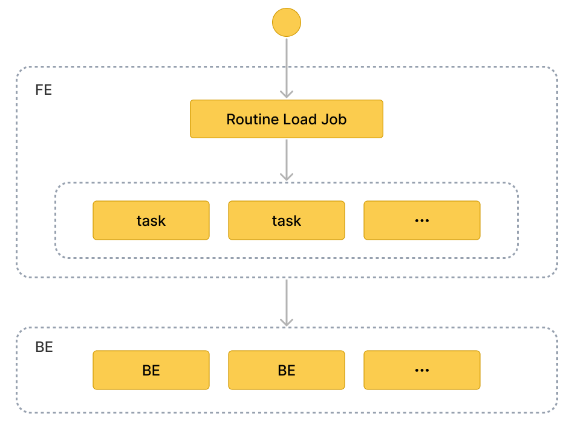

# Routine Load を使用したデータロード

このトピックでは、Kafka メッセージ（イベント）を StarRocks にストリームするための Routine Load ジョブの作成方法を紹介し、Routine Load に関する基本的な概念を説明します。

ストリームのメッセージを StarRocks に継続的にロードするには、メッセージストリームを Kafka トピックに保存し、Routine Load ジョブを作成してメッセージを消費します。Routine Load ジョブは StarRocks に永続化され、トピック内のすべてまたは一部のパーティションのメッセージを消費する一連のロードタスクを生成し、メッセージを StarRocks にロードします。

Routine Load ジョブは、StarRocks にロードされたデータが失われたり重複したりしないことを保証するために、正確に一度だけの配信セマンティクスをサポートします。

Routine Load はデータロード時のデータ変換をサポートし、データロード中に UPSERT および DELETE 操作によるデータ変更をサポートします。詳細については、[Transform data at loading](../loading/Etl_in_loading.md) および [Change data through loading](../loading/Load_to_Primary_Key_tables.md) を参照してください。

## サポートされているデータ形式

Routine Load は現在、Kafka クラスターからの CSV および JSON 形式のデータの消費をサポートしています。

> **注意**
>
> CSV データについては、以下の点に注意してください:
>
> - テキスト区切り文字として、長さが 50 バイトを超えない UTF-8 文字列（カンマ（,）、タブ、パイプ（|）など）を使用できます。
> - Null 値は `\N` を使用して示されます。たとえば、データファイルが 3 列で構成されており、そのデータファイルのレコードが第 1 列と第 3 列にデータを持ち、第 2 列にはデータがない場合、この状況では第 2 列に `\N` を使用して Null 値を示す必要があります。つまり、レコードは `a,\N,b` としてコンパイルされる必要があり、`a,,b` ではありません。`a,,b` はレコードの第 2 列が空の文字列を持っていることを示します。

## 基本概念



### 用語

- **Load job**

   Routine Load ジョブは長時間実行されるジョブです。そのステータスが RUNNING である限り、ロードジョブは Kafka クラスターのトピック内のメッセージを消費し、データを StarRocks にロードするために、1 つまたは複数の同時ロードタスクを継続的に生成します。

- **Load task**

  ロードジョブは特定のルールに基づいて複数のロードタスクに分割されます。ロードタスクはデータロードの基本単位です。個々のイベントとして、ロードタスクは [Stream Load](../loading/StreamLoad.md) に基づくロードメカニズムを実装します。複数のロードタスクが同時にトピックの異なるパーティションからメッセージを消費し、データを StarRocks にロードします。

### ワークフロー

1. **Routine Load ジョブを作成します。**
   Kafka からデータをロードするには、[CREATE ROUTINE LOAD](../sql-reference/sql-statements/data-manipulation/CREATE_ROUTINE_LOAD.md) ステートメントを実行して Routine Load ジョブを作成する必要があります。FE はステートメントを解析し、指定したプロパティに従ってジョブを作成します。

2. **FE はジョブを複数のロードタスクに分割します。**

    FE は特定のルールに基づいてジョブを複数のロードタスクに分割します。各ロードタスクは個別のトランザクションです。
    分割ルールは次のとおりです:
    - FE は、Kafka トピックのパーティション数と生存している BE ノードの数に基づいて、ロードタスクの実際の同時数を計算します。
    - FE は計算された実際の同時数に基づいてジョブをロードタスクに分割し、タスクをタスクキューに配置します。

    各 Kafka トピックは複数のパーティションで構成されています。トピックパーティションとロードタスクの関係は次のとおりです:
    - パーティションはロードタスクに一意に割り当てられ、そのパーティションからのすべてのメッセージはロードタスクによって消費されます。
    - ロードタスクは 1 つ以上のパーティションからメッセージを消費できます。
    - すべてのパーティションはロードタスク間で均等に分配されます。

3. **複数のロードタスクが同時に複数の Kafka トピックパーティションからメッセージを消費し、データを StarRocks にロードします。**

   1. **FE はロードタスクをスケジュールして提出します**: FE はキュー内のロードタスクをタイムリーにスケジュールし、選択された Coordinator BE ノードに割り当てます。ロードタスク間の間隔は、構成項目 `max_batch_interval` によって定義されます。FE はロードタスクをすべての BE ノードに均等に分配します。`max_batch_interval` に関する詳細は [CREATE ROUTINE LOAD](../sql-reference/sql-statements/data-manipulation/CREATE_ROUTINE_LOAD.md#example) を参照してください。

   2. Coordinator BE はロードタスクを開始し、パーティション内のメッセージを消費し、データを解析およびフィルタリングします。ロードタスクは、事前に定義されたメッセージ量が消費されるか、事前に定義された時間制限に達するまで続きます。メッセージバッチサイズと時間制限は、FE 構成の `max_routine_load_batch_size` および `routine_load_task_consume_second` に定義されています。詳細情報は [Configuration](../administration/Configuration.md) を参照してください。Coordinator BE はその後、メッセージを Executor BEs に分配します。Executor BEs はメッセージをディスクに書き込みます。

         > **注意**
         >
         > StarRocks は、SASL_SSL、SAS_PLAINTEXT、SSL、PLAINTEXT を含むセキュリティプロトコルを介した Kafka へのアクセスをサポートしています。このトピックでは、PLAINTEXT を介して Kafka に接続する例を使用しています。他のセキュリティプロトコルを介して Kafka に接続する必要がある場合は、[CREATE ROUTINE LOAD](../sql-reference/sql-statements/data-manipulation/CREATE_ROUTINE_LOAD.md) を参照してください。

4. **FE は新しいロードタスクを生成してデータを継続的にロードします。**
   Executor BEs がデータをディスクに書き込んだ後、Coordinator BE はロードタスクの結果を FE に報告します。結果に基づいて、FE は新しいロードタスクを生成してデータを継続的にロードします。または、FE は失敗したタスクを再試行して、StarRocks にロードされたデータが失われたり重複したりしないことを確認します。

## Routine Load ジョブを作成する

次の 2 つの例では、Kafka で CSV 形式および JSON 形式のデータを消費し、Routine Load ジョブを作成してデータを StarRocks にロードする方法を説明します。詳細な手順と参照については、[CREATE ROUTINE LOAD](../sql-reference/sql-statements/data-manipulation/CREATE_ROUTINE_LOAD.md) を参照してください。

### CSV 形式のデータをロードする

このセクションでは、Kafka クラスターで CSV 形式のデータを消費し、データを StarRocks にロードするための Routine Load ジョブを作成する方法を説明します。

#### データセットを準備する

Kafka クラスターのトピック `ordertest1` に CSV 形式のデータセットがあるとします。データセット内の各メッセージには、注文 ID、支払い日、顧客名、国籍、性別、価格の 6 つのフィールドが含まれています。

```Plain
2020050802,2020-05-08,Johann Georg Faust,Deutschland,male,895
2020050802,2020-05-08,Julien Sorel,France,male,893
2020050803,2020-05-08,Dorian Grey,UK,male,1262
2020050901,2020-05-09,Anna Karenina",Russia,female,175
2020051001,2020-05-10,Tess Durbeyfield,US,female,986
2020051101,2020-05-11,Edogawa Conan,japan,male,8924
```

#### テーブルを作成する

CSV 形式のデータのフィールドに従って、データベース `example_db` にテーブル `example_tbl1` を作成します。次の例では、CSV 形式のデータの顧客性別フィールドを除く 5 つのフィールドを持つテーブルを作成します。

```SQL
CREATE TABLE example_db.example_tbl1 ( 
    `order_id` bigint NOT NULL COMMENT "Order ID",
    `pay_dt` date NOT NULL COMMENT "Payment date", 
    `customer_name` varchar(26) NULL COMMENT "Customer name", 
    `nationality` varchar(26) NULL COMMENT "Nationality", 
    `price`double NULL COMMENT "Price"
) 
ENGINE=OLAP 
DUPLICATE KEY (order_id,pay_dt) 
DISTRIBUTED BY HASH(`order_id`) BUCKETS 5; 
```

#### Routine Load ジョブを提出する

次のステートメントを実行して、トピック `ordertest1` のメッセージを消費し、データをテーブル `example_tbl1` にロードする Routine Load ジョブ `example_tbl1_ordertest1` を提出します。ロードタスクは、トピックの指定されたパーティションの初期オフセットからメッセージを消費します。

```SQL
CREATE ROUTINE LOAD example_db.example_tbl1_ordertest1 ON example_tbl1
COLUMNS TERMINATED BY ",",
COLUMNS (order_id, pay_dt, customer_name, nationality, temp_gender, price)
PROPERTIES
(
    "desired_concurrent_number" = "5"
)
FROM KAFKA
(
    "kafka_broker_list" ="<kafka_broker1_ip>:<kafka_broker1_port>,<kafka_broker2_ip>:<kafka_broker2_port>",
    "kafka_topic" = "ordertest1",
    "kafka_partitions" ="0,1,2,3,4",
    "property.kafka_default_offsets" = "OFFSET_BEGINNING"
);
```

ロードジョブを提出した後、[SHOW ROUTINE LOAD](../sql-reference/sql-statements/data-manipulation/SHOW_ROUTINE_LOAD.md) ステートメントを実行してロードジョブのステータスを確認できます。

- **ロードジョブ名**

  テーブルには複数のロードジョブが存在する可能性があります。そのため、ロードジョブを対応する Kafka トピックとロードジョブが提出された時間で命名することをお勧めします。これにより、各テーブルのロードジョブを区別するのに役立ちます。

- **カラムセパレータ**

  プロパティ `COLUMN TERMINATED BY` は CSV 形式データのカラムセパレータを定義します。デフォルトは `\t` です。

- **Kafka トピックパーティションとオフセット**

  プロパティ `kafka_partitions` と `kafka_offsets` を指定して、メッセージを消費するパーティションとオフセットを指定できます。たとえば、ロードジョブがトピック `ordertest1` の Kafka パーティション `"0,1,2,3,4"` からすべて初期オフセットでメッセージを消費するようにしたい場合、プロパティを次のように指定できます。Kafka パーティション `"0,1,2,3,4"` からメッセージを消費し、各パーティションの開始オフセットを個別に指定する必要がある場合、次のように構成できます。

    ```SQL
    "kafka_partitions" ="0,1,2,3,4",
    "kafka_offsets" = "OFFSET_BEGINNING, OFFSET_END, 1000, 2000, 3000"
    ```

  また、プロパティ `property.kafka_default_offsets` を使用して、すべてのパーティションのデフォルトオフセットを設定できます。

    ```SQL
    "kafka_partitions" ="0,1,2,3,4",
    "property.kafka_default_offsets" = "OFFSET_BEGINNING"
    ```

  詳細については、[CREATE ROUTINE LOAD](../sql-reference/sql-statements/data-manipulation/CREATE_ROUTINE_LOAD.md) を参照してください。

- **データマッピングと変換**

  CSV 形式データと StarRocks テーブルの間のマッピングと変換の関係を指定するには、`COLUMNS` パラメータを使用する必要があります。

  **データマッピング:**

  - StarRocks は CSV 形式データのカラムを抽出し、それらを `COLUMNS` パラメータで宣言されたフィールドに**順番に**マッピングします。

  - StarRocks は `COLUMNS` パラメータで宣言されたフィールドを抽出し、それらを StarRocks テーブルのカラムに**名前で**マッピングします。

  **データ変換:**

  例では、CSV 形式データから顧客性別のカラムを除外しているため、`COLUMNS` パラメータのフィールド `temp_gender` はこのフィールドのプレースホルダーとして使用されます。他のフィールドは StarRocks テーブル `example_tbl1` のカラムに直接マッピングされます。

  データ変換の詳細については、[Transform data at loading](./Etl_in_loading.md) を参照してください。

    > **注意**
    >
    > CSV 形式データのカラム名、数、および順序が StarRocks テーブルのそれらと完全に一致する場合、`COLUMNS` パラメータを指定する必要はありません。

- **タスクの同時実行**

  Kafka トピックパーティションが多く、BE ノードが十分にある場合、タスクの同時実行を増やすことでロードを加速できます。

  実際のロードタスクの同時実行を増やすには、Routine Load ジョブを作成する際に希望するロードタスクの同時実行数 `desired_concurrent_number` を増やすことができます。また、FE の動的構成項目 `max_routine_load_task_concurrent_num`（デフォルトの最大ロードタスク通貨）を大きな値に設定することもできます。`max_routine_load_task_concurrent_num` の詳細については、[FE configuration items](../administration/Configuration.md#fe-configuration-items) を参照してください。

  実際のタスクの同時実行は、生存している BE ノードの数、事前に指定された Kafka トピックパーティションの数、および `desired_concurrent_number` と `max_routine_load_task_concurrent_num` の値の最小値によって定義されます。

  例では、生存している BE ノードの数は `5`、事前に指定された Kafka トピックパーティションの数は `5`、`max_routine_load_task_concurrent_num` の値は `5` です。実際のロードタスクの同時実行を増やすには、デフォルト値 `3` から `5` に `desired_concurrent_number` を増やすことができます。

  プロパティの詳細については、[CREATE ROUTINE LOAD](../sql-reference/sql-statements/data-manipulation/CREATE_ROUTINE_LOAD.md) を参照してください。ロードを加速するための詳細な手順については、[Routine Load FAQ](../faq/loading/Routine_load_faq.md) を参照してください。

### JSON 形式のデータをロードする

このセクションでは、Kafka クラスターで JSON 形式のデータを消費し、データを StarRocks にロードするための Routine Load ジョブを作成する方法を説明します。

#### データセットを準備する

Kafka クラスターのトピック `ordertest2` に JSON 形式のデータセットがあるとします。データセットには、商品 ID、顧客名、国籍、支払い時間、価格の 6 つのキーが含まれています。また、支払い時間のカラムを DATE 型に変換し、StarRocks テーブルの `pay_dt` カラムにロードしたいとします。

```JSON
{"commodity_id": "1", "customer_name": "Mark Twain", "country": "US","pay_time": 1589191487,"price": 875}
{"commodity_id": "2", "customer_name": "Oscar Wilde", "country": "UK","pay_time": 1589191487,"price": 895}
{"commodity_id": "3", "customer_name": "Antoine de Saint-Exupéry","country": "France","pay_time": 1589191487,"price": 895}
```

> **注意** 各 JSON オブジェクトは 1 行につき 1 つの Kafka メッセージ内にある必要があります。そうでない場合、JSON 解析エラーが返されます。

#### テーブルを作成する

JSON 形式データのキーに従って、データベース `example_db` にテーブル `example_tbl2` を作成します。

```SQL
CREATE TABLE `example_tbl2` ( 
    `commodity_id` varchar(26) NULL COMMENT "Commodity ID", 
    `customer_name` varchar(26) NULL COMMENT "Customer name", 
    `country` varchar(26) NULL COMMENT "Country", 
    `pay_time` bigint(20) NULL COMMENT "Payment time", 
    `pay_dt` date NULL COMMENT "Payment date", 
    `price`double SUM NULL COMMENT "Price"
) 
ENGINE=OLAP
AGGREGATE KEY(`commodity_id`,`customer_name`,`country`,`pay_time`,`pay_dt`) 
DISTRIBUTED BY HASH(`commodity_id`) BUCKETS 5; 
```

#### Routine Load ジョブを提出する

次のステートメントを実行して、トピック `ordertest2` のメッセージを消費し、データをテーブル `example_tbl2` にロードする Routine Load ジョブ `example_tbl2_ordertest2` を提出します。ロードタスクは、トピックの指定されたパーティションの初期オフセットからメッセージを消費します。

```SQL
CREATE ROUTINE LOAD example_db.example_tbl2_ordertest2 ON example_tbl2
COLUMNS(commodity_id, customer_name, country, pay_time, price, pay_dt=from_unixtime(pay_time, '%Y%m%d'))
PROPERTIES
(
    "desired_concurrent_number"="5",
    "format" ="json",
    "jsonpaths" ="[\"$.commodity_id\",\"$.customer_name\",\"$.country\",\"$.pay_time\",\"$.price\"]"
 )
FROM KAFKA
(
    "kafka_broker_list" ="<kafka_broker1_ip>:<kafka_broker1_port>,<kafka_broker2_ip>:<kafka_broker2_port>",
    "kafka_topic" = "ordertest2",
    "kafka_partitions" ="0,1,2,3,4",
    "property.kafka_default_offsets" = "OFFSET_BEGINNING"
);
```

ロードジョブを提出した後、[SHOW ROUTINE LOAD](../sql-reference/sql-statements/data-manipulation/SHOW_ROUTINE_LOAD.md) ステートメントを実行してロードジョブのステータスを確認できます。

- **データ形式**

  データ形式が JSON であることを定義するために、`PROPERTIES` 節で `"format"="json"` を指定する必要があります。

- **データマッピングと変換**

  JSON 形式データと StarRocks テーブルの間のマッピングと変換の関係を指定するには、`COLUMNS` パラメータとプロパティ `jsonpaths` を指定する必要があります。`COLUMNS` パラメータで指定されたフィールドの順序は JSON 形式データの順序と一致し、フィールドの名前は StarRocks テーブルの名前と一致する必要があります。プロパティ `jsonpaths` は JSON データから必要なフィールドを抽出するために使用されます。これらのフィールドは `COLUMNS` プロパティによって命名されます。

  例では、支払い時間フィールドを DATE データ型に変換し、StarRocks テーブルの `pay_dt` カラムにデータをロードする必要があるため、`COLUMNS` パラメータで from_unixtime 関数を使用する必要があります。他のフィールドはテーブル `example_tbl2` のフィールドに直接マッピングされます。

  **データマッピング:**

  - StarRocks は JSON 形式データの `name` および `code` キーを抽出し、それらを `jsonpaths` プロパティで宣言されたキーにマッピングします。

  - StarRocks は `jsonpaths` プロパティで宣言されたキーを抽出し、それらを `COLUMNS` パラメータで宣言されたフィールドに**順番に**マッピングします。

  - StarRocks は `COLUMNS` パラメータで宣言されたフィールドを抽出し、それらを StarRocks テーブルのカラムに**名前で**マッピングします。

  **データ変換**:

  - 例では、キー `pay_time` を DATE データ型に変換し、StarRocks テーブルの `pay_dt` カラムにデータをロードする必要があるため、`COLUMNS` パラメータで from_unixtime 関数を使用する必要があります。他のフィールドはテーブル `example_tbl2` のフィールドに直接マッピングされます。

  - 例では、JSON 形式データから顧客性別のカラムを除外しているため、`COLUMNS` パラメータのフィールド `temp_gender` はこのフィールドのプレースホルダーとして使用されます。他のフィールドは StarRocks テーブル `example_tbl1` のカラムに直接マッピングされます。

    データ変換の詳細については、[Transform data at loading](./Etl_in_loading.md) を参照してください。

    > **注意**
    >
    > JSON オブジェクト内のキーの名前と数が StarRocks テーブルのフィールドと完全に一致する場合、`COLUMNS` パラメータを指定する必要はありません。

## ロードジョブとタスクを確認する

### ロードジョブを確認する

[SHOW ROUTINE LOAD](../sql-reference/sql-statements/data-manipulation/SHOW_ROUTINE_LOAD.md) ステートメントを実行して、ロードジョブ `example_tbl2_ordertest2` のステータスを確認します。StarRocks は実行状態 `State`、統計情報（消費された合計行数とロードされた合計行数を含む）`Statistics`、およびロードジョブの進行状況 `progress` を返します。

ロードジョブの状態が自動的に **PAUSED** に変更された場合、エラーロウの数がしきい値を超えた可能性があります。このしきい値の設定に関する詳細な手順については、[CREATE ROUTINE LOAD](../sql-reference/sql-statements/data-manipulation/CREATE_ROUTINE_LOAD.md) を参照してください。問題を特定してトラブルシューティングするために、`ReasonOfStateChanged` および `ErrorLogUrls` ファイルを確認できます。問題を修正した後、[RESUME ROUTINE LOAD](../sql-reference/sql-statements/data-manipulation/RESUME_ROUTINE_LOAD.md) ステートメントを実行して **PAUSED** ロードジョブを再開できます。

ロードジョブの状態が **CANCELLED** の場合、ロードジョブが例外（たとえば、テーブルが削除された）に遭遇した可能性があります。問題を特定してトラブルシューティングするために、`ReasonOfStateChanged` および `ErrorLogUrls` ファイルを確認できます。ただし、**CANCELLED** ロードジョブを再開することはできません。

```SQL
MySQL [example_db]> SHOW ROUTINE LOAD FOR example_tbl2_ordertest2 \G
*************************** 1. row ***************************
                  Id: 63013
                Name: example_tbl2_ordertest2
          CreateTime: 2022-08-10 17:09:00
           PauseTime: NULL
             EndTime: NULL
              DbName: default_cluster:example_db
           TableName: example_tbl2
               State: RUNNING
      DataSourceType: KAFKA
      CurrentTaskNum: 3
       JobProperties: {"partitions":"*","partial_update":"false","columnToColumnExpr":"commodity_id,customer_name,country,pay_time,pay_dt=from_unixtime(`pay_time`, '%Y%m%d'),price","maxBatchIntervalS":"20","whereExpr":"*","dataFormat":"json","timezone":"Asia/Shanghai","format":"json","json_root":"","strict_mode":"false","jsonpaths":"[\"$.commodity_id\",\"$.customer_name\",\"$.country\",\"$.pay_time\",\"$.price\"]","desireTaskConcurrentNum":"3","maxErrorNum":"0","strip_outer_array":"false","currentTaskConcurrentNum":"3","maxBatchRows":"200000"}
DataSourceProperties: {"topic":"ordertest2","currentKafkaPartitions":"0,1,2,3,4","brokerList":"<kafka_broker1_ip>:<kafka_broker1_port>,<kafka_broker2_ip>:<kafka_broker2_port>"}
    CustomProperties: {"kafka_default_offsets":"OFFSET_BEGINNING"}
           Statistic: {"receivedBytes":230,"errorRows":0,"committedTaskNum":1,"loadedRows":2,"loadRowsRate":0,"abortedTaskNum":0,"totalRows":2,"unselectedRows":0,"receivedBytesRate":0,"taskExecuteTimeMs":522}
            Progress: {"0":"1","1":"OFFSET_ZERO","2":"OFFSET_ZERO","3":"OFFSET_ZERO","4":"OFFSET_ZERO"}
ReasonOfStateChanged: 
        ErrorLogUrls: 
            OtherMsg: 
```

> **注意**
>
> 停止したロードジョブやまだ開始されていないロードジョブを確認することはできません。

### ロードタスクを確認する

[SHOW ROUTINE LOAD TASK](../sql-reference/sql-statements/data-manipulation/SHOW_ROUTINE_LOAD_TASK.md) ステートメントを実行して、ロードジョブ `example_tbl2_ordertest2` のロードタスクを確認します。現在実行中のタスクの数、消費される Kafka トピックパーティションと消費進行状況 `DataSourceProperties`、および対応する Coordinator BE ノード `BeId` などを確認できます。

```SQL
MySQL [example_db]> SHOW ROUTINE LOAD TASK WHERE JobName = "example_tbl2_ordertest2" \G
*************************** 1. row ***************************
              TaskId: 18c3a823-d73e-4a64-b9cb-b9eced026753
               TxnId: -1
           TxnStatus: UNKNOWN
               JobId: 63013
          CreateTime: 2022-08-10 17:09:05
   LastScheduledTime: 2022-08-10 17:47:27
    ExecuteStartTime: NULL
             Timeout: 60
                BeId: -1
DataSourceProperties: {"1":0,"4":0}
             Message: there is no new data in kafka, wait for 20 seconds to schedule again
*************************** 2. row ***************************
              TaskId: f76c97ac-26aa-4b41-8194-a8ba2063eb00
               TxnId: -1
           TxnStatus: UNKNOWN
               JobId: 63013
          CreateTime: 2022-08-10 17:09:05
   LastScheduledTime: 2022-08-10 17:47:26
    ExecuteStartTime: NULL
             Timeout: 60
                BeId: -1
DataSourceProperties: {"2":0}
             Message: there is no new data in kafka, wait for 20 seconds to schedule again
*************************** 3. row ***************************
              TaskId: 1a327a34-99f4-4f8d-8014-3cd38db99ec6
               TxnId: -1
           TxnStatus: UNKNOWN
               JobId: 63013
          CreateTime: 2022-08-10 17:09:26
   LastScheduledTime: 2022-08-10 17:47:27
    ExecuteStartTime: NULL
             Timeout: 60
                BeId: -1
DataSourceProperties: {"0":2,"3":0}
             Message: there is no new data in kafka, wait for 20 seconds to schedule again
```

## ロードジョブを一時停止する

[PAUSE ROUTINE LOAD](../sql-reference/sql-statements/data-manipulation/PAUSE_ROUTINE_LOAD.md) ステートメントを実行してロードジョブを一時停止できます。ステートメントが実行されると、ロードジョブの状態は **PAUSED** になります。ただし、停止していません。[RESUME ROUTINE LOAD](../sql-reference/sql-statements/data-manipulation/RESUME_ROUTINE_LOAD.md) ステートメントを実行して再開できます。[SHOW ROUTINE LOAD](../sql-reference/sql-statements/data-manipulation/SHOW_ROUTINE_LOAD.md) ステートメントを使用してそのステータスを確認することもできます。

次の例では、ロードジョブ `example_tbl2_ordertest2` を一時停止します。

```SQL
PAUSE ROUTINE LOAD FOR example_tbl2_ordertest2;
```

## ロードジョブを再開する

[RESUME ROUTINE LOAD](../sql-reference/sql-statements/data-manipulation/RESUME_ROUTINE_LOAD.md) ステートメントを実行して、一時停止したロードジョブを再開できます。ロードジョブの状態は一時的に **NEED_SCHEDULE** になります（ロードジョブが再スケジュールされているため）。その後、**RUNNING** になります。[SHOW ROUTINE LOAD](../sql-reference/sql-statements/data-manipulation/SHOW_ROUTINE_LOAD.md) ステートメントを使用してそのステータスを確認できます。

次の例では、一時停止したロードジョブ `example_tbl2_ordertest2` を再開します。

```SQL
RESUME ROUTINE LOAD FOR example_tbl2_ordertest2;
```

## ロードジョブを変更する

ロードジョブを変更する前に、[PAUSE ROUTINE LOAD](../sql-reference/sql-statements/data-manipulation/PAUSE_ROUTINE_LOAD.md) ステートメントを使用して一時停止する必要があります。その後、[ALTER ROUTINE LOAD](../sql-reference/sql-statements/data-manipulation/ALTER_ROUTINE_LOAD.md) を実行できます。変更後、[RESUME ROUTINE LOAD](../sql-reference/sql-statements/data-manipulation/RESUME_ROUTINE_LOAD.md) ステートメントを実行して再開し、[SHOW ROUTINE LOAD](../sql-reference/sql-statements/data-manipulation/SHOW_ROUTINE_LOAD.md) ステートメントを使用してそのステータスを確認できます。

生存している BE ノードの数が `6` に増加し、消費される Kafka トピックパーティションが `"0,1,2,3,4,5,6,7"` になったとします。実際のロードタスクの同時実行を増やしたい場合、次のステートメントを実行して、希望するタスクの同時実行数 `desired_concurrent_number` を `6` に増やし（生存している BE ノードの数以上）、Kafka トピックパーティションと初期オフセットを指定します。

> **注意**
>
> 実際のタスクの同時実行は複数のパラメータの最小値によって決定されるため、FE の動的パラメータ `max_routine_load_task_concurrent_num` の値が `6` 以上であることを確認する必要があります。

```SQL
ALTER ROUTINE LOAD FOR example_tbl2_ordertest2
PROPERTIES
(
    "desired_concurrent_number" = "6"
)
FROM kafka
(
    "kafka_partitions" = "0,1,2,3,4,5,6,7",
    "kafka_offsets" = "OFFSET_BEGINNING,OFFSET_BEGINNING,OFFSET_BEGINNING,OFFSET_BEGINNING,OFFSET_END,OFFSET_END,OFFSET_END,OFFSET_END"
);
```

## ロードジョブを停止する

[STOP ROUTINE LOAD](../sql-reference/sql-statements/data-manipulation/STOP_ROUTINE_LOAD.md) ステートメントを実行してロードジョブを停止できます。ステートメントが実行されると、ロードジョブの状態は **STOPPED** になります。停止したロードジョブを再開することはできません。[SHOW ROUTINE LOAD](../sql-reference/sql-statements/data-manipulation/SHOW_ROUTINE_LOAD.md) ステートメントを使用して停止したロードジョブのステータスを確認することはできません。

次の例では、ロードジョブ `example_tbl2_ordertest2` を停止します。

```SQL
STOP ROUTINE LOAD FOR example_tbl2_ordertest2;
```

## FAQ

[Routine Load FAQ](../faq/loading/Routine_load_faq.md) を参照してください。