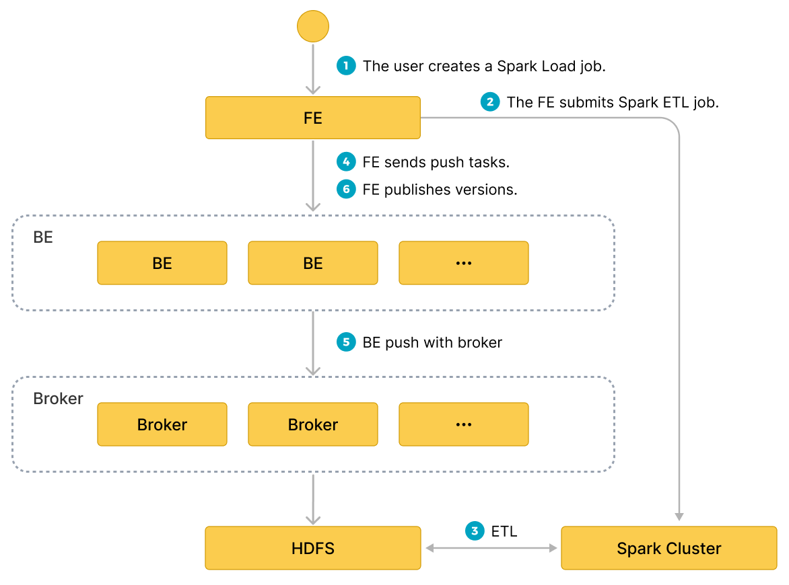

# Spark Load を使用してデータを一括ロードする

このロードは、外部の Apache Spark™ リソースを使用してインポートデータを事前処理し、インポートのパフォーマンスを向上させ、計算リソースを節約します。主に **初期移行** や **大規模データインポート** に使用され、StarRocks へのデータ量は TB レベルまで対応します。

Spark load は **非同期** のインポート方法であり、ユーザーは MySQL プロトコルを介して Spark タイプのインポートジョブを作成し、`SHOW LOAD` を使用してインポート結果を確認します。

> **注意**
>
> - StarRocks テーブルに対して INSERT 権限を持つユーザーのみがこのテーブルにデータをロードできます。[GRANT](../sql-reference/sql-statements/account-management/GRANT.md) に従って必要な権限を付与できます。
> - Spark Load は、主キーテーブルにデータをロードするためには使用できません。

## 用語の説明

- **Spark ETL**: インポートプロセスでのデータの ETL を主に担当し、グローバル辞書の構築（BITMAP タイプ）、パーティショニング、ソート、集計などを含みます。
- **Broker**: Broker は独立したステートレスプロセスです。ファイルシステムインターフェースをカプセル化し、StarRocks にリモートストレージシステムからファイルを読み取る機能を提供します。
- **Global Dictionary**: 元の値からエンコードされた値へのデータ構造を保存します。元の値は任意のデータ型であり、エンコードされた値は整数です。グローバル辞書は、正確なカウントディスティンクトが事前計算されるシナリオで主に使用されます。

## 基本原理

ユーザーは MySQL クライアントを通じて Spark タイプのインポートジョブを提出し、FE がメタデータを記録し、提出結果を返します。

spark load タスクの実行は、以下の主要なフェーズに分かれます。

1. ユーザーが spark load ジョブを FE に提出します。
2. FE は ETL タスクを Apache Spark™ クラスターに提出して実行するようスケジュールします。
3. Apache Spark™ クラスターは、グローバル辞書の構築（BITMAP タイプ）、パーティショニング、ソート、集計などを含む ETL タスクを実行します。
4. ETL タスクが完了すると、FE は各事前処理済みスライスのデータパスを取得し、関連する BE に Push タスクを実行するようスケジュールします。
5. BE は Broker プロセスを通じて HDFS からデータを読み取り、StarRocks ストレージ形式に変換します。
    > Broker プロセスを使用しない場合、BE は HDFS から直接データを読み取ります。
6. FE は有効なバージョンをスケジュールし、インポートジョブを完了します。

以下の図は、spark load の主なフローを示しています。



---

## グローバル辞書

### 適用シナリオ

現在、StarRocks の BITMAP カラムは Roaringbitmap を使用して実装されており、入力データ型は整数のみです。そのため、インポートプロセスで BITMAP カラムの事前計算を実装する場合、入力データ型を整数に変換する必要があります。

StarRocks の既存のインポートプロセスでは、グローバル辞書のデータ構造は Hive テーブルに基づいて実装されており、元の値からエンコードされた値へのマッピングを保存します。

### 構築プロセス

1. 上流のデータソースからデータを読み取り、一時的な Hive テーブル `hive-table` を生成します。
2. `hive-table` の強調されていないフィールドの値を抽出し、新しい Hive テーブル `distinct-value-table` を生成します。
3. 元の値とエンコードされた値の 1 列を持つ新しいグローバル辞書テーブル `dict-table` を作成します。
4. `distinct-value-table` と `dict-table` の間で左ジョインを行い、ウィンドウ関数を使用してこのセットをエンコードします。最終的に、重複除去されたカラムの元の値とエンコードされた値を `dict-table` に書き戻します。
5. `dict-table` と `hive-table` の間でジョインを行い、`hive-table` の元の値を整数のエンコード値に置き換える作業を完了します。
6. `hive-table` は次回のデータ事前処理で読み取られ、計算後に StarRocks にインポートされます。

## データ事前処理

データ事前処理の基本プロセスは次のとおりです。

1. 上流のデータソース（HDFS ファイルまたは Hive テーブル）からデータを読み取ります。
2. 読み取ったデータに対してフィールドマッピングと計算を完了し、パーティション情報に基づいて `bucket-id` を生成します。
3. StarRocks テーブルの Rollup メタデータに基づいて RollupTree を生成します。
4. RollupTree を反復処理し、階層的な集計操作を実行します。次の階層の Rollup は、前の階層の Rollup から計算できます。
5. 集計計算が完了するたびに、データは `bucket-id` に基づいてバケット化され、その後 HDFS に書き込まれます。
6. 後続の Broker プロセスは HDFS からファイルを取得し、StarRocks BE ノードにインポートします。

## 基本操作

### ETL クラスターの設定

Apache Spark™ は StarRocks で ETL 作業を行うための外部計算リソースとして使用されます。StarRocks に追加される他の外部リソースとしては、クエリ用の Spark/GPU、外部ストレージ用の HDFS/S3、ETL 用の MapReduce などがあります。したがって、StarRocks で使用されるこれらの外部リソースを管理するために `Resource Management` を導入します。

Apache Spark™ インポートジョブを提出する前に、ETL タスクを実行するための Apache Spark™ クラスターを設定します。操作の構文は次のとおりです。

```sql
-- Apache Spark™ リソースを作成
CREATE EXTERNAL RESOURCE resource_name
PROPERTIES
(
 type = spark,
 spark_conf_key = spark_conf_value,
 working_dir = path,
 broker = broker_name,
 broker.property_key = property_value
);

-- Apache Spark™ リソースを削除
DROP RESOURCE resource_name;

-- リソースを表示
SHOW RESOURCES
SHOW PROC "/resources";

-- 権限
GRANT USAGE_PRIV ON RESOURCE resource_name TO user_identityGRANT USAGE_PRIV ON RESOURCE resource_name TO ROLE role_name;
REVOKE USAGE_PRIV ON RESOURCE resource_name FROM user_identityREVOKE USAGE_PRIV ON RESOURCE resource_name FROM ROLE role_name;
```

- リソースの作成

**例**:

```sql
-- yarn クラスター モード
CREATE EXTERNAL RESOURCE "spark0"
PROPERTIES
(
    "type" = "spark",
    "spark.master" = "yarn",
    "spark.submit.deployMode" = "cluster",
    "spark.jars" = "xxx.jar,yyy.jar",
    "spark.files" = "/tmp/aaa,/tmp/bbb",
    "spark.executor.memory" = "1g",
    "spark.yarn.queue" = "queue0",
    "spark.hadoop.yarn.resourcemanager.address" = "127.0.0.1:9999",
    "spark.hadoop.fs.defaultFS" = "hdfs://127.0.0.1:10000",
    "working_dir" = "hdfs://127.0.0.1:10000/tmp/starrocks",
    "broker" = "broker0",
    "broker.username" = "user0",
    "broker.password" = "password0"
);

-- yarn HA クラスター モード
CREATE EXTERNAL RESOURCE "spark1"
PROPERTIES
(
    "type" = "spark",
    "spark.master" = "yarn",
    "spark.submit.deployMode" = "cluster",
    "spark.hadoop.yarn.resourcemanager.ha.enabled" = "true",
    "spark.hadoop.yarn.resourcemanager.ha.rm-ids" = "rm1,rm2",
    "spark.hadoop.yarn.resourcemanager.hostname.rm1" = "host1",
    "spark.hadoop.yarn.resourcemanager.hostname.rm2" = "host2",
    "spark.hadoop.fs.defaultFS" = "hdfs://127.0.0.1:10000",
    "working_dir" = "hdfs://127.0.0.1:10000/tmp/starrocks",
    "broker" = "broker1"
);
```

`resource-name` は StarRocks に設定された Apache Spark™ リソースの名前です。

`PROPERTIES` には Apache Spark™ リソースに関連するパラメータが含まれます。次のとおりです。
> **注意**
>
> Apache Spark™ リソースの詳細な説明については、[CREATE RESOURCE](../sql-reference/sql-statements/Resource/CREATE_RESOURCE.md) を参照してください。

- Spark 関連パラメータ:
  - `type`: リソースタイプ、必須、現在は `spark` のみをサポート。
  - `spark.master`: 必須、現在は `yarn` のみをサポート。
    - `spark.submit.deployMode`: Apache Spark™ プログラムのデプロイメントモード、必須、現在は `cluster` と `client` の両方をサポート。
    - `spark.hadoop.fs.defaultFS`: マスターが yarn の場合に必須。
    - yarn リソースマネージャーに関連するパラメータ、必須。
      - 単一ノードの ResourceManager
        `spark.hadoop.yarn.resourcemanager.address`: 単一ポイントリソースマネージャーのアドレス。
      - ResourceManager HA
        > ResourceManager のホスト名またはアドレスを指定できます。
        - `spark.hadoop.yarn.resourcemanager.ha.enabled`: リソースマネージャー HA を有効にし、`true` に設定。
        - `spark.hadoop.yarn.resourcemanager.ha.rm-ids`: リソースマネージャーの論理 ID のリスト。
        - `spark.hadoop.yarn.resourcemanager.hostname.rm-id`: 各 rm-id に対して、リソースマネージャーに対応するホスト名を指定。
        - `spark.hadoop.yarn.resourcemanager.address.rm-id`: 各 rm-id に対して、クライアントがジョブを送信するための `host:port` を指定。

- `*working_dir`: ETL に使用されるディレクトリ。Apache Spark™ が ETL リソースとして使用される場合に必須。例: `hdfs://host:port/tmp/starrocks`。

- Broker 関連パラメータ:
  - `broker`: Broker の名前。Apache Spark™ が ETL リソースとして使用される場合に必須。`ALTER SYSTEM ADD BROKER` コマンドを使用して事前に設定を完了する必要があります。
  - `broker.property_key`: Broker プロセスが ETL によって生成された中間ファイルを読み取る際に指定する情報（例: 認証情報）。

**注意事項**:

上記は Broker プロセスを介したロードのパラメータの説明です。Broker プロセスを使用せずにデータをロードする場合、以下に注意してください。

- `broker` を指定する必要はありません。
- ユーザー認証や NameNode ノードの HA を設定する必要がある場合、HDFS クラスターの hdfs-site.xml ファイルでパラメータを設定する必要があります。パラメータの説明については [broker_properties](../sql-reference/sql-statements/loading_unloading/BROKER_LOAD.md#hdfs) を参照してください。また、各 FE の **$FE_HOME/conf** および各 BE の **$BE_HOME/conf** に **hdfs-site.xml** ファイルを移動する必要があります。

> 注意
>
> HDFS ファイルが特定のユーザーのみアクセス可能な場合、`broker.name` に HDFS ユーザー名を指定し、`broker.password` にユーザーパスワードを指定する必要があります。

- リソースの表示

通常のアカウントは、`USAGE-PRIV` アクセス権を持つリソースのみを表示できます。root および admin アカウントはすべてのリソースを表示できます。

- リソース権限

リソース権限は `GRANT REVOKE` を通じて管理され、現在は `USAGE-PRIV` 権限のみをサポートしています。ユーザーまたはロールに `USAGE-PRIV` 権限を付与できます。

```sql
-- user0 に spark0 リソースへのアクセスを許可
GRANT USAGE_PRIV ON RESOURCE "spark0" TO "user0"@"%";

-- role0 に spark0 リソースへのアクセスを許可
GRANT USAGE_PRIV ON RESOURCE "spark0" TO ROLE "role0";

-- user0 にすべてのリソースへのアクセスを許可
GRANT USAGE_PRIV ON RESOURCE* TO "user0"@"%";

-- role0 にすべてのリソースへのアクセスを許可
GRANT USAGE_PRIV ON RESOURCE* TO ROLE "role0";

-- user user0 から spark0 リソースの使用権限を取り消す
REVOKE USAGE_PRIV ON RESOURCE "spark0" FROM "user0"@"%";
```

### Spark クライアントの設定

FE が `spark-submit` コマンドを実行して Spark タスクを送信できるように Spark クライアントを設定します。公式バージョンの Spark2 2.4.5 以上を使用することをお勧めします [spark ダウンロードアドレス](https://archive.apache.org/dist/spark/)。ダウンロード後、次の手順を使用して設定を完了してください。

- `SPARK-HOME` の設定
  
Spark クライアントを FE と同じマシンのディレクトリに配置し、FE 設定ファイルの `spark_home_default_dir` をこのディレクトリに設定します。デフォルトでは FE ルートディレクトリの `lib/spark2x` パスであり、空にすることはできません。

- **SPARK 依存パッケージの設定**
  
依存パッケージを設定するには、Spark クライアントの jars フォルダー内のすべての jar ファイルを zip 圧縮し、FE 設定の `spark_resource_path` 項目にこの zip ファイルを設定します。この設定が空の場合、FE は FE ルートディレクトリの `lib/spark2x/jars/spark-2x.zip` ファイルを探します。FE が見つけられない場合、エラーが報告されます。

spark load ジョブが送信されると、アーカイブされた依存ファイルがリモートリポジトリにアップロードされます。デフォルトのリポジトリパスは `working_dir/{cluster_id}` ディレクトリの `--spark-repository--{resource-name}` という名前で、クラスター内のリソースがリモートリポジトリに対応します。ディレクトリ構造は次のように参照されます。

```bash
---spark-repository--spark0/

   |---archive-1.0.0/

   |        |\---lib-990325d2c0d1d5e45bf675e54e44fb16-spark-dpp-1.0.0\-jar-with-dependencies.jar

   |        |\---lib-7670c29daf535efe3c9b923f778f61fc-spark-2x.zip

   |---archive-1.1.0/

   |        |\---lib-64d5696f99c379af2bee28c1c84271d5-spark-dpp-1.1.0\-jar-with-dependencies.jar

   |        |\---lib-1bbb74bb6b264a270bc7fca3e964160f-spark-2x.zip

   |---archive-1.2.0/

   |        |-...

```

spark の依存関係（デフォルトで `spark-2x.zip` と命名）に加えて、FE は DPP の依存関係もリモートリポジトリにアップロードします。spark load によって送信されたすべての依存関係がリモートリポジトリに既に存在する場合、依存関係を再度アップロードする必要はなく、毎回大量のファイルを繰り返しアップロードする時間を節約できます。

### YARN クライアントの設定

FE が yarn コマンドを実行して、実行中のアプリケーションのステータスを取得したり、アプリケーションを終了したりできるように、yarn クライアントを設定します。公式バージョンの Hadoop2 2.5.2 以上を使用することをお勧めします（[hadoop ダウンロードアドレス](https://archive.apache.org/dist/hadoop/common/)）。ダウンロード後、次の手順を使用して設定を完了してください。

- **YARN 実行可能パスの設定**
  
ダウンロードした yarn クライアントを FE と同じマシンのディレクトリに配置し、FE 設定ファイルの `yarn_client_path` 項目を yarn のバイナリ実行ファイルに設定します。デフォルトでは FE ルートディレクトリの `lib/yarn-client/hadoop/bin/yarn` パスです。

- **YARN を生成するために必要な設定ファイルのパスを設定（オプション）**
  
FE が yarn クライアントを通じてアプリケーションのステータスを取得したり、アプリケーションを終了したりする際、デフォルトで StarRocks は FE ルートディレクトリの `lib/yarn-config` パスに yarn コマンドを実行するために必要な設定ファイルを生成します。このパスは FE 設定ファイルの `yarn_config_dir` エントリを設定することで変更できます。現在は `core-site.xml` と `yarn-site.xml` を含みます。

### インポートジョブの作成

**構文:**

```sql
LOAD LABEL load_label
    (data_desc, ...)
WITH RESOURCE resource_name 
[resource_properties]
[PROPERTIES (key1=value1, ... )]

* load_label:
    db_name.label_name

* data_desc:
    DATA INFILE ('file_path', ...)
    [NEGATIVE]
    INTO TABLE tbl_name
    [PARTITION (p1, p2)]
    [COLUMNS TERMINATED BY separator ]
    [(col1, ...)]
    [COLUMNS FROM PATH AS (col2, ...)]
    [SET (k1=f1(xx), k2=f2(xx))]
    [WHERE predicate]

    DATA FROM TABLE hive_external_tbl
    [NEGATIVE]
    INTO TABLE tbl_name
    [PARTITION (p1, p2)]
    [SET (k1=f1(xx), k2=f2(xx))]
    [WHERE predicate]

* resource_properties:
 (key2=value2, ...)
```

**例 1**: 上流データソースが HDFS の場合

```sql
LOAD LABEL db1.label1
(
    DATA INFILE("hdfs://abc.com:8888/user/starrocks/test/ml/file1")
    INTO TABLE tbl1
    COLUMNS TERMINATED BY ","
    (tmp_c1,tmp_c2)
    SET
    (
        id=tmp_c2,
        name=tmp_c1
    ),
    DATA INFILE("hdfs://abc.com:8888/user/starrocks/test/ml/file2")
    INTO TABLE tbl2
    COLUMNS TERMINATED BY ","
    (col1, col2)
    where col1 > 1
)
WITH RESOURCE 'spark0'
(
    "spark.executor.memory" = "2g",
    "spark.shuffle.compress" = "true"
)
PROPERTIES
(
    "timeout" = "3600"
);
```

**例 2**: 上流データソースが Hive の場合。

- ステップ 1: 新しい hive リソースを作成

```sql
CREATE EXTERNAL RESOURCE hive0
PROPERTIES
( 
    "type" = "hive",
    "hive.metastore.uris" = "thrift://xx.xx.xx.xx:8080"
);
```

- ステップ 2: 新しい hive 外部テーブルを作成

```sql
CREATE EXTERNAL TABLE hive_t1
(
    k1 INT,
    K2 SMALLINT,
    k3 varchar(50),
    uuid varchar(100)
)
ENGINE=hive
PROPERTIES
( 
    "resource" = "hive0",
    "database" = "tmp",
    "table" = "t1"
);
```

- ステップ 3: ロードコマンドを送信し、インポートされる StarRocks テーブルのカラムが hive 外部テーブルに存在することを要求します。

```sql
LOAD LABEL db1.label1
(
    DATA FROM TABLE hive_t1
    INTO TABLE tbl1
    SET
    (
        uuid=bitmap_dict(uuid)
    )
)
WITH RESOURCE 'spark0'
(
    "spark.executor.memory" = "2g",
    "spark.shuffle.compress" = "true"
)
PROPERTIES
(
    "timeout" = "3600"
);
```

Spark load のパラメータの紹介:

- **ラベル**
  
インポートジョブのラベル。各インポートジョブにはデータベース内で一意のラベルがあり、broker load と同じルールに従います。

- **データ記述クラスのパラメータ**
  
現在サポートされているデータソースは CSV と Hive テーブルです。他のルールは broker load と同じです。

- **インポートジョブのパラメータ**
  
インポートジョブのパラメータは、インポートステートメントの `opt_properties` セクションに属するパラメータを指します。これらのパラメータはインポートジョブ全体に適用されます。ルールは broker load と同じです。

- **Spark リソースパラメータ**
  
Spark リソースは事前に StarRocks に設定され、ユーザーに USAGE-PRIV 権限が付与されてから Spark load にリソースを適用できます。
ユーザーが一時的なニーズを持っている場合、Spark リソースパラメータを設定できます。たとえば、ジョブのためにリソースを追加したり、Spark の設定を変更したりします。この設定はこのジョブにのみ有効であり、StarRocks クラスター内の既存の設定には影響しません。

```sql
WITH RESOURCE 'spark0'
(
    "spark.driver.memory" = "1g",
    "spark.executor.memory" = "3g"
)
```

- **データソースが Hive の場合のインポート**
  
現在、インポートプロセスで Hive テーブルを使用するには、`Hive` タイプの外部テーブルを作成し、インポートコマンドを送信する際にその名前を指定する必要があります。

- **グローバル辞書を構築するためのインポートプロセス**
  
ロードコマンドで、グローバル辞書を構築するために必要なフィールドを次の形式で指定できます: `StarRocks フィールド名=bitmap_dict(hive テーブルフィールド名)` 現在、**グローバル辞書は上流データソースが Hive テーブルの場合のみサポートされています**。

- **バイナリタイプデータのロード**

バージョン v2.5.17 以降、Spark Load は bitmap_from_binary 関数をサポートしており、バイナリデータをビットマップデータに変換できます。Hive テーブルまたは HDFS ファイルのカラムタイプがバイナリであり、StarRocks テーブルの対応するカラムがビットマップタイプの集計カラムである場合、ロードコマンドで次の形式でフィールドを指定できます: `StarRocks フィールド名=bitmap_from_binary(Hive テーブルフィールド名)`。これにより、グローバル辞書を構築する必要がなくなります。

## インポートジョブの表示

Spark load インポートは非同期であり、broker load も同様です。ユーザーはインポートジョブのラベルを記録し、`SHOW LOAD` コマンドでインポート結果を表示するために使用する必要があります。インポートを表示するコマンドはすべてのインポート方法に共通です。例は次のとおりです。

Broker Load の返されたパラメータの詳細な説明については、参照してください。違いは次のとおりです。

```sql
mysql> show load order by createtime desc limit 1\G
*************************** 1. row ***************************
  JobId: 76391
  Label: label1
  State: FINISHED
 Progress: ETL:100%; LOAD:100%
  Type: SPARK
 EtlInfo: unselected.rows=4; dpp.abnorm.ALL=15; dpp.norm.ALL=28133376
 TaskInfo: cluster:cluster0; timeout(s):10800; max_filter_ratio:5.0E-5
 ErrorMsg: N/A
 CreateTime: 2019-07-27 11:46:42
 EtlStartTime: 2019-07-27 11:46:44
 EtlFinishTime: 2019-07-27 11:49:44
 LoadStartTime: 2019-07-27 11:49:44
LoadFinishTime: 2019-07-27 11:50:16
  URL: http://1.1.1.1:8089/proxy/application_1586619723848_0035/
 JobDetails: {"ScannedRows":28133395,"TaskNumber":1,"FileNumber":1,"FileSize":200000}
```

- **State**
  
インポートジョブの現在のステージ。
PENDING: ジョブがコミットされました。
ETL: Spark ETL がコミットされました。
LOADING: FE が BE にプッシュ操作を実行するようスケジュールします。
FINISHED: プッシュが完了し、バージョンが有効になりました。

インポートジョブの最終ステージは `CANCELLED` と `FINISHED` の 2 つであり、どちらもロードジョブが完了したことを示します。`CANCELLED` はインポートの失敗を示し、`FINISHED` はインポートの成功を示します。

- **Progress**
  
インポートジョブの進捗状況の説明。進捗には ETL と LOAD の 2 種類があり、インポートプロセスの 2 つのフェーズ、ETL と LOADING に対応します。

- LOAD の進捗範囲は 0〜100% です。
  
`LOAD 進捗 = すべてのレプリカインポートの現在完了したタブレットの数 / このインポートジョブのタブレットの総数 * 100%`。

- すべてのテーブルがインポートされた場合、LOAD の進捗は 99% であり、インポートが最終検証フェーズに入ると 100% に変わります。

- インポートの進捗は線形ではありません。進捗に変化がない期間があっても、インポートが実行されていないことを意味するわけではありません。

- **Type**

 インポートジョブのタイプ。spark load の場合は SPARK。

- **CreateTime/EtlStartTime/EtlFinishTime/LoadStartTime/LoadFinishTime**

これらの値は、インポートが作成された時間、ETL フェーズが開始された時間、ETL フェーズが完了した時間、LOADING フェーズが開始された時間、およびインポートジョブ全体が完了した時間を表します。

- **JobDetails**

ジョブの詳細な実行状況を表示し、インポートされたファイルの数、合計サイズ（バイト単位）、サブタスクの数、処理される生データ行の数などを含みます。例:

```json
 {"ScannedRows":139264,"TaskNumber":1,"FileNumber":1,"FileSize":940754064}
```

- **URL**

対応するアプリケーションの Web インターフェースにアクセスするために、ブラウザに入力をコピーできます。

### Apache Spark™ Launcher コミットログの表示

ユーザーが Apache Spark™ ジョブのコミット中に生成された詳細なログを表示する必要がある場合があります。デフォルトでは、ログは FE ルートディレクトリの `log/spark_launcher_log` パスに `spark-launcher-{load-job-id}-{label}.log` という名前で保存されます。ログはこのディレクトリに一定期間保存され、FE メタデータのインポート情報がクリーンアップされると削除されます。デフォルトの保持期間は 3 日です。

### インポートのキャンセル

Spark load ジョブのステータスが `CANCELLED` または `FINISHED` でない場合、ユーザーはインポートジョブのラベルを指定して手動でキャンセルできます。

---

## 関連するシステム設定

**FE 設定:** 次の設定は Spark load のシステムレベルの設定であり、すべての Spark load インポートジョブに適用されます。設定値は主に `fe.conf` を変更することで調整できます。

- enable-spark-load: Spark load とリソース作成を有効にし、デフォルト値は false。
- spark-load-default-timeout-second: ジョブのデフォルトのタイムアウトは 259200 秒（3 日）。
- spark-home-default-dir: Spark クライアントパス（`fe/lib/spark2x`）。
- spark-resource-path: パッケージ化された Spark 依存ファイルのパス（デフォルトでは空）。
- spark-launcher-log-dir: Spark クライアントのコミットログが保存されるディレクトリ（`fe/log/spark-launcher-log`）。
- yarn-client-path: yarn バイナリ実行ファイルのパス（`fe/lib/yarn-client/hadoop/bin/yarn`）。
- yarn-config-dir: Yarn の設定ファイルパス（`fe/lib/yarn-config`）。

---

## ベストプラクティス

Spark load を使用する最も適したシナリオは、生データがファイルシステム（HDFS）にあり、データ量が数十 GB から TB レベルの場合です。データ量が少ない場合は、Stream Load または Broker Load を使用してください。

完全な spark load インポートの例については、github のデモを参照してください: [https://github.com/StarRocks/demo/blob/master/docs/03_sparkLoad2StarRocks.md](https://github.com/StarRocks/demo/blob/master/docs/03_sparkLoad2StarRocks.md)

## よくある質問

- `Error: When running with master 'yarn' either HADOOP-CONF-DIR or YARN-CONF-DIR must be set in the environment.`

 Spark Load を使用する際に、Spark クライアントの `spark-env.sh` に `HADOOP-CONF-DIR` 環境変数を設定していない。

- `Error: Cannot run program "xxx/bin/spark-submit": error=2, No such file or directory`

 Spark Load を使用する際に、`spark_home_default_dir` 設定項目が Spark クライアントのルートディレクトリを指定していない。

- `Error: File xxx/jars/spark-2x.zip does not exist.`

 Spark load を使用する際に、`spark-resource-path` 設定項目がパックされた zip ファイルを指していない。

- `Error: yarn client does not exist in path: xxx/yarn-client/hadoop/bin/yarn`

 Spark load を使用する際に、yarn-client-path 設定項目が yarn 実行ファイルを指定していない。

- `ERROR: Cannot execute hadoop-yarn/bin/... /libexec/yarn-config.sh`

 CDH を使用して Hadoop を使用する場合、`HADOOP_LIBEXEC_DIR` 環境変数を設定する必要があります。
 `hadoop-yarn` と hadoop ディレクトリが異なるため、デフォルトの `libexec` ディレクトリは `hadoop-yarn/bin/... /libexec` を探しますが、`libexec` は hadoop ディレクトリにあります。
 Spark タスクのステータスを取得するための ```yarn application status``` コマンドがエラーを報告し、インポートジョブが失敗しました。