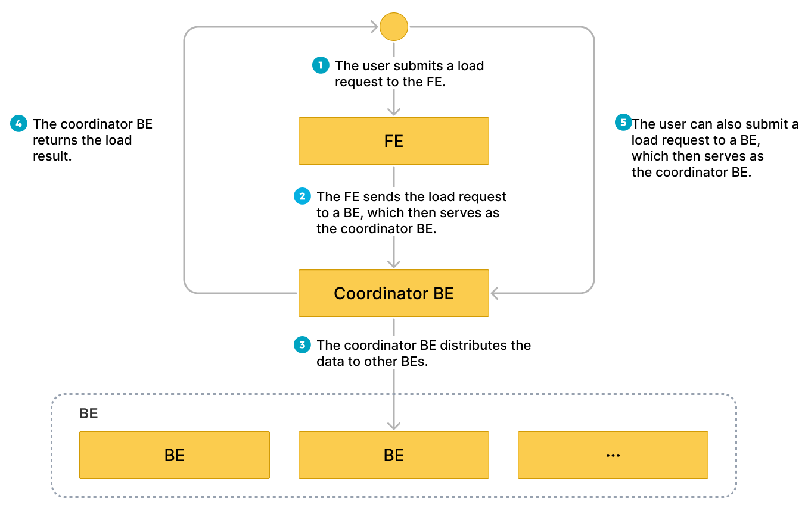
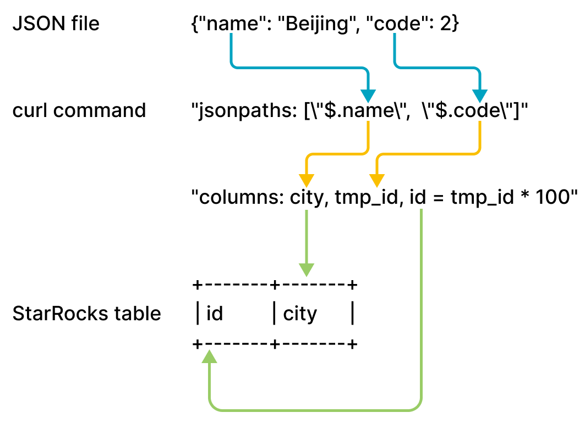

# ローカルファイルシステムからデータをロードする

import InsertPrivNote from '../_assets/commonMarkdown/insertPrivNote.md'

StarRocks はローカルファイルシステムからデータをロードするための2つの方法を提供しています：

- [Stream Load](../sql-reference/sql-statements/loading_unloading/STREAM_LOAD.md) を使用した同期ロード
- [Broker Load](../sql-reference/sql-statements/loading_unloading/BROKER_LOAD.md) を使用した非同期ロード

それぞれのオプションには独自の利点があります：

- Stream Load は CSV と JSON ファイル形式をサポートしています。この方法は、個々のサイズが 10 GB を超えない少数のファイルからデータをロードしたい場合に推奨されます。
- Broker Load は Parquet、ORC、CSV、および JSON ファイル形式をサポートしています（JSON ファイル形式は v3.2.3 以降でサポートされています）。この方法は、個々のサイズが 10 GB を超える多数のファイルからデータをロードしたい場合、またはファイルがネットワークアタッチドストレージ (NAS) デバイスに保存されている場合に推奨されます。**ローカルファイルシステムからデータをロードするための Broker Load の使用は v2.5 以降でサポートされています。**

CSV データについては、以下の点に注意してください：

- テキスト区切り文字として、長さが 50 バイトを超えない UTF-8 文字列（カンマ（,）、タブ、パイプ（|）など）を使用できます。
- Null 値は `\N` を使用して示されます。例えば、データファイルが3つの列で構成され、あるレコードが最初と3番目の列にデータを持ち、2番目の列にデータがない場合、この状況では2番目の列に `\N` を使用して Null 値を示す必要があります。つまり、レコードは `a,\N,b` としてコンパイルされるべきであり、`a,,b` ではありません。`a,,b` はレコードの2番目の列が空の文字列を持っていることを示します。

Stream Load と Broker Load はどちらもデータロード時のデータ変換をサポートしており、データロード中に UPSERT および DELETE 操作によるデータ変更をサポートしています。詳細については、[Transform data at loading](../loading/Etl_in_loading.md) および [Change data through loading](../loading/Load_to_Primary_Key_tables.md) を参照してください。

## 始める前に

### 権限を確認する

<InsertPrivNote />

#### ネットワーク設定を確認する

ロードしたいデータが存在するマシンが、StarRocks クラスタの FE および BE ノードに [`http_port`](../administration/management/FE_configuration.md#http_port)（デフォルト：`8030`）および [`be_http_port`](../administration/management/BE_configuration.md#be_http_port)（デフォルト：`8040`）を介してアクセスできることを確認してください。

## Stream Load を介してローカルファイルシステムからロードする

Stream Load は HTTP PUT ベースの同期ロード方法です。ロードジョブを送信すると、StarRocks はジョブを同期的に実行し、ジョブが終了した後にその結果を返します。ジョブの結果に基づいて、ジョブが成功したかどうかを判断できます。

> **注意**
>
> Stream Load を使用して StarRocks テーブルにデータをロードした後、そのテーブル上に作成されたマテリアライズドビューのデータも更新されます。

### 動作の仕組み

クライアントで HTTP に従って FE にロードリクエストを送信できます。FE は HTTP リダイレクトを使用して、特定の BE または CN にロードリクエストを転送します。また、クライアントから選択した BE または CN に直接ロードリクエストを送信することもできます。

:::note

FE にロードリクエストを送信する場合、FE はポーリングメカニズムを使用して、どの BE または CN がロードリクエストを受信して処理するコーディネーターとして機能するかを決定します。このポーリングメカニズムは、StarRocks クラスタ内での負荷分散を実現するのに役立ちます。したがって、FE にロードリクエストを送信することをお勧めします。

:::

ロードリクエストを受信した BE または CN は、コーディネーター BE または CN として機能し、使用されるスキーマに基づいてデータを分割し、データの各部分を関与する他の BE または CN に割り当てます。ロードが終了すると、コーディネーター BE または CN はロードジョブの結果をクライアントに返します。コーディネーター BE または CN をロード中に停止すると、ロードジョブは失敗します。

以下の図は、Stream Load ジョブのワークフローを示しています。



### 制限

Stream Load は、JSON 形式の列を含む CSV ファイルのデータをロードすることをサポートしていません。

### 典型的な例

このセクションでは、curl を例にして、ローカルファイルシステムから StarRocks に CSV または JSON ファイルのデータをロードする方法を説明します。詳細な構文とパラメータの説明については、[STREAM LOAD](../sql-reference/sql-statements/loading_unloading/STREAM_LOAD.md) を参照してください。

StarRocks では、いくつかのリテラルが SQL 言語によって予約キーワードとして使用されます。これらのキーワードを SQL ステートメントで直接使用しないでください。SQL ステートメントでこのようなキーワードを使用する場合は、バックティック (`) で囲んでください。[キーワード](../sql-reference/sql-statements/keywords.md) を参照してください。

#### CSV データをロードする

##### データセットを準備する

ローカルファイルシステムで、`example1.csv` という名前の CSV ファイルを作成します。このファイルは、ユーザー ID、ユーザー名、ユーザースコアを順に表す3つの列で構成されています。

```Plain
1,Lily,23
2,Rose,23
3,Alice,24
4,Julia,25
```

##### データベースとテーブルを作成する

データベースを作成し、切り替えます：

```SQL
CREATE DATABASE IF NOT EXISTS mydatabase;
USE mydatabase;
```

`table1` という名前の主キーテーブルを作成します。このテーブルは、`id`、`name`、`score` の3つの列で構成されており、`id` が主キーです。

```SQL
CREATE TABLE `table1`
(
    `id` int(11) NOT NULL COMMENT "user ID",
    `name` varchar(65533) NULL COMMENT "user name",
    `score` int(11) NOT NULL COMMENT "user score"
)
ENGINE=OLAP
PRIMARY KEY(`id`)
DISTRIBUTED BY HASH(`id`);
```

:::note

v2.5.7 以降、StarRocks はテーブルを作成する際やパーティションを追加する際に、バケット数 (BUCKETS) を自動的に設定できます。バケット数を手動で設定する必要はありません。詳細については、[バケット数を設定する](../table_design/data_distribution/Data_distribution.md#set-the-number-of-buckets) を参照してください。

:::

##### Stream Load を開始する

次のコマンドを実行して、`example1.csv` のデータを `table1` にロードします：

```Bash
curl --location-trusted -u <username>:<password> -H "label:123" \
    -H "Expect:100-continue" \
    -H "column_separator:," \
    -H "columns: id, name, score" \
    -T example1.csv -XPUT \
    http://<fe_host>:<fe_http_port>/api/mydatabase/table1/_stream_load
```

:::note

- パスワードが設定されていないアカウントを使用する場合は、`<username>:` のみを入力する必要があります。
- FE ノードの IP アドレスと HTTP ポートを表示するには、[SHOW FRONTENDS](../sql-reference/sql-statements/cluster-management/nodes_processes/SHOW_FRONTENDS.md) を使用できます。

:::

`example1.csv` は3つの列で構成されており、カンマ (,) で区切られ、`table1` の `id`、`name`、`score` 列に順番にマッピングできます。したがって、`column_separator` パラメータを使用してカンマ (,) を列区切り文字として指定する必要があります。また、`columns` パラメータを使用して、`example1.csv` の3つの列を一時的に `id`、`name`、`score` として名付け、それらを順番に `table1` の3つの列にマッピングする必要があります。

ロードが完了したら、`table1` をクエリしてロードが成功したことを確認できます：

```SQL
SELECT * FROM table1;
+------+-------+-------+
| id   | name  | score |
+------+-------+-------+
|    1 | Lily  |    23 |
|    2 | Rose  |    23 |
|    3 | Alice |    24 |
|    4 | Julia |    25 |
+------+-------+-------+
4 rows in set (0.00 sec)
```

#### JSON データをロードする

v3.2.7 以降、Stream Load は送信中に JSON データを圧縮することをサポートしており、ネットワーク帯域幅のオーバーヘッドを削減します。ユーザーは `compression` および `Content-Encoding` パラメータを使用して異なる圧縮アルゴリズムを指定できます。サポートされている圧縮アルゴリズムには GZIP、BZIP2、LZ4_FRAME、および ZSTD があります。構文については、[STREAM LOAD](../sql-reference/sql-statements/loading_unloading/STREAM_LOAD.md) を参照してください。

##### データセットを準備する

ローカルファイルシステムで、`example2.json` という名前の JSON ファイルを作成します。このファイルは、都市 ID と都市名を順に表す2つの列で構成されています。

```JSON
{"name": "Beijing", "code": 2}
```

##### データベースとテーブルを作成する

データベースを作成し、切り替えます：

```SQL
CREATE DATABASE IF NOT EXISTS mydatabase;
USE mydatabase;
```

`table2` という名前の主キーテーブルを作成します。このテーブルは、`id` と `city` の2つの列で構成されており、`id` が主キーです。

```SQL
CREATE TABLE `table2`
(
    `id` int(11) NOT NULL COMMENT "city ID",
    `city` varchar(65533) NULL COMMENT "city name"
)
ENGINE=OLAP
PRIMARY KEY(`id`)
DISTRIBUTED BY HASH(`id`);
```

:::note

v2.5.7 以降、StarRocks はテーブルを作成する際やパーティションを追加する際に、バケット数 (BUCKETS) を自動的に設定できます。バケット数を手動で設定する必要はありません。詳細については、[バケット数を設定する](../table_design/data_distribution/Data_distribution.md#set-the-number-of-buckets) を参照してください。

:::

##### Stream Load を開始する

次のコマンドを実行して、`example2.json` のデータを `table2` にロードします：

```Bash
curl -v --location-trusted -u <username>:<password> -H "strict_mode: true" \
    -H "Expect:100-continue" \
    -H "format: json" -H "jsonpaths: [\"$.name\", \"$.code\"]" \
    -H "columns: city,tmp_id, id = tmp_id * 100" \
    -T example2.json -XPUT \
    http://<fe_host>:<fe_http_port>/api/mydatabase/table2/_stream_load
```

:::note

- パスワードが設定されていないアカウントを使用する場合は、`<username>:` のみを入力する必要があります。
- FE ノードの IP アドレスと HTTP ポートを表示するには、[SHOW FRONTENDS](../sql-reference/sql-statements/cluster-management/nodes_processes/SHOW_FRONTENDS.md) を使用できます。

:::

`example2.json` は `name` と `code` の2つのキーで構成されており、`table2` の `id` と `city` 列にマッピングされています。以下の図に示されています。



前述の図に示されているマッピングは次のように説明されます：

- StarRocks は `example2.json` の `name` と `code` キーを抽出し、それらを `jsonpaths` パラメータで宣言された `name` と `code` フィールドにマッピングします。

- StarRocks は `jsonpaths` パラメータで宣言された `name` と `code` フィールドを抽出し、それらを `columns` パラメータで宣言された `city` と `tmp_id` フィールドに順番にマッピングします。

- StarRocks は `columns` パラメータで宣言された `city` と `tmp_id` フィールドを抽出し、それらを `table2` の `city` と `id` 列に名前でマッピングします。

:::note

前述の例では、`example2.json` の `code` の値は `table2` の `id` 列にロードされる前に 100 倍されます。

:::

`jsonpaths`、`columns`、および StarRocks テーブルの列間の詳細なマッピングについては、[STREAM LOAD](../sql-reference/sql-statements/loading_unloading/STREAM_LOAD.md) の「列マッピング」セクションを参照してください。

ロードが完了したら、`table2` をクエリしてロードが成功したことを確認できます：

```SQL
SELECT * FROM table2;
+------+--------+
| id   | city   |
+------+--------+
| 200  | Beijing|
+------+--------+
4 rows in set (0.01 sec)
```

#### Stream Load リクエストをマージする

v3.4.0 以降、システムは複数の Stream Load リクエストをマージすることをサポートしています。

Merge Commit は Stream Load の最適化であり、高並行性、小バッチ（KB から数十 MB）のリアルタイムロードシナリオ向けに設計されています。以前のバージョンでは、各 Stream Load リクエストがトランザクションとデータバージョンを生成していましたが、高並行性ロードシナリオでは次のような問題が発生していました：

- 過剰なデータバージョンがクエリパフォーマンスに影響を与え、バージョン数を制限すると `too many versions` エラーが発生する可能性があります。
- Compaction を通じたデータバージョンのマージがリソース消費を増加させます。
- 小さなファイルが生成され、IOPS と I/O レイテンシが増加します。共有データクラスタでは、これによりクラウドオブジェクトストレージのコストも増加します。
- トランザクションマネージャーとしての Leader FE ノードがボトルネックとなる可能性があります。

Merge Commit は、時間ウィンドウ内で複数の同時 Stream Load リクエストを単一のトランザクションにマージすることで、これらの問題を軽減します。これにより、高並行性リクエストによって生成されるトランザクションとバージョンの数が減少し、ロードパフォーマンスが向上します。

Merge Commit は同期モードと非同期モードの両方をサポートしています。各モードには利点と欠点があります。使用ケースに基づいて選択できます。

- **同期モード**

  サーバーは、マージされたトランザクションがコミットされた後にのみ返します。これにより、ロードが成功し、可視であることが保証されます。

- **非同期モード**

  サーバーはデータを受信した直後に返します。このモードでは、ロードが成功することを保証しません。

| **モード**     | **利点**                                               | **欠点**                                            |
| ------------ | ------------------------------------------------------------ | ------------------------------------------------------------ |
| 同期モード  | <ul><li>リクエストの返却時にデータの永続性と可視性を保証します。</li><li>同じクライアントからの複数の連続したロードリクエストが順番に実行されることを保証します。</li></ul> | クライアントからの各ロードリクエストは、サーバーがマージウィンドウを閉じるまでブロックされます。ウィンドウが過度に大きい場合、単一のクライアントのデータ処理能力が低下する可能性があります。 |
| 非同期モード | サーバーがマージウィンドウを閉じるのを待たずに、単一のクライアントが次のロードリクエストを送信できるため、ロードスループットが向上します。 | <ul><li>返却時にデータの永続性や可視性を保証しません。クライアントは後でトランザクションの状態を確認する必要があります。</li><li>同じクライアントからの複数の連続したロードリクエストが順番に実行されることを保証しません。</li></ul> |

##### Stream Load を開始する

- 次のコマンドを実行して、同期モードで Merge Commit を有効にした Stream Load ジョブを開始し、マージウィンドウを `5000` ミリ秒、並行度を `2` に設定します：

  ```Bash
  curl --location-trusted -u <username>:<password> \
      -H "Expect:100-continue" \
      -H "column_separator:," \
      -H "columns: id, name, score" \
      -H "enable_merge_commit:true" \
      -H "merge_commit_interval_ms:5000" \
      -H "merge_commit_parallel:2" \
      -T example1.csv -XPUT \
      http://<fe_host>:<fe_http_port>/api/mydatabase/table1/_stream_load
  ```

- 次のコマンドを実行して、非同期モードで Merge Commit を有効にした Stream Load ジョブを開始し、マージウィンドウを `60000` ミリ秒、並行度を `2` に設定します：

  ```Bash
  curl --location-trusted -u <username>:<password> \
      -H "Expect:100-continue" \
      -H "column_separator:," \
      -H "columns: id, name, score" \
      -H "enable_merge_commit:true" \
      -H "merge_commit_async:true" \
      -H "merge_commit_interval_ms:60000" \
      -H "merge_commit_parallel:2" \
      -T example1.csv -XPUT \
      http://<fe_host>:<fe_http_port>/api/mydatabase/table1/_stream_load
  ```

:::note

- Merge Commit は、**同種の** ロードリクエストを単一のデータベースとテーブルにマージすることのみをサポートしています。「同種」とは、Stream Load パラメータが共通パラメータ、JSON 形式パラメータ、CSV 形式パラメータ、`opt_properties`、および Merge Commit パラメータを含めて同一であることを示します。
- CSV 形式のデータをロードする場合、各行が行区切り文字で終わることを確認する必要があります。`skip_header` はサポートされていません。
- サーバーはトランザクションのラベルを自動的に生成します。指定された場合は無視されます。
- Merge Commit は、複数のロードリクエストを単一のトランザクションにマージします。1つのリクエストにデータ品質の問題が含まれている場合、トランザクション内のすべてのリクエストが失敗します。

:::

#### Stream Load の進行状況を確認する

ロードジョブが完了すると、StarRocks はジョブの結果を JSON 形式で返します。詳細については、[STREAM LOAD](../sql-reference/sql-statements/loading_unloading/STREAM_LOAD.md) の「返り値」セクションを参照してください。

Stream Load は、SHOW LOAD ステートメントを使用してロードジョブの結果をクエリすることを許可していません。

#### Stream Load ジョブをキャンセルする

Stream Load は、ロードジョブをキャンセルすることを許可していません。ロードジョブがタイムアウトしたりエラーが発生した場合、StarRocks は自動的にジョブをキャンセルします。

### パラメータ設定

このセクションでは、ロード方法として Stream Load を選択した場合に設定する必要があるいくつかのシステムパラメータについて説明します。これらのパラメータ設定は、すべての Stream Load ジョブに適用されます。

- `streaming_load_max_mb`: ロードしたい各データファイルの最大サイズ。デフォルトの最大サイズは 10 GB です。詳細については、[BE または CN の動的パラメータを設定する](../administration/management/BE_configuration.md) を参照してください。
  
  一度に 10 GB を超えるデータをロードしないことをお勧めします。データファイルのサイズが 10 GB を超える場合、データファイルを 10 GB 未満の小さなファイルに分割し、それらのファイルを一つずつロードすることをお勧めします。10 GB を超えるデータファイルを分割できない場合、このパラメータの値をファイルサイズに基づいて増やすことができます。

  このパラメータの値を増やした後、新しい値は StarRocks クラスタの BEs または CNs を再起動した後にのみ有効になります。さらに、システムパフォーマンスが低下する可能性があり、ロード失敗時のリトライのコストも増加します。

  :::note
  
  JSON ファイルのデータをロードする際には、次の点に注意してください：
  
  - ファイル内の各 JSON オブジェクトのサイズは 4 GB を超えてはなりません。ファイル内の JSON オブジェクトが 4 GB を超える場合、StarRocks は「This parser can't support a document that big.」というエラーをスローします。
  
  - デフォルトでは、HTTP リクエスト内の JSON ボディは 100 MB を超えることはできません。JSON ボディが 100 MB を超える場合、StarRocks は「The size of this batch exceed the max size [104857600] of json type data data [8617627793]. Set ignore_json_size to skip check, although it may lead huge memory consuming.」というエラーをスローします。このエラーを防ぐために、HTTP リクエストヘッダに `"ignore_json_size:true"` を追加して JSON ボディサイズのチェックを無視することができます。

  :::

- `stream_load_default_timeout_second`: 各ロードジョブのタイムアウト期間。デフォルトのタイムアウト期間は 600 秒です。詳細については、[FE の動的パラメータを設定する](../administration/management/FE_configuration.md#configure-fe-dynamic-parameters) を参照してください。
  
  作成したロードジョブの多くがタイムアウトする場合、このパラメータの値を次の式から得られる計算結果に基づいて増やすことができます：

  **各ロードジョブのタイムアウト期間 > ロードするデータ量/平均ロード速度**

  例えば、ロードしたいデータファイルのサイズが 10 GB で、StarRocks クラスタの平均ロード速度が 100 MB/s の場合、タイムアウト期間を 100 秒以上に設定します。

  :::note
  
  前述の式における **平均ロード速度** は、StarRocks クラスタの平均ロード速度です。これはディスク I/O や StarRocks クラスタ内の BEs または CNs の数によって異なります。

  :::

  Stream Load は、個々のロードジョブのタイムアウト期間を指定するための `timeout` パラメータも提供しています。詳細については、[STREAM LOAD](../sql-reference/sql-statements/loading_unloading/STREAM_LOAD.md) を参照してください。

### 使用上の注意

ロードしたいデータファイル内のレコードにフィールドが欠けており、StarRocks テーブル内のフィールドがマッピングされる列が `NOT NULL` と定義されている場合、StarRocks はレコードのロード中に StarRocks テーブルのマッピング列に自動的に `NULL` 値を埋め込みます。また、`ifnull()` 関数を使用して埋め込みたいデフォルト値を指定することもできます。

例えば、前述の `example2.json` ファイルで都市 ID を表すフィールドが欠けており、`table2` のマッピング列に `x` 値を埋め込みたい場合、`"columns: city, tmp_id, id = ifnull(tmp_id, 'x')"` を指定できます。

## Broker Load を介してローカルファイルシステムからロードする

Stream Load に加えて、Broker Load を使用してローカルファイルシステムからデータをロードすることもできます。この機能は v2.5 以降でサポートされています。

Broker Load は非同期ロード方法です。ロードジョブを送信すると、StarRocks はジョブを非同期に実行し、ジョブ結果をすぐには返しません。ジョブ結果を手動でクエリする必要があります。[Broker Load の進行状況を確認する](#check-broker-load-progress) を参照してください。

### 制限

- 現在、Broker Load は単一のブローカー（バージョン v2.5 以降）を介してのみローカルファイルシステムからのロードをサポートしています。
- 単一のブローカーに対する高並行クエリは、タイムアウトや OOM などの問題を引き起こす可能性があります。影響を軽減するために、`pipeline_dop` 変数（[システム変数](../sql-reference/System_variable.md#pipeline_dop) を参照）を使用して Broker Load のクエリ並行性を設定できます。単一のブローカーに対するクエリの場合、`pipeline_dop` を `16` 未満の値に設定することをお勧めします。

### 典型的な例

Broker Load は、単一のデータファイルから単一のテーブルへのロード、複数のデータファイルから単一のテーブルへのロード、複数のデータファイルから複数のテーブルへのロードをサポートしています。このセクションでは、複数のデータファイルから単一のテーブルへのロードを例として使用します。

StarRocks では、いくつかのリテラルが SQL 言語によって予約キーワードとして使用されます。これらのキーワードを SQL ステートメントで直接使用しないでください。SQL ステートメントでこのようなキーワードを使用する場合は、バックティック (`) で囲んでください。[キーワード](../sql-reference/sql-statements/keywords.md) を参照してください。

#### データセットを準備する

CSV ファイル形式を例として使用します。ローカルファイルシステムにログインし、特定のストレージ場所（例：`/home/disk1/business/`）に `file1.csv` と `file2.csv` という2つの CSV ファイルを作成します。両方のファイルは、ユーザー ID、ユーザー名、ユーザースコアを順に表す3つの列で構成されています。

- `file1.csv`

  ```Plain
  1,Lily,21
  2,Rose,22
  3,Alice,23
  4,Julia,24
  ```

- `file2.csv`

  ```Plain
  5,Tony,25
  6,Adam,26
  7,Allen,27
  8,Jacky,28
  ```

#### データベースとテーブルを作成する

データベースを作成し、切り替えます：

```SQL
CREATE DATABASE IF NOT EXISTS mydatabase;
USE mydatabase;
```

`mytable` という名前の主キーテーブルを作成します。このテーブルは、`id`、`name`、`score` の3つの列で構成されており、`id` が主キーです。

```SQL
CREATE TABLE `mytable`
(
    `id` int(11) NOT NULL COMMENT "User ID",
    `name` varchar(65533) NULL DEFAULT "" COMMENT "User name",
    `score` int(11) NOT NULL DEFAULT "0" COMMENT "User score"
)
ENGINE=OLAP
PRIMARY KEY(`id`)
DISTRIBUTED BY HASH(`id`)
PROPERTIES("replication_num"="1");
```

#### Broker Load を開始する

次のコマンドを実行して、ローカルファイルシステムの `/home/disk1/business/` パスに保存されているすべてのデータファイル（`file1.csv` と `file2.csv`）から StarRocks テーブル `mytable` にデータをロードする Broker Load ジョブを開始します：

```SQL
LOAD LABEL mydatabase.label_local
(
    DATA INFILE("file:///home/disk1/business/csv/*")
    INTO TABLE mytable
    COLUMNS TERMINATED BY ","
    (id, name, score)
)
WITH BROKER "sole_broker"
PROPERTIES
(
    "timeout" = "3600"
);
```

このジョブには4つの主要なセクションがあります：

- `LABEL`: ロードジョブの状態をクエリする際に使用される文字列。
- `LOAD` 宣言: ソース URI、ソースデータ形式、および宛先テーブル名。
- `PROPERTIES`: タイムアウト値およびロードジョブに適用するその他のプロパティ。

詳細な構文とパラメータの説明については、[BROKER LOAD](../sql-reference/sql-statements/loading_unloading/BROKER_LOAD.md) を参照してください。

#### Broker Load の進行状況を確認する

v3.0 以前では、[SHOW LOAD](../sql-reference/sql-statements/loading_unloading/SHOW_LOAD.md) ステートメントまたは curl コマンドを使用して Broker Load ジョブの進行状況を表示します。

v3.1 以降では、[`information_schema.loads`](../sql-reference/information_schema/loads.md) ビューから Broker Load ジョブの進行状況を表示できます：

```SQL
SELECT * FROM information_schema.loads;
```

複数のロードジョブを送信した場合、ジョブに関連付けられた `LABEL` でフィルタリングできます。例：

```SQL
SELECT * FROM information_schema.loads WHERE LABEL = 'label_local';
```

ロードジョブが終了したことを確認した後、テーブルをクエリしてデータが正常にロードされたかどうかを確認できます。例：

```SQL
SELECT * FROM mytable;
+------+-------+-------+
| id   | name  | score |
+------+-------+-------+
|    3 | Alice |    23 |
|    5 | Tony  |    25 |
|    6 | Adam  |    26 |
|    1 | Lily  |    21 |
|    2 | Rose  |    22 |
|    4 | Julia |    24 |
|    7 | Allen |    27 |
|    8 | Jacky |    28 |
+------+-------+-------+
8 rows in set (0.07 sec)
```

#### Broker Load ジョブをキャンセルする

ロードジョブが **CANCELLED** または **FINISHED** ステージにない場合、[CANCEL LOAD](../sql-reference/sql-statements/loading_unloading/CANCEL_LOAD.md) ステートメントを使用してジョブをキャンセルできます。

例えば、`mydatabase` データベース内のラベルが `label_local` のロードジョブをキャンセルするには、次のステートメントを実行できます：

```SQL
CANCEL LOAD
FROM mydatabase
WHERE LABEL = "label_local";
```

## NAS を介して Broker Load でロードする

Broker Load を使用して NAS からデータをロードする方法は2つあります：

- NAS をローカルファイルシステムとして扱い、ブローカーを使用してロードジョブを実行します。前のセクション「[Broker Load を介してローカルシステムからロードする](#loading-from-a-local-file-system-via-broker-load)」を参照してください。
- (推奨) NAS をクラウドストレージシステムとして扱い、ブローカーなしでロードジョブを実行します。

このセクションでは、2番目の方法を紹介します。詳細な操作は次のとおりです：

1. NAS デバイスを StarRocks クラスタのすべての BE または CN ノードおよび FE ノードに同じパスにマウントします。このようにして、すべての BE または CN は NAS デバイスに自分のローカルに保存されたファイルにアクセスするようにアクセスできます。

2. Broker Load を使用して NAS デバイスから宛先の StarRocks テーブルにデータをロードします。例：

   ```SQL
   LOAD LABEL test_db.label_nas
   (
       DATA INFILE("file:///home/disk1/sr/*")
       INTO TABLE mytable
       COLUMNS TERMINATED BY ","
   )
   WITH BROKER
   PROPERTIES
   (
       "timeout" = "3600"
   );
   ```

   このジョブには4つの主要なセクションがあります：

   - `LABEL`: ロードジョブの状態をクエリする際に使用される文字列。
   - `LOAD` 宣言: ソース URI、ソースデータ形式、および宛先テーブル名。宣言内の `DATA INFILE` は NAS デバイスのマウントポイントフォルダパスを指定するために使用されます。上記の例では、`file:///` がプレフィックスであり、`/home/disk1/sr` がマウントポイントフォルダパスです。
   - `BROKER`: ブローカー名を指定する必要はありません。
   - `PROPERTIES`: タイムアウト値およびロードジョブに適用するその他のプロパティ。

   詳細な構文とパラメータの説明については、[BROKER LOAD](../sql-reference/sql-statements/loading_unloading/BROKER_LOAD.md) を参照してください。

ジョブを送信した後、必要に応じてロードの進行状況を確認したり、ジョブをキャンセルしたりできます。詳細な操作については、このトピックの「[Broker Load の進行状況を確認する](#check-broker-load-progress)」および「[Broker Load ジョブをキャンセルする](#cancel-a-broker-load-job)」を参照してください。