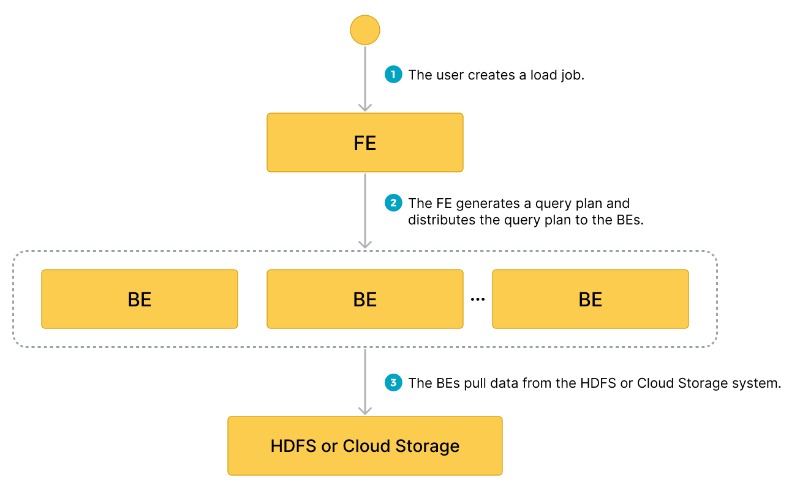

# Microsoft Azure Storage からのデータロード

import InsertPrivNote from '../_assets/commonMarkdown/insertPrivNote.md'

StarRocks は、Azure からデータをロードするために以下のオプションを提供しています:

- [INSERT](../sql-reference/sql-statements/loading_unloading/INSERT.md)+[`FILES()`](../sql-reference/sql-functions/table-functions/files.md) を使用した同期ロード
- [Broker Load](../sql-reference/sql-statements/loading_unloading/BROKER_LOAD.md) を使用した非同期ロード

これらのオプションにはそれぞれ利点があり、詳細は以下のセクションで説明します。

ほとんどの場合、使用が簡単な INSERT+`FILES()` メソッドをお勧めします。

ただし、INSERT+`FILES()` メソッドは現在、Parquet、ORC、CSV ファイル形式のみをサポートしています。そのため、JSON などの他のファイル形式のデータをロードする必要がある場合や、[データロード中に DELETE などのデータ変更を行う](../loading/Load_to_Primary_Key_tables.md)場合は、Broker Load を使用できます。

## 始める前に

### ソースデータの準備

StarRocks にロードしたいソースデータが、Azure ストレージアカウント内のコンテナに適切に保存されていることを確認してください。

このトピックでは、Azure Data Lake Storage Gen2 (ADLS Gen2) ストレージアカウント (`starrocks`) 内のコンテナ (`starrocks-container`) のルートディレクトリに保存されている Parquet 形式のサンプルデータセット (`user_behavior_ten_million_rows.parquet`) のデータをロードすることを想定しています。

### 権限の確認

<InsertPrivNote />

### 認証情報の収集

このトピックの例では、Shared Key 認証方法を使用します。ADLS Gen2 からデータを読み取る権限があることを確認するために、[Azure Data Lake Storage Gen2 > Shared Key (ストレージアカウントのアクセスキー)](../integrations/authenticate_to_azure_storage.md#service-principal-1) を読み、設定する必要がある認証パラメータを理解することをお勧めします。

要するに、Shared Key 認証を実践する場合、以下の情報を収集する必要があります:

- ADLS Gen2 ストレージアカウントのユーザー名
- ADLS Gen2 ストレージアカウントの共有キー

利用可能なすべての認証方法については、[Azure クラウドストレージへの認証](../integrations/authenticate_to_azure_storage.md)を参照してください。

## INSERT+FILES() の使用

このメソッドは v3.2 以降で利用可能で、現在は Parquet、ORC、CSV (v3.3.0 以降) ファイル形式のみをサポートしています。

### INSERT+FILES() の利点

`FILES()` は、指定したパス関連のプロパティに基づいてクラウドストレージに保存されているファイルを読み取り、ファイル内のデータのテーブルスキーマを推測し、ファイルからデータをデータ行として返すことができます。

`FILES()` を使用すると、以下が可能です:

- [SELECT](../sql-reference/sql-statements/table_bucket_part_index/SELECT.md) を使用して Azure から直接データをクエリする。
- [CREATE TABLE AS SELECT](../sql-reference/sql-statements/table_bucket_part_index/CREATE_TABLE_AS_SELECT.md) (CTAS) を使用してテーブルを作成し、ロードする。
- [INSERT](../sql-reference/sql-statements/loading_unloading/INSERT.md) を使用して既存のテーブルにデータをロードする。

### 典型的な例

#### SELECT を使用して Azure から直接クエリする

SELECT+`FILES()` を使用して Azure から直接クエリすることで、テーブルを作成する前にデータセットの内容をプレビューできます。例えば:

- データを保存せずにデータセットをプレビューする。
- 最小値と最大値をクエリし、使用するデータ型を決定する。
- `NULL` 値をチェックする。

以下の例は、ストレージアカウント `starrocks` 内のコンテナ `starrocks-container` に保存されているサンプルデータセット `user_behavior_ten_million_rows.parquet` をクエリします:

```SQL
SELECT * FROM FILES
(
    "path" = "abfss://starrocks-container@starrocks.dfs.core.windows.net/user_behavior_ten_million_rows.parquet",
    "format" = "parquet",
    "azure.adls2.storage_account" = "starrocks",
    "azure.adls2.shared_key" = "xxxxxxxxxxxxxxxxxx"
)
LIMIT 3;
```

システムは次のようなクエリ結果を返します:

```Plain
+--------+---------+------------+--------------+---------------------+
| UserID | ItemID  | CategoryID | BehaviorType | Timestamp           |
+--------+---------+------------+--------------+---------------------+
| 543711 |  829192 |    2355072 | pv           | 2017-11-27 08:22:37 |
| 543711 | 2056618 |    3645362 | pv           | 2017-11-27 10:16:46 |
| 543711 | 1165492 |    3645362 | pv           | 2017-11-27 10:17:00 |
+--------+---------+------------+--------------+---------------------+
```

> **NOTE**
>
> 上記で返された列名は Parquet ファイルによって提供されていることに注意してください。

#### CTAS を使用してテーブルを作成しロードする

これは前の例の続きです。前のクエリは CREATE TABLE AS SELECT (CTAS) でラップされ、スキーマ推測を使用してテーブル作成を自動化します。これは、StarRocks がテーブルスキーマを推測し、希望するテーブルを作成し、データをテーブルにロードすることを意味します。Parquet ファイルを使用する場合、Parquet 形式には列名が含まれているため、`FILES()` テーブル関数を使用する際にテーブルを作成するための列名と型は必要ありません。

> **NOTE**
>
> スキーマ推測を使用する場合の CREATE TABLE の構文では、レプリカの数を設定することはできません。StarRocks 共有なしクラスタを使用している場合は、テーブルを作成する前にレプリカの数を設定してください。以下の例は、3 つのレプリカを持つシステム用です:
>
> ```SQL
> ADMIN SET FRONTEND CONFIG ('default_replication_num' = "3");
> ```

データベースを作成し、切り替えます:

```SQL
CREATE DATABASE IF NOT EXISTS mydatabase;
USE mydatabase;
```

CTAS を使用してテーブルを作成し、ストレージアカウント `starrocks` 内のコンテナ `starrocks-container` に保存されているサンプルデータセット `user_behavior_ten_million_rows.parquet` のデータをテーブルにロードします:

```SQL
CREATE TABLE user_behavior_inferred AS
SELECT * FROM FILES
(
    "path" = "abfss://starrocks-container@starrocks.dfs.core.windows.net/user_behavior_ten_million_rows.parquet",
    "format" = "parquet",
    "azure.adls2.storage_account" = "starrocks",
    "azure.adls2.shared_key" = "xxxxxxxxxxxxxxxxxx"
);
```

テーブルを作成した後、[DESCRIBE](../sql-reference/sql-statements/table_bucket_part_index/DESCRIBE.md) を使用してそのスキーマを表示できます:

```SQL
DESCRIBE user_behavior_inferred;
```

システムは次のクエリ結果を返します:

```Plain
+--------------+-----------+------+-------+---------+-------+
| Field        | Type      | Null | Key   | Default | Extra |
+--------------+-----------+------+-------+---------+-------+
| UserID       | bigint    | YES  | true  | NULL    |       |
| ItemID       | bigint    | YES  | true  | NULL    |       |
| CategoryID   | bigint    | YES  | true  | NULL    |       |
| BehaviorType | varbinary | YES  | false | NULL    |       |
| Timestamp    | varbinary | YES  | false | NULL    |       |
+--------------+-----------+------+-------+---------+-------+
```

テーブルにデータがロードされたことを確認するためにテーブルをクエリします。例:

```SQL
SELECT * from user_behavior_inferred LIMIT 3;
```

次のクエリ結果が返され、データが正常にロードされたことを示しています:

```Plain
+--------+--------+------------+--------------+---------------------+
| UserID | ItemID | CategoryID | BehaviorType | Timestamp           |
+--------+--------+------------+--------------+---------------------+
|     84 | 162325 |    2939262 | pv           | 2017-12-02 05:41:41 |
|     84 | 232622 |    4148053 | pv           | 2017-11-27 04:36:10 |
|     84 | 595303 |     903809 | pv           | 2017-11-26 08:03:59 |
+--------+--------+------------+--------------+---------------------+
```

#### INSERT を使用して既存のテーブルにロードする

挿入するテーブルをカスタマイズしたい場合があります。例えば、以下のようなものです:

- 列のデータ型、NULL 設定、またはデフォルト値
- キーの種類と列
- データのパーティショニングとバケッティング

> **NOTE**
>
> 最も効率的なテーブル構造を作成するには、データの使用方法と列の内容に関する知識が必要です。このトピックではテーブル設計については扱いません。テーブル設計についての情報は、[テーブルタイプ](../table_design/StarRocks_table_design.md)を参照してください。

この例では、テーブルがどのようにクエリされるかと Parquet ファイル内のデータに関する知識に基づいてテーブルを作成しています。Parquet ファイル内のデータに関する知識は、Azure でファイルを直接クエリすることで得られます。

- Azure でのデータセットのクエリにより、`Timestamp` 列が VARBINARY データ型に一致するデータを含んでいることが示されているため、以下の DDL で列型が指定されています。
- Azure でデータをクエリすることで、データセットに `NULL` 値がないことがわかるため、DDL ではどの列も NULL 設定されていません。
- 予想されるクエリタイプに基づいて、ソートキーとバケッティング列は `UserID` 列に設定されています。このデータに対するユースケースは異なるかもしれないので、ソートキーとして `UserID` の代わりにまたは追加で `ItemID` を使用することを決定するかもしれません。

データベースを作成し、切り替えます:

```SQL
CREATE DATABASE IF NOT EXISTS mydatabase;
USE mydatabase;
```

手動でテーブルを作成します (Azure からロードしたい Parquet ファイルと同じスキーマを持つことをお勧めします):

```SQL
CREATE TABLE user_behavior_declared
(
    UserID int(11),
    ItemID int(11),
    CategoryID int(11),
    BehaviorType varchar(65533),
    Timestamp varbinary
)
ENGINE = OLAP 
DUPLICATE KEY(UserID)
DISTRIBUTED BY HASH(UserID);
```

スキーマを表示して、`FILES()` テーブル関数によって生成された推測スキーマと比較できるようにします:

```sql
DESCRIBE user_behavior_declared;
```

```plaintext
+--------------+----------------+------+-------+---------+-------+
| Field        | Type           | Null | Key   | Default | Extra |
+--------------+----------------+------+-------+---------+-------+
| UserID       | int            | NO   | true  | NULL    |       |
| ItemID       | int            | NO   | false | NULL    |       |
| CategoryID   | int            | NO   | false | NULL    |       |
| BehaviorType | varchar(65533) | NO   | false | NULL    |       |
| Timestamp    | varbinary      | NO   | false | NULL    |       |
+--------------+----------------+------+-------+---------+-------+
5 rows in set (0.00 sec)
```

:::tip

`FILES()` テーブル関数を使用して以前に推測されたスキーマと、今作成したスキーマを比較してください。以下を確認します:

- データ型
- NULL 設定
- キーフィールド

宛先テーブルのスキーマをより良く制御し、クエリパフォーマンスを向上させるために、本番環境では手動でテーブルスキーマを指定することをお勧めします。

:::

テーブルを作成した後、INSERT INTO SELECT FROM FILES() を使用してロードできます:

```SQL
INSERT INTO user_behavior_declared
SELECT * FROM FILES
(
    "path" = "abfss://starrocks-container@starrocks.dfs.core.windows.net/user_behavior_ten_million_rows.parquet",
    "format" = "parquet",
    "azure.adls2.storage_account" = "starrocks",
    "azure.adls2.shared_key" = "xxxxxxxxxxxxxxxxxx"
);
```

ロードが完了したら、テーブルをクエリしてデータがロードされたことを確認できます。例:

```SQL
SELECT * from user_behavior_declared LIMIT 3;
```

システムは次のようなクエリ結果を返し、データが正常にロードされたことを示しています:

```Plain
 +--------+---------+------------+--------------+---------------------+
| UserID | ItemID  | CategoryID | BehaviorType | Timestamp           |
+--------+---------+------------+--------------+---------------------+
|    142 | 2869980 |    2939262 | pv           | 2017-11-25 03:43:22 |
|    142 | 2522236 |    1669167 | pv           | 2017-11-25 15:14:12 |
|    142 | 3031639 |    3607361 | pv           | 2017-11-25 15:19:25 |
+--------+---------+------------+--------------+---------------------+
```

#### ロード進捗の確認

StarRocks Information Schema の [`loads`](../sql-reference/information_schema/loads.md) ビューから INSERT ジョブの進捗をクエリできます。この機能は v3.1 以降でサポートされています。例:

```SQL
SELECT * FROM information_schema.loads ORDER BY JOB_ID DESC;
```

`loads` ビューで提供されるフィールドについての情報は、[`loads`](../sql-reference/information_schema/loads.md) を参照してください。

複数のロードジョブを送信した場合は、ジョブに関連付けられた `LABEL` でフィルタリングできます。例:

```SQL
SELECT * FROM information_schema.loads WHERE LABEL = 'insert_f3fc2298-a553-11ee-92f4-00163e0842bd' \G
*************************** 1. row ***************************
              JOB_ID: 10193
               LABEL: insert_f3fc2298-a553-11ee-92f4-00163e0842bd
       DATABASE_NAME: mydatabase
               STATE: FINISHED
            PROGRESS: ETL:100%; LOAD:100%
                TYPE: INSERT
            PRIORITY: NORMAL
           SCAN_ROWS: 10000000
       FILTERED_ROWS: 0
     UNSELECTED_ROWS: 0
           SINK_ROWS: 10000000
            ETL_INFO:
           TASK_INFO: resource:N/A; timeout(s):300; max_filter_ratio:0.0
         CREATE_TIME: 2023-12-28 15:37:38
      ETL_START_TIME: 2023-12-28 15:37:38
     ETL_FINISH_TIME: 2023-12-28 15:37:38
     LOAD_START_TIME: 2023-12-28 15:37:38
    LOAD_FINISH_TIME: 2023-12-28 15:39:35
         JOB_DETAILS: {"All backends":{"f3fc2298-a553-11ee-92f4-00163e0842bd":[10120]},"FileNumber":0,"FileSize":0,"InternalTableLoadBytes":581730322,"InternalTableLoadRows":10000000,"ScanBytes":581574034,"ScanRows":10000000,"TaskNumber":1,"Unfinished backends":{"f3fc2298-a553-11ee-92f4-00163e0842bd":[]}}
           ERROR_MSG: NULL
        TRACKING_URL: NULL
        TRACKING_SQL: NULL
REJECTED_RECORD_PATH: NULL
```

> **NOTE**
>
> INSERT は同期コマンドです。INSERT ジョブがまだ実行中の場合、その実行ステータスを確認するには別のセッションを開く必要があります。

## Broker Load の使用

Broker Load プロセスは非同期で、Azure への接続を確立し、データを取得し、StarRocks にデータを保存します。

このメソッドは以下のファイル形式をサポートしています:

- Parquet
- ORC
- CSV
- JSON (v3.2.3 以降でサポート)

### Broker Load の利点

- Broker Load はバックグラウンドで実行され、クライアントはジョブが続行するために接続を維持する必要がありません。
- Broker Load は長時間実行されるジョブに適しており、デフォルトのタイムアウトは 4 時間です。
- Parquet および ORC ファイル形式に加えて、Broker Load は CSV ファイル形式と JSON ファイル形式 (JSON ファイル形式は v3.2.3 以降でサポート) をサポートしています。

### データフロー



1. ユーザーがロードジョブを作成します。
2. フロントエンド (FE) がクエリプランを作成し、プランをバックエンドノード (BEs) またはコンピュートノード (CNs) に配布します。
3. BEs または CNs がソースからデータを取得し、StarRocks にデータをロードします。

### 典型的な例

テーブルを作成し、Azure からサンプルデータセット `user_behavior_ten_million_rows.parquet` を取得するロードプロセスを開始し、データロードの進捗と成功を確認します。

#### データベースとテーブルの作成

StarRocks クラスタに接続します。その後、データベースを作成し、切り替えます:

```SQL
CREATE DATABASE IF NOT EXISTS mydatabase;
USE mydatabase;
```

手動でテーブルを作成します (Azure からロードしたい Parquet ファイルと同じスキーマを持つことをお勧めします):

```SQL
CREATE TABLE user_behavior
(
    UserID int(11),
    ItemID int(11),
    CategoryID int(11),
    BehaviorType varchar(65533),
    Timestamp varbinary
)
ENGINE = OLAP 
DUPLICATE KEY(UserID)
DISTRIBUTED BY HASH(UserID);
```

#### Broker Load の開始

以下のコマンドを実行して、サンプルデータセット `user_behavior_ten_million_rows.parquet` から `user_behavior` テーブルにデータをロードする Broker Load ジョブを開始します:

```SQL
LOAD LABEL user_behavior
(
    DATA INFILE("abfss://starrocks-container@starrocks.dfs.core.windows.net/user_behavior_ten_million_rows.parquet")
    INTO TABLE user_behavior
    FORMAT AS "parquet"
)
WITH BROKER
(
    "azure.adls2.storage_account" = "starrocks",
    "azure.adls2.shared_key" = "xxxxxxxxxxxxxxxxxx"
)
PROPERTIES
(
    "timeout" = "3600"
);
```

このジョブには 4 つの主要なセクションがあります:

- `LABEL`: ロードジョブの状態をクエリする際に使用される文字列。
- `LOAD` 宣言: ソース URI、ソースデータ形式、および宛先テーブル名。
- `BROKER`: ソースの接続詳細。
- `PROPERTIES`: タイムアウト値およびロードジョブに適用するその他のプロパティ。

詳細な構文とパラメータの説明については、[BROKER LOAD](../sql-reference/sql-statements/loading_unloading/BROKER_LOAD.md) を参照してください。

#### ロード進捗の確認

StarRocks Information Schema の [`loads`](../sql-reference/information_schema/loads.md) ビューから Broker Load ジョブの進捗をクエリできます。この機能は v3.1 以降でサポートされています。

```SQL
SELECT * FROM information_schema.loads \G
```

`loads` ビューで提供されるフィールドについての情報は、[`loads`](../sql-reference/information_schema/loads.md) を参照してください。

複数のロードジョブを送信した場合は、ジョブに関連付けられた `LABEL` でフィルタリングできます:

```SQL
SELECT * FROM information_schema.loads WHERE LABEL = 'user_behavior' \G
*************************** 1. row ***************************
              JOB_ID: 10250
               LABEL: user_behavior
       DATABASE_NAME: mydatabase
               STATE: FINISHED
            PROGRESS: ETL:100%; LOAD:100%
                TYPE: BROKER
            PRIORITY: NORMAL
           SCAN_ROWS: 10000000
       FILTERED_ROWS: 0
     UNSELECTED_ROWS: 0
           SINK_ROWS: 10000000
            ETL_INFO:
           TASK_INFO: resource:N/A; timeout(s):3600; max_filter_ratio:0.0
         CREATE_TIME: 2023-12-28 16:15:19
      ETL_START_TIME: 2023-12-28 16:15:25
     ETL_FINISH_TIME: 2023-12-28 16:15:25
     LOAD_START_TIME: 2023-12-28 16:15:25
    LOAD_FINISH_TIME: 2023-12-28 16:16:31
         JOB_DETAILS: {"All backends":{"6a8ef4c0-1009-48c9-8d18-c4061d2255bf":[10121]},"FileNumber":1,"FileSize":132251298,"InternalTableLoadBytes":311710786,"InternalTableLoadRows":10000000,"ScanBytes":132251298,"ScanRows":10000000,"TaskNumber":1,"Unfinished backends":{"6a8ef4c0-1009-48c9-8d18-c4061d2255bf":[]}}
           ERROR_MSG: NULL
        TRACKING_URL: NULL
        TRACKING_SQL: NULL
REJECTED_RECORD_PATH: NULL
```

ロードジョブが完了したことを確認した後、宛先テーブルのサブセットをチェックしてデータが正常にロードされたかどうかを確認できます。例:

```SQL
SELECT * from user_behavior LIMIT 3;
```

システムは次のようなクエリ結果を返し、データが正常にロードされたことを示しています:

```Plain
+--------+---------+------------+--------------+---------------------+
| UserID | ItemID  | CategoryID | BehaviorType | Timestamp           |
+--------+---------+------------+--------------+---------------------+
|    142 | 2869980 |    2939262 | pv           | 2017-11-25 03:43:22 |
|    142 | 2522236 |    1669167 | pv           | 2017-11-25 15:14:12 |
|    142 | 3031639 |    3607361 | pv           | 2017-11-25 15:19:25 |
+--------+---------+------------+--------------+---------------------+
```