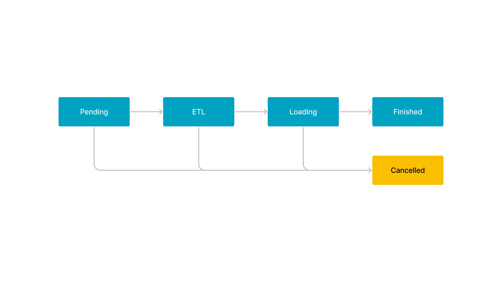

# ロードの概念

import InsertPrivNote from '../../_assets/commonMarkdown/insertPrivNote.md'

このトピックでは、データロードに関する一般的な概念と情報を紹介します。

## 権限

<InsertPrivNote />

## ラベリング

StarRocks にデータをロードするには、ロードジョブを実行します。各ロードジョブには、ユーザーが指定するか StarRocks が自動生成する一意のラベルがあり、ジョブを識別します。各ラベルは 1 つのロードジョブにのみ使用できます。ロードジョブが完了すると、そのラベルは他のロードジョブには再利用できません。失敗したロードジョブのラベルのみ再利用可能です。

## 原子性

StarRocks が提供するすべてのロード方法は原子性を保証します。原子性とは、ロードジョブ内の適格なデータがすべて正常にロードされるか、まったくロードされないことを意味します。適格なデータの一部がロードされ、他のデータがロードされないということはありません。適格なデータには、データ型変換エラーなどの品質問題によりフィルタリングされたデータは含まれません。

## プロトコル

StarRocks は、ロードジョブを送信するために使用できる 2 つの通信プロトコルをサポートしています: MySQL と HTTP。StarRocks がサポートするすべてのロード方法のうち、HTTP を使用するのは Stream Load のみで、他のすべては MySQL を使用します。

## データ型

StarRocks はすべてのデータ型のデータロードをサポートしています。特定のデータ型のロードに関する制限に注意する必要があります。詳細については、 [Data types](../../sql-reference/data-types/README.md) を参照してください。

## ストリクトモード

ストリクトモードは、データロードのために設定できるオプションのプロパティです。ロードの動作と最終的なロードデータに影響を与えます。詳細については、 [Strict mode](../load_concept/strict_mode.md) を参照してください。

## ロードモード

StarRocks は 2 つのロードモードをサポートしています: 同期ロードモードと非同期ロードモード。

:::note

外部プログラムを使用してデータをロードする場合、ロード方法を決定する前に、ビジネス要件に最も適したロードモードを選択する必要があります。

:::

### 同期ロード

同期ロードモードでは、ロードジョブを送信した後、StarRocks はジョブを同期的に実行してデータをロードし、ジョブが終了した後にジョブの結果を返します。ジョブ結果に基づいて、ジョブが成功したかどうかを確認できます。

StarRocks は、同期ロードをサポートする 2 つのロード方法を提供しています: [Stream Load](../StreamLoad.md) と [INSERT](../InsertInto.md)。

同期ロードのプロセスは次のとおりです。

1. ロードジョブを作成します。

2. StarRocks によって返されたジョブ結果を確認します。

3. ジョブ結果に基づいてジョブが成功したかどうかを確認します。ジョブ結果がロード失敗を示している場合は、ジョブを再試行できます。

### 非同期ロード

非同期ロードモードでは、ロードジョブを送信した後、StarRocks はすぐにジョブ作成結果を返します。

- 結果がジョブ作成の成功を示している場合、StarRocks はジョブを非同期的に実行します。ただし、それはデータが正常にロードされたことを意味するわけではありません。ステートメントやコマンドを使用してジョブのステータスを確認する必要があります。その後、ジョブのステータスに基づいてデータが正常にロードされたかどうかを判断できます。

- 結果がジョブ作成の失敗を示している場合、失敗情報に基づいてジョブを再試行する必要があるかどうかを判断できます。

:::tip

テーブルに対して異なる書き込みクォーラムを設定できます。つまり、StarRocks がロードタスクを成功と判断する前に、ロード成功を返す必要があるレプリカの数を指定できます。 `write_quorum` プロパティを追加して [CREATE TABLE](../../sql-reference/sql-statements/table_bucket_part_index/CREATE_TABLE.md) するか、 [ALTER TABLE](../../sql-reference/sql-statements/table_bucket_part_index/ALTER_TABLE.md) を使用して既存のテーブルにこのプロパティを追加できます。

:::

StarRocks は、非同期ロードをサポートする 4 つのロード方法を提供しています: [Broker Load](../../sql-reference/sql-statements/loading_unloading/BROKER_LOAD.md)、 [Pipe](../../sql-reference/sql-statements/loading_unloading/pipe/CREATE_PIPE.md)、 [Routine Load](../../sql-reference/sql-statements/loading_unloading/routine_load/CREATE_ROUTINE_LOAD.md)、および [Spark Load](../../sql-reference/sql-statements/loading_unloading/SPARK_LOAD.md)。

非同期ロードのプロセスは次のとおりです。

1. ロードジョブを作成します。

2. StarRocks によって返されたジョブ作成結果を確認し、ジョブが正常に作成されたかどうかを判断します。

   - ジョブ作成が成功した場合、ステップ 3 に進みます。

   - ジョブ作成が失敗した場合、ステップ 1 に戻ります。

3. ステートメントやコマンドを使用してジョブのステータスを確認し、ジョブステータスが **FINISHED** または **CANCELLED** になるまで確認します。

#### Broker Load または Spark Load のワークフロー

Broker Load または Spark Load ジョブのワークフローは、次の図に示すように 5 つのステージで構成されています。

ワークフローは次のように説明されます。

1. **PENDING**

   ジョブは FE によってスケジュールされるのを待つキューに入ります。

2. **ETL**

   FE はデータを前処理し、クレンジング、パーティショニング、ソート、および集約を行います。

   ETL ステージは Spark Load ジョブにのみ存在します。Broker Load ジョブはこのステージをスキップします。

3. **LOADING**

   FE はデータをクレンジングおよび変換し、その後データを BEs または CNs に送信します。すべてのデータがロードされた後、データは効果を発揮するのを待つキューに入ります。この時点で、ジョブのステータスは **LOADING** のままです。

4. **FINISHED**

   ロードが完了し、関与するすべてのデータが効果を発揮すると、ジョブのステータスは **FINISHED** になります。この時点で、データはクエリ可能です。**FINISHED** は最終的なジョブ状態です。

5. **CANCELLED**

   ジョブのステータスが **FINISHED** になる前に、いつでもジョブをキャンセルできます。さらに、StarRocks はロードエラーが発生した場合にジョブを自動的にキャンセルできます。ジョブがキャンセルされると、ジョブのステータスは **CANCELLED** になり、キャンセル前に行われたすべてのデータ更新が元に戻されます。**CANCELLED** も最終的なジョブ状態です。

#### Pipe のワークフロー

Pipe ジョブのワークフローは次のように説明されます。

1. ジョブは MySQL クライアントから FE に送信されます。

2. FE は、指定されたパスに保存されたデータファイルをその数またはサイズに基づいて分割し、ジョブをより小さな連続タスクに分解します。タスクは作成後、スケジュールを待つキューに入ります。

3. FE はキューからタスクを取得し、INSERT INTO SELECT FROM FILES ステートメントを呼び出して各タスクを実行します。

4. データロードが完了します:

   - ジョブ作成時に `"AUTO_INGEST" = "FALSE"` が指定されている場合、指定されたパスに保存されたすべてのデータファイルのデータがロードされた後にジョブが完了します。

   - ジョブ作成時に `"AUTO_INGEST" = "TRUE"` が指定されている場合、FE はデータファイルの変更を監視し続け、データファイルから新しいまたは更新されたデータを自動的に StarRocks の宛先テーブルにロードします。

#### Routine Load のワークフロー

Routine Load ジョブのワークフローは次のように説明されます。

1. ジョブは MySQL クライアントから FE に送信されます。

2. FE はジョブを複数のタスクに分割します。各タスクは、複数のパーティションからデータをロードするように設計されています。

3. FE はタスクを指定された BEs または CNs に配布します。

4. BEs または CNs はタスクを実行し、タスク完了後に FE に報告します。

5. FE は後続のタスクを生成し、失敗したタスクがある場合は再試行し、BEs からの報告に基づいてタスクスケジューリングを一時停止します。